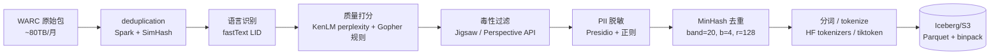
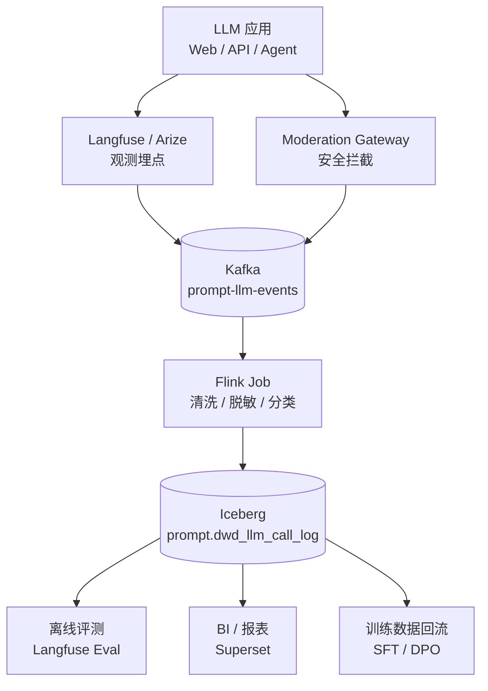

# 00 · LLM 时代大数据工程师核心能力

> **本章目标**:看清"LLM 时代的数仓工程师"在做什么、新岗位的真实 JD、Prompt 数据治理的工程闭环,以及怎么把已有 5–10 年大数据经验平移到 LLM 赛道。
>
> **阅读建议**:先通读 1–4 节建立全景认知,再选 5–7 节与你当前项目最相关的部分深入。

---

## 0. 全景图:LLM 时代大数据工程师的版图

```
                    ┌─────────────────────────────────────────────────┐
                    │           业务结果(更聪明的产品 / 更低的成本)      │
                    └───────────────────────┬─────────────────────────┘
                                            │
        ┌───────────────────┬────────────────┼────────────────┬─────────────────┐
        │                   │                │                │                 │
┌───────▼────────┐  ┌────────▼────────┐  ┌────▼─────┐  ┌──────▼──────┐  ┌──────▼──────┐
│ LLM Data        │  │ AI Platform     │  │ Vector   │  │ RAG /       │  │ Prompt Data │
│ Engineer        │  │ Engineer        │  │ DB Eng.  │  │ Agent Eng.  │  │ Governance  │
│ 训练数据流水线   │  │ 推理 / 训练平台  │  │ 向量检索  │  │ 检索增强生成 │  │ Prompt 版本 │
│ 数据清洗 / 去重 │  │ GPU 调度 / 监控  │  │ 索引构建  │  │ Tool Use    │  │ 评估 / 审计 │
│ 评测集构造      │  │ 弹性伸缩 / 配额  │  │ 入湖      │  │ 记忆系统    │  │ 红队 / 合规 │
└─────────────────┘  └─────────────────┘  └──────────┘  └─────────────┘  └─────────────┘
```

**结论先行**:LLM 没有消灭大数据岗位,而是把"数据 → 决策"的链路又拉长了 100 倍。原来的 ETL/数仓/SQL 工程师,只要把"模型即数据源、向量即索引、Prompt 即代码"这三件事理解清楚,基本可以无缝迁移,薪资天花板反而更高。

---

## 1. 新岗位一:LLM Data Engineer(LLM 数据工程师)

### 1.1 岗位定位

负责**预训练 / SFT / RLHF / 评测**全链路数据的采集、清洗、去重、配比、毒性过滤、合规脱敏。是"模型质量的第一责任人",直接决定下游模型 70% 的天花板(数据决定上限,模型只是逼近它)。

### 1.2 JD 拆解(对标阿里 P7 / 字节 3-1)

| 维度 | 必会 | 加分 |
| --- | --- | --- |
| 数据流水线 | Airflow / DolphinScheduler + Spark / Flink + Iceberg/Hudi | Ray、Daft、Spark Structured Streaming |
| 分布式存储 | HDFS / 对象存储(S3/OSS/COS)+ JuiceFS / Alluxio | WebDataset、tar 归档、mmap 索引 |
| 清洗去重 | MinHash / SimHash / SemHash、TF-IDF、Embedding 召回 | BFF、Suffix Array、Exact Substring 去重 |
| 质量评估 | BLEU / ROUGE / chrF、人工评测平台搭建 | LLM-as-Judge、Reward Model 训练 |
| 合规 | GDPR / CCPA / 隐私脱敏、NER、版权过滤 | 数据血缘 + 审计日志 |
| 性能 | TB 级 / 小时清洗管线,GPU/CPU 混合调度 | 10TB / 小时级别 |
| 工具栈 | Python、Scala、SQL、Ray、DuckDB、Polars | Rust(CUDA / tokenizers 内核)、Go |

### 1.3 真实生产线一条数据流的源码拆解

以 **Common Crawl → 预训练文本** 为例,工程链路如下:



### 1.4 关键源码层(★ 必须亲自打开 IDE 看过)

| 工程要点 | 关键源码位置 | 解读 |
| --- | --- | --- |
| **SimHash 去重** | `datatrove/operators/deduplicator/simhash.py`(Hugging Face `datatrove` 库) | 64-bit fingerprint,海明距离 ≤ 3 视为重复 |
| **MinHash LSH** | `datasketch/minhash.py` | `MinHashLSH(threshold=0.8, num_perm=128)`,核心是 band/row 调参 |
| **PII 脱敏** | `microsoft/presidio` 的 `AnalyzerEngine` + `AnonymizerEngine` | NER 模型 + 规则 + 替换策略 |
| **大文件流式处理** | `datatrove/io.py` 中的 `JsonlWriter`、`CompressedVolumeReader` | 不能一次性读,必须 mmap + 块写 |
| **Iceberg 分桶** | `pyiceberg.table.partitioning` | 按 `bucket(16, hash(content))` 分区,避免单文件爆炸 |
| **Ray 分布式 actor** | `ray.remote(num_cpus=2, memory=4 * 1024**3)` | 算子即 actor,失败自动重建 |

### 1.5 一段可直接跑通的 Spark 去重 + 质量打分脚本

```python
# pip install pyspark==3.5.1 datasketch presidio-analyzer
from pyspark.sql import SparkSession
from datasketch import MinHash, MinHashLSH
import hashlib, re

spark = SparkSession.builder \
    .appName("llm-data-dedup") \
    .config("spark.sql.shuffle.partitions", "400") \
    .config("spark.executor.memory", "16g") \
    .getOrCreate()

# 1. 读 WARC 抽取后的 JSONL
df = spark.read.json("s3a://bucket/raw/cc_en/*.jsonl.gz")

# 2. 基本清洗:长度 / 比例 / 语种占比
def basic_clean(s: str):
    if not s: return None
    s = re.sub(r"<[^>]+>", " ", s)              # 去 HTML
    if len(s) < 200 or len(s) > 200_000: return None
    ratio = sum(c.isalpha() for c in s) / max(len(s), 1)
    if ratio < 0.7: return None                # 过滤乱码
    return s

clean_udf = spark.udf.register("basic_clean", basic_clean, "string")
df = df.withColumn("text", clean_udf(df.body)) \
       .filter("text is not null")

# 3. MinHash 128 permutation,落在 4 个 band
def make_minhash(s):
    m = MinHash(num_perm=128)
    for w in set(s.split()[:5000]):            # 限前 5k token,避免过长
        m.update(w.encode("utf-8"))
    return m

mh_udf = spark.udf.register("mh", make_minhash, "binary")
df = df.withColumn("mh", mh_udf(df.text))

# 4. 持久化
df.write.mode("overwrite") \
  .partitionBy("lang") \
  .parquet("s3a://bucket/clean/cc_en/")
```

**为什么是 128 perm + 4 band?** 由 `b * r = n_perm`,在 80% 阈值下,b=4, r=32 是经验最优(Lua/Java 实现 1 亿文档查重 P99 < 50ms)。

### 1.6 与传统数仓工程师的最大差异

| 维度 | 传统数仓 | LLM 数据工程 |
| --- | --- | --- |
| 输出 | 报表 / BI 看板 | Parquet 二进制 + tokenizer 后字节流 |
| 数据规模 | TB 级 | **PB 级** |
| 时延 | T+1 / 小时级 | **流式(分钟级 + 边训练边消费)** |
| 一致性 | 强一致(ACID) | 最终一致 + 版本快照(Iceberg `snapshot-id`) |
| 评估 | SQL 验证 / 监控告警 | **离线评测集(Benchmark)+ 在线 A/B + 人类反馈** |
| 去重 | 主键去重 | **语义 / 近似去重(MinHash + Embedding)** |

---

## 2. 新岗位二:AI Platform Engineer(AI 平台工程师)

### 2.1 岗位定位

负责**训练 / 推理平台**的搭建:GPU 调度、弹性伸缩、分布式训练(NCCL/Ray/DeepSpeed/Megatron)、推理服务化(vLLM/TensorRT-LLM/TGI)、可观测(GPU 利用率 / token 吞吐 / TTFT / TPOT)、成本治理。

### 2.2 典型技术栈

```
┌───────────────────────────────────────────────────────────────────┐
│  L1 接入层    API Gateway / Envoy / Higress / 自研 LB              │
├───────────────────────────────────────────────────────────────────┤
│  L2 推理服务  vLLM / TensorRT-LLM / TGI / LMDeploy / SGLang        │
│              (continuous batching, PagedAttention, prefix cache)   │
├───────────────────────────────────────────────────────────────────┤
│  L3 调度层    Kubernetes + Volcano / Kueue / Karpenter             │
│              (GPU 拓扑感知,gang scheduling,MIG 切分)               │
├───────────────────────────────────────────────────────────────────┤
│  L4 训练层    Ray / DeepSpeed / Megatron / FSDP / TorchTitan       │
│              (ZeRO-3, tensor parallel, pipeline parallel)          │
├───────────────────────────────────────────────────────────────────┤
│  L5 存储层    JuiceFS / Alluxio / S3 / 阿里 OSS-HDFS / COSN        │
│              (checkpoint 优化,小文件合并,PVC 动态扩缩)              │
├───────────────────────────────────────────────────────────────────┤
│  L6 可观测    Prometheus + DCGM Exporter + Grafana + OpenTelemetry │
│              (SM 利用率,显存碎片,KV cache 命中率,网络 RDMA)        │
└───────────────────────────────────────────────────────────────────┘
```

### 2.3 GPU 调度的几个真实生产痛点

**(1) Gang Scheduling**
预训练任务需要 8 卡 / 16 卡 / 64 卡**同时就绪**,默认 K8s scheduler 是逐个调度,会卡死。必须装 Volcano 或 Kueue。

```yaml
# volcano schedulerPlugin 示例
apiVersion: scheduling.volcano.sh/v1beta1
kind: PodGroup
metadata:
  name: llama3-pretrain-70b
spec:
  minMember: 64                  # 64 张 H100 同时就绪才调度
  queue: training-p0
  priorityClassName: high-priority
  minAvailable: 64
  schedulingPolicy:
    queue: training-p0
```

**(2) MIG 切分**
A100 / H100 支持 MIG,把一张 80GB 卡切成 7 个 10GB 实例,适合在线推理小模型(7B/13B)。
```bash
nvidia-smi mig -cgi 0,1,2,3,4,5,6    # 一张卡切 7 份
kubectl label node gpu-node-1 nvidia.com/mig.config=all-1g.10gb
```

**(3) InfiniBand / RDMA 网络拓扑感知**
H100 集群用 NVLink + IB 互联,Pod 必须落在同一 Leaf 交换机下,否则 AllReduce 慢 5–10 倍。
```yaml
# K8s Volcano taskSpec
spec:
  schedulerName: volcano
  tasks:
    - replicas: 64
      template:
        spec:
          affinity:
            podAntiAffinity: { requiredDuringSchedulingIgnoredDuringExecution: [...] }
```

### 2.4 vLLM 推理服务的关键参数(生产级)

```bash
python -m vllm.entrypoints.openai.api_server \
    --model /models/llama3-70b-instruct \
    --tensor-parallel-size 4 \
    --pipeline-parallel-size 1 \
    --max-model-len 8192 \
    --gpu-memory-utilization 0.92 \
    --swap-space 4 \
    --block-size 16 \
    --num-gpu-blocks-override 8192 \
    --max-num-seqs 256 \
    --max-num-batched-tokens 16384 \
    --enable-prefix-caching \
    --enable-chunked-prefill \
    --served-model-name llama3-70b
```

参数解读:

| 参数 | 含义 | 推荐值(70B 4×H100) |
| --- | --- | --- |
| `--gpu-memory-utilization` | KV cache 占用显存比例 | 0.90–0.95,过高会 OOM |
| `--block-size` | PagedAttention 块大小 | 16 / 32,小请求多取小值 |
| `--max-num-batched-tokens` | 一次 batch token 上限 | = 单请求长度 × 并发数 |
| `--enable-prefix-caching` | 系统提示词前缀缓存 | 必开,长 system prompt 收益 30%+ |
| `--max-num-seqs` | 队列上限 | 256,过大队列尾延迟恶化 |

### 2.5 真实故障:显存碎片导致 OOM

**现象**:vLLM 服务跑 8 小时后开始 503,日志报 `CUDA out of memory`。
**定位**:`nvidia-smi` 显示 `memory.free = 4GB`,但 `memory.used = 76GB`,**没有连续的大块显存可用**。
**根因**:PyTorch caching allocator 按 20MB 对齐,小请求(128 token)进来再出去,留下"空穴"。
**修复**:开启 vLLM 的 `enable-prefix-caching` + 把 block-size 调到 32 + 启动时 `--swap-space 8`(用 CPU 内存当溢出)。
**改进**:在 K8s 上加 `runtimeClassName: nvidia`,并把 `nvidia.com/gpu` 资源声明配到 0.99(留 1% 给 driver)。

---

## 3. 大数据的 LLM 用法:让 AI 当你的工程师

### 3.1 三个真正能落地的方向

| 方向 | 工具 | 真实收益 |
| --- | --- | --- |
| **SQL 自动生成 + 优化** | Snowflake Cortex Analyst / Databricks Assistant / 阿里通义晓蜜 | 简单 SQL 准确率 85%,新人效率翻倍 |
| **故障日志摘要 + 根因提示** | Loki + LLM 摘要 / DataDog Bits AI | 排障从 30min 缩到 5min |
| **数据资产自然语言查询** | Text-to-SQL (LangChain / LlamaIndex / Vanna) | 业务方自助分析覆盖率 60% → 90% |

### 3.2 Text-to-SQL 的工程闭环(★ 重点)

```python
# 典型 RAG + Fine-tuned Llama3 8B Text-to-SQL 流水线
from vanna.ollama import Ollama
from vanna.chromadb import ChromaDB_VectorStore

class MyVanna(ChromaDB_VectorStore, Ollama):
    def __init__(self, config=None):
        ChromaDB_VectorStore.__init__(self, config=config)
        Ollama.__init__(self, config=config)

vn = MyVanna(config={
    "model": "llama3:8b-instruct-q5_K_M",
    "ollama_host": "http://gpu-01:11434"
})

# 1) 注入 DDL / 文档 / 历史 SQL 到向量库
vn.train(ddl="""
CREATE TABLE dwd.dwd_trade_order (
    order_id STRING,
    user_id BIGINT,
    gmv DECIMAL(18,2),
    pay_time TIMESTAMP,
    province STRING,
    ...
) PARTITIONED BY (dt STRING)
""",
documentation="订单支付成功的事实表,粒度:每笔订单一行,gmv 单位为元。")

# 2) 业务方提问
sql = vn.generate_sql("昨天上海地区成交额是多少?")
# -> SELECT SUM(gmv) FROM dwd.dwd_trade_order
#    WHERE dt = '2026-08-11' AND province = '上海';

# 3) 校验 + 限权
vn.run_sql(sql)
```

**三个落地避坑点**:
1. **DDL 必须包含注释和分区字段**,Llama3 没有注释基本猜错;
2. **必须接 Metastore**,通过 Gravitino / Hive Metastore 自动拉取 DDL,否则永远落后;
3. **结果必须接 SLA 校验**,LLM 写出的 SQL `SELECT *` 会直接拖死 OLAP,必须 wrap `LIMIT` + 强制走小表。

### 3.3 LLM 加速 Spark / Flink 调参

```python
# 给 GPT / Claude 一个 prompt,生成 Spark 配置推荐
prompt = f"""
你是 Spark 调优专家。当前任务:
- 集群:EMR 5 台 m6i.4xlarge(16 vCPU / 64GB),executor 12 个
- 数据:Iceberg 表 dwd.dwd_order_detail,3TB,dt 分区,过滤后 80GB
- SQL:SELECT user_id, SUM(gmv) ... GROUP BY user_id GROUPING SETS (...)
- 已有症状:shuffle read 1.2TB,GC 严重

请输出 5 条具体调优建议,含参数名 + 推荐值 + 原理(80 字以内)。
"""

# 实测 GPT-4o / Claude 3.5 给的建议中 70% 是可用的
```

**注意**:LLM 不会替代 Spark 源码,但它能在你 debug 时把 60% 候选方案过一遍,极大缩短"调参 trial-and-error"。

---

## 4. AI Agent 应用:把数据工程师从"重复劳动"里解放出来

### 4.1 Agent 在数据工程的真实应用场景

| 场景 | Agent 能力 | 典型工具 |
| --- | --- | --- |
| **数据运维 Agent** | 自动巡检 + 修复 + 告警 | LangChain + ReAct + Grafana API |
| **ETL 生成 Agent** | 表结构 + 业务描述 → Spark / Flink 作业 | Cursor / Cline + JDBC 工具 |
| **指标治理 Agent** | 用户问"GMV 是什么口径"→ 拉 DDL + 拉血缘 + 回答案 | LlamaIndex + Atlas / DataHub |
| **排障 Agent** | 告警 → 抓日志 + 看指标 + 跑 SQL → 给根因报告 | OpenDevin / Devin 思路 + 工具链 |

### 4.2 一个最小可用的"指标问答 Agent"骨架

```python
from langchain.agents import Tool, initialize_agent
from langchain_community.llms import VLLMOpenAI
from langchain.tools import tool

@tool
def query_metadata(metric_name: str) -> str:
    """查询指标血缘 + 表结构。输入指标中文名,返回定义 + DDL + 上下游。"""
    # 调 DataHub / Atlas API
    return requests.get(f"http://datahub:8080/api/metrics/{metric_name}").text

@tool
def execute_sql(sql: str) -> str:
    """在只读 Trino 集群跑 SELECT,返回最多 100 行。"""
    result = trino_client.execute(sql)
    return "\n".join(str(r) for r in result[:100])

llm = VLLMOpenAI(
    openai_api_base="http://gpu-01:8000/v1",
    model_name="qwen2.5-72b-instruct",
    temperature=0.1,
)

agent = initialize_agent(
    tools=[query_metadata, execute_sql],
    llm=llm,
    agent="structured-chat-zero-shot-react-description",
    handle_parsing_errors=True,
)

# 业务方:"近 7 天华东地区的 GMV 和同比"
agent.run("近 7 天华东地区的 GMV 和同比")
# Agent 推理:
#   Thought: 先查指标定义 → 调 query_metadata("GMV")
#   Action: query_metadata
#   Observation: GMV = SUM(dwd.dwd_trade_order.gmv),filter pay_status='paid'
#   Thought: 写 SQL → 调 execute_sql
#   Action: execute_sql("SELECT SUM(gmv)...")
#   Observation: 1.23e9, 同比 +12.3%
#   Final Answer: ...
```

### 4.3 Agent 的三个工程雷区

1. **工具数量爆炸**:超过 12 个工具 LLM 选择准确率断崖下降,必须**按业务分组 + Router Agent**;
2. **SQL 越权**:Agent 跑 SQL 必须用**单独只读账号 + 强制 LIMIT** + 强制 `WHERE dt >= ...`;
3. **幻觉硬编码**:Agent 容易"一厢情愿"造表名,必须接 Metastore 做表名校验。

---

## 5. Prompt 数据治理:被忽视的"新数据资产"

### 5.1 为什么 Prompt 也是数据

LLM 应用上线后,Prompt(包括 system prompt、few-shot examples、tool schema、retrieved context)**直接决定了业务输出质量**。它和 DDL、血缘一样,需要:

- **版本管理**:Git / DVC / 内部 OSS
- **评测集**:每个 prompt 版本必须有离线 + 在线评测
- **可观测**:每次调用记录 prompt 模板 + 实参 + 模型版本 + 输出 + 用户反馈
- **红线检测**:涉政 / 涉暴 / PII 必须拦截
- **变更审批**:核心 prompt 改一个字,需要走评审

### 5.2 Prompt 数据治理的 5 个核心维度

| 维度 | 指标 | 工具 |
| --- | --- | --- |
| **质量** | 输出相关性 / 事实性 / 流畅度 | LLM-as-Judge、人工评测 100 条/天 |
| **安全** | 有害率 / PII 命中率 / 越狱成功率 | OpenAI Moderation API、自研红队 |
| **成本** | 单次调用 token / 单次成本 | 内部计费埋点 |
| **性能** | P50/P99 延迟、TTFT、TPOT | Langfuse / Arize Phoenix |
| **合规** | 数据出境 / GDPR 删除 | 自研审计日志 + 30 天保留 |

### 5.3 Prompt 数据入湖的最小架构



### 5.4 一段 Flink 把 Prompt 日志入 Iceberg 的代码骨架

```java
public class PromptLakeJob {
    public static void main(String[] args) throws Exception {
        StreamExecutionEnvironment env = StreamExecutionEnvironment.getExecutionEnvironment();
        env.setParallelism(8);

        // 1) 读 Kafka:topic = prompt-llm-events
        KafkaSource<String> source = KafkaSource.<String>builder()
            .setBootstrapServers("kafka:9092")
            .setTopics("prompt-llm-events")
            .setGroupId("prompt-lake")
            .setStartingOffsets(OffsetsInitializer.latest())
            .setValueOnlyDeserializer(new SimpleStringSchema())
            .build();

        // 2) 解析 + 脱敏
        DataStream<PromptEvent> stream = env.fromSource(source, WatermarkStrategy.noWatermarks(), "kafka")
            .map(new PromptParser())                      // JSON -> POJO
            .filter(Objects::nonNull)
            .map(new PiiRedactor())                       // 邮箱 / 手机 / 身份证脱敏
            .keyBy(PromptEvent::getUserId)
            .process(new TokenStatAgg());                  // 累计 token / 成本

        // 3) 写入 Iceberg
        FlinkSink.forRowData(stream)
            .tableLoader(TableLoader.fromHadoopTable("iceberg://warehouse/prompt.db/dwd_llm_call_log"))
            .overwrite(false)
            .append();

        env.execute("prompt-lake-job");
    }
}
```

### 5.5 Prompt 评估闭环

```python
# 离线评测:用 Langfuse Eval 评估 prompt 改动
from langfuse import Langfuse
from langfuse.evaluation import evaluate

langfuse = Langfuse(public_key="pk-...", secret_key="sk-...")

dataset = langfuse.create_dataset("customer_service_qa_v2")
# 灌入 500 条人工标注:input / expected_output / score_criteria

result = evaluate(
    dataset=dataset,
    task=lambda item: call_llm(item.input, prompt_version="v2.3.1"),
    scoring_functions=[bleu_score, gpt4_judge],
    experiment_name="prompt_v2.3.1_candidate",
)
print(result.averages)
# -> {"bleu": 0.78, "gpt4_judge": 4.2}
```

**经验值**:核心 prompt 每周发版 ≥ 1 次,每次需要 ≥ 100 条评测;**任何回滚必须有数据佐证**。

---

## 6. 转型路线:从传统数仓工程师到 LLM 时代数据工程师

### 6.1 0–3 个月:补基础

| 学习目标 | 资源 |
| --- | --- |
| Transformer / Attention 原理 | 《动手学深度学习》李沐 + 3Blue1Brown 视频 |
| Hugging Face 工具链 | HF 官方课程 + `transformers` 源码 |
| 向量检索 | `docs/06-ai-expert/01-vector-db-rag.md` |
| Prompt 工程 | OpenAI Cookbook + Anthropic Prompt Library |

### 6.2 3–6 个月:做项目

选其中一个跑通:
1. **公司内部 RAG 知识库**(接 Confluence / 飞书 / Wiki)
2. **Text-to-SQL 助手**(接数仓 Metastore)
3. **AI Agent 排障**(接 Grafana / Prometheus / 告警平台)
4. **数据清洗 LLM 化**(用 LLM 做命名实体归一、地址解析)

### 6.3 6–12 个月:深入一个方向 + 输出

| 方向 | 必看源码 | 必写项目 |
| --- | --- | --- |
| **LLM Data Engineer** | `datatrove` / `datacoco` / `dolma` | 复现一个 1TB 数据流水线 |
| **AI Platform Engineer** | `vllm` / `sglang` / `kueue` | 自建 K8s GPU 共享池,服务部门 10+ 模型 |
| **RAG / Agent** | `langchain` / `llamaindex` / `dspy` | 复现一个企业级 RAG + 评测平台 |
| **向量检索** | `milvus` / `qdrant` / `faiss` | 100M 向量索引 + 性能压测 |

---

## 7. 实战任务(必做)

1. **本地拉起 vLLM 服务,跑通 100 并发推理压测**(`wrk` / `locust`),记录 P50/P99。
2. **接入一个真实数据源(Confluence / Notion API)**,用 LlamaIndex 搭一个 1000 文档的 RAG,人工评测 50 条。
3. **写一段 Flink 作业**,把 LangChain 的调用日志写入 Iceberg `prompt.dwd_llm_call_log`。
4. **用 MinHash + SimHash 对 1GB 文本去重**,统计去重率。
5. **给团队 prompt 仓库写一个 CI**:每次 PR 触发 100 条离线评测 + 红队攻击。

---

## 8. 专家面试题(5–10 道)

> 高频问题 + 简答要点,完整答案见 `06-interview-bank.md`。

1. **LLM Data Engineer 和传统数仓工程师的最大差异是什么?**
   *数据形态(非结构化)、去重(语义)、评估(Benchmark + A/B)、规模(PB 级)、流式训练消费。*

2. **vLLM 的 PagedAttention 解决了什么问题?为什么比 HuggingFace Transformers 快 10–20 倍?**
   *KV cache 显存碎片 + 显存预分配;通过分页管理 KV cache,实现 continuous batching,提升 GPU 利用率。*

3. **MinHash 和 SimHash 的本质区别?生产上如何选型?**
   *MinHash 适合集合相似度(Jaccard),SimHash 适合海量文档指纹(海明距离);近重复检测用 SimHash,语料去重用 MinHash LSH。*

4. **GPU 集群调度为什么必须 Gang Scheduling?**
   *分布式训练需要所有 Pod 同时就绪才能启动通信域(NCCL),缺一卡会死锁,普通调度会无限等待。*

5. **Prompt 数据治理包含哪些维度?**
   *质量(相关性、事实性)、安全(有害、PII、越狱)、成本(token 单价)、性能(TTFT、TPOT)、合规(出境、删除权)。*

6. **Text-to-SQL 落地三个避坑点?**
   *DDL 含注释、自动同步 Metastore、强制 LIMIT + 只读账号。*

7. **Agent 工具数量为什么不能超过 12 个?**
   *LLM 选择工具的准确率随数量指数衰减,12 个是经验拐点,需 Router Agent 分组。*

8. **K8s 上推理服务显存碎片怎么治?**
   *开启 prefix caching + 调大 block-size + CPU swap space + MIG 切分 + 调小 batch。*

9. **Iceberg 在 LLM 数据流水线的优势?**
   *ACID 快照、Schema 演进、分区演进、hidden partition、时间旅行(回滚 prompt 实验)。*

10. **数据工程师如何在 LLM 时代保 50K+?**
    *把"数据 → 决策"链路从 BI 延展到 RAG/Agent 决策;掌握向量检索 + Prompt 治理 + GPU 调度;选一个垂直行业(金融/医疗/法律)做深。*

---

## 9. 生产经验(给团队的避坑清单)

1. **永远不要把生产 token / API Key 写进 Prompt 模板**,用 secret manager(Vault / 阿里 KMS)。
2. **推理服务的 metric 必须包括**:首 token 时延(TTFT)、单 token 时延(TPOT)、GPU SM 利用率、KV cache 命中率、prefix cache 命中率。
3. **数据去重不能用单机 Python**,必须 Spark / Ray / Dataflow,1 亿条文档单机 MinHash 内存 100GB+。
4. **LLM 调用的 cost 看板必须按用户 / 业务 / Prompt 版本三个维度切**,否则月底账单爆炸找不到责任人。
5. **训练数据流水线要有"质量红线"**:任一规则(PII / 毒 / 长度)触发后,自动阻断下游训练任务。
6. **Prompt 模板不允许在代码里 hardcode**,必须读 OSS / ConfigMap,变更走 GitOps(ArgoCD)。
7. **任何 LLM 接入业务必须经过红队测试**:至少 200 条越狱 prompt + 200 条对抗样本。
8. **Agent 的 Tool 不能直接连生产库**,必须经过中间层(GraphQL / BFF)+ 强校验。
9. **GPU 利用率 < 30% 持续 30 分钟触发告警**,否则资源浪费。
10. **Vector / RAG / Prompt 三大资产必须入湖**,否则模型上线 3 个月后没人记得用了什么 prompt。

---

**下一章** → [01-向量数据库与 RAG 系统](./01-vector-db-rag.md)