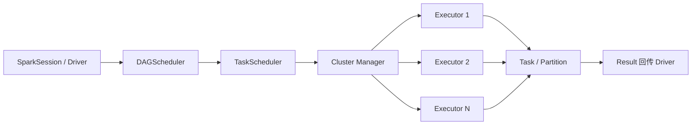
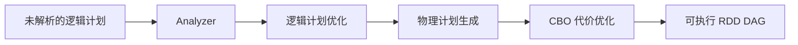

# 06-Spark：大数据计算引擎的核心设计与实践

Apache Spark 自 2014 年成为 Apache 顶级项目以来，已成为离线计算、交互式查询、机器学习与流式处理的事实标准。Spark 经历了三代核心架构演进：RDD + DAGScheduler 的纯函数式 API、DataFrame + Catalyst 的关系代数优化、Dataset + Tungsten + AQE 的全链路向量化执行。本章从架构入手，拆解三大数据结构（RDD / DataFrame / Dataset）、两大核心（Catalyst / Tungsten）、流批一体的 Structured Streaming、Shuffle 与 AQE，以及生产中最高频的 Broadcast Join，最后用 Spark vs Hive 对比给出选型框架。

本模块示例基于 `data/small/` 的电商数据集（订单、订单明细、商品、用户、用户行为五张 Parquet 表），用 Polars 在单机上模拟 Spark DataFrame 语义。`src/spark_demo.py` 覆盖 `groupBy / join / withColumn / window` 四大核心操作，`tests/test_spark.py` 对结果做正确性断言。

---

## ch01 Spark 架构总览

Spark 采用 **Master / Worker（Driver / Executor）** 主从架构，是排查性能问题的前提。

| 角色 | 职责 |
| --- | --- |
| Driver | 运行 `main`、构建 DAG、调度 Task、聚合结果；持有 `SparkContext` |
| Cluster Manager | Standalone / YARN / Mesos / K8s，资源分配 |
| Executor | Worker 上的进程，执行 Task、缓存 RDD/DataFrame 分区 |
| Task | 最小执行单位，一个 Task 处理一个 Partition |
| Job | 一次 Action 触发的整套计算 |
| Stage | DAGScheduler 按 Shuffle 边界切分得到的阶段集合 |

一次作业的物理执行流程：

生产最常用 **YARN 的 Client / Cluster 模式** 和 **K8s 上的 Spark Operator**。差别在于 Driver 跑在哪里：Client 在提交机便于调试；Cluster 在集群内更稳定；Spark Operator 把 SparkApplication 当 K8s 原生对象管理。

核心概念：**Job**（Action 触发的整套计算）、**Stage**（按 Shuffle 边界切分）、**Task**（Stage 内最小执行单元）、**Partition**（物理分片，默认 128 MB）。

**生产经验**：任务慢时第一件事是去 Spark UI 看 Event Timeline——Shuffle Read / Write / GC / Spill 四个指标往往直接指向根因。

---

## ch02 RDD vs DataFrame vs Dataset

Spark 提供三套不同抽象级别的 API，理解差异是写好 Spark 代码的前提。

### RDD

- 低级别、面向对象；算子分 Transformation（懒）和 Action（触发）。
- 编译期无优化，运行期靠 DAGScheduler 调度。
- 适用场景：精细控制分区、底层 ETL、自定义数据源、迭代计算细控。

RDD 的核心价值在于 **弹性**：通过 lineage 记录每个分区的父依赖，丢失时基于父 RDD 重新计算，无需副本备份——这是它能跑赢 MapReduce 的关键。

### DataFrame

- 分布式表格，带 **schema**（列名 + 类型）。
- Catalyst 优化器介入，生成高效物理执行计划。
- 可注册成临时视图跑 SQL；适用绝大多数结构化 ETL、聚合、Join。

DataFrame 的 API 几乎是声明式的——"我要什么数据"而非"我要怎么算"，可读性远超 RDD，也更易 Code Review 和单测。

### Dataset[T]

- DataFrame + 强类型 `Encoder[T]`，仅 Scala / Java 存在。
- Python 端 DataFrame 即 Dataset[Row]。
- Encoder 在 JVM 对象与 Spark 内部二进制格式间互转，比 Java 自带序列化快一个数量级。

| 维度 | RDD | DataFrame | Dataset |
| --- | --- | --- | --- |
| 类型安全 | 编译期（JVM） | 运行期 | 编译期 |
| 自动优化 | 无 | Catalyst + Tungsten | Catalyst + Tungsten |
| 易用性 | 低 | 高 | 中 |
| 性能（结构化数据） | 中 | 高 | 高 |

**经验法则**：能用 DataFrame 就不用 RDD；只有遇到 DataFrame 表达不了的复杂逻辑（自定义分区器、迭代细控）才退回 RDD。

---

## ch03 Catalyst 优化器

Catalyst 是 Spark SQL 的查询优化器，把声明式 DataFrame / SQL 代码转换成高效物理执行计划：

1. **解析**：把列名、函数名绑定成真实符号，生成 `LogicalPlan`。
2. **分析**：补齐类型、处理属性引用、解析 UDF。
3. **逻辑优化**：谓词下推、常量折叠、列裁剪、算子重写。谓词下推把 `where` 推到数据源端，是减少 IO 的关键。
4. **物理优化**：Join Reorder、Join 策略选择（BroadcastHashJoin / SortMergeJoin / ShuffleHashJoin）、CBO。
5. **代码生成**：Tungsten 的 Whole-Stage CodeGen 把算子链生成一整段 JVM 字节码，避免虚函数调用。

Catalyst 应用 **Tree + Rule** 模式：所有计划都是树形结构，每个优化是一条 Rule，扩展性极强。`EXPLAIN EXTENDED` 是诊断 Catalyst 行为的最直接工具。常见优化技巧：

- 避免在 filter 里调用 Python UDF（会阻断谓词下推）。
- 多次使用的中间结果用 `df.cache()` 或 `df.persist(StorageLevel.DISK_ONLY)` 复用。
- 显式 `hint("broadcast")` 让小表走广播 Join。

---

## ch04 Tungsten：让 Spark 接近手写 C 的性能

Tungsten 是 Spark 自 1.4 起的内部性能引擎，目标是 **绕过 JVM GC 和虚函数开销**，把 Spark 拉到接近手写 C 的级别。三条主线：

1. **内存管理与二进制处理**：用 `sun.misc.Unsafe` 直接分配堆外内存；数据以紧凑二进制布局（Unsafe Row）存储，列式访问无需反序列化对象；减少 GC 压力。
2. **Cache-Friendly 的算法**：列式计算、按列局部性访问 CPU cache line；排序、Join、Aggregation 全部向量化；利用 CPU 预取和 SIMD 指令把内存带宽用到极限。
3. **Whole-Stage Code Generation**：把整个算子链（`filter → project → agg`）编译成一段 Java 字节码，消除虚函数分发和中间临时 Row 的物化，多数 SQL 算子上带来 **2x–10x** 加速。

Tungsten 对用户透明：代码仍是 `df.filter(...).groupBy(...).agg(...)`，但 Spark 内部已生成紧凑执行路径。这也是 DataFrame 写复杂逻辑比 RDD 快得多的根本原因。

---

## ch05 Structured Streaming

Structured Streaming 把流式数据当成 **无界表（Unbounded Table）**，让批代码与流代码复用同一套 DataFrame / SQL API——这是相对 Storm / 早期 Flink 的最大卖点。基本用法：

- 输入：`readStream.format("kafka").option("subscribe", "topic")`。
- 逻辑：`df.groupBy(window(col("ts"), "10 minutes")).agg(count("*"))`。
- 输出：`writeStream.outputMode("update").format("console").start()`。

三种输出语义：**Append** 只输出新增行；**Update** 输出本次触发相对上次的差量；**Complete** 每次重输出整张结果表。两种 Trigger：**Micro-batch（默认）** 切成微批，端到端延迟 100 ms 量级；**Continuous Processing（实验性）** 真正的连续处理，延迟可到 1 ms，但仅支持 map/filter 类算子。

**水位线（Watermark）** 处理迟到数据：`df.withWatermark("event_ts", "10 minutes")` 告诉 Spark 最多容忍 10 分钟迟到。**Exactly-Once 语义** 通过 source 可重放 + sink 幂等写入 + checkpoint 三者结合实现；生产常用 sink 是 Kafka、Hudi、Iceberg、Delta Lake。

在数据仓库领域，Structured Streaming 最常见的角色是 **ODS 层的实时落地**（Kafka → Iceberg/Hudi 流式写入）以及 **DWD 层的轻量 ETL**。

---

## ch06 Shuffle 与 AQE

Shuffle 是 Spark 中最贵的操作，本质是把上游 Partition 的数据按 Key 重新分区到下游 Partition：

- 默认走 **Sort Shuffle Manager**，同 Partition 数据先排序后溢写，避免大量随机 IO。
- `spark.sql.shuffle.partitions` 控制下游默认分区数（默认 200）。
- 减少 Shuffle 的根本手段：**Join Key 选择、广播小表、提前聚合**。

Shuffle 涉及磁盘 IO、网络 IO、反序列化、排序四大开销，几乎所有慢查询根因都能追溯到 Shuffle。

**Adaptive Query Execution（AQE）** 在 3.2 之后成为默认开启的生产特性，能在 Shuffle 结束后重新决策：

| AQE 特性 | 解决的问题 |
| --- | --- |
| Coalesce Post-Shuffle Partitions | 合并过小分区，避免任务调度开销 |
| Convert SortMergeJoin to BroadcastHashJoin | 运行期探测小表，自动转广播 |
| Skew Join Optimization | 检测倾斜 Key，把大 Key 拆成多个子任务 |

**Skew Join** 是数据倾斜的克星：在 SortMergeJoin 中，AQE 自动识别数据量远超平均的 Key，拆成 N 个子切片并行处理，最后再合并。原本可能长达几小时的 Join 任务可压回到分钟级。

---

## ch07 Broadcast Join

当 Join 一侧足够小（默认阈值 `spark.sql.autoBroadcastJoinThreshold = 10MB`），Spark 把右侧全量复制到每个 Executor，**跳过 Shuffle**，直接做本地 Hash Join：

- 优点：无 Shuffle、无磁盘 IO、CPU 极省；通常比 SortMergeJoin 快一个数量级。
- 代价：Driver / Executor 内存各存一份小表；过大会 OOM。
- 强制广播：`from pyspark.sql.functions import broadcast; df_large.join(broadcast(df_small), "k")`。

调优时三个常用动作：

1. **调大阈值**：`spark.conf.set("spark.sql.autoBroadcastJoinThreshold", 50 * 1024 * 1024)`。
2. **手动广播**：维度表比阈值稍大又确认能放下时，用 `broadcast()` 显式指定。
3. **配合 AQE**：让运行期自动判断，避免手工估算失误。

**生产经验**：维度表几乎永远是 Broadcast Join 的右侧（用户、商品、地区、品类等）。事实表之间的 Join 因两侧都很大，通常走 SortMergeJoin。若某 Key 占比极高，可对该 Key 加盐。

---

## ch08 Spark vs Hive：如何选型

| 维度 | Hive | Spark |
| --- | --- | --- |
| 计算模型 | MapReduce / Tez | DAG + 多阶段流水线 |
| 延迟 | 分钟级 | 秒级（交互式）/ 毫秒级（流式） |
| API | HQL（类 SQL） | DataFrame / Dataset / SQL / RDD |
| 优化器 | Calcite + 启发式 | Catalyst + Tungsten + AQE |
| 生态 | Hadoop 体系最完整 | 上下游、ML、流式更全 |
| 资源占用 | 启动慢、内存友好 | 内存密集、回收及时 |
| 多语言 | Java 为主 | Scala / Python / R / Java |
| UDF 性能 | 一般 | 矢量化、代码生成加持 |

**经验法则**：

- **TB 级离线批处理 + 与 Hadoop 深度集成** → Hive on Tez。Hive 优势是与 HDFS / YARN / HMS 的天然集成，启动慢但运行时资源利用率高。
- **复杂表达（窗口、UDF、迭代）、多语言、低延迟** → Spark SQL。Spark 在 ETL 表达力上比 Hive 强得多。
- **流批一体、湖仓（Lakehouse）** → Spark + Iceberg / Hudi / Delta。开放表格式让 Spark 同时具备事务、Schema 演进、Time Travel 能力。
- **小数据量、对延迟不敏感** → 任选其一；Hive 上手成本更低。

工程上更常见的做法是 **混部**：Hive 负责历史归档和简单 ETL，Spark 负责复杂指标计算和机器学习。两套引擎通过同一份 HMS 共享元数据，互为补充。
