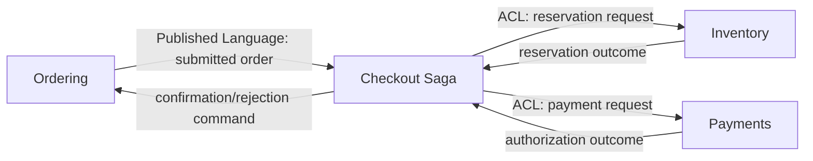

# Kotlin DDD 从零到专家学习项目

这是一个可运行、可测试、按学习阶段组织的电子商务案例。你会在同一条业务主线中逐步学习战术设计、战略设计、六边形架构、事件驱动、Saga、Outbox、幂等与架构治理，而不是只记术语。

> **想系统掌握完整 DDD 知识体系？先读 [docs/ddd-theory.md](docs/ddd-theory.md)（13 章理论手册，含战略/战术/架构/事件驱动/高级建模/工作坊方法论/团队拓扑/反模式/决策框架/术语索引）。读完再按下方 L0–L8 练功。**

## 快速开始

环境要求：JDK 8+。仓库自带 Gradle Wrapper。

```bash
# Windows
./gradlew.bat test
./gradlew.bat :bootstrap:run

# macOS / Linux
./gradlew test
./gradlew :bootstrap:run
```

## 项目业务

业务场景是“下单并履约”：

1. Ordering 创建并提交订单。
2. Checkout Saga 请求 Inventory 预留库存。
3. 库存成功后请求 Payments 授权付款。
4. 全部成功则确认订单；失败则补偿已预留库存并拒绝订单。
5. 领域事件先进入 Outbox，再以至少一次语义发布；消费者用幂等表抵御重复消息。

这不是按数据库表拆模块。每个限界上下文拥有独立语言和模型：

| 上下文 | 核心语言 | 聚合一致性边界 |
|---|---|---|
| `ordering` | Order、OrderLine、submit、confirm、reject | 单个 Order |
| `inventory` | StockItem、Reservation、reserve、release、commit | 单个 SKU@Warehouse |
| `payments` | Payment、authorize、capture、refund | 单个 Payment |
| `shared-kernel` | Money、DomainEvent、Outbox 等极少共享概念 | 技术/通用契约 |
| `bootstrap` | 组合根、Saga、演示入口 | 跨聚合最终一致性 |

## 学习地图

建议按阶段顺序完成。每一阶段先读概念，再读指定代码和测试，最后完成练习；不要先看答案式实现后只运行测试。

### L0：起点——业务优先，而非框架优先

**目标**：能解释 DDD 解决的是复杂业务知识的协作与建模问题，不是目录命名问题。

先掌握：

- Domain：组织要解决的问题空间。
- Model：为特定目的构造的业务抽象，不是现实世界复刻。
- Ubiquitous Language：业务与代码共同使用、在上下文内无歧义的语言。
- 领域专家、开发、产品共同通过示例、规则和反例完善语言。
- CRUD 适合规则简单的子域；不要为了“纯 DDD”制造聚合和事件。

**练习**：写出“订单已提交”的三个正例、三个反例；标出规则来源和仍有歧义的词。然后运行演示，观察业务叙事而不是类名。

**过关标准**：能从用户目标、政策、约束描述模型；不会从数据库表开始设计。

### L1：Kotlin 战术建模——让非法状态难以表示

阅读顺序：

1. `shared-kernel/.../Money.kt`：值对象、不可变、构造不变量。
2. `ordering/.../Order.kt`：实体身份、聚合根、状态转换。
3. 对应测试：测试业务行为，不测试 getter/setter。

核心概念：

- **Value Object** 按值相等，应不可变、自校验；如 Money、Sku、Quantity。
- **Entity** 由连续身份定义；属性变化后仍是同一对象。
- **Aggregate** 是事务一致性边界；外部只持有聚合根 ID，只通过根修改内部。
- **Invariant** 在每次命令完成时成立。跨聚合通常用最终一致性，不扩大一个巨型事务。
- **Domain Event** 用过去时表达已经发生且业务关心的事实。
- Repository 是聚合的集合式端口，不是每张表一个 DAO。

Kotlin 要点：`data class` 建模值对象，`sealed interface`/`enum` 建模有限状态，`val` 和返回新集合避免共享可变状态，`when` 穷尽状态分支。

**练习**：增加“订单提交后不能删行”规则，先写失败测试，再让聚合保护它。解释为什么规则不应放 Controller。

**过关标准**：能辨别 Entity/Value Object；能划聚合边界；不把贫血对象和 Service 脚本称为 DDD。

### L2：应用层与六边形架构——编排副作用

阅读：各模块的 `application` 与 `port` 包，以及 in-memory adapter。

依赖方向：

```text
外部世界 -> 入站适配器 -> 应用用例 -> 领域模型
                         -> 出站端口 <- 出站适配器
```

- Domain 不读取系统时间、不生成随机 ID、不访问仓库、不调用支付网关。
- Application Service 负责加载聚合、调用领域行为、保存、发布结果；不复制业务规则。
- Port 表达核心需要什么，Adapter 说明具体怎么做。
- Command 改变状态；Query 返回专用 DTO。这里展示轻量 CQRS，不要求两套数据库。
- Optimistic Lock 用版本拒绝丢失更新；它不能替代业务幂等。

**练习**：实现一个订单详情 Query，不暴露聚合对象；再模拟两个客户端同时保存，证明第二次更新失败。

**过关标准**：可以在不启动框架/数据库时测试领域和用例；依赖方向始终指向核心。

### L3：战略设计——决定模型在哪里成立

代码模块就是明确的 Bounded Context。重点不是微服务数量，而是语义边界。

- **Core Domain**：能形成竞争优势、值得最佳建模投入的能力。
- **Supporting Subdomain**：支撑核心但不是差异化能力。
- **Generic Subdomain**：成熟通用能力，通常购买或采用标准方案。
- **Bounded Context**：某套模型和语言有效的边界；同一个词跨边界可有不同含义。
- **Context Map**：记录上下文关系、权力关系和翻译策略。

本项目 Context Map：



模式辨析：Customer/Supplier、Conformist、Anti-Corruption Layer、Open Host Service、Published Language、Partnership、Shared Kernel、Separate Ways。`shared-kernel` 应保持极小；共享整个领域模型会把边界重新粘死。

**练习**：画出你熟悉业务的 Context Map；对每条边写明上游、下游、契约所有者、兼容策略。选择一处 ACL 并说明它保护了哪种语言差异。

**过关标准**：边界由团队认知、业务能力和变化节奏决定，而不是按技术层或表拆分。

### L4：跨聚合流程——Saga 与补偿

阅读 `bootstrap` 中 Checkout Saga/Process Manager。

一个本地 ACID 事务无法安全覆盖订单、库存、支付三个自治边界。Saga 将长期业务事务建模为显式状态机：

- 每步有唯一业务键并可重入。
- 记录状态后再发下一步命令。
- 失败走补偿；补偿不是数据库 rollback，而是新的业务动作。
- 消息可能延迟、重复、乱序；状态机必须拒绝不合法输入。
- 超时需要业务决策：重试、人工介入或补偿，不可悄悄吞掉。

本项目流程：

```text
Submitted -> Reserving -> Authorizing -> Completed
                  |              |
                  +----> Compensating -> Failed
```

**练习**：注入付款拒绝，验证库存释放且订单被拒绝；重复投递同一事件，验证不会二次扣款。再设计“付款成功但确认订单消息永久失败”的人工恢复方案。

**过关标准**：能明确每一步的幂等键、补偿动作、不可补偿点、超时策略和可观测状态。

### L5：可靠事件驱动——承认分布式现实

阅读 Outbox、Relay、Idempotent Handler。

- 数据库提交成功后直接发消息会出现双写不一致。
- **Transactional Outbox**：业务状态与待发消息同事务写入；Relay 后续发布。
- Relay 的常见保证是 **at-least-once**，所以重复是正常输入。
- Consumer 用消息 ID/业务幂等键记录已处理状态。去重记录与业务写入也应处于同一事务。
- “Exactly once”通常只在有限边界内成立；端到端仍需幂等语义。
- 事件契约是公共 API：版本、兼容、顺序、敏感信息和演进都必须治理。
- 失败消息要有退避、死信/停车场、告警、重放和审计策略。

**练习**：让 Publisher 第一次失败、第二次成功；证明消息未丢。让同一 Envelope 投递两次；证明业务只执行一次。写出崩溃发生在每个语句之间时的结果。

**过关标准**：不会声称 EventBus 本身解决一致性；能描述交付保证及故障矩阵。

### L6：高级建模——何时使用、更重要的是何时不用

- **Domain Service**：规则属于领域，但不自然属于单一 Entity/Value Object；应尽量纯。
- **Specification**：需要组合、命名、复用的业务谓词；不要包装每个 `if`。
- **Policy/Strategy**：可替换的业务决策。
- **Factory**：复杂且必须一次构造正确的聚合。
- **Event Sourcing**：事件为事实源，适合需要完整决策历史、时间查询或复杂审计的领域；代价是版本演进、投影、重放、删除与运维复杂度。
- **CQRS**：命令和查询模型可独立优化；不等于必须异步、微服务或 Event Sourcing。
- **Temporal modeling**：生效时间、记录时间、追溯修正；财务/合同常见。

**练习**：为定价政策实现 Specification 或 Strategy，并写出不用它的更简单版本。列出选择 Event Sourcing 的证据；若只有“想保存日志”，拒绝采用。

**过关标准**：按问题选择模式，能为“不使用高级模式”给出同样严谨的理由。

### L7：演化与架构治理

- 用 Architecture Decision Record 记录上下文边界和关键取舍。
- 用架构适应性检查防止 Context 直接依赖另一 Context 的 domain。
- 采用 branch by abstraction、expand/contract 和兼容事件版本逐步迁移模型。
- 监控业务指标：订单卡在哪个 Saga 状态、补偿率、消息积压年龄、重复率，而不只监控 CPU。
- 安全：事件最小披露，PII 分类，加密与删除策略；审计日志不可替代授权。
- 团队拓扑会影响边界；高频跨团队同步通常说明 Context Map 或 ownership 有问题。

**练习**：将库存策略从 Ordering 中迁出，保证过程中系统始终可发布；写 ADR、兼容契约和回滚点。为 Saga 定义 SLI/SLO 与告警阈值。

**过关标准**：能让模型和组织在不中断业务的情况下演化，并用自动检查守住方向。

### L8：专家实战——从代码走向建模领导力

专家不是“使用最多模式的人”，而是持续降低业务认知成本和变更风险的人。

完成一次闭环：

1. 选择真实复杂子域，访谈至少两类领域角色。
2. 用 Event Storming 梳理 Domain Event、Command、Actor、Policy、Hotspot。
3. 通过 Example Mapping/Specification by Example 消除规则歧义。
4. 提出多个模型，比较一致性边界、失败模式、认知负担和组织 ownership。
5. 实现 walking skeleton，使用业务指标验证模型是否改善交付。
6. 组织建模复盘：哪些词仍冲突，哪些聚合争用，哪些事件没有消费者，哪些边界泄漏。
7. 删除不再有价值的抽象；更新 Context Map 和 ADR。

**毕业作品要求**：

- 一页领域愿景和子域分类。
- 统一语言词典，含同义词/禁用词/示例/反例。
- Context Map 及每条关系的 ownership。
- 至少两个非平凡聚合及其不变量和并发策略。
- 一条跨上下文流程的故障矩阵、幂等键和补偿策略。
- 可执行测试体现关键业务示例。
- 生产可观测与事件演进方案。
- 一次真实反馈导致模型被修改的证据。

**专家级自检**：你能主持对话让领域专家纠正模型；能区分偶然复杂度和本质复杂度；能从一致性需求推导边界；能在失败、并发、演进和组织约束下解释取舍；也能识别简单 CRUD 才是正确方案。

## 代码阅读索引

```text
shared-kernel/  DDD primitives + event reliability patterns
ordering/       Rich aggregate + use cases + projection
inventory/      Independent model + reservation workflow + ACL
payments/       Gateway port + idempotent payment workflow + ACL
bootstrap/      Composition root + process manager + executable scenarios
```

每个测试是一个可运行的业务例子。优先从测试名称读意图，再进入实现。修改规则时遵循 red-green-refactor：先让业务例子失败，最小实现，再重构语言。

## 常见误区

- 只有 `domain/application/infrastructure` 三个目录：这是分层，不足以证明 DDD。
- 所有字段有 getter/setter，规则都在 Service：贫血模型。
- 一个聚合包含整张业务网络：导致锁争用和不可扩展事务。
- 上下文共享同一套 Entity：语义耦合；优先 ID + 显式契约 + ACL。
- 每件事都发事件：只有业务关心且消费者需要的既成事实才是事件。
- 把 Kafka 当作 Event Sourcing：消息传输不等于事实存储。
- 把 Saga 当分布式 ACID：补偿可能失败，必须可观察与恢复。
- 追求端到端 exactly-once：先设计幂等业务语义。
- 模式数量衡量成熟度：删除不必要模式通常更专家。

## 推荐延伸阅读

完整 DDD 理论手册见 [docs/ddd-theory.md](docs/ddd-theory.md)（13 章：本质/战略/战术/架构/事件驱动/高级建模/工作坊方法论/团队拓扑/演化治理/反模式/决策框架/阅读路径/术语索引）。

外部按学习顺序：Eric Evans《Domain-Driven Design》；Vaughn Vernon《Implementing Domain-Driven Design》与《Domain-Driven Design Distilled》；Alberto Brandolini 的 EventStorming；Matthew Skelton / Manuel Pais《Team Topologies》；Chris Richardson《Microservices Patterns》。阅读时把每个概念映射回本仓库并写反例，避免只背定义。
