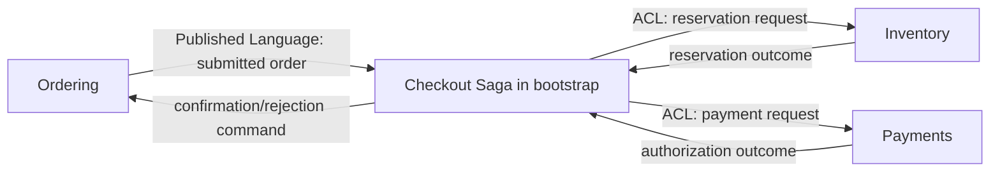

# DDD 理论知识完整手册（学完可成为 DDD 领域专家）

> 这份文档是 `kotlin-ddd-learning-lab` 的**完整理论参考**。README 的 L0–L8 是**练功路径**，本文是**理论地图**。两份文档互相交叉引用：路径告诉你今天练什么，本文告诉你这一招在整个体系中的位置、原理、边界与替代方案。学完本文并完成 L0–L8 的练习，你将具备 DDD 领域专家所需的完整知识体系。

---

## 目录

1. [DDD 的本质](#1-ddd-的本质)
2. [战略设计（Strategic Design）](#2-战略设计strategic-design)
3. [战术设计（Tactical Design）](#3-战术设计tactical-design)
4. [架构风格与系统拓扑](#4-架构风格与系统拓扑)
5. [事件驱动与可靠性](#5-事件驱动与可靠性)
6. [高级建模主题](#6-高级建模主题)
7. [建模工作坊方法论](#7-建模工作坊方法论)
8. [组织、团队与认知负载](#8-组织团队与认知负载)
9. [演化与架构治理](#9-演化与架构治理)
10. [反模式与气味清单](#10-反模式与气味清单)
11. [决策框架与启发式](#11-决策框架与启发式)
12. [阅读路径与延伸资料](#12-阅读路径与延伸资料)
13. [术语索引（指向仓库代码）](#13-术语索引指向仓库代码)

---

## 1. DDD 的本质

### 1.1 三个根本问题

Eric Evans 在《Domain-Driven Design》中回答的不是“如何分层”，也不是“哪些模式”，而是三个根本问题：

1. **如何让软件真正解决业务问题？** 业务知识必须出现在代码里，而不是只出现在需求文档里。
2. **如何在团队规模扩大时保持模型一致？** 必须有共同的、严格的、精炼过的语言。
3. **如何让模型在多年演化中不退化？** 模型必须被持续重构、隔离、对齐。

> **专家心法**：DDD 不是技术架构方法，**是协作建模方法**，架构只是其副作用。

### 1.2 知识的两种形态

Evans 把知识分成：

- **Tacit Knowledge（隐性知识）**：存在于领域专家脑中、未被表达出来的规则。
- **Explicit Knowledge（显性知识）**：被命名、被定义、可被代码执行的规则。

DDD 的全部活动是把**隐性 → 显性**。这一过程在仓库里表现为：

- 业务专家说“订单提交后不能再改行项” → 仓库里表现为 `Order.addLine` / `removeLine` / `changeQuantity` 都通过 `requireDraft` 校验，只在 `OrderStatus.DRAFT` 时允许，提交后调用即抛 `IllegalOrderTransitionException`（见 `ordering/.../Order.kt`）。
- 业务专家说“同一订单号不能付两次款” → 仓库里表现为 `Payment` 用 `orderReference` 作为业务幂等键，`AuthorizePaymentHandler` 拒绝重复请求（见 `payments/.../Payment.kt`）。

### 1.3 知识消化（Knowledge Crunching）

不是瀑布式的“需求 → 设计 → 编码”。是**与领域专家一起**通过具体例子反复打磨模型。

**三步循环**：

```text
示例驱动 → 命名抽象 → 验证反例
```

仓库中体现：

- `bootstrap/.../DddLearningApplication.kt` 中的演示是“示例驱动”。
- 命名抽象：`OrderLine`（订单行）、`StockReservation`（预留）、`CheckoutProcess`（结账流程）。
- 反例：`OrderTest.kt`、`StockItemTest.kt` 中的失败用例。

### 1.4 统一语言（Ubiquitous Language）

**定义**：在某个限界上下文中，被业务方、技术方、文档、代码、UI 测试**共同使用**的、严格定义的术语集合。

**三条铁律**：

1. **一个词一个意思**：在同一个限界上下文内，`Order` 只能是订单，不能是“历史订单 + 待支付订单 + 销售订单”混合体。
2. **语言随模型演化**：当模型改变时，文档、UI、对话、代码必须同步更新。
3. **禁用同义词**：`PurchaseOrder` 和 `SalesOrder` 同时存在必须有定义性差异。

**反模式**：业务说“订单”，技术说 `OrderEntity`；业务说“已下单”，技术说 `Order.submitted = true`。语言断裂 = 模型泄漏。

**仓库证据**：`Ordering` 限界上下文用 `Order` / `OrderLine` / `submit` / `confirm` / `reject`；`Inventory` 用 `StockItem` / `Reservation` / `reserve` / `release` / `commit`。两边都有“预留”，但含义完全不同——Inventory 的 `Reservation` 是物理库存锁定，Ordering 完全不感知。

### 1.5 模型驱动设计（Model-Driven Design）

**定义**：分析模型（业务图）和设计模型（代码）**一一对应**。两者不能独立漂移。

**判断标准**：

- 业务专家能否在不看代码的情况下，从类名读懂业务？
- 类图能否直接当作分析模型交付？

仓库中：`Order.kt` 的状态机 `DRAFT → SUBMITTED → CONFIRMED/REJECTED/CANCELLED` 直接对应业务术语；`Payment.kt` 的状态机 `PENDING → AUTHORIZED → CAPTURED → REFUNDED` 也是。这是模型驱动设计的胜利。

### 1.6 重构走向更深的理解（Refactoring Toward Deeper Insight）

Evans 称之为 **Deep Modeling**。它不是“清理代码”，是**通过重构改变模型本身**。

**两类重构**：

1. **机会主义重构**：让代码更整洁，模型不变。
2. **方向性重构**：发现新约束时，重新划聚合、改语言、重做边界。

**触发信号**：

- 业务专家反复说“这不是我想说的”。
- 多个不变量散落在不同聚合里。
- 每次新需求都要跨多个上下文改同一份代码。

**专家心法**：80% 的重构是机会主义的，20% 是方向性的。区分两者是专家与熟练工的差异。

---

## 2. 战略设计（Strategic Design）

战略设计回答的问题是**模型在哪里成立、在哪里断裂**。

### 2.1 子域（Subdomain）

**定义**：业务能力的划分，**与组织对齐，与技术无关**。

**三类**：

| 类型 | 含义 | 投入策略 |
|---|---|---|
| **核心子域（Core Domain）** | 差异化竞争力所在 | 投入最好的建模人才，建立最严格的统一语言 |
| **支撑子域（Supporting Subdomain）** | 业务需要但非差异化 | 内部团队按需定制 |
| **通用子域（Generic Subdomain）** | 通用能力（认证、邮件） | 采购或采用标准方案，**不要自己造** |

**本仓库识别**：

- **核心**：`ordering` 的下单领域——它决定用户体验与商业策略。
- **支撑**：`inventory` 的预留模型——业务必需但不是差异化（任何零售商都需要库存）。
- **通用**：`shared-kernel` 的 `Money`、ID 生成、Clock——应当极薄。

**识别陷阱**：

- 工程师把所有代码都叫“核心”。不是。问一句“换了团队，我们是否还能交付同样质量？” 答“否”，才是核心。
- “核心”不等于“复杂”。一个简单但赢利的领域也是核心。

### 2.2 限界上下文（Bounded Context）

**定义**：**某个统一语言和模型完全成立的边界**。同一个词跨过边界可以有完全不同的含义。

**它不是**：

- 不是微服务（一个上下文可以是一个模块、一个包、一个进程、一个服务）。
- 不是数据库 schema（共享数据库通常意味着边界没划对）。
- 不是技术层（“domain 层”不是上下文）。

**划分的依据**：

1. **语言冲突**：同一个词在不同地方意思不同 → 划分。
2. **变化节奏**：一部分高变动、一部分稳 → 划分。
3. **团队认知**：一组人能装下整个模型 → 一个上下文。
4. **业务能力**：能独立提供业务价值的能力 → 候选上下文。

**仓库中的体现**：

| 上下文 | 语言 | 一致性边界 |
|---|---|---|
| `ordering` | Order, OrderLine, submit, confirm, reject | 单个 Order |
| `inventory` | StockItem, Reservation, reserve, release, commit | 单个 SKU@Warehouse |
| `payments` | Payment, authorize, capture, refund | 单个 Payment |
| `shared-kernel` | Money, DomainEvent, Outbox | 技术/通用契约 |
| `bootstrap` | Saga, Composition root | 跨聚合最终一致性 |

**核心判据**：限界上下文由**语言**决定，不由文件目录决定。

### 2.3 上下文映射（Context Map）

**定义**：限界上下文之间**所有关系**的总图，记录**谁依赖谁、用什么契约、有没有翻译、关系是否健康**。

#### 2.3.1 八种关系模式

| 模式 | 含义 | 何时用 |
|---|---|---|
| **Partnership**（合作） | 两个上下文共同成功或失败，团队紧密对齐 | 同一团队两个上下文 |
| **Shared Kernel**（共享内核） | 两个上下文共享一部分代码 | 仅当团队紧密且共同维护 |
| **Customer-Supplier**（客户-供应商） | 上游服务于下游，下游有话语权 | 组织上明确上下游 |
| **Conformist**（跟随者） | 下游被迫接受上游模型 | 没有话语权、没有 ACL 资源 |
| **Anti-Corruption Layer**（防腐层） | 下游主动翻译上游模型 | 下游要保护自己的语言 |
| **Open Host Service**（开放主机服务） | 上游提供良好定义的公共协议 | 上游服务多个下游 |
| **Published Language**（发布语言） | 上游用公认的格式发布事件/文档 | 跨组织集成 |
| **Separate Ways**（各行其道） | 集成成本高于重写 | 集成无价值 |
| **Big Ball of Mud**（大泥球） | 没有清晰边界 | 现实状态，标记出来以便治理 |

#### 2.3.2 本仓库 Context Map



**逐条解读**：

- `Ordering → Saga`：Ordering 发出 `OrderSubmitted`，这是**发布语言**——其它系统只看到稳定的事件结构。
- `Saga → Inventory` / `Saga → Payments`：通过 **ACL**（`OrderInventoryAcl`、`CheckoutToPaymentTranslator`）翻译：把上游的 `OrderInventoryRequest` / `AuthorizeCheckoutRequest` 转成 Inventory 的 `ReserveStockCommand` 和 Payments 的 `AuthorizePaymentCommand`，并把字符串字段包装为 `Sku`、`ReservationId`、`PaymentId` 等强类型值对象；防御性校验（拒绝空字符串、拒绝重复 reservationReference）保证脏数据不进入领域。
- `Inventory → Saga`：以 `reservation outcome` 形式返回，使用领域事件（`StockReserved` / `StockReservationRejected`）。
- `Payments → Saga`：以 `PaymentAuthorized` / `PaymentFailed` 返回。

#### 2.3.3 防腐层（ACL）的实现要点

ACL 不是简单 mapper，而是**语言翻译器**。它做三件事：

1. **协议翻译**：把上游的 API/事件结构转为下游的领域语言。
2. **语义收敛**：把上游多个事件压成一个下游概念（例如：上游的 `OrderCreated + OrderLineAdded` 在下游翻译为 `DraftOrder`）。
3. **防御性输入校验**：防止上游的脏数据进入下游领域。

**仓库证据**：

- `inventory/.../OrderInventoryAcl.kt`：接收上游 `OrderInventoryRequest`（字符串 + 防御性校验），在边界处包装为 `Sku` / `ReservationId` / `WarehouseId` 等强类型领域值对象，再调 `ReserveStock` 命令。
- `payments/.../CheckoutToPaymentTranslator.kt`：从 `Order` + 货币 → `AuthorizePaymentCommand`。

测试 `OrderInventoryAclTest.kt` / `CheckoutToPaymentTranslatorTest.kt` 验证翻译正确性，**而不是验证上游业务**——ACL 是翻译正确性的单一测试入口。

#### 2.3.4 共享内核的边界

`Shared Kernel` 是**最容易滥用的模式**。规则：

- 共享内容**应能在一张纸上描述**。
- 任何修改需要**两个团队同时批准**。
- 同步发布。

仓库中 `shared-kernel` 只放 `Money`、DomainEvent 接口、Outbox 端口、ID/Clock 端口——**不到 50 个类的接口层**。业务逻辑一律不在 shared-kernel。

#### 2.3.5 识别大泥球

**特征**：

- 多个团队改同一个包。
- 一个部署单元横跨多个“上下文”。
- 统一语言已经被迫妥协。

**治理**：先承认大泥球存在，再**找出一根能被分离的线**——通常从变化最快的子系统开始剥离。

### 2.4 核心域图（Core Domain Chart）

**定义**：把核心子域、内部模块、关键概念画在一张图上，让团队能一眼看见核心。

**画法**：

```text
[Core: Order Submission]
        ↑
[Supporting: Inventory Reservation]  ← [Supporting: Payment Authorization]
        ↑
[Generic: Notification / Logging / Audit]
```

**用途**：在做投资决策时，让非技术领导看见我们把钱投在哪里。

### 2.5 大尺度结构（Large-Scale Structure）

Evans 提出三种**贯穿整个系统**的结构模式：

1. **Evicted Order**（被驱逐的次序）：某些概念被明确划出主流程，单独演化（如：历史归档、合规审计）。
2. **System Metaphor**（系统隐喻）：用一个统一的隐喻贯穿（如：流水线 / 集装箱）。慎用——隐喻一旦错误会传染。
3. **Responsibility Layers**（责任分层）：分层在架构层（不是技术层）。例如：决策层（Policy）→ 机制层（Mechanism）→ 活动层（Activity）。

**仓库证据**：本项目用 **三层**——`bootstrap`（编排）→ 各 BC 的 `application`（机制）→ 各 BC 的 `domain`（业务活动）。但分层不是责任分层，它是技术分层——**演进目标**是把 bootstrap 拆成 Process Manager（机制）和编排策略（决策）。

### 2.6 蒸馏（Distillation）

**目的**：把核心域从噪声中提取出来。

**三种文档**：

1. **Core Domain Chart**：见 2.4。
2. **Domain Vision Statement**：一页文档，说明核心域是什么、为什么重要、未来方向。
3. **Highlighted Core**：在共享白板上把核心子域高亮，让所有人都看见。

**仓库建议**：在 `docs/domain-vision.md` 中写一份愿景陈述；每个 PR 注明是否影响核心域。

### 2.7 战略设计检查清单

- [ ] 子域已分类（Core/Supporting/Generic）。
- [ ] 每个子域都有 Context Map 关系说明。
- [ ] 关系已注明组织/团队所有权。
- [ ] 上下游契约（OHS / Published Language）已发布且版本化。
- [ ] ACL 单测覆盖每个翻译路径。
- [ ] 没有跨上下文共享可变状态。

---

## 3. 战术设计（Tactical Design）

战术设计回答**在一个上下文内部如何建模**。

### 3.1 实体（Entity）

**定义**：由**连续身份**定义的对象。属性可变，但身份不变。

**关键点**：

- 身份由模型定义，不是数据库生成。
- 身份应**业务稳定**（订单号不会因订单状态变化而变）。
- 等价性基于身份，不基于属性。

**仓库证据**：

```kotlin
abstract class AggregateRoot<ID : Any>(val id: ID) {
    // 身份优先于所有属性
    override fun equals(other: Any?): Boolean {
        if (other == null || other::class != this::class) return false
        other as AggregateRoot<*>
        return id == other.id
    }
}
```

`Order` 的身份是 `OrderId`，`Payment` 的身份是 `PaymentId`。两个不同属性的 `Order`（如：增加了一行），只要 ID 相同，仍然相等。

### 3.2 值对象（Value Object）

**定义**：描述事物度量或描述，**无可分辨身份**，按值相等。

**特征**：

- 不可变。
- 自校验（构造失败抛异常）。
- 行为完整（不是数据袋）。

**仓库证据**：

`Money` 是教科书例子：

- 不可变（所有字段 `val`）。
- 自校验（金额非负、scale 不超 `fractionDigits`）。
- 行为完整（`+`、`-`、`*`、`compareTo`）。
- 按值相等（`equals` 基于金额和币种）。

`Currency` 是枚举值对象；`Sku`、`OrderLineId` 等强类型 ID 也是值对象。

**判断题**：当你需要修改它时，是新建一个还是修改属性？如果必须新建——值对象。

### 3.3 领域事件（Domain Event）

**定义**：**过去时**的、已经发生且业务关心的事实。

**铁律**：

1. 用过去时命名：`OrderSubmitted`，不是 `SubmitOrder`。
2. 不可变。
3. 包含**业务需要**的最小信息（不必包含全部聚合状态）。
4. 自带 ID 与时间戳（见 `DomainEvent` 接口）。

**仓库证据**：

`OrderSubmitted`、`StockReserved`、`PaymentAuthorized` 等。事件只携带**消费者需要的字段**（如 `PaymentAuthorized` 携带 `paymentId` 和 `orderReference`，不需要支付卡号）。

### 3.4 聚合（Aggregate）

**定义**：一组被作为**事务一致性单元**对待的对象集合，由聚合根封装。

**六条设计准则**（Vaughn Vernon）：

1. **保护聚合边界内不变量**。
2. **聚合应小**：尽量小到只有根和值对象。
3. **通过 ID 引用其他聚合**：不持有外部聚合引用。
4. **一个事务更新一个聚合**：跨聚合用最终一致性。
5. **乐观锁防止丢失更新**（见 `version` 字段）。
6. **外部只能通过根操作**。

**仓库证据**：

- `Order` 聚合：根 = `Order`，内部对象 = `OrderLine`（值对象集合）。`lines` 暴露为不可变 `List`。
- `StockItem` 聚合：根 = `StockItem`，内部 = `StockReservation`（实体，有身份）。
- `Payment` 聚合：根 = `Payment`，状态机驱动。
- 跨聚合引用：CheckoutProcessManager 通过 `OrderId` 字符串引用 Order，**不持有 Order 对象**。

#### 3.4.1 聚合设计的启发式

| 场景 | 倾向 |
|---|---|
| 一个不变量的对象集合 | 同一聚合 |
| 性能关键的查询 | 同一聚合（避免 join） |
| 多用户同时改 | 拆聚合 |
| 跨地理分布 | 拆聚合 |
| 业务上不同生命周期 | 拆聚合 |

#### 3.4.2 聚合大小的常见错误

- **超大聚合**：把订单、订单项、客户、地址、支付信息全塞进一个聚合 → 锁争用、版本冲突、扩展困难。
- **过小聚合**：把每个对象都拆成聚合 → 一致性无法保证，需要 saga 补偿。

仓库中 `Order` 仅含订单行（值对象），不含客户主数据、不含地址——这些是其他聚合甚至其他上下文。

### 3.5 仓储（Repository）

**定义**：聚合根的**集合式访问端口**。它模拟一个“集合”，按 ID 存取。

**规则**：

- 一个聚合一个仓储。
- 返回**完整聚合根**（不是 DAO）。
- 不应在仓储中放业务规则（那是领域逻辑）。
- 不应是 CRUD 的别名。

**仓库证据**：

```kotlin
interface OrderRepository {
    fun findById(id: OrderId): Order?
    fun save(order: Order, expectedVersion: Long = order.version)
}
```

`InMemoryOrderRepository` 实现为线程安全快照存储，调用方不持有可变聚合实例（`save` 后立即返回新快照）。

**反模式**：把仓储变成万能 DAO——`findByCustomerIdAndStatusAndDateBetween(...)`。这违反集合语义；查询应该走专门的查询模型（见 3.11）。

### 3.6 工厂（Factory）

**定义**：负责**复杂聚合的一次性正确构造**。

**何时用**：

- 构造需要协调多个对象。
- 构造需要保证不变量。
- 构造需要分配 ID、事件、初始状态。

**何时不用**：

- 简单 `new` 即可时。
- 工厂内部引入新抽象反而更难懂时。

**仓库证据**：

`Order.create(...)` 工厂方法在创建订单时同时触发 `OrderCreated` 事件，保证“创建即事件”。

### 3.7 领域服务（Domain Service）

**定义**：业务规则不属于任何单一实体/值对象时，使用领域服务表达。

**何时用**：

- 规则跨多个聚合。
- 规则是计算性的（无状态）。
- 规则是有外部意义但属于领域的。

**何时不用**：

- 可以放进实体方法 → 放进去。
- 需要 IO → 那不是领域服务，那是应用服务。

**仓库证据**：

仓库没有显式的领域服务，因为业务规则都内聚在聚合内。如果有跨聚合计算（如：VIP 客户的定价折扣），应当放在 `pricing.domain.PricingService`，而非 `application`。

**反模式**：把领域服务当 ServiceLocator 或贫血脚本容器。

### 3.8 应用服务（Application Service）

**定义**：**编排**用例的薄层。加载聚合、调用领域方法、保存、发布结果。**不持有业务规则**。

**职责**：

- 接收 command（DTO）。
- 加载聚合。
- 调用领域方法。
- 持久化（仓储.save）。
- 发布事件（Outbox.enqueue）。
- 返回 result。

**仓库证据**：

`ordering/.../AddOrderLineHandler`、`payments/.../AuthorizePaymentHandler` 等。每个 handler 不包含“订单金额计算”这类规则，只调度。

**反模式**：

- 业务规则在应用服务里 → 贫血模型。
- 应用服务直接操作数据库 → 绕过了领域。

### 3.9 端口与适配器（Ports & Adapters / Hexagonal）

**目的**：让领域与应用框架、数据库、消息中间件解耦。

**结构**：

```text
外部世界 → 入站适配器（HTTP/CLI/消息）→ 应用服务 → 领域模型
                                       → 出站端口 ← 出站适配器（DB/消息/网关）
```

**端口类型**：

- **入站端口**（Driving）：应用服务本身的接口（`CommandHandler<C, R>`）。
- **出站端口**（Driven）：领域需要的外部能力（`OrderRepository`、`Clock`、`IdGenerator`、`DomainEventPublisher`）。

**仓库证据**：

`shared-kernel/.../port/` 包含 `Clock`、`IdGenerator`、`DomainEventPublisher`；`ordering/.../domain/OrderRepository.kt` 是出站端口；`payments/.../domain/repository/PaymentGateway.kt` 是出站端口。

**好处**：

- 领域可单元测试，不启动框架。
- 替换技术栈不污染业务。
- 适配器可以是 in-memory、生产数据库、消息总线，对领域透明。

### 3.10 规范（Specification）

**定义**：可组合的、可命名的业务谓词。

**三种使用方式**：

1. **验证**：检查对象是否满足规则。
2. **选择**：仓储中根据规范过滤。
3. **构造**：用组合形成新规范。

**组合代数**：

```kotlin
interface Specification<T> {
    fun isSatisfiedBy(candidate: T): Boolean
    fun and(other: Specification<T>): Specification<T>
    fun or(other: Specification<T>): Specification<T>
    fun not(): Specification<T>
}
```

**仓库证据**：仓库本身没有显式 Specification 实现，但 Order 的 `OrderStatus` 检查逻辑（`requireStatus`）是 Specification 思想的内联实现。专家在定价、促销、客户分级中应抽出来。

**反模式**：把每个 `if` 都包装成 Specification。过度抽象比代码重复更糟糕。

### 3.11 查询模型与 CQRS

**定义**：将**命令模型**（写）和**查询模型**（读）分离。

**三种形态**：

1. **CQRS-lite**：写模型和读模型同库，但读模型可以是专门的视图（最常见）。
2. **严格 CQRS**：读模型与写模型完全分离。
3. **事件溯源 CQRS**：写模型只有事件，读模型是事件投影。

**何时需要**：

- 读写比例差异巨大（如：审计查询 vs 高频订单写入）。
- 读写模型语言差异大（如：订单写模型关心状态机，订单读模型关心“最近浏览”）。
- 性能瓶颈在查询端。

**仓库证据**：

`ordering/.../query/OrderQuery.kt` 与 `InMemoryOrderProjection.kt` 是轻量 CQRS-lite：写用 `Order` 聚合，读用专门的投影对象。

**反模式**：

- “听说 CQRS 很好” → 直接上事件溯源 → 复杂度爆炸。
- 命令端返回 DTO 又复用 DTO 做读模型 → 写读耦合。

### 3.12 战术设计检查清单

- [ ] 每个聚合有清晰的根、不变量、单事务边界。
- [ ] 聚合之间通过 ID 引用。
- [ ] 值对象不可变、自校验、按值相等。
- [ ] 仓储只暴露集合式 API。
- [ ] 应用服务是薄编排层。
- [ ] 端口与适配器清晰隔离。
- [ ] 复杂业务谓词以 Specification 表达。
- [ ] 命令模型与查询模型按需分离。

---

## 4. 架构风格与系统拓扑

### 4.1 分层架构（Layered）

**经典三层**：表现层 → 应用层 → 领域层 → 基础设施层。

**优点**：简单、易理解。

**缺点**：如果“领域层”被贫血的实体填满、退化成 Service-Oriented 的贫血架构。

**仓库**：本质是分层，但通过端口把“基础设施”下沉为可替换的适配器。

### 4.2 六边形架构（Hexagonal / Ports & Adapters）

见 3.9。本质：让业务不依赖技术，技术通过端口为业务服务。

### 4.3 洋葱架构（Onion）

与六边形同源，强调**依赖方向只指向核心**。分层：外圈（基础设施）→ 中圈（应用服务）→ 内圈（领域服务）→ 中心（领域模型）。

### 4.4 干净架构（Clean Architecture）

Robert Martin 提出，与六边形/洋葱等价，强调**业务规则可独立测试、独立框架、独立 UI、独立数据库**。

### 4.5 微服务

**定义**：独立部署、独立伸缩、围绕业务能力组织的小服务。

**核心判据**：

- 一个团队能完全拥有一个服务（康威定律）。
- 一个服务能独立发布、独立伸缩。
- 服务之间通过稳定的契约通信。

**与 DDD 关系**：DDD 不强制微服务。**限界上下文是思考单位，微服务是部署单位**。一个上下文可以是：

- 一个进程内的模块（Modulith）。
- 一个独立服务（Microservice）。
- 一个库（Library）。

**判断标准**：

| 情况 | 选择 |
|---|---|
| 团队 ≤ 8 人，部署频率高 | Modulith 优先 |
| 团队 ≥ 团队认知边界 | 微服务 |
| 性能/扩展差异巨大 | 微服务 |
| 跨语言、跨平台集成 | 微服务 + OHS |

### 4.6 模块化单体（Modulith）

**定义**：单一部署单元，但内部严格分模块（包），模块之间有显式边界和端口。

**优点**：

- 部署简单。
- 事务简单（同一数据库）。
- 演进路径清晰：能拆就拆，不能拆就合。

**仓库**：本项目就是一个 Modulith，所有限界上下文在同一个 Gradle 项目下，但通过 Gradle 子项目和包前缀强制边界。

### 4.7 隔离舱模式（Bulkhead）

**目的**：一个上下文故障不拖垮其他上下文。

**实现**：

- 线程池隔离。
- 进程隔离（独立部署）。
- 队列隔离（带超时与丢弃策略）。

**仓库**：当前所有上下文在同一进程内运行。**生产中 Inventory 应独立部署**——它可能因外部库存系统故障而延迟。

### 4.8 绞杀者模式（Strangler Fig）

**目的**：渐进式替换遗留系统。

**步骤**：

1. 在遗留系统前放代理层。
2. 把特定能力迁到新系统。
3. 把流量切到新系统。
4. 重复直到遗留系统被吸干。

**与 DDD 关系**：常用于把遗留的单体按限界上下文拆分为微服务。每个被拆出的部分应独立有 UL。

### 4.9 抽象分支（Branch by Abstraction）

**目的**：在生产系统上做不间断迁移。

**步骤**：

1. 在新抽象上引入接口。
2. 新旧实现并存，调用方逐渐切到新抽象。
3. 删除旧实现。

**与 DDD 关系**：用于事件契约演化（见 5.7）和模型迁移。

### 4.10 架构适应性测试（Architecture Fitness Functions）

**定义**：用自动化测试验证架构特性（依赖方向、模块边界、依赖层数）。

**仓库证据**：

`shared-kernel/.../architecture/ArchitectureFitness.kt` 提供规则定义与检查接口：

```kotlin
fun boundedContextIsolation(
    rootPackage: String,
    contextPackages: Set<String>,
): List<DependencyRule>
```

可以接入 ArchUnit、Dependency-Check 或自研 Gradle 插件，在 CI 中强制“`ordering.domain` 不依赖 `inventory`”。

---

## 5. 事件驱动与可靠性

### 5.1 双写问题

**场景**：业务事务提交后立即发消息 → 提交成功 + 消息未发 = 业务状态与下游不一致。

**根因**：业务数据库与消息系统是两个独立事务，**没有原子性保证**。

### 5.2 事务性 Outbox

**方案**：在同一事务内把消息写入 `outbox` 表，然后由独立进程读取并发布。

```text
BEGIN
  UPDATE orders SET status = 'SUBMITTED' WHERE id = ?
  INSERT INTO outbox (id, event_type, payload, occurred_at)
    VALUES (?, 'OrderSubmitted', ?, ?)
COMMIT
```

**仓库证据**：`shared-kernel/.../messaging/Outbox.kt`、`InMemoryOutbox.kt`、`AtLeastOnceOutboxRelay.kt`。

**专家级要点**：

- outbox 表与业务表必须在同一数据库、同一事务。
- Relay 是独立的进程/线程，**不参与业务事务**。
- 消息表应有 `status`、`attempt_count`、`next_attempt_at` 字段。

### 5.3 至少一次（At-Least-Once）

**定义**：每条消息**至少**送达一次。可能重复。

**原因**：发消息和标记“已发送”是两个操作。中间崩溃 → 重发。

**本质**：分布式系统**不能做到端到端精确一次**，除非在有限边界内（如 Kafka 事务）。

**仓库证据**：`AtLeastOnceOutboxRelay` 注释明确说明“a crash between broker acknowledgement and marking may publish a duplicate”。

### 5.4 幂等消费（Idempotent Consumer）

**方案**：消费者用消息 ID + 业务幂等键识别已处理消息。

**两类幂等**：

1. **去重幂等**：用唯一索引/去重表拒绝重复 ID。
2. **业务幂等**：操作天然可重复执行（如：`SET status = 'CONFIRMED'` 多次结果一致）。

**仓库证据**：

- `IdempotentEventHandler` 用 `ProcessedMessageStore` 做去重。
- `Payment` 用 `orderReference` 做业务幂等：同一订单号第二次 `authorize` 被识别为重复。

### 5.5 Saga 与补偿

**背景**：跨聚合不能用 ACID，必须用业务级补偿。

**两种风格**：

| 风格 | 编排 | 通信 |
|---|---|---|
| **Orchestration（编排）** | 中心化的 Process Manager | 显式命令 |
| **Choreography（编舞）** | 无中心，每个服务监听事件 | 事件链 |

**仓库证据**：`bootstrap/.../CheckoutProcessManager.kt` 是**编排式 Saga**。

**状态机**：

```text
Submitted → Reserving → Authorizing → Completed
                  ↓              ↓
              Compensating → Failed
```

**补偿原则**：

1. **补偿是新的业务动作**，不是数据库回滚。
2. 补偿可能失败 → 必须可观察、可重试、可人工干预。
3. 补偿的幂等性必须保证（“释放库存”多次执行无副作用）。
4. **不可补偿动作必须前移**（如：发货一旦发生，无法自动补偿）。

**专家心法**：把跨聚合步骤按 **compensability** 分类：

- 可补偿（reserve → release）
- 关键节点（capture）——失败需人工
- 不可补偿（发货）——必须确认后才执行

### 5.6 进程管理器（Process Manager）

**定义**：监听领域事件、按业务规则决定下一步动作、维护长期事务状态的组件。

**仓库证据**：

- `shared-kernel/.../process/ProcessManager.kt`：通用接口。
- `bootstrap/.../CheckoutProcessManager`：结账流程的进程管理器。

**与 Saga 关系**：Saga 是 Process Manager 的业务称呼，强调补偿。

**与领域服务关系**：Process Manager 是**应用层组件**，不属领域——它跨聚合编排，违反聚合一致性原则。

### 5.7 事件契约与版本演进

**事件是公共 API**。一旦发布，**几乎无法收回**。

**演进规则**：

1. **加字段**：消费者忽略未知字段 → 安全。
2. **删字段**：消费者依赖 → 破坏。
3. **重命名字段**：破坏。
4. **改语义**：破坏。

**版本策略**：

- **Schema Registry**：所有事件有版本号，消费者按版本路由。
- **双写策略**：新事件类型并行发布，旧的逐步废弃。
- **upcasting**：消费者在投影时把旧版本字段映射为新版本。

**仓库现状**：所有事件是 Kotlin `data class`，编译时版本一致（强类型）。生产环境需要序列化协议（Avro/Protobuf）+ Schema Registry。

### 5.8 死信与重试策略

**策略**：

1. **指数退避**：失败重试，时间指数增长。
2. **死信队列（DLQ）**：超过重试次数后入队，等待人工或离线处理。
3. **停车场模式（Parking Lot）**：DLQ 内的消息保留可观察、可重放。
4. **重放工具**：支持从历史事件重建投影。

**仓库证据**：`AtLeastOnceOutboxRelay` 用 `attemptNumber` 跟踪重试，可扩展为“有上限退避 + DLQ”。

### 5.9 顺序保证

**事实**：分布式系统无全局顺序。

**常见做法**：

- 单分区有序（Kafka per-partition）。
- 业务键路由（同一聚合的事件到同一分区）。
- 消费者按 ID 去重+最终一致。

**仓库证据**：当前 in-process bus 不跨进程，无需顺序保证；生产化时需要按 `orderId` 路由以保证同一订单的事件有序。

### 5.10 事件驱动检查清单

- [ ] 所有跨进程通知走 Outbox。
- [ ] Relay 提供至少一次语义。
- [ ] 消费者幂等（去重表 + 业务幂等键）。
- [ ] 事件有版本号与 Schema Registry。
- [ ] 失败消息有重试、退避、DLQ。
- [ ] 业务指标监控：消息积压年龄、重复率、DLQ 数量、Saga 卡点分布。

---

## 6. 高级建模主题

### 6.1 事件溯源（Event Sourcing）

**定义**：**事件是事实源**，聚合状态由事件流重放得到，而非直接持久化当前状态。

**结构**：

```text
Event Stream → Apply → Aggregate State
            → Project → Read Model
```

#### 6.1.1 何时采用

**采用信号**：

- 需要完整决策历史（如：金融、审计、医疗）。
- 需要时间查询（如：某时刻状态快照）。
- 需要复杂分析（事件流挖掘）。
- 业务本身就是事件流（协作工具、消息平台）。

**不采用信号**：

- 只需要当前状态。
- “想保存日志”——用审计表更简单。
- 团队无事件溯源经验。

#### 6.1.2 代价

- **查询**：必须从事件流投影，读模型复杂。
- **演进**：事件 schema 变更需要 upcasting（历史事件不能改）。
- **删除**：GDPR “被遗忘权” → 加密删除、加密粉碎、Crypto-Shredding。
- **运维**：事件存储容量、快照策略、重放成本。

#### 6.1.3 快照（Snapshot）

**目的**：避免每次都从头重放事件。

**策略**：每 N 个事件或每 T 时间保存一次当前状态。加载时先加载快照，再回放后续事件。

#### 6.1.4 投影（Projection）

**定义**：从事件流构建的**专用读模型**。

**原则**：

- 投影是事件流的**派生状态**，可随时重建。
- 投影不应被业务写入直接修改。
- 多个投影可以共存（不同查询需求）。

**仓库现状**：仓库使用“Outbox + 事件发布 → 投影”的轻量 ES 风格（事件作为事实），但聚合仍按当前状态存储。这是**务实折中**。

### 6.2 时间建模（Temporal Modeling）

**三类时间**：

1. **Occurrence Time**：事件实际发生的业务时间。
2. **Recorded Time**：事件被记录到系统的时间（clock.now()）。
3. **Effective Time**：事件对业务生效的时间（如：合同条款的生效日）。

**建模要点**：

- 领域事件携带 `occurredAt`（业务时间）——见 `DomainEvent.occurredAt`。
- 必要时增加 `effectiveAt`（生效时间）。
- 临时状态机 vs 永久状态机的区分（如：试用期员工 vs 正式员工）。

**仓库现状**：`Order`、`Payment` 都用 `Instant` 表示业务时间。生产化需要明确“时钟漂移如何处理”、“历史事件如何回填”。

### 6.3 业务规则引擎与 Specification

**何时抽离业务规则**：

- 规则频繁变化（促销、税率、合规）。
- 规则需要被多个聚合共享。
- 规则需要可配置（运营可调整）。

**实现**：

- **Specification 模式**：组合谓词（见 3.10）。
- **策略模式（Policy）**：可替换业务决策。
- **DSL**：用领域专用语言表达规则。

**仓库现状**：当前规则内聚在聚合内。**演进方向**：将定价规则抽离到 `pricing.domain` 上下文，用 Specification 组合。

### 6.4 多租户（Multi-Tenancy）

**三种模式**：

1. **数据库共享，schema 共享**：靠 tenant_id 隔离。最便宜。
2. **数据库共享，schema 隔离**：折中。
3. **数据库隔离**：最贵，最安全。

**与 DDD 关系**：tenant 通常是横切关注点，通过 `TenantContext` 注入到仓储或聚合。

### 6.5 审计与合规

**审计 vs 业务事件**：

- 审计日志：记录**谁、何时、做了什么**。技术性。
- 业务事件：记录**业务上发生了什么**。领域性。

**关系**：业务事件是审计的一部分；额外审计可能包括：登录、数据导出、权限变更。

**注意**：审计日志**不能替代授权**。审计只能事后追责，不能事前阻止。

### 6.6 安全

**原则**：

1. **最小披露**：事件只携带消费者需要的字段（不放 PII 到不必要的地方）。
2. **PII 分类**：标记哪些字段是 PII，加密存储。
3. **加密静止与传输**：TLS 强制、字段级加密、密钥管理。
4. **删除策略**：GDPR “被遗忘权”、保留期、自动清理。

**与 DDD 关系**：在领域事件层面就要设计——**事件是公开契约**，敏感信息一旦发布就难以收回。

---

## 7. 建模工作坊方法论

### 7.1 EventStorming

Alberto Brandolini 发明的工作坊方法，用于在短时间内对复杂业务领域建立共享理解。

**三个层级**：

#### 7.1.1 Big Picture EventStorming

**参与者**：领域专家 + 技术团队 + 产品（10–20 人）。

**材料**：无限长卷的纸张 + 多色便利贴。

**步骤**：

1. **邀请领域事件**（橙色）：让领域专家说出所有**已经发生的事实**（过去时）。
2. **识别时间线**：按时间顺序排列。
3. **找出 Pivotal Events**（黄色）：业务关键节点。
4. **标出 Hotspots**（红色）：模糊、争议、风险点。
5. **识别 Swimlanes**：按参与者/系统分组。

**产出**：一张业务全景图，揭示核心流程、关键事件、争议地带。

**何时用**：项目启动、跨团队对齐、复杂遗留系统理解。

#### 7.1.2 Process Modeling EventStorming

**参与者**：核心团队（5–10 人）。

**新增元素**：

- **Command**（蓝色）：触发事件的意图。
- **Actor**（黄色小人）：谁发起 Command。
- **Policy**（紫色）：自动触发的规则（如：“订单提交 → 自动预留库存”）。
- **External System**（粉色）：外部依赖。
- **Aggregate**：补充聚合标识。

**产出**：从事件倒推命令、参与者、规则，初步发现聚合边界。

**何时用**：识别核心子域、设计命令接口。

#### 7.1.3 Software Design EventStorming

**参与者**：开发团队。

**新增元素**：

- **Aggregate**：明确聚合边界。
- **Bounded Context**：上下文边界。
- **Context Map**：关系标注。

**产出**：可执行的领域模型草图，直接映射到代码结构。

**何时用**：从业务共识到代码的过渡。

#### 7.1.4 实践要点

- **不要在 EventStorming 中谈技术**。只有业务。
- **便利贴可移动**。模型演化是常态。
- **争议不要立即解决**。标红作为 Hotspot，事后再讨论。
- **拍照存档**。工作坊的物理产物需要数字化。

**仓库建议**：在 `docs/event-storming/` 中保留 Big Picture 与 Process Modeling 的产出照片与数字化版本。

### 7.2 Example Mapping

由 Matt Wynne 发明，用于在写代码前澄清业务规则。

**四类卡片**：

- **Story**（黄色）：用户故事。
- **Rule**（蓝色）：业务规则。
- **Example**（绿色）：规则的例子。
- **Question**（红色）：未解决的问题。

**流程**：

1. 业务专家提出 Story。
2. 团队提出 Rule（一条规则一张卡片）。
3. 业务专家给每条 Rule 至少一个 Example。
4. 模糊点改为 Question，事后再讨论。

**产出**：每个 Story 都有清晰的规则集与示例；可直接写验收测试。

**仓库建议**：每个新增业务规则先写 Example，再写测试，最后写实现。

### 7.3 Specification by Example / BDD

用 Given-When-Then 表达行为，让业务方、QA、开发共享。

**仓库现状**：`shared-kernel` 用 JUnit 5 + `kotlin-test`。**演进方向**：引入 Kotest 或 Cucumber，让业务方能读懂测试。

### 7.4 Domain Storytelling

Hohmann / Nolte 提出的**画流程**方法：用简单的图标（Actor、WorkObject、Action）画出业务流程。

**优势**：可视化、跨语言、揭示参与者与责任。

### 7.5 影响地图（Impact Mapping）

Gojko Adzic 提出的**对齐业务目标与技术工作**的方法。

**结构**：

```text
Why（业务目标）
  → Who（影响者/角色）
    → How（他们怎么帮/阻碍）
      → What（我们做什么）
```

**用途**：让技术工作直接对齐业务价值。

### 7.6 Wardley Maps

Simon Wardley 提出的**战略地图**，横轴是“演化阶段”（自定义 → 产品 → 商品），纵轴是“价值链可见性”。

**用途**：识别子域的成熟度（核心域 vs 通用子域），决定自研 vs 采购。

---

## 8. 组织、团队与认知负载

### 8.1 康威定律（Conway's Law）

> “设计系统的组织……其设计的系统结构会映射出该组织的沟通结构。”

**含义**：限界上下文的边界应与团队边界对齐。一个团队应能独立拥有一个或多个上下文。

### 8.2 逆康威操纵（Inverse Conway Maneuver）

**策略**：先组建团队结构，再让系统结构自然产生。

**做法**：识别业务的稳定性与变化性，按团队能力划分所有权。

### 8.3 团队拓扑（Team Topologies）

Skelton & Pais 提出四种团队类型：

1. **Stream-aligned Team**：与业务流对齐，端到端负责一个或多个流。
2. **Enabling Team**：帮助其他团队提升能力（如：架构、安全、QA）。
3. **Complicated-Subsystem Team**：负责需要专家知识的复杂子系统。
4. **Platform Team**：提供内部平台服务，减少其他团队认知负载。

**与 DDD 关系**：

- Stream-aligned Team 拥有限界上下文。
- Complicated-Subsystem Team 拥有核心域中的高复杂度部分。
- Platform Team 提供 `shared-kernel`、基础设施抽象。

### 8.4 认知负载（Cognitive Load）

Sweller 提出的心理学概念，三种类型：

1. **Intrinsic（内在）**：领域本身复杂度。不可消除。
2. **Extraneous（外在）**：由工具/接口/约定引入的不必要复杂度。**应消除**。
3. **Germane（关联）**：用于建立心理模型的努力。**应支持**。

**DDD 的作用**：通过统一语言、聚合边界、限界上下文**降低外在负载**。

### 8.5 团队成熟度

** Dreyfus 模型**五级：新手 → 高级初学者 → 胜任者 → 精通者 → 专家。

**专家定义**（Dreyfus）：能凭直觉识别模式、从全局看到关键要素、容忍模糊、采用情境化决策。

**与 DDD 关系**：Dreyfus 的“专家” = “DDD 专家”。前者是抽象认知能力，后者是其在 DDD 领域的具体化。

---

## 9. 演化与架构治理

### 9.1 架构决策记录（ADR）

**结构**：

```markdown
# ADR-N: <短标题>

## 状态
提议 / 已接受 / 已废弃

## 上下文
当前面临的问题与约束。

## 决策
我们决定做什么。

## 后果
积极后果、消极后果、风险。
```

**原则**：

- 一旦接受，**不可修改**——修改通过新 ADR 替代。
- 每条 ADR 独立文件。
- 与代码同仓库存放。

**仓库建议**：在 `docs/adr/` 中维护 ADR，例如：

- ADR-001: 为什么 Outbox 而不是直接发消息？
- ADR-002: 为什么 Checkout 用编排式 Saga 而不是 Choreography？
- ADR-003: 为什么 Order 聚合不持有 Customer 主数据？

### 9.2 架构适应性测试

见 4.10。

### 9.3 演化模式

#### 9.3.1 Branch by Abstraction

见 4.9。用于在生产系统上做不间断迁移。

#### 9.3.2 Parallel Change / Expand-Contract

**三阶段**：

1. **Expand**：同时支持新旧版本。
2. **Migrate**：消费者逐个迁移。
3. **Contract**：删除旧版本。

**用途**：事件契约演化、API 版本过渡。

#### 9.3.3 Strangler Fig

见 4.8。

### 9.4 可观测性（Observability）

**三大支柱**：

1. **日志（Logs）**：离散事件记录。
2. **指标（Metrics）**：聚合数值（计数、延迟、错误率）。
3. **追踪（Tracing）**：跨服务调用链。

**业务级可观测性**：

- 订单卡在哪个 Saga 状态？
- 补偿率、消息积压年龄、重复率。
- 关键不变量违反次数。
- 业务事件速率（每秒下单数）。

**仓库现状**：当前 in-process 演示，**生产化需要**：

- 分布式追踪（OpenTelemetry）。
- 业务指标埋点（Micrometer/Prometheus）。
- 死信与重试的可视化（Grafana）。

### 9.5 SLO / SLI / 错误预算

**定义**：

- **SLI（Service Level Indicator）**：可量化的服务质量指标。
- **SLO（Service Level Objective）**：SLI 的目标值。
- **Error Budget（错误预算）**：允许的未达 SLO 的比例。

**示例（Saga）**：

- SLI：Checkout 完成率（成功结账数 / 提交结账数）。
- SLO：99.5% 提交订单在 30 秒内完成结账。
- 错误预算：每月 0.5% * 月单量。

**业务价值**：让运维与业务目标对齐。

---

## 10. 反模式与气味清单

### 10.1 战略层反模式

| 反模式 | 气味 | 治理 |
|---|---|---|
| **隐式上下文** | 团队改同一文件无上下文边界 | 强制包边界 + 架构测试 |
| **共享内核膨胀** | `shared-kernel` 越来越大 | 定期审视；只放技术概念 |
| **错误 ACL** | 直接使用上游模型 | 抽 ACL，单测翻译逻辑 |
| **大泥球** | 没有清晰边界 | 标记 + 逐步剥离 |
| **微服务蔓延** | 8 个团队拆 30 个服务 | 团队规模先行；Modulith 起步 |

### 10.2 战术层反模式

| 反模式 | 气味 | 治理 |
|---|---|---|
| **贫血模型** | 实体只有 getter/setter，规则在 Service | 把规则搬回实体 |
| **超大聚合** | 一个聚合包含整张业务网络 | 拆聚合 + Saga |
| **聚合内强引用** | Order 持有 Customer 对象 | 改为 ID 引用 |
| **业务规则在应用服务** | 业务计算散落 handler | 移到领域 |
| **DAO 当仓储** | 仓储暴露 SQL 风格查询 | 用集合语义 + 专门查询模型 |
| **事件泛滥** | 所有变化都发事件 | 只发“业务关心 + 消费者需要”的事件 |

### 10.3 可靠性反模式

| 反模式 | 气味 | 治理 |
|---|---|---|
| **直接发送消息** | 业务事务提交后立刻发消息 | Outbox |
| **非幂等消费** | 处理重复消息导致数据错误 | 幂等键 + 去重表 |
| **吞噬异常** | 消费失败仅记录日志 | 重试 + DLQ + 告警 |
| **端到端 exactly-once** | 试图在分布式系统中精确一次 | 接受 at-least-once + 幂等 |
| **Saga 当分布式 ACID** | 期望 Saga 自动补偿一切 | 显式状态机 + 补偿业务化 |

### 10.4 团队层反模式

| 反模式 | 气味 | 治理 |
|---|---|---|
| **单人专家** | 关键知识只在一两个人脑中 | 配对、文档、ADR |
| **跨团队频繁同步** | 一个 Story 触发多个团队会议 | 重划 Context 或所有权 |
| **架构师远离业务** | 架构师只看技术不参与建模 | 强制参与 EventStorming |

---

## 11. 决策框架与启发式

### 11.1 何时用 DDD

**适合**：

- 业务复杂度高（多个角色、多变规则、跨流程）。
- 长期演化（系统会活 3+ 年）。
- 团队规模中等（≥ 5 人）。

**不适合**：

- 简单 CRUD。
- 短期工具脚本。
- 业务规则稳定且简单。

### 11.2 何时拆限界上下文

**拆**：

- 同一词在不同地方意思不同。
- 团队认知已经分叉。
- 变化节奏差异巨大。
- 不同性能/扩展需求。

**合**：

- 一组人能装下整个模型。
- 共享事务是必需的。
- 拆分后集成成本高于单体内聚收益。

### 11.3 何时用 Saga

**用**：

- 跨聚合事务。
- 一致性窗口允许秒/分钟级延迟。
- 步骤数 ≤ 8（更复杂考虑 BPMN）。

**不用**：

- 单聚合内部——直接事务。
- 强一致性必需——重新考虑边界。

### 11.4 何时用 Event Sourcing

**用**：

- 业务本身是事件流。
- 需要完整审计/时间查询。
- 团队有 ES 经验。

**不用**：

- “想保存日志”——审计表更简单。
- 读写性能要求极高且不需要历史。
- 团队不熟 ES，引入成本高。

### 11.5 何时用 CQRS

**用**：

- 读写比例差 ≥ 10:1。
- 读写模型语言差异大。
- 读模型需要专门优化（缓存、搜索）。

**不用**：

- CRUD 即可。
- 一份模型就够用。

### 11.6 何时用 Specification

**用**：

- 规则可组合、可复用。
- 规则需要被命名（提升表达力）。
- 规则需要在多场景使用（验证、查询、构造）。

**不用**：

- 单条规则。
- 规则不会复用。
- 抽象成本高于表达收益。

### 11.7 何时用 ACL

**用**：

- 上游模型与下游模型语言差异大。
- 下游要保护自己的核心域。
- 上游不提供稳定协议。

**不用**：

- 上游模型已经是公共标准。
- 下游没有核心域可保护。
- 翻译成本远高于直接调用。

### 11.8 何时用微服务

**用**：

- 团队规模 ≥ 团队认知边界。
- 不同服务的可用性/扩展性差异大。
- 技术栈多样性合理（避免“为多样性而多样性”）。

**不用**：

- 团队 ≤ 5 人——Modulith 起步。
- 单一业务能力不必拆分。

---

## 12. 阅读路径与延伸资料

### 12.1 推荐阅读顺序

| 阶段 | 书 | 重点 |
|---|---|---|
| 入门 | 《Domain-Driven Design Distilled》（Vernon） | 全貌、关键概念 |
| 核心 | 《Domain-Driven Design》（Eric Evans） | 战略 + 战术完整版 |
| 实践 | 《Implementing Domain-Driven Design》（Vernon） | 战术细节、聚合设计 |
| 协作 | 《EventStorming》（Brandolini） | 工作坊方法 |
| 行为 | 《Specification by Example》（Adzic） | BDD 与示例驱动 |
| 架构 | 《Clean Architecture》（Martin） | 架构原则 |
| 微服务 | 《Microservices Patterns》（Richardson） | Saga、CQRS、Sourcing |
| 团队 | 《Team Topologies》（Skelton/Pais） | 组织 + 认知负载 |
| 战略 | 《Wardley Maps》在线资料 | 战略决策 |
| 探索 | 《Exploring Domain-Driven Design》（Millett） | 实践模式 |

### 12.2 在线资源

- [Domain Language](https://domainlanguage.com/)：Eric Evans 官方。
- [DDD Community](https://dddcommunity.org/)：社区资源。
- [Alberto Brandolini EventStorming](https://www.eventstorming.com/)：工作坊指南。
- [Kotlin DDD](https://github.com/NikitaKuryshev/Kotlin-DDD-example)：参考实现。

### 12.3 论文与思想源头

- Eric Evans (2003)《Domain-Driven Design》。
- Bertrand Meyer (1986)《Object-Oriented Software Construction》：CQS 起源。
- Alistair Cockburn (2006) Hexagonal Architecture。
- Robert Martin (2012) Clean Architecture。
- Greg Young (2008) CQRS 演讲。
- Martin Fowler (2005) Patterns of Enterprise Application Architecture：Repository、UnitOfWork。

---

## 13. 术语索引（指向仓库代码）

| 概念 | 仓库位置 | 文件 |
|---|---|---|
| AggregateRoot | `shared-kernel/.../domain/AggregateRoot.kt` | 聚合根基类 |
| DomainEvent | `shared-kernel/.../domain/DomainEvent.kt` | 领域事件接口 |
| EventId | `shared-kernel/.../domain/EventId.kt` | 事件 ID 值对象 |
| Money（值对象） | `shared-kernel/.../value/Money.kt` | 货币值对象 |
| Currency（值对象） | `shared-kernel/.../value/Currency.kt` | 货币枚举 |
| Clock 端口 | `shared-kernel/.../port/Clock.kt` | 时间抽象 |
| IdGenerator 端口 | `shared-kernel/.../port/IdGenerator.kt` | ID 抽象 |
| DomainEventPublisher 端口 | `shared-kernel/.../port/DomainEventPublisher.kt` | 事件发布抽象 |
| CommandHandler | `shared-kernel/.../application/CommandHandler.kt` | 命令处理器 |
| Outbox 端口 | `shared-kernel/.../messaging/OutboxMessage.kt` | Outbox 接口 |
| ProcessedMessageStore | `shared-kernel/.../messaging/ProcessedMessageStore.kt` | 幂等去重 |
| EventEnvelope | `shared-kernel/.../messaging/EventEnvelope.kt` | 消息封装 |
| AtLeastOnceOutboxRelay | `shared-kernel/.../reliability/AtLeastOnceOutboxRelay.kt` | 至少一次发布 |
| IdempotentEventHandler | `shared-kernel/.../reliability/IdempotentEventHandler.kt` | 幂等消费 |
| OptimisticLockingException | `shared-kernel/.../reliability/OptimisticLockingException.kt` | 乐观锁异常 |
| ProcessManager | `shared-kernel/.../process/ProcessManager.kt` | 进程管理器接口 |
| ArchitectureFitness | `shared-kernel/.../architecture/ArchitectureFitness.kt` | 架构规则 |
| InProcessTypedEventBus | `shared-kernel/.../integration/InProcessTypedEventBus.kt` | 进程内事件总线 |
| Order 聚合 | `ordering/.../domain/Order.kt` | 订单聚合根 |
| Order 仓储 | `ordering/.../domain/OrderRepository.kt` | 订单仓储 |
| OrderQuery（CQRS-lite） | `ordering/.../query/OrderQuery.kt` | 订单查询模型 |
| InMemoryOrderProjection | `ordering/.../query/OrderQuery.kt`（同文件） | 订单读模型投影 |
| StockItem 聚合 | `inventory/.../domain/StockItem.kt` | 库存聚合根 |
| Reservation（实体） | `inventory/.../domain/StockItem.kt`（`StockReservation`） | 预留实体 |
| OrderInventoryAcl | `inventory/.../application/OrderInventoryAcl.kt` | 防腐层 |
| Payment 聚合 | `payments/.../domain/model/Payment.kt` | 支付聚合根 |
| PaymentGateway 端口 | `payments/.../domain/repository/PaymentGateway.kt` | 支付网关端口 |
| CheckoutToPaymentTranslator | `payments/.../acl/CheckoutToPaymentTranslator.kt` | 防腐层 |
| CheckoutProcessManager | `bootstrap/.../CheckoutProcessManager.kt` | Saga 进程管理器 |
| CheckoutProcessRepository | `bootstrap/.../CheckoutProcessManager.kt` | Saga 仓储 |
| DddLearningApplication | `bootstrap/.../DddLearningApplication.kt` | 组合根 + 演示 |
| MoneyTest | `shared-kernel/src/test/.../value/MoneyTest.kt` | 值对象测试 |
| AggregateRootTest | `shared-kernel/src/test/.../domain/AggregateRootTest.kt` | 聚合根测试 |
| OutboxTest | `shared-kernel/src/test/.../messaging/OutboxTest.kt` | Outbox 测试 |
| IdempotencyTest | `shared-kernel/src/test/.../messaging/IdempotencyTest.kt` | 幂等测试 |
| ExpertPatternsTest | `shared-kernel/src/test/.../reliability/ExpertPatternsTest.kt` | 高级模式测试 |
| OrderTest | `ordering/src/test/.../domain/OrderTest.kt` | Order 业务测试 |
| OrderHandlersTest | `ordering/src/test/.../application/OrderHandlersTest.kt` | 应用服务测试 |
| StockItemTest | `inventory/src/test/.../domain/StockItemTest.kt` | 库存业务测试 |
| PaymentTest | `payments/src/test/.../domain/model/PaymentTest.kt` | 支付业务测试 |

---

## 结语：从专家到领导

读完这份文档并完成 README 中 L0–L8 的练习，你将：

- **能在白板上主持 EventStorming**，把混乱的业务对话变成清晰的模型。
- **能为一笔新业务画 Context Map**，并说服团队接受边界。
- **能设计聚合、识别不变量、避免巨型事务**。
- **能搭建可靠的事件驱动系统**，包括 Outbox、Saga、幂等、可观测性。
- **能识别何时不用 DDD**，知道 CRUD 才是正确答案。
- **能用 ADR + 架构测试守住演化方向**。

**真正的 DDD 专家**与熟练工程师的区别在于：**专家能识别“什么不要做”**。

> 模型越简单越好；模式越少越好；上下文越大越糟；事件越少越好；同步越少越好。

当你有一天能用一句话让团队放弃一个错误方案时，你就是专家了。
