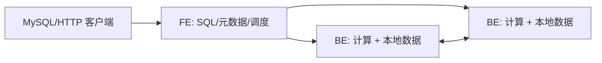

# 01｜架构、核心对象与第一条查询

## 1. 为什么选择 Doris

Apache Doris 是基于 MPP 的实时分析数据库，通过 MySQL 协议提供 SQL 接口，目标工作负载包括实时报表、交互分析、高并发点查、湖仓联邦分析，以及 4.x 中的全文/向量混合检索。它不是事务型 OLTP 数据库的通用替代品：大量短事务、强外键约束、逐行锁竞争通常应留在 OLTP，Doris 承担分析副本。

先把需求写成数字：日增量、保留期、压缩前字节数、峰值导入、查询并发、P95 延迟、数据鲜度、RPO/RTO。没有这些输入，架构选择只是偏好。

## 2. 两种部署架构

### 2.1 存算一体



- **FE**：认证、SQL 解析、逻辑与物理计划、元数据、节点与任务调度。
- **BE**：列式存储、Tablet 副本、向量化/Pipeline 执行、Compaction。
- **Master FE** 处理元数据写；**Follower** 参与选举；**Observer** 扩展读能力但不参与选举。
- Tablet 是数据分片和副本调度的基本单位。写入形成 Rowset，Rowset 内含 Segment；后台 Compaction 合并版本和小文件。

优点是本地 I/O 路径短、组件少。代价是扩计算通常也带来存储迁移，资源隔离主要依赖工作负载治理。

### 2.2 存算分离

计算组中的 BE 主要承担计算与本地缓存，持久数据放在 S3/HDFS/OSS 等共享存储，Meta Service 管理数据层元数据。它适合云上弹性、多计算组隔离和共享数据；代价是外部存储依赖、冷缓存延迟、网络成本与更高运维复杂度。

**选择规则**：团队小、规模可控、低延迟优先 → 先选存算一体；已有可靠对象存储、峰谷显著、需要多计算组隔离 → 对存算分离做 POC。POC 必须覆盖缓存命中/未命中、对象存储限流和故障。

## 3. 一条查询如何执行

1. 客户端通过 9030（默认 MySQL 端口）连接 FE；
2. FE 解析、鉴权、改写并由 CBO 选择计划；
3. 计划拆成多个 Fragment，下发到 BE；
4. BE 的 Scan 读取列和索引，经过 Filter/Join/Aggregate/Sort；
5. Exchange 在节点或 Fragment 间传数据；
6. 结果汇总返回客户端。

专家看慢查询时沿这条链路定位：排队 → 规划 → 扫描 → Exchange → 算子 → 返回，而不是先调全局参数。

## 4. 存储路径心智模型

```text
Database
└── Table
    └── Partition（生命周期、分区裁剪）
        └── Bucket/Tablet（分布、并行、迁移）
            └── Replica（容错副本，存算一体）
                └── Rowset -> Segment（写入版本与列式文件）
```

关键结论：

- 分区过多会放大 FE 元数据和调度成本；分区太粗会多扫描且难以按时间管理。
- Tablet 太少无法并行，太多会制造元数据、调度和 Compaction 压力。
- 高频小批写入会产生大量小 Rowset；优先批量化或 Group Commit，而不是靠加机器掩盖。
- 排序 Key 决定前缀索引和数据局部性；它不是 OLTP 的 B-Tree 主键。

## 5. 创建并观察第一个库

先运行 `examples/ecommerce/schema.sql` 和 `seed.sql`。然后检查对象，不要只看“SQL 成功”。

```sql
SELECT VERSION();
SHOW FRONTENDS;
SHOW BACKENDS;
SHOW CREATE TABLE doris_lab.fact_order_items;
SHOW PARTITIONS FROM doris_lab.fact_order_items;

SELECT order_date, shop_id,
       SUM(quantity * unit_price - discount_amount) AS gmv
FROM doris_lab.fact_order_items
WHERE order_date >= '2026-08-01' AND order_date < '2026-09-01'
GROUP BY order_date, shop_id
ORDER BY order_date, shop_id;
```

查看计划：

```sql
EXPLAIN VERBOSE
SELECT shop_id, SUM(pay_amount)
FROM doris_lab.fact_orders
WHERE order_date = '2026-08-01' AND order_status = 'PAID'
GROUP BY shop_id;
```

阅读顺序：

1. 分区是否只命中目标分区；
2. 谓词是否下推到 Scan；
3. 预计行数是否符合实际数量级；
4. Join 分发是 Broadcast、Shuffle、Colocate 还是 Bucket Shuffle；
5. Exchange、聚合、排序在哪一层发生。

`EXPLAIN` 是计划，不是运行事实。运行耗时、等待、峰值内存、实际行数和数据倾斜必须看 Query Profile。

## 6. 一致性与可用性

存算一体通常以多副本保存 Tablet。副本让节点故障时仍可服务，但不等于备份：误删、错误更新和逻辑损坏会传播到副本。FE 多节点保障元数据服务可用；生产常用奇数个可选举 FE，跨故障域放置，具体数量按官方版本建议和故障模型设计。

把三个概念分开：

- **高可用**：组件故障后服务是否继续；
- **灾备**：站点或集群级事故后恢复到哪里；
- **备份**：可恢复到哪个历史时间点的数据副本。

## 7. 容量估算起点

设每日原始增量 $D$，保留 $R$ 天，压缩比 $c$（压缩后/原始），副本数 $r$，安全余量 $h$，则仅数据的粗略磁盘需求：

$$S = D \times R \times c \times r \times (1+h)$$

还要加入索引、临时空间、Compaction、Schema Change 和增长窗口。压缩比必须用真实样本导入测量，不从宣传数字推断。生产磁盘不能按 100% 使用率规划。

## 8. 实验：证明分区裁剪
1. 先向 `2026-07`、`2026-08`、`2026-09` 三个分区各写入一批测试数据（或扩展 seed.sql）；
2. 对有日期谓词和无日期谓词的同一聚合分别执行 `EXPLAIN VERBOSE`；
3. 记录选中分区、扫描行/字节和耗时；
4. 故意对日期列套不利于下推的复杂表达式，再改写为范围谓词；
5. 用结果集校验两种写法语义一致。

只有存在多个非空分区时，比较结果才真正证明了分区裁剪。

## 9. 过关标准

- 能从客户端请求一路讲到 Segment，并指出至少五个可观测点；
- 能根据给定约束选择存算一体或分离，并列出需验证的三个风险；
- 能用 `EXPLAIN` 证明分区裁剪，而不是凭 SQL 外观判断；
- 能解释“副本不是备份”。

参考：[系统架构](https://doris.apache.org/docs/4.x/features-architecture/system-architecture/)、[产品概念](https://doris.apache.org/docs/4.x/features-architecture/product-concepts/)。

下一章：[表模型与物理设计](02-data-modeling.md)。
