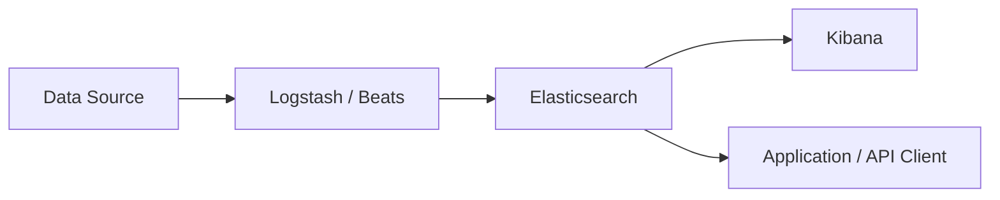
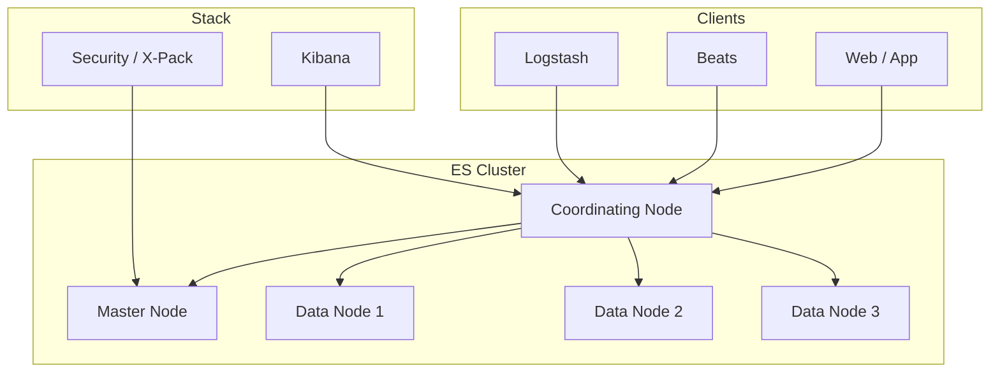

# 第 1 章 Elasticsearch 简介与生态

## 本章目标

学完本章,你能回答:

- Elasticsearch 是什么?它和数据库、搜索引擎分别是什么关系?
- 它诞生于什么背景?解决了什么根本问题?
- 在 ELK / Elastic Stack 中它处在什么位置?
- 当前主流版本与许可证情况如何?

---

## 1.1 一句话理解 Elasticsearch

> **Elasticsearch 是一个分布式的、基于 RESTful API 的、近实时(NRT)的搜索与分析引擎。**

把这句话拆开看:

- **分布式**:数据分片存放在多台机器,水平扩展。
- **RESTful**:一切皆 HTTP,所有操作都是 `GET / POST / PUT / DELETE` 之类的请求。
- **近实时(NRT, Near Real-Time)**:写入到可被搜索,有 1 秒左右的延迟(默认 1s 刷新)。
- **搜索与分析引擎**:既能全文检索,又能做统计聚合(类似 `GROUP BY` / `SUM`),常被作为"OLAP + 搜索"的合体。

---

## 1.2 它从哪来

Elasticsearch(后简称 ES)由 Shay Banon 在 2010 年发布。它的前身是一个叫 **Compass** 的库(给一个菜谱搜索 App 用)。
因为效果显著,作者抽出核心重写,得到 ES。

> ES 的底层全文检索能力来自 **Apache Lucene**。Lucene 是 Java 写的、极其强大的全文检索库;ES 等于给它穿上了"分布式 + 易用 API"的外衣。

时间线:

- 2010:0.x 发布
- 2014:1.x,被广泛使用
- 2015:2.x
- 2016:5.x(里程碑:合并 `mapping types`,提供 `Kibana`、`X-Pack` 集成)
- 2017:6.x
- 2019:7.x(`mapping types` 彻底移除)
- 2022:8.x(默认开启 Security、API 简化)
- 2024:8.13+ 持续演进

---

## 1.3 它解决什么根本问题

数据库(MySQL / PG)在"模糊搜索 + 高并发 + 大数据量"上存在明显短板:

| 场景 | 关系型数据库 | Elasticsearch |
| --- | --- | --- |
| 全文模糊搜索 `LIKE '%关键词%'` | 走全表扫描,数据量大时极慢 | 倒排索引,毫秒级 |
| 多字段组合过滤 + 全文搜索 | 需要复杂的 SQL + 全文索引 | 单一 DSL 即可 |
| 千万级以上数据 | 需要分库分表 + 中间件 | 天然分布,水平扩展 |
| 高亮 / 纠错 / 同义词 | 自己写 | 内置 |
| 复杂聚合分析 | 大数据量时 GROUP BY 极慢 | 面向聚合优化 |

**ES 不是数据库替代品**。关系型数据库擅长事务(ACID),ES 擅长搜索与分析。常见搭配是:**MySQL(写) + ES(读 / 搜索)**,通过 binlog 或 MQ 把数据同步过去。

---

## 1.4 Elastic Stack(ELK)生态

ES 不是孤立存在的,它属于 **Elastic Stack** —— 一组协同组件的合集。

- **Beats**:轻量级数据采集器(Filebeat 采集日志、Metricbeat 采集指标、Packetbeat 采集网络等)。
- **Logstash**:数据处理管道,能解析、转换、丰富数据(JVM 重量级)。
- **Elasticsearch**:存储 + 搜索 + 分析。
- **Kibana**:可视化与运维 UI(也含 Dev Tools,可以写 REST)。

> 早期的 "ELK" 指 Elasticsearch + Logstash + Kibana。后来 Beats 家族加入,合称 **Elastic Stack**。

---

## 1.5 ES 的典型使用场景

| 场景 | 示例 |
| --- | --- |
| 站内搜索 | 电商商品搜索、内容平台搜索 |
| 日志平台 | 集中式日志检索(替代 grep + awk) |
| 应用监控 | APM 指标存储 + 可视化 |
| 安全分析 | SIEM,威胁检测 |
| 向量检索 | RAG 系统中存储 embedding,做相似度搜索(8.x+) |
| 时序数据 | 配合 ILM 做冷热分层时序存储 |

---

## 1.6 版本与许可证(重要)

- **开源协议**:从 7.11 开始,Elastic 把源码改为 **SSPL + Elastic License** 双协议。
- **商业版(Platinum / Enterprise)**:提供高级安全、机器学习、告警、跨集群等。
- **开源分支 OpenSearch**:由 AWS 在 2021 年 fork 自 7.10.2,继续 Apache 2.0,功能与 Elastic Stack 高度兼容但已分化。
- **本教程基于 Elastic 官方 8.x**:你学完后,OpenSearch(8.x)绝大部分内容也适用,但部分新 API 与商业功能会有差异。

---

## 1.7 关键术语速览

| 术语 | 含义 | 类比 |
| --- | --- | --- |
| Cluster | 一个或多个节点组成的 ES 集群 | 整个数据库 |
| Node | 一台 ES 进程 | 一台服务器 |
| Index | 一组文档的集合 | 关系库的 table(但更轻量) |
| Document | 一条 JSON 数据 | 表的一行 |
| Field | 文档的字段 | 表的一列 |
| Mapping | 字段的类型与索引方式定义 | 表结构 DDL |
| Shard | 索引的分片 | 数据的分片 |
| Replica | 分片的副本 | 主备 |

具体含义在 [第 3 章](./03-核心概念.md) 详细解释。

---

## 1.8 一图看懂 ES 整体生态

---

## 1.9 要点速查

- ES = 分布式 + 近实时 + 搜索与分析。
- 内核是 Lucene,核心数据结构是 **倒排索引**。
- 不替代关系型数据库,常与 MySQL 配合(写 + 读搜索分离)。
- 8.x 默认开启安全(账号密码),`https` 默认开启。
- 生态包含 Beats、Logstash、Kibana、Security,合称 Elastic Stack。

---

## 1.10 实操练习

1. 访问 <https://www.elastic.co/cn/elasticsearch/> 阅读官方简介。
2. 访问 <https://opensearch.org/> 了解 OpenSearch 的差异。
3. 在脑里默画:你公司目前的搜索/日志/分析需求,哪一块能交给 ES 做?理由是什么?

---

## 1.11 思考题

1. ES 是"数据库"吗?为什么?
2. 既然 ES 底层是 Lucene,为什么不直接用 Lucene?ES 解决了 Lucene 的什么痛点?
3. ES 与 ClickHouse、Doris 等 OLAP 引擎的核心区别是什么?何时该选 ES,何时该选 OLAP?
4. SSPL / Elastic License 与 Apache 2.0 的差异点是什么?对自建商业产品有什么影响?

---

下一章:[第 2 章 环境搭建与基本配置](./02-环境搭建与基本配置.md)
