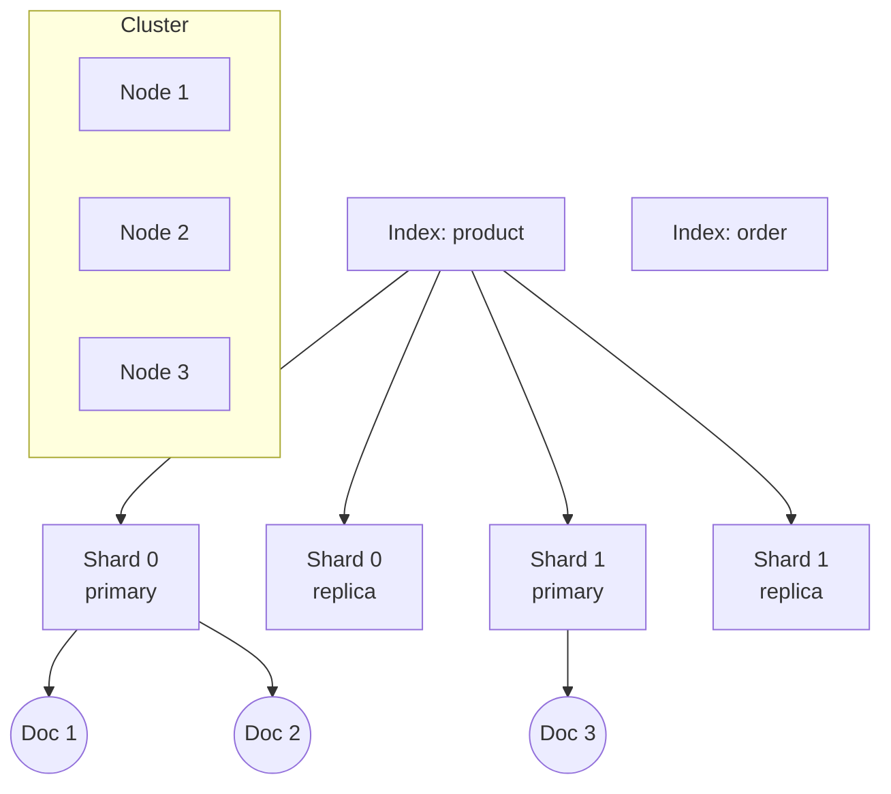
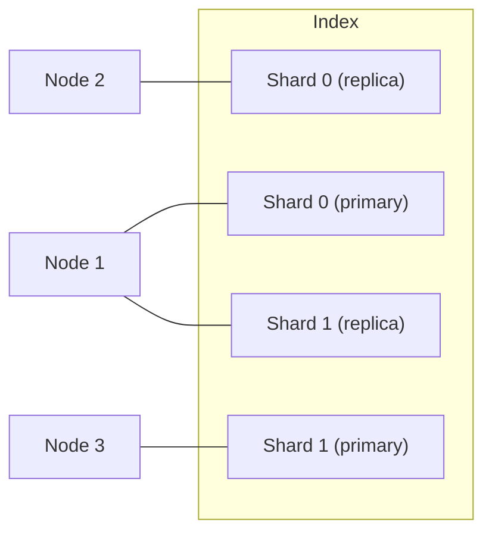

# 第 3 章 核心概念(索引 / 文档 / 分片 / 集群)

## 本章目标

学完本章,你能:

- 清楚解释 ES 中 **cluster / node / index / document / field / mapping / shard / replica** 的含义。
- 理解 **倒排索引** 的原理。
- 知道 ES 是怎么把数据分散到多台机器的。
- 解释 **primary shard / replica shard** 的角色。

---

## 3.1 整体模型



---

## 3.2 核心对象

### 3.2.1 Cluster(集群)

ES 集群由一个或多个 **node** 组成,对外表现为一个整体,通过 **cluster name** 识别。
不同 `cluster.name` 不会互通,即使网络可达。

### 3.2.2 Node(节点)

一个 ES 进程就是一个 node。每个 node 启动时分配一个 UUID(写盘),保留在 `data` 目录。

**节点角色**(8.x 推荐显式声明):

| 角色 | 作用 |
| --- | --- |
| `master` | 集群元数据管理(选主、增删索引) |
| `data` | 存储数据、响应读写 |
| `data_content` | 偏内容型(写入多) |
| `data_hot/warm/cold/frozen` | 温度分层 |
| `ingest` | 数据预处理管道 |
| `ml` | 机器学习 |
| `remote_cluster_client` | 跨集群 |
| `coordinating` | 默认角色,所有节点都有,负责请求转发与汇总 |

一个 node 可以同时是多个角色;但生产推荐**职责分离**。

### 3.2.3 Index(索引)

> **一个 index ≈ 一类数据**。比如 `product`、`order`、`user`。

- Index 名必须小写(8.x)。
- 一个 index 由若干 **shard**(分片)组成。
- 一旦创建,**主分片数量不可改**(除非 reindex)。

### 3.2.4 Document(文档)

- ES 数据的最小单位。一个文档就是一个 JSON 对象。
- 每个文档属于一个 index,每个文档有唯一的 `_id`。

示例:

```json
{
  "_index": "product",
  "_id": "p001",
  "_source": {
    "name": "iPhone 15 Pro",
    "price": 8999,
    "tags": ["apple", "phone", "5g"]
  }
}
```

### 3.2.5 Field(字段)

文档的字段。字段有**类型**(text / keyword / integer / date / boolean / geo_point 等),类型在 mapping 中定义。

### 3.2.6 Mapping(映射)

Mapping = index 的 **schema**。告诉 ES 字段是什么类型、是否分词、是否索引等。

> 与关系库类比:Index ≈ table,Document ≈ row,Field ≈ column,Mapping ≈ table DDL。

**注意:ES 不是 schema 强制的**。你没定义 mapping,第一次写入时 ES 会"猜"出字段类型(动态映射)。**生产强烈不推荐**依赖动态映射。

---

## 3.3 Shard(分片)

> Shard 是 ES 实现"水平扩展 + 并行"的关键。

一个 index 的数据被切分成 N 个 **主分片(primary shard)**。每个主分片可以再挂 0..N 个 **副本(replica)**。



要点:

- **主分片数 = 创建时定,不可改**。
- **副本分片数可随时改**。
- 主分片处理 **写**,副本既能读也能 fail-over 时升主。
- 主副不能在同一节点(ES 强制)。

### 3.3.1 副本数怎么选

- 数据可靠性优先:`number_of_replicas: 1` 或 2。
- 单节点测试:`number_of_replicas: 0`(否则 yellow)。
- 搜索性能:`number_of_replicas` 越多,搜索吞吐越高(读可分摊)。

---

## 3.4 倒排索引(Inverted Index)

倒排索引是 ES 实现快速全文搜索的核心数据结构。

对比 **正排索引**(文档 → 词):

| 文档 | 内容 |
| --- | --- |
| D1 | "我喜欢 Java" |
| D2 | "我喜欢 Elasticsearch" |
| D3 | "Java 是最好的语言" |

**倒排索引**(词 → 文档):

| 词 | 出现的文档 |
| --- | --- |
| 我 | [D1, D2] |
| 喜欢 | [D1, D2] |
| Java | [D1, D3] |
| Elasticsearch | [D2] |
| 是 | [D3] |
| 最好 | [D3] |
| 的 | [D3] |
| 语言 | [D3] |

搜"Java Elasticsearch" 时:

1. 查"Java" → [D1, D3]
2. 查"Elasticsearch" → [D2]
3. 求交集为空 → 但 ES 还能算相关性分数,支持 OR 行为
4. 实际搜索时,Lucene 还维护 **词频(TF) / 位置 / 偏移** 信息,用于打分、高亮、phrase query。

> 想了解细节(词频、位置对相关性的影响)看 [第 9 章 相关性打分与排序机制](../02-高级篇/09-相关性打分与排序机制.md)。

---

## 3.5 近实时(Near Real-Time)与 refresh

- 文档写入后,**默认 1 秒** 才可被搜索到,这个动作叫 `refresh`。
- refresh 把内存中的 segment 刷到文件系统缓存,并生成新的可搜索 segment。
- 写盘(flush)默认 30 分钟一次(可改)。
- 事务日志 translog 在文档写时落盘,保证宕机不丢。

> 强制立即可搜:`POST /index/_refresh`(测试用,生产禁用)。

---

## 3.6 集群节点交互

### 3.6.1 Master 节点

- 维护集群状态(cluster state):包括所有 index、shard、副本位置。
- 通过 Zen Discovery / 新的 Coordinator 选举产生。
- **建议** 集群设 3 个 master eligible 节点,**其中 1 个为 active master,2 个 voting-only**。
- 节点数 = 1:勉强;节点数 = 2:脑裂风险;节点数 ≥ 3:推荐(odd 数为佳)。

### 3.6.2 Data 节点

- 真实存数据的节点。CPU/IO/磁盘压力最大。
- 一般 3~10 个,每个 data 节点机器配置高。

### 3.6.3 Coordinating 节点

- 每个节点默认都是 coordinating,负责把客户端请求分发到对应 shard、再汇总结果。
- 大集群可设专用 coordinating(去掉 master/data 角色),用于扛高 QPS 读 / search 请求。

---

## 3.7 集群健康(再深入)

`/_cluster/health`:

| 字段 | 含义 |
| --- | --- |
| status | green / yellow / red |
| number_of_nodes | 节点数 |
| active_primary_shards | 活跃的主分片数 |
| active_shards | 活跃总分片数 |
| unassigned_shards | 未分配的分片数 |
| relocating_shards | 正在搬迁的分片数 |
| initializing_shards | 正在初始化的分片数 |

---

## 3.8 路由:文档怎么落到 shard

写入时,ES 用下面的公式决定文档落哪个主分片:

```
shard_num = hash(_id) % number_of_primary_shards
```

> `_id` 必填,**写完即不可改 shard 位置**。所以设计主分片数时,要预估未来 1~2 年总量。

自定义路由:可以指定 `routing` 参数强制文档走指定 shard(把同一类数据集中,提升查询效率,但有热点风险)。

---

## 3.9 segment 与合并

- shard 内部由多个 **segment** 组成。
- segment 不可修改,只有合并(merge)和删除(标记)。
- 后台 `merge` 任务把小 segment 合成大 segment,减少文件数,提升性能。
- 写多场景下 merge 是性能瓶颈,需要关注 `index.merge.*` 调优。

---

## 3.10 要点速查

- **Cluster / Node / Index / Shard / Document / Field / Mapping** 是七层对象。
- 倒排索引:词 → 文档,带 TF / 位置信息。
- 主分片数 = 创建时定;副本可调。
- 写时计算 shard = `hash(_id) % primary_shards`。
- 副本不在同一节点(ES 强制)。
- 集群颜色看副本是否就位。
- 8.x 推荐显式声明 node.roles。

---

## 3.11 实操练习

1. 创建 3 主分片、1 副本的 index:

   ```
   PUT /test_index
   {
     "settings": { "number_of_shards": 3, "number_of_replicas": 1 }
   }
   ```

2. 用 `_cat/shards/test_index?v` 看分片分布。
3. 停掉一个 node,观察 health 变 red → yellow;再启动,变回 green。

---

## 3.12 思考题

1. 为什么主分片数不能改?如果业务增长要扩,怎么做?(reindex 思路)
2. 单节点集群为什么总是 yellow?
3. shard 多 = 查询快吗?太多会怎样?
4. ES 的"近实时"和 MySQL 的"实时"对业务的差别是什么?

---

下一章:[第 4 章 CRUD 基本操作](./04-CRUD基本操作.md)
