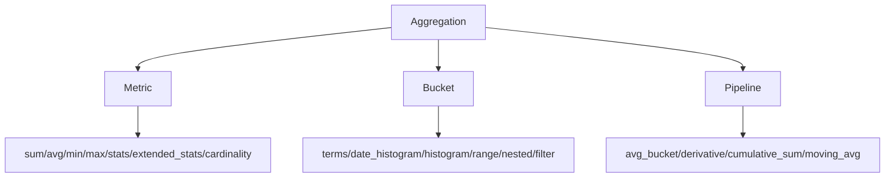

# 第 8 章 聚合分析(Aggregations)

## 本章目标

学完本章,你能:

- 区分 **Bucket / Metric / Pipeline** 三类聚合。
- 用 `terms` / `date_histogram` / `histogram` / `range` 各种 bucket 做分组。
- 用 `sum` / `avg` / `min` / `max` / `stats` / `cardinality` 等 metric 做统计。
- 用 `avg_bucket` / `derivative` 等 pipeline 算"二级指标"。
- 理解 **doc_count_error_max** 与 **shard_size** 的原理。

---

## 8.1 聚合分类



- **Metric**:算一个数(总和 / 平均 / 极值 / 基数)。
- **Bucket**:把文档分桶,每桶再聚合(类似 SQL `GROUP BY`)。
- **Pipeline**:基于其他聚合的结果再聚合。

---

## 8.2 Metric 聚合

```
{
  "size": 0,
  "aggs": {
    "total_price":   { "sum": { "field": "price" } },
    "avg_price":     { "avg": { "field": "price" } },
    "min_price":     { "min": { "field": "price" } },
    "max_price":     { "max": { "field": "price" } },
    "price_stats":   { "stats": { "field": "price" } },
    "unique_brands": { "cardinality": { "field": "brand" } }
  }
}
```

> `size: 0` 表示不要 hits,只返回 agg(节省带宽)。

### 8.2.1 cardinality 误差

`cardinality` 用 HyperLogLog,误差约 6%。`precision_threshold` 调高可降低误差,代价是内存。

```
{ "cardinality": { "field": "uid", "precision_threshold": 10000 } }
```

---

## 8.3 Bucket 聚合

### 8.3.1 terms(分桶统计)

```
{
  "aggs": {
    "by_brand": {
      "terms": { "field": "brand", "size": 10 }
    }
  }
}
```

输出每个 brand 的 `doc_count` + `key`(brand 值)。

> 排序:`terms` 默认按 `doc_count` 倒序。可改 `"order": { "_key": "asc" }`。

#### 8.3.1.1 嵌套 metric

```
{
  "aggs": {
    "by_brand": {
      "terms": { "field": "brand", "size": 10 },
      "aggs": {
        "avg_price": { "avg": { "field": "price" } },
        "max_price": { "max": { "field": "price" } }
      }
    }
  }
}
```

> 类似 SQL:`SELECT brand, COUNT(*), AVG(price) ... GROUP BY brand`

### 8.3.2 date_histogram(时间分桶)

```
{
  "aggs": {
    "sales_over_time": {
      "date_histogram": {
        "field": "launched_at",
        "calendar_interval": "month",
        "min_doc_count": 0
      }
    }
  }
}
```

`calendar_interval`:day / week / month / quarter / year(calendar 边界对齐)。
`fixed_interval`:`30m` / `2h` 这种(从 0 开始计)。

补全空桶:

```
"extended_bounds": { "min": "2024-01-01", "max": "2024-12-31" }
```

### 8.3.3 histogram(数值分桶)

```
{ "histogram": { "field": "price", "interval": 50 } }   // 0~50, 50~100 ...
```

### 8.3.4 range(自定义区间)

```
{
  "aggs": {
    "price_ranges": {
      "range": {
        "field": "price",
        "ranges": [
          { "to": 50 },
          { "from": 50, "to": 100 },
          { "from": 100 }
        ]
      }
    }
  }
}
```

### 8.3.5 filter / filters

```
{
  "aggs": {
    "on_sale_count":  { "filter": { "term": { "on_sale": true } } },
    "by_status": {
      "filters": {
        "filters": {
          "active":   { "term": { "status": "active" } },
          "inactive": { "term": { "status": "inactive" } }
        }
      }
    }
  }
}
```

### 8.3.6 nested agg(嵌套聚合)

```
{
  "aggs": {
    "specs_agg": {
      "nested": { "path": "specs" },
      "aggs": {
        "by_k": {
          "terms": { "field": "specs.k" }
        }
      }
    }
  }
}
```

### 8.3.7 global agg(全局聚合,忽略 query)

```
{
  "query": { "term": { "on_sale": true } },
  "aggs": {
    "all_count": {
      "global": {},
      "aggs": {
        "by_brand": { "terms": { "field": "brand" } }
      }
    }
  }
}
```

> 在命中条件下,还能看到全量统计。

---

## 8.4 Pipeline 聚合(二级指标)

Pipeline 聚合对**已有聚合结果**再聚合。

### 8.4.1 derivative(差分)

```
{
  "aggs": {
    "sales": {
      "date_histogram": { "field": "ts", "calendar_interval": "month" },
      "aggs": { "revenue": { "sum": { "field": "price" } } }
    },
    "sales_diff": {
      "derivative": { "buckets_path": "sales>revenue" }
    }
  }
}
```

> 算每月销售额的环比变化。

### 8.4.2 moving_avg(移动平均)

```
{ "moving_avg": { "buckets_path": "sales>revenue", "window": 3 } }
```

### 8.4.3 cumulative_sum

```
{ "cumulative_sum": { "buckets_path": "sales>revenue" } }
```

### 8.4.4 avg_bucket / sum_bucket

```
{
  "aggs": {
    "by_brand": {
      "terms": { "field": "brand" },
      "aggs": { "avg_price": { "avg": { "field": "price" } } }
    },
    "overall_avg": {
      "avg_bucket": { "buckets_path": "by_brand>avg_price" }
    }
  }
}
```

> 各品牌均价再求平均。

---

## 8.5 聚合的精度问题

### 8.5.1 terms agg 的"不准"原因

`terms` 聚合在每个 shard 内部取前 N 个,再合并。如果某品牌在 shard A 是 top5,在 shard B 是 top20,合并时可能漏掉。

控制精度:

```
{
  "aggs": {
    "by_brand": {
      "terms": {
        "field": "brand",
        "size": 10,
        "shard_size": 200,
        "show_term_doc_count_error": true
      }
    }
  }
}
```

- `size`:最终返回的桶数。
- `shard_size`:每个 shard 取的桶数(比 `size` 大,通常 1.5~2x,提高精度)。
- `show_term_doc_count_error`:返回每个桶的 `doc_count_error_upper_bound`(与真实计数的最大可能差)。

### 8.5.2 解决精度

- 增大 `shard_size`。
- 减少 shard 数(用 `_shrink` 减少,但要谨慎)。
- 对极高基数场景,改用 `composite` 聚合做分页(后述)。

---

## 8.6 composite 聚合(分桶分页)

类似 "terms of terms",逐页输出桶,适合**所有分组(高基数)**:

```
POST /books/_search
{
  "size": 0,
  "aggs": {
    "my_buckets": {
      "composite": {
        "size": 100,
        "sources": [
          { "brand": { "terms": { "field": "brand" } } },
          { "category": { "terms": { "field": "category" } } }
        ]
      }
    }
  }
}
```

下一页:用上次返回的 `after_key`:

```
{
  "size": 0,
  "aggs": {
    "my_buckets": {
      "composite": {
        "size": 100,
        "sources": [
          { "brand": { "terms": { "field": "brand" } } },
          { "category": { "terms": { "field": "category" } } }
        ],
        "after": { "brand": "Apple", "category": "phone" }
      }
    }
  }
}
```

---

## 8.7 复杂聚合示例:商品报表

```
POST /products/_search
{
  "size": 0,
  "query": {
    "range": { "launched_at": { "gte": "2024-01-01", "lte": "2024-12-31" } }
  },
  "aggs": {
    "by_brand": {
      "terms": { "field": "brand", "size": 20, "order": { "revenue": "desc" } },
      "aggs": {
        "by_month": {
          "date_histogram": { "field": "launched_at", "calendar_interval": "month" },
          "aggs": {
            "revenue":     { "sum": { "field": "price" } },
            "avg_price":   { "avg": { "field": "price" } },
            "on_sale_pct": {
              "filter": { "term": { "on_sale": true } }   // 这里 avg_doc_count
            }
          }
        },
        "revenue": { "sum": { "field": "price" } }
      }
    }
  }
}
```

> 这相当于一份"按品牌、按月"的销售报表,带销售额、均价、促销占比。

---

## 8.8 性能与最佳实践

1. **`size: 0` 不用 hits**:聚合场景几乎都是 `size: 0`。
2. **`keyword` 字段才能 terms**:text 字段要先 `.keyword`。
3. **避免高基数**:`cardinality` 几千万的字段不要 terms(内存爆)。
4. **控制时间范围**:大索引上无 range 的聚合代价高。
5. **缓存**:聚合结果可被 `request_cache` 缓存(节点级)。
6. **Composite 替代 terms 分页**:用深分页遍历所有桶。
7. **nested 字段聚合**:必须先 `nested` 进入,再 agg 子字段。
8. **pipeline 聚合**性能差,大报表用 material view 或提前算。

---

## 8.9 实战技巧

### 8.9.1 标签占比

```
{
  "aggs": {
    "tags": {
      "terms": { "field": "tags", "size": 100 },
      "aggs": {
        "tag_ratio": {
          "avg": { "field": "weight" }
        }
      }
    }
  }
}
```

### 8.9.2 Top N 文档取出来

> `top_hits` 子聚合:在每个桶里再取出 top 文档。

```
{
  "aggs": {
    "by_user": {
      "terms": { "field": "user_id", "size": 10 },
      "aggs": {
        "recent_orders": {
          "top_hits": {
            "sort": [{ "order_time": "desc" }],
            "size": 3,
            "_source": ["order_id", "order_time", "amount"]
          }
        }
      }
    }
  }
}
```

> 类似 SQL 窗口函数 `ROW_NUMBER() OVER(PARTITION BY user_id ORDER BY order_time DESC)`.

### 8.9.3 百分位 / 中位数

```
{ "percentiles": { "field": "price", "percents": [50, 75, 90, 99] } }
{ "percentile_ranks": { "field": "price", "values": [50, 100, 200] } }
```

### 8.9.4 geo 距离聚合

```
{
  "aggs": {
    "by_ring": {
      "geo_distance": {
        "field":     "location",
        "origin":    { "lat": 39.9, "lon": 116.4 },
        "ranges":    [
          { "to": 1000 },
          { "from": 1000, "to": 5000 }
        ],
        "unit": "m"
      }
    }
  }
}
```

---

## 8.10 要点速查

- `terms` 是最常用的 bucket;`date_histogram` 做时间序列。
- `cardinality` 用 HLL,有约 6% 误差。
- `top_hits` 在桶内取 top 文档。
- 精度差时调 `shard_size`;高基数分页用 `composite`。
- `size: 0` 加速聚合响应。

---

## 8.11 实操练习

1. 在 `products` 上做 `terms(brand)` + `avg(price)`,返回前 10。
2. 加 `date_histogram` 按月统计销售额,再算 derivative(环比)。
3. 写 `composite` 分页,翻 3 页各 100 桶。
4. 对比加 `size: 0` 与否的响应时间。

---

## 8.12 思考题

1. `terms` 默认只返回 size 个桶,为什么不返回所有?
2. 业务侧要"销量前 100"——`terms` 准吗?为什么不?如何解决?
3. `top_hits` 和 `inner_hits` 有什么区别?何时用哪个?
4. 海量日志(几十亿条)做"按小时的 PV/UV"统计,你用 ES 还是 ClickHouse?为什么?

---

下一章:[第 9 章 相关性打分与排序机制 →](../02-高级篇/09-相关性打分与排序机制.md)
