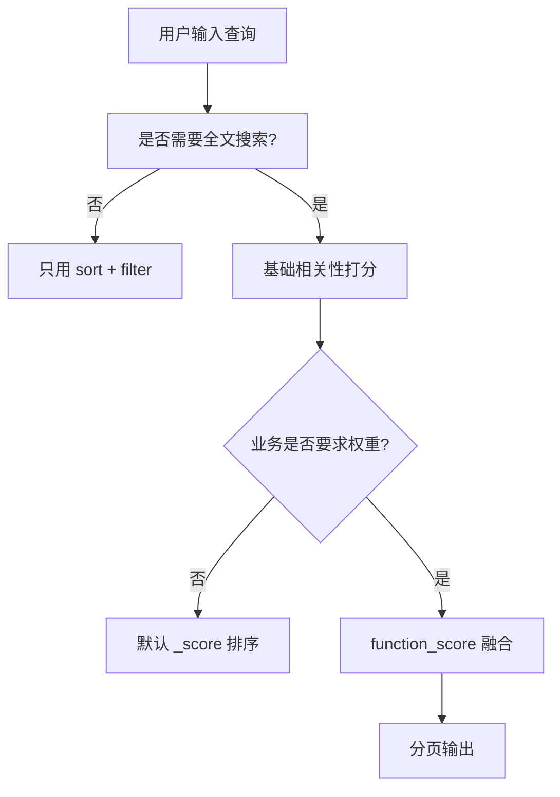

# 第 9 章 相关性打分与排序机制

## 本章目标

学完本章,你能:

- 说出 Lucene 默认打分公式的核心组成(TF / IDF / coord / lengthNorm / boost)。
- 用 `explain` / `explain` API 看每个文档的具体打分过程。
- 用 BM25 替代 TF-IDF(7.x+ 默认)。
- 用 `function_score` 把业务权重融合到相关性。
- 写一个实战的多策略排序方案(相关性 + 新品 + 销量 + 距离)。

---

## 9.1 为什么要理解打分

ES 默认用 Lucene 算 `_score`(相关性分数),按它降序排。
**搜索质量的差异,90% 在于相关性调优。**

理解打分机制,才能:

- 调对索引字段权重。
- 排好自定义排序(新品 / 销量 / 距离)。
- 看 `explain` 调试为什么"该上的没上,该下的没下"。

---

## 9.2 经典 BM25(默认)

ES 5.0 起默认使用 **BM25**(Best Matching 25),替代 TF-IDF。
公式:

$$
\text{score}(D, Q) = \sum_{t \in Q} IDF(t) \cdot \frac{tf(t, D) \cdot (k_1 + 1)}{tf(t, D) + k_1 \cdot (1 - b + b \cdot \frac{|D|}{\text{avgdl}})}
$$

- $tf(t, D)$:**词 t 在文档 D 中出现次数**(词频)。
- $IDF(t)$:**逆文档频率**,全局稀有词权重大。
- $|D|$:文档长度;`avgdl`:平均长度。
- $k_1$:`bm25.k1`,控制 TF 饱和(默认 1.2)。值越大,词频影响越大。
- $b$:`bm25.b`,控制长度归一化强度(默认 0.75)。0 = 不归一化,1 = 完全归一化。

可调:

```
PUT /index
{
  "settings": { "index": { "similarity": { "default": { "type": "BM25", "k1": 1.5, "b": 0.6 } } } }
}
```

---

## 9.3 Lucene 实用打分(Similarity)

ES 在 BM25 之上,做了**实用打分** (Lucene's Practical Scoring Function):

$$
\text{score}(q, d) = \text{coord}(q, d) \cdot \text{queryNorm}(q) \cdot \sum_{t \in q} \sqrt{tf(t,d)} \cdot \text{idf}(t)^2 \cdot \text{boost}(t) \cdot \text{norm}(d, t)
$$

各组件:

- `coord(q, d)`:匹配到的 term 数 / 总 term 数(命中越多,系数越大)。
- `queryNorm(q)`:归一化因子,保证不同 query 间分数可比较(每个 query 内部抵消)。
- `tf`:词频。
- `idf`:逆文档频率。
- `boost(t)`:查询时的 boost(`^N`)。
- `norm(d, t)`:字段级归一化(长度归一化 + 索引期 boost),存在 norms 文件中(1 byte / 字段 / 文档)。

> 实用打分是 BM25 之外再封装的一层,但核心仍是 BM25 思想。

---

## 9.4 用 explain 调试

```
GET /books/_search
{
  "query": {
    "match": { "title": "elasticsearch" }
  },
  "explain": true
}
```

返回中每条 hit 多一个 `_explanation` 字段,逐项展示打分细节:

```json
{
  "_explanation": {
    "value": 1.2,
    "description": "weight(title:elasticsearch in 0) [PerFieldSimilarity], result of:",
    "details": [
      { "value": 1.2, "description": "score(freq=1.0), computed as boost * ..." }
    ]
  }
}
```

排错技巧:

1. 想让某字段更相关 → 加大 `boost`。
2. 想让短文档优先(默认就是)→ 调小 `b`。
3. 想看 lengthNorm 影响 → 文档长度差异大时,差异会体现在分母。

---

## 9.5 boost(权重)

### 9.5.1 索引期 boost

> 7.x 起 **弃用**。在 mapping 中加 `boost` 字段被忽略。

### 9.5.2 查询期 boost

```
{
  "multi_match": {
    "query": "elasticsearch",
    "fields": ["title^3", "comment^1", "tags^2"]
  }
}
```

`^N` 是字段权重。N 越大,影响越显著。

> 不同字段类型权重差距大时,可用 `tie_breaker` 软化。

---

## 9.6 常见调权手段

### 9.6.1 multi_match type 选

- `best_fields`(默认):**取单字段最高分**——一篇文章里"标题命中"更重要。
- `most_fields`:多字段分数**求和**——同一文本分散在多字段时用。
- `cross_fields`:把多字段当"一整段文本"——跨字段召回,适合"first_name + last_name"。

### 9.6.2 dis_max + tie_breaker

`best_fields` 内部就是 dis_max,加 `tie_breaker` 让次高分参与打分(避免信息丢失):

```
{ "dis_max": {
    "tie_breaker": 0.3,
    "queries": [
      { "match": { "title":   "elasticsearch" } },
      { "match": { "comment": "elasticsearch" } }
    ]
  } }
```

### 9.6.3 minimum_should_match

控制 should 的"宽松度":

```
{ "match": { "comment": { "query": "java elasticsearch spring", "minimum_should_match": "75%" } } }
```

> 3 个 term 中至少 75%(取整,实际 2 个)命中。

---

## 9.7 function_score 实战

把业务权重融合到打分里,核心是:

```
function_score(原始 query 分, 业务函数, score_mode, boost_mode)
```

### 9.7.1 函数一览

| 函数 | 用途 |
| --- | --- |
| `weight` | 加固定权重 |
| `field_value_factor` | 用字段值(销量 / 评分) |
| `decay functions`(gauss / linear / exp) | 按距离 / 时间衰减 |
| `script_score` | 自定义脚本 |

### 9.7.2 field_value_factor

```
{
  "query": {
    "function_score": {
      "query": { "match": { "title": "elasticsearch" } },
      "field_value_factor": {
        "field":    "sales",
        "modifier": "log1p",  // log(sales + 1)
        "missing":  0,
        "factor":   1.2
      },
      "boost_mode": "sum"
    }
  }
}
```

`modifier`:

- `none` / `log1p` / `log2p` / `ln1p` / `ln2p`:对数处理,避免爆大。
- `sqrt`:平方根。
- `reciprocal`:取倒数。

### 9.7.3 时间衰减

新品优先:

```
{
  "function_score": {
    "query":   { "match": { "title": "elasticsearch" } },
    "functions": [
      {
        "gauss": {
          "launched_at": {
            "origin": "now",
            "scale":  "30d",
            "offset": "7d",
            "decay":  0.5
          }
        }
      }
    ],
    "boost_mode": "multiply"
  }
}
```

> 30 天前的文档分数衰减到 0.5,7 天内不衰减。

### 9.7.4 距离衰减

距离优先(LBS 场景):

```
{
  "function_score": {
    "query": { "match": { "poi_name": "咖啡" } },
    "functions": [
      {
        "gauss": {
          "location": {
            "origin": { "lat": 39.9, "lon": 116.4 },
            "scale":  "2km",
            "decay":  0.5
          }
        }
      }
    ],
    "boost_mode": "multiply"
  }
}
```

### 9.7.5 组合函数

```
{
  "function_score": {
    "query": { "match": { "title": "elasticsearch" } },
    "functions": [
      { "filter": { "term": { "on_sale": true } }, "weight": 1.5 },
      { "field_value_factor": { "field": "sales",  "modifier": "log1p", "missing": 0 } },
      { "field_value_factor": { "field": "rating", "modifier": "sqrt",   "missing": 3 } },
      { "gauss":  { "launched_at": { "origin": "now", "scale": "30d", "decay": 0.5 } } }
    ],
    "score_mode":  "sum",
    "boost_mode": "multiply"
  }
}
```

> 把"在售"加权、销量 + 评分 log 处理、新品时间衰减,统一乘到 query 分上。

---

## 9.8 script_score(自定义脚本)

```
{
  "function_score": {
    "query": { "match": { "title": "elasticsearch" } },
    "functions": [
      {
        "script_score": {
          "script": {
            "source": "Math.log(2 + doc['sales'].value)"
          }
        }
      }
    ],
    "boost_mode": "multiply"
  }
}
```

> 灵活但慢,生产慎用,优先用 `field_value_factor`。

---

## 9.9 排序决策流程



实际工程:

1. **纯商品搜索**:`function_score(query_score, sales_log, time_decay)`。
2. **无搜索的列表**(feed / 关注的人):直接 `sort: created_at desc`。
3. **混合**(搜索 + 距离):`gauss` 距离衰减 × 销量 × 时间。
4. **电商热门词**(大词):避免"销量无限碾压"导致好商品埋没,要 cap 销量分。

---

## 9.10 实战:商品多策略排序

```
{
  "size": 20,
  "query": {
    "function_score": {
      "query": {
        "bool": {
          "must": [
            { "multi_match": { "query": "elasticsearch", "fields": ["title^3", "tags^2", "comment"], "type": "best_fields" } }
          ],
          "filter": [
            { "term":  { "on_sale": true } },
            { "range": { "price": { "gte": 0, "lte": 1000 } } }
          ]
        }
      },
      "functions": [
        { "filter":     { "term": { "official": true } }, "weight": 2 },
        { "field_value_factor": { "field": "sales",    "modifier": "log1p", "missing": 0, "factor": 1 } },
        { "field_value_factor": { "field": "rating",   "modifier": "sqrt",   "missing": 3 } },
        { "gauss": { "launched_at": { "origin": "now", "scale": "30d", "decay": 0.5 } } }
      ],
      "score_mode":  "sum",
      "boost_mode": "sum"
    }
  },
  "sort": [
    "_score",
    { "sales": "desc" }
  ]
}
```

> 解读:`_score` 主导;相同分时按销量兜底。

---

## 9.11 反向调权:boosting 与 negative boost

```
{ "boosting": {
    "positive":       { "match": { "title": "elasticsearch" } },
    "negative":       { "match": { "title": "教程" } },
    "negative_boost": 0.3
  } }
```

> "elasticsearch 教程" 这类标题不被剔除,但分数 × 0.3。

---

## 9.12 模型诊断与可视化

### 9.12.1 explain

```
GET /products/_search?explain=true
{ "query": { ... } }
```

### 9.12.2 人工评估

准备"query - 期望 top 10"对,人工评估 top10 命中率 / MRR / NDCG。

### 9.12.3 A/B 测试

新打分函数上线,对比旧版的 CTR / 转化 / 留资。

---

## 9.13 要点速查

- 7.x+ 默认 BM25,可调 `k1` / `b`。
- `field_value_factor` 把业务量级融合进相关性。
- `gauss` 衰减做时间 / 距离。
- `tie_breaker` 软化单字段霸权。
- 7.x 起的索引期 boost 已弃用,查询期 `^N` 是主流。
- 生产排序:相关性 + 业务权重(销量 / 评分 / 时新 / 距离)按业务场景配比。

---

## 9.14 实操练习

1. 改 `bm25.k1` / `bm25.b` 看打分变化。
2. 写一个 `function_score`,融合"销量 + 新品"。
3. 用 `explain=true` 看 top1 文档,逐项解释 score。
4. 对比:同 query 关 / 开 function_score 时的 top10 差异。

---

## 9.15 思考题

1. BM25 比 TF-IDF 优秀在哪里?
2. `queryNorm` 存在意义是什么?为什么不能去?
3. 为什么不能用 doc 数量限制大数爆掉?你有什么 cap 策略?
4. 给你一个电商搜索:如何在"长尾词"和"热门词"间保持公平的相关性?

---

下一章:[第 10 章 性能调优与 JVM 优化 →](./10-性能调优与JVM优化.md)
