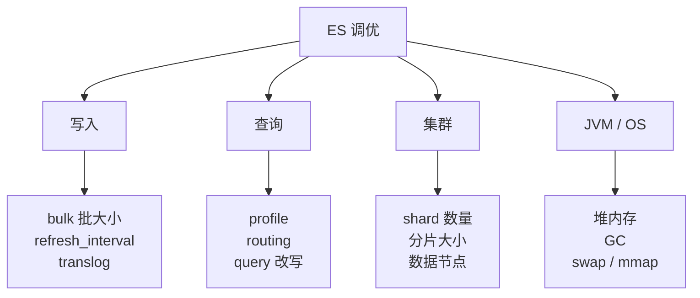

# 第 10 章 性能调优与 JVM 优化

## 本章目标

学完本章,你能:

- 写出索引 / 搜索 / 集群 3 个维度的关键调优点。
- 熟练调 JVM 堆与 GC,定位长 GC。
- 用 `/_tasks`、`/_nodes/hot_threads`、`/profile` 定位性能瓶颈。
- 用 `routing` / `preference` / `request_cache` 等高级参数优化查询。
- 实施 Benchmark 用 esrally 测性能。

---

## 10.1 调优总览



---

## 10.2 写入性能调优

### 10.2.1 Bulk 调优

```
POST /_bulk
{ "index": { "_index": "logs", "_id": "1" } }
{ ... }
...
```

- 推荐批次大小 **5~15 MB**(而非 N 条)。
- 并发客户端 = ES 节点数(协调节点) × 1~2。

```
for (i = 0; i < N; i++) {
  bulk(5MB);
}
```

### 10.2.2 refresh_interval

```
PUT /logs/_settings
{ "refresh_interval": "30s" }
```

> 默认 1s。日志/时序可以拉到 30s 甚至 -1(关闭,手动 refresh)。代价:不可实时搜索。

### 10.2.3 translog

```
PUT /logs/_settings
{
  "index.translog.durability": "async",   // 异步刷盘
  "index.translog.sync_interval": "30s"
}
```

> 异步 + 较长同步间隔可提升写吞吐。代价:宕机可能丢少量未刷盘数据。

### 10.2.4 副本数

写流程:主分片写完 → 副本同步 → 成功。副本越多写越慢。
**写入密集**场景,先把副本数调 0,写入完成后再加副本。

### 10.2.5 用 _bulk 线程池

`thread_pool.write.queue_size` 调大(默认 1000),避免写溢出。

---

## 10.3 查询性能调优

### 10.3.1 filter > query

`bool.filter` 不打分,缓存命中率高。`must` / `should` 走打分,慢。

### 10.3.2 避免深分页

深分页 → 每个 shard 返回 `from + size` 条,O(shard_num * size)。
改用 `search_after` / PIT。

### 10.3.3 routing

按 `user_id` / `tenant_id` 路由,查询只走 1 个 shard:

```
PUT /orders?routing=u123
{ ... }
```

> 但热点租户 / 大租户需要单独处理(shard 拆 / 切租户)。

### 10.3.4 preference

指定查询的 shard 顺序,减少跨节点 round-trip:

```
GET /orders/_search?preference=_primary
{ ... }
```

`_primary` / `_replica` / 自定义 string。

### 10.3.5 request_cache

聚合 / 命中 query 缓存,节点级共享:

```
GET /orders/_search?request_cache=true
{ ... }
```

> 第一次 miss,后续 hit。命中率高的 dashboard 报表很受用。

### 10.3.6 关闭 _source

节省 IO,但失去 update / reindex / highlight。一般**不关**;按字段裁剪即可。

### 10.3.7 调整 max_result_window

```
PUT /orders/_settings
{ "index.max_result_window": 50000 }
```

> 太大不利于 GC;不要无脑改大。

### 10.3.8 fielddata 与 doc_values

- `text` 字段聚合 → 触发 fielddata,内存开销巨大。
- 改用 `text + .keyword` 多字段聚合。
- 关闭 `norms` 节省内存(如果不需要打分)。

### 10.3.9 关闭 norms / index_options

```
"title": {
  "type":          "text",
  "norms":         false,
  "index_options": "freqs"
}
```

> 减少倒排文件,适合"只用 filter 不用打分"的字段。

### 10.3.10 eager_global_ordinals

keyword 字段建索引时构建全局字典,聚合更快。

```
"tags": { "type": "keyword", "eager_global_ordinals": true }
```

> 适合"聚合频繁,写入不密集"的字段。

---

## 10.4 索引与 shard 调优

### 10.4.1 shard 大小

经验:单个 shard **10~50 GB** 为佳(GB 级,LUENCE 经验)。
太大 → 恢复慢 / merge 慢;太小 → 资源浪费 / 请求合并难。

### 10.4.2 分片数估算

- 数据量 1TB / 50GB/shard ≈ **20~30 个主分片**。
- 集群节点数 = 主分片副本数 × 1.5~2。
- 公式:`number_of_shards = max(数据量 / 50GB, 节点数 × 1.5)`。

### 10.4.3 shrink API

减少主分片(8.x 起有限制):

```
POST /source_index/_shrink/target_index
{ "settings": { "index.number_of_shards": 1 } }
```

> 源分片数必须是目标倍数(4, 9, 16)。需先设 `index.blocks.write: true`。

### 10.4.4 split API

扩主分片(同样有限制):

```
POST /source_index/_split/target_index
{ "settings": { "index.number_of_shards": 12 } }
```

> 源分片数必须能整除目标(2, 3, 4 ... 9, 16)。

### 10.4.5 rollover

写入时按时间或大小自动滚动新 index(配合 ILM):

```
POST /logs/_rollover
{
  "conditions": {
    "max_age":   "7d",
    "max_size":  "50gb"
  }
}
```

---

## 10.5 集群调优

### 10.5.1 节点角色分离

- **coordinating only**:小机器,负责路由,减少 data 节点压力。
- **data**:存数据。
- **master**:仅 master 角色,3 台小机器即可。

### 10.5.2 数据节点数

至少 3 个 data,推荐 5~10。  
副本数 = `nodes - 1` 是常用的"高可用"配置。

### 10.5.3 master 选举

`discovery.seed_hosts` 列出所有 master 候选,`cluster.initial_master_nodes` 首次启动用,后续重启不再需要。

`discovery.zen.minimum_master_nodes = (master_eligible / 2) + 1`(7.x 起,ES 自动)。

### 10.5.4 慢日志

```
PUT /_all/_settings
{
  "index.search.slowlog.threshold.query.warn": "10s",
  "index.search.slowlog.threshold.fetch.warn":  "1s",
  "index.indexing.slowlog.threshold.index.warn": "10s"
}
```

> 慢查询会写到 `logs/indices_indexing_slowlog.log`。

### 10.5.5 任务管理

```
GET /_tasks
GET /_tasks?actions=*search&detailed=true
POST /_tasks/<task_id>/_cancel
```

> 长跑 query 可取消。

---

## 10.6 JVM 调优

### 10.6.1 堆设置

`config/jvm.options`:

```
-Xms16g
-Xmx16g
```

- 物理内存 ≤ 64G:`Xms = Xmx = 物理内存 / 2`。
- 物理内存 > 64G:`Xms = Xmx = 32G`。
- 留 OS 给 Lucene 文件系统缓存(越大越快)。

### 10.6.2 GC 选择

- 7.x+:G1(默认)。
- 8.x+:G1GC(默认);ZGC 在某些实验版本可用。

G1 配置参考:

```
-XX:+UseG1GC
-XX:MaxGCPauseMillis=200
-XX:G1ReservePercent=25
-XX:InitiatingHeapOccupancyPercent=30
```

### 10.6.3 GC 监控

```
GET /_nodes/stats/jvm
GET /_cat/thread_pool?v
```

关键指标:

- young GC 时间 10~50ms,可接受。
- old GC 时间几百 ms,频繁出现 → 危险。
- heap used % 持续 > 75% → 扩容或加节点。

### 10.6.4 内存区域

- **heap**:ES 主体,占 Xmx。
- **off-heap**:Lucene 文件系统缓存由 OS 管,与堆隔离。
- **JVM 自身 / Thread stack**:几百 MB。

> Lucene 用 mmap,把索引文件映射到 OS Page Cache,搜索热点全在 OS 内存里。所以 ES 机器"内存够大"比"CPU 多"更重要。

### 10.6.5 常见 JVM 问题

| 现象 | 原因 | 解决 |
| --- | --- | --- |
| 老年代频繁 GC | heap 不足 / 内存泄漏 | 调 heap / 排查 fielddata |
| Young GC > 100ms | heap 太大 / region 不合适 | 调小 heap 或调 G1 region |
| Stop the world 几秒 | 写盘风暴 / merge 卡住 | 减少 merge / 加大 IO |
| 节点 OOM | fielddata 爆 / 大聚合 | 加 heap 或分拆聚合 |

---

## 10.7 操作系统级

### 10.7.1 关闭 swap

```
swapoff -a
```

ES 检测到 swap 会严重降速。

### 10.7.2 文件描述符

`/etc/security/limits.conf`:

```
* soft nofile 65536
* hard nofile 65536
```

### 10.7.3 vm.max_map_count

```
sysctl -w vm.max_map_count=262144
```

> 否则 segment 超过限制,启动失败。

### 10.7.4 磁盘选型

- **优先 SSD**:NVMe > SATA SSD > HDD。
- **避免 RAID5 / RAID6**:写性能差。
- **挂载选项**:`noatime` 减少写。

### 10.7.5 网络

- 节点间用 10 Gbps 内部网络。
- 节点 hostname 解析走 DNS,避免 hosts 污染。

---

## 10.8 性能诊断命令速查

| 命令 | 用途 |
| --- | --- |
| `GET /_cat/nodes?v&h=name,heap.percent,cpu,load_1m,disk.used_percent` | 节点资源 |
| `GET /_nodes/hot_threads` | 热点线程 |
| `GET /_tasks?detailed=true` | 长跑任务 |
| `GET /_nodes/stats/indices/fielddata?human` | fielddata 内存 |
| `GET /index/_search?profile=true` | 查询剖析 |
| `GET /_cluster/allocation/explain` | 分片分配解释 |
| `GET /_nodes/stats/indices/merge` | merge 状态 |
| `GET /_stats/indices/store?level=shards` | 存储分布 |

---

## 10.9 性能测试工具

### 10.9.1 esrally

Elastic 官方的基准测试框架:

```bash
pip install esrally
esrally race --track=geonames --target-hosts=es-host:9200
```

自带多个 track:geonames / nyc_taxis / http_logs / pmc。

### 10.9.2 简单压测:Rally / ab / wrk / vegeta

```bash
wrk -t10 -c100 -d60s -s search.lua http://es-host:9200/idx/_search
```

---

## 10.10 实战 checklist

**写入**:
- [ ] bulk 批次 5~15 MB
- [ ] refresh_interval 30s+(业务允许)
- [ ] 副本 0 → 写 → 加副本
- [ ] translog 异步 + 30s 同步

**查询**:
- [ ] filter 优先
- [ ] routing 走热数据
- [ ] request_cache 报表命中
- [ ] search_after / PIT 替深分页
- [ ] text 不用 .keyword 不用 fielddata

**索引**:
- [ ] 单 shard 10~50 GB
- [ ] 节点数 = 副本数 + 1
- [ ] rollover + ILM 自动滚动

**JVM**:
- [ ] Xms = Xmx = 物理 / 2(≤ 64G)或 32G(> 64G)
- [ ] G1GC
- [ ] 关 swap
- [ ] 调文件描述符 / max_map_count

**集群**:
- [ ] 角色分离(coordinating / data / master)
- [ ] 慢日志打开
- [ ] _tasks 长查询监控
- [ ] hot_threads 定位

---

## 10.11 要点速查

- 写:bulk / refresh_interval / translog / 副本数。
- 查:filter / routing / search_after / request_cache。
- 集群:角色分离 / shard 10~50G。
- JVM:G1GC,Xms = Xmx,关 swap。
- OS:SSD + 10G + max_map_count。

---

## 10.12 实操练习

1. 用 esrally 跑 geonames track,记录 baseline。
2. 改 `refresh_interval: 30s` + `translog durability: async`,对比写入吞吐。
3. 打开慢日志,执行一个 5s 的 query,看 `logs/..._index_search_slowlog.log`。
4. 用 `profile=true` 分析你之前写的最复杂 query,找最慢阶段。

---

## 10.13 思考题

1. 为什么"副本 0 写,再加副本"能提升吞吐?什么场景不能这么做?
2. 慢日志里看到 fetch phase 慢,通常是什么问题?
3. fielddata 与 doc_values 的核心区别?为什么 text 默认不开 doc_values?
4. ES 推荐 Xmx ≤ 32G 的原因?

---

下一章:[第 11 章 索引设计与生命周期管理(ILM)→](./11-索引设计与生命周期管理.md)
