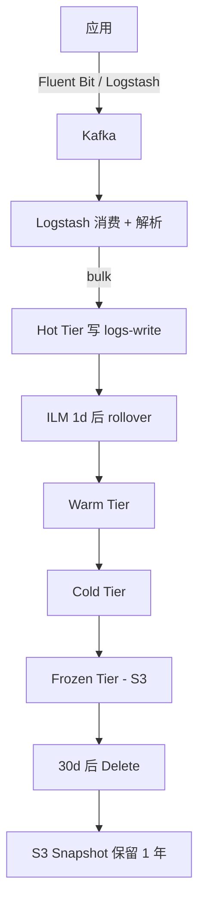

# 第 11 章 索引设计与生命周期管理(ILM)

## 本章目标

学完本章,你能:

- 设计按时间 / 大小 / 业务维度切分的索引架构。
- 使用 **ILM(索引生命周期管理)** 自动管理 hot / warm / cold / frozen。
- 配合 **ISM(数据流)** 写时序数据(8.x 新)。
- 知道 **shrink / split / rollover / delete** 的使用场景。
- 实战:搭建一套按天滚动 + 冷热分层的日志索引。

---

## 11.1 为什么要分索引

单一索引的问题:

- 数据量超大 → 分片 / segment 多,merge 慢。
- 删除 / 修改代价大(段合并才能清掉)。
- 难以针对冷热数据做差异化(老的几乎不被查)。
- mapping 难以演进。

**生产实践:按时间或业务切多索引,按时间滚动。**

---

## 11.2 时间序列 vs 业务

| 维度 | 切法 | 适用 |
| --- | --- | --- |
| 时间 | `logs-2024-01-15`、`logs-2024-01-16` | 日志 / 指标 / 事件流 |
| 业务 | `orders`、`order_2024q1` | 交易 / 业务数据 |
| 租户 | `tenant_001`、`tenant_002` | 多租户 |
| 混合 | `orders-2024-01` | 时序 + 业务 |

最经典:日志类用 **时间** 切(写多读少,有明显时间局部性)。

---

## 11.3 Rollover:索引自动滚动

```
POST /logs-000001/_rollover
{
  "conditions": {
    "max_age":   "1d",
    "max_size":  "50gb",
    "max_docs":  200000000
  }
}
```

满足任一条件 → 创建 `logs-000002`,别名指向新 index。

### 11.3.1 别名(Alias)模式

写入用别名,读按业务路由:

```
PUT /logs-000001
{ "aliases": { "logs-write": { "is_write_index": true }, "logs-read": {} } }
```

写别名只有 1 个 `is_write_index: true`,rollover 完,新 index 变 write,老 index 自动去掉。

### 11.3.2 rollover 完整示例

```
# 1) 创建初始索引
PUT /%3Clogs-%7Bnow%2Fd%7D-000001%3E
{
  "aliases": {
    "logs-write": { "is_write_index": true }
  }
}

# 2) 触发 rollover
POST /logs-write/_rollover
{
  "conditions": { "max_age": "1d", "max_size": "50gb" }
}

# 3) 应用代码写 logs-write,读 logs-*
```

> URL 中的 `<...>` 是 date math,自动计算日期。

---

## 11.4 ILM:四阶段生命周期

ES 7.x 起引入 ILM(基于 X-Pack Basic 免费功能)。
四阶段:


- **Hot**:写入密集,需要高 IO(SSD)。
- **Warm**:读多写少,可以降配。
- **Cold**:极少读,大量数据,可以低 IO 存储。
- **Frozen**:用 **frozen tier**(S3 / GCS 兼容对象存储),本地几乎不占空间。
- **Delete**:删除。

### 11.4.1 ILM 策略

```
PUT /_ilm/policy/logs-policy
{
  "policy": {
    "phases": {
      "hot": {
        "min_age": "0ms",
        "actions": {
          "rollover": { "max_age": "1d", "max_size": "50gb" },
          "set_priority": { "priority": 100 }
        }
      },
      "warm": {
        "min_age": "2d",
        "actions": {
          "forcemerge":  { "max_num_segments": 1 },
          "shrink":      { "number_of_shards": 1 },
          "set_priority": { "priority": 50 }
        }
      },
      "cold": {
        "min_age": "7d",
        "actions": {
          "set_priority": { "priority": 0 }
        }
      },
      "delete": {
        "min_age": "30d",
        "actions": { "delete": {} }
      }
    }
  }
}
```

> `min_age` 从 **rollover 时间**算起(不是创建时间)。

### 11.4.2 ILM 模板

```
PUT /_index_template/logs-template
{
  "index_patterns": ["logs-*"],
  "template": {
    "settings": {
      "number_of_shards":   3,
      "number_of_replicas": 1,
      "index.lifecycle.name": "logs-policy"
    },
    "mappings": { "properties": { /* ... */ } }
  }
}
```

新建 `logs-*` 自动套用 ILM 策略。

### 11.4.3 监控 ILM

```
GET /logs-*/_ilm/explain
```

返回每个索引当前 phase / action / 进度。

```
GET /_ilm/policy
GET /_ilm/status
```

---

## 11.5 数据流(Data Streams,8.x)

> 8.x 推荐用 **Data Streams** 替代手工 rollover + 别名。

适合:append-only 数据(日志 / 指标 / 事件)。
特性:

- 自动 rollover。
- 强制单写入口(`_create` 写别名)。
- 拒绝更新 / 删除(只能 `_update_by_query` / `_delete_by_query`)。
- 内部对应 backing index,索引名后缀 `-<日期>-<序号>`。

### 11.5.1 创建数据流

```
PUT /_index_template/logs-template
{
  "index_patterns": ["logs"],
  "data_stream": {},
  "template": {
    "settings": { "index.lifecycle.name": "logs-policy" },
    "mappings": { "properties": { "@timestamp": { "type": "date" } } }
  }
}
```

写:

```
POST /logs/_create/1
{ "@timestamp": "2024-01-15T10:00:00Z", "msg": "..." }
```

读:

```
GET /logs/_search
```

> 只能通过 `_create` API 写;不允许 `_doc` / `_update` / `_delete`。
> 多文档 / 批量:用 `_bulk`,每行用 `create` 而不是 `index`。

---

## 11.6 冷热分层(节点层)

除了 ILM,还要在节点层把 hot / warm / cold 数据放到对应角色节点上。

```
node.attr.box_type: hot    # 热节点
node.attr.box_type: warm   # 温节点
node.attr.box_type: cold   # 冷节点
```

索引 routing:

```
PUT /logs-2024-01-15
{
  "settings": { "index.routing.allocation.require.box_type": "hot" }
}
```

ILM 阶段切换时,通过脚本自动迁移到对应节点:

```
PUT /_ilm/policy/logs-policy
{
  "policy": {
    "phases": {
      "warm": {
        "min_age": "2d",
        "actions": {
          "allocate": { "require": { "box_type": "warm" } }
        }
      },
      "cold": {
        "min_age": "7d",
        "actions": {
          "allocate": { "require": { "box_type": "cold" } }
        }
      }
    }
  }
}
```

> 温 / 冷节点硬件可以降配(更便宜磁盘、更多磁盘、稍弱 CPU)。

---

## 11.7 冻结层(Frozen Tier)

> 7.12+ 引入;8.x GA。把超冷数据放对象存储(S3 / GCS / Azure)。

- 几乎不占本地磁盘。
- 走 `searchable snapshot` API,部分 segment 从远端加载到本地缓存。
- 适合"偶尔要查"的数据(法规合规 / 冷审计)。

```
PUT /_ilm/policy/cold-archive
{
  "policy": {
    "phases": {
      "cold": {
        "min_age": "30d",
        "actions": {
          "searchable_snapshot": {
            "snapshot_repository": "s3-repo",
            "force_merge_index": true
          }
        }
      }
    }
  }
}
```

需要先注册 snapshot repository 到 S3。

---

## 11.8 索引设计模式

### 11.8.1 模式 1:按业务切分

```
PUT /orders
PUT /order_items
PUT /users
```

> 各自独立 mapping、shard 数量。

### 11.8.2 模式 2:按时间滚动

```
PUT /logs-2024-01-15
PUT /logs-2024-01-16
...
```

> 配合 ILM 自动 rollover,适合日志 / 指标。

### 11.8.3 模式 3:数据流

> 8.x append-only 场景首选。

### 11.8.4 模式 4:租户切分

> 适合 SaaS 多租户,大租户单独索引 + 资源隔离。

---

## 11.9 Shrink 与 Split

| 操作 | 用途 | 限制 |
| --- | --- | --- |
| shrink | 主分片变少(8 → 1) | 源分片必须能合并到目标(都是 2 的幂) |
| split | 主分片变多(1 → 8) | 源分片必须能拆出目标(都是 2 的幂) |

`shrink` 例子:

```
POST /logs-2024-01-15/_shrink/logs-2024-01-15-small
{
  "settings": {
    "index.number_of_shards":       1,
    "index.number_of_replicas":     0,
    "index.routing.allocation.require._name": "warm-node-1"
  }
}
```

> 源 index 需先设 `index.blocks.write: true`。

---

## 11.10 实战:日志平台的索引架构



完整配置:

```
# 1) snapshot repository
PUT /_snapshot/s3_repo
{
  "type": "s3",
  "settings": {
    "bucket": "my-es-snapshots",
    "region": "us-east-1"
  }
}

# 2) ILM 策略
PUT /_ilm/policy/logs-policy
{
  "policy": {
    "phases": {
      "hot": {
        "min_age": "0ms",
        "actions": {
          "rollover":     { "max_age": "1d", "max_size": "50gb" },
          "set_priority": { "priority": 100 }
        }
      },
      "warm": {
        "min_age": "2d",
        "actions": {
          "forcemerge":     { "max_num_segments": 1 },
          "shrink":         { "number_of_shards": 1 },
          "allocate":       { "require": { "box_type": "warm" } },
          "set_priority":   { "priority": 50 }
        }
      },
      "cold": {
        "min_age": "7d",
        "actions": {
          "allocate":     { "require": { "box_type": "cold" } },
          "set_priority": { "priority": 0 }
        }
      },
      "frozen": {
        "min_age": "30d",
        "actions": {
          "searchable_snapshot": { "snapshot_repository": "s3_repo" }
        }
      },
      "delete": {
        "min_age": "180d",
        "actions": { "delete": {} }
      }
    }
  }
}

# 3) index template
PUT /_index_template/logs-template
{
  "index_patterns": ["logs-*"],
  "template": {
    "settings": {
      "number_of_shards":   3,
      "number_of_replicas": 1,
      "index.lifecycle.name": "logs-policy"
    },
    "mappings": {
      "properties": {
        "@timestamp": { "type": "date" },
        "level":      { "type": "keyword" },
        "msg":        { "type": "text" },
        "service":    { "type": "keyword" }
      }
    }
  }
}

# 4) 写第一条,触发创建
POST /logs-write/_doc
{ "@timestamp": "2024-01-15T10:00:00Z", "level": "INFO", "msg": "hello", "service": "auth" }
```

---

## 11.11 常见错误

1. **ILM 没生效**:索引没套用 index template(检查 `index.lifecycle.name`)。
2. **rollover 不触发**:条件没满足(看 `/_ilm/explain`)。
3. **shrink 失败**:目标分片数与源不成倍数。
4. **frozen tier 慢**:远端对象存储,首次拉取 segment 慢,适合"低 QPS 查"。
5. **数据流不能 update**:append-only,业务侧需保证事件不变。

---

## 11.12 要点速查

- 按时间 / 业务切分索引,rollover 自动化。
- ILM 4 阶段:Hot → Warm → Cold → Frozen → Delete。
- 8.x 时序数据用 **Data Streams** 简化开发。
- 热数据 SSD,冷数据 HDD / 对象存储。
- `/_ilm/explain` 监控进度。
- 数据流只支持 `_create`,不可 update。

---

## 11.13 实操练习

1. 写一个 ILM 策略,1d rollover,2d 合并,7d 冷,30d 删。
2. 创建数据流 `logs`,写 3 条,触发 rollover。
3. 用 `/_ilm/explain` 看每个 backing index 的 phase。
4. 加 searchable snapshot,frozen 后查询验证。

---

## 11.14 思考题

1. 为什么 ILM 的 `min_age` 从 rollover 起算,而不是从创建?
2. 数据流(append-only)vs 普通 index,业务上怎么选?
3. frozen tier 用对象存储,有什么代价?什么场景不能用?
4. 业务数据(交易记录)适不适合 ILM?为什么?

---

下一章:[第 12 章 集群架构与分布式原理 →](./12-集群架构与分布式原理.md)
