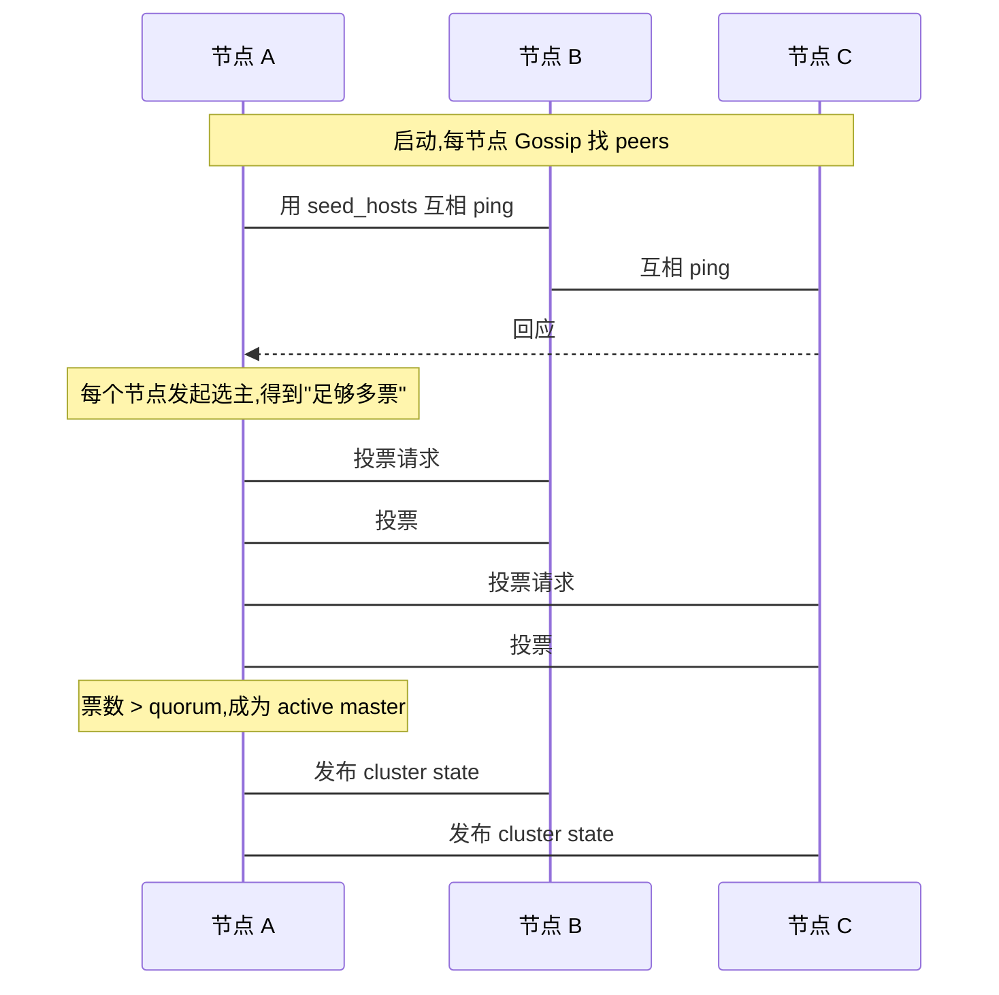
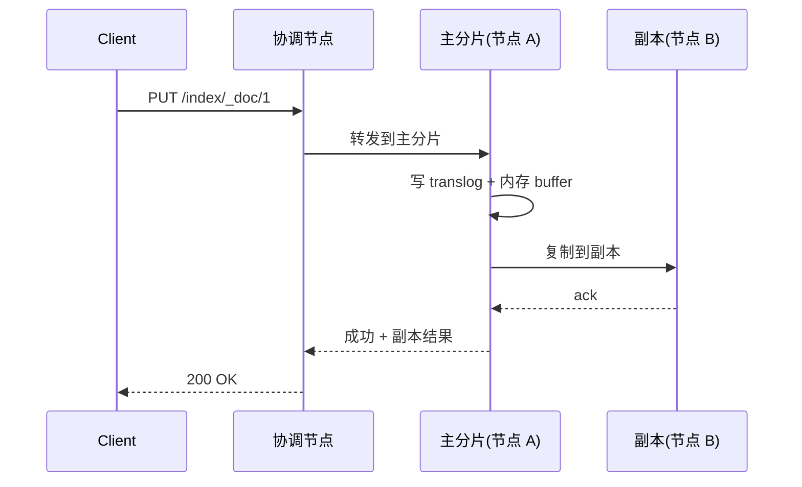
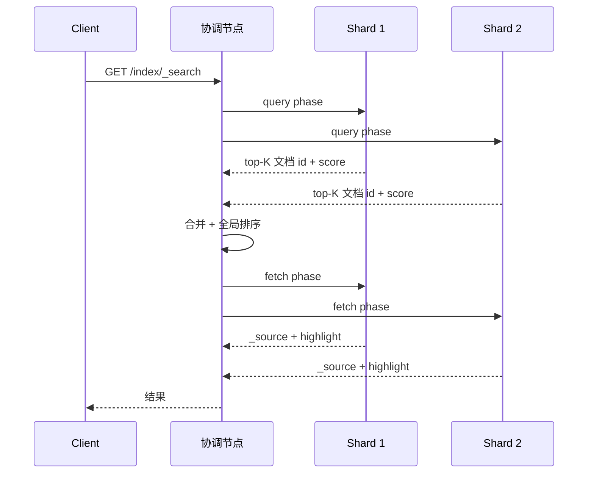

# 第 12 章 集群架构与分布式原理

## 本章目标

学完本章,你能:

- 解释 ES 集群的启动、master 选举、集群状态维护。
- 清楚 **脑裂** 是什么、怎么防。
- 理解 **shard 分配 / 重平衡 / 恢复** 流程。
- 看清 **写入 / 搜索请求** 在节点间的流转。
- 设计高可用 / 容灾 / 多活集群。

---

## 12.1 集群状态(Cluster State)

集群的"全局元数据":

- 集群级 settings
- 节点列表 + 角色
- 所有 index 的 mapping / settings
- 每个 shard 的位置 / 状态

> 集群状态由 master 节点维护,通过 **ZAB-like 的两阶段提交** 同步到所有节点。

---

## 12.2 节点启动流程



关键点:

- **种子节点** `discovery.seed_hosts` 必须包含所有 master eligible 节点(可以是 hostname 或 IP)。
- **第一次启动** `cluster.initial_master_nodes` 列出要参与的节点(之后不再用)。
- **选主算法**:基于 Elasticsearch 自己实现的"集群协调"模块(7.x 起替换 Zen Discovery),Bully-like 投票。

---

## 12.3 master 选举与脑裂

### 12.3.1 quorum

选举需要 majority(过半):

$$
\text{majority} = \lfloor \frac{N}{2} \rfloor + 1
$$

- 3 节点 → majority = 2(挂 1 个不脑裂)。
- 5 节点 → majority = 3。
- **节点数 = 偶数容易出问题**。推荐 odd。

### 12.3.2 脑裂场景

网络分区,A / B 与 C 断开:

- A,B 看到自己 2 个节点 → majority=2 → 还能形成 quorum,继续服务。
- C 只看到自己 1 个 → 退出 master,变为 follower。

只要网络分裂不超过 quorum,就不会有 2 个 active master。

### 12.3.3 脑裂可能吗?

极少数情况:

- master 假死(GC / 磁盘满),副本选新 master,旧 master 复活。
- ES 通过 `minimum_master_nodes` 防止双主,7.x 起自动算。

### 12.3.4 防止脑裂

- 至少 3 个 master eligible。
- 控制 GC / 磁盘(避免假死)。
- 7.x+ `cluster.routing.allocation.enable` 配置可暂停分片分配(升级时用)。

---

## 12.4 集群状态变更(Cluster State Update)

任何集群状态变化(创建索引、mapping 变更、副本数调整)都是:

1. client → 协调节点。
2. 协调节点 → master。
3. master 计算新 cluster state。
4. master 把新 state 发给所有节点,节点 ack。
5. master 收到 majority ack → commit。
6. 协调节点回 client。

> 这是经典的 2PC 模式;瓶颈在 master 的"状态大小"和"提交延迟"。

---

## 12.5 shard 分配(Shard Allocation)

### 12.5.1 决定因素

- **磁盘水位**:`cluster.routing.allocation.disk.threshold_enabled` 防止磁盘满挂掉。
  - `low`:85% 不分配,90% 强制 relocate。
- **分片数限制**:`cluster.routing.allocation.total_shards_per_node`(避免单节点堆)。
- **节点过滤**:`require._name` / `require.box_type` / `include._ip`。
- **负载均衡**:shard 数量 / 大小平衡。

### 12.5.2 查看 / 调整

```
GET /_cluster/allocation/explain
```

> 集群没分到 shard 时,会告诉你"为什么"。

### 12.5.3 强制重平衡

```
POST /_cluster/reroute
{
  "commands": [
    { "move": { "index": "test", "shard": 0, "from_node": "n1", "to_node": "n2" } }
  ]
}
```

### 12.5.4 分片恢复策略

```
PUT /test/_settings
{
  "index.unassigned.node_left.delayed_timeout": "5m"
}
```

> 节点离开后,默认延迟 1 分钟才触发恢复(避免瞬时网络抖动反复迁移)。

---

## 12.6 写入请求流转



要点:

- 默认 `wait_for_active_shards = 1`(主分片写完就返回)。生产推荐 `all`。
- 写入后默认 1s 可被搜索(refresh)。
- `refresh` 把内存 buffer 落到 segment,生成新可搜 segment。
- `flush` 触发 commit,segment + translog cut。

### 12.6.1 写入一致性

- `consistency: one` / `quorum` / `all`。
- 8.x 起 `?wait_for_active_shards=1|all|quorum` 替代。
- 副本数 0 / 1 时,`all` 含义为空,小心。

---

## 12.7 搜索请求流转



要点:

- 协调节点必须把请求发给所有相关 shard(没有 routing 时)。
- query 阶段每个 shard 内部算 top-K,合并到协调节点。
- fetch 阶段才取 `_source`。

---

## 12.8 脑裂 / 故障 / 恢复

### 12.8.1 节点故障

- 节点挂 → master 在 `node_left` 后 N 分钟(默认 1m)开始恢复。
- 重新分配丢失副本,选举新副本(从其他分片拷贝)。
- 网络抖动可以调高 `node_left.delayed_timeout` 缓解。

### 12.8.2 master 故障

- 集群重新选主。
- 短暂的 503,客户端重试。
- 短暂不可用通常 < 30s。

### 12.8.3 磁盘故障

- 单磁盘挂 → 副本启用。
- 多磁盘挂 → 部分索引 yellow / red。

### 12.8.4 索引恢复(recovery)

- 恢复 = 从源 shard 拷贝 segment 到目标 shard。
- 大量小文档时,recovery 慢。
- `index.recovery.max_bytes_per_sec` 限速,避免影响生产。

---

## 12.9 容量规划

### 12.9.1 节点规格

| 角色 | CPU | 内存 | 磁盘 |
| --- | --- | --- | --- |
| master(3 台) | 4 | 16G | 普通 SSD |
| data(hot) | 16+ | 64G | NVMe SSD |
| data(warm) | 8 | 32G | SATA SSD |
| data(cold) | 4 | 16G | HDD |
| coordinating | 8 | 16G | 不存数据 |

### 12.9.2 集群规模

- 小型(开发):1~3 节点,单角色。
- 中型(部门):5~10 节点,角色分离。
- 大型(企业):50+ 节点,按热温冷拆分。

### 12.9.3 容量估算

- 数据量 / 单 shard(50G) → 主分片数。
- 副本数 = 节点数 - 1(高可用)。
- 磁盘总量 = 数据量 × (1 + 副本数) / 节点数。

> 例:数据 3TB,5 节点,主分片 60(3TB/50G),副本 1 → 实际占用 6TB,每节点 1.2TB。

---

## 12.10 多活与容灾

### 12.10.1 同城双活

两个数据中心,各放一半 master / data 节点。
风险:机房级故障 → 集群 down。

### 12.10.2 跨地域 CCR(主从复制)

```
主集群(写) --CCR--> 异地从集群(读 / 容灾)
```

主从数据异步复制;从集群可读,主集群挂了切流量。

### 12.10.3 跨地域 CCS(联合搜索)

> 详见 [第 13 章 跨集群搜索与 CCR/CCS](../03-专家篇/13-跨集群搜索与CCR_CCS.md)。

---

## 12.11 容量监控

```
GET /_cat/nodes?h=name,heap.percent,ram.percent,cpu,load_1m,node.roles
GET /_cat/indices?h=index,docs.count,store.size,pri,rep
GET /_cat/shards?h=index,shard,prirep,state,docs,store,ip,node
GET /_cluster/health
GET /_nodes/stats/fs
```

- `heap.percent` > 75% 警戒,> 90% 危险。
- `disk.used_percent` > 85% 警戒,> 90% 触发 rebalance / read-only。
- `cpu` > 80% 持续,看 `_nodes/hot_threads`。

---

## 12.12 升级与滚动重启

### 12.12.1 滚动重启步骤

1. 停 shard 分配:`PUT /_cluster/settings {"transient": {"cluster.routing.allocation.enable": "primaries"}}`(只允许副本恢复)。
2. 关闭一个 data 节点。
3. 升级 / 重启。
4. 等集群 green / yellow,再启下一个。
5. 全做完,恢复分配:`"none"` → 默认。

### 12.12.2 升级版本路径

- 小版本(8.13 → 8.14):滚动升级。
- 大版本(7.x → 8.x):先升级所有节点到一个支持滚动升级的中间版本,再走滚动。
- 不允许跨大版本直接升级(必须 7.x → 7.17 → 8.x → 8.x)。

---

## 12.13 要点速查

- 集群状态由 master 维护,所有节点最终一致。
- master 选举靠 quorum,推荐 odd 数。
- 写流程:主分片 + 副本,默认 `wait_for_active_shards=1`。
- 搜索流程:query 阶段合并 ID,fetch 阶段取 source。
- 节点故障 → 1m 延迟 → 自动恢复。
- 容量规划:单 shard 10~50G,副本 = 节点 - 1。

---

## 12.14 实操练习

1. 模拟挂一个 master eligible 节点,看集群是否继续服务。
2. 制造磁盘写满(`ulimit` / 占满),看 ES 是否把 index 切 read-only。
3. 用 `/_cluster/allocation/explain` 看 unassigned 原因。
4. 演练滚动重启:停一个 data 节点,升级,再启动。

---

## 12.15 思考题

1. 为什么 master 节点推荐奇数?3 / 5 / 7 节点的容错分别是多少?
2. 协调节点本身要存数据吗?为什么?
3. "ES 是最终一致" 是什么意思?对业务有什么影响?
4. master 节点过多会怎样?

---

下一章:[第 13 章 跨集群搜索与 CCR/CCS →](../03-专家篇/13-跨集群搜索与CCR_CCS.md)
