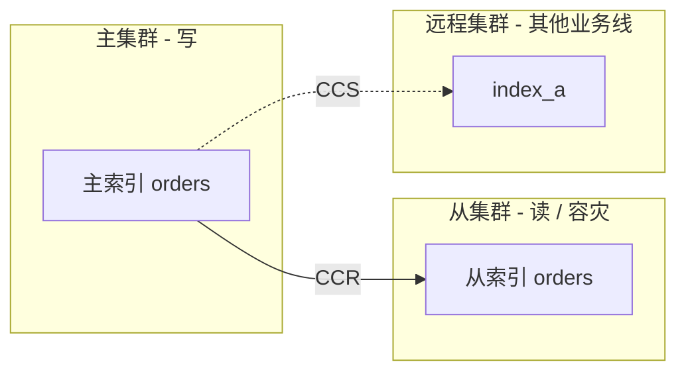
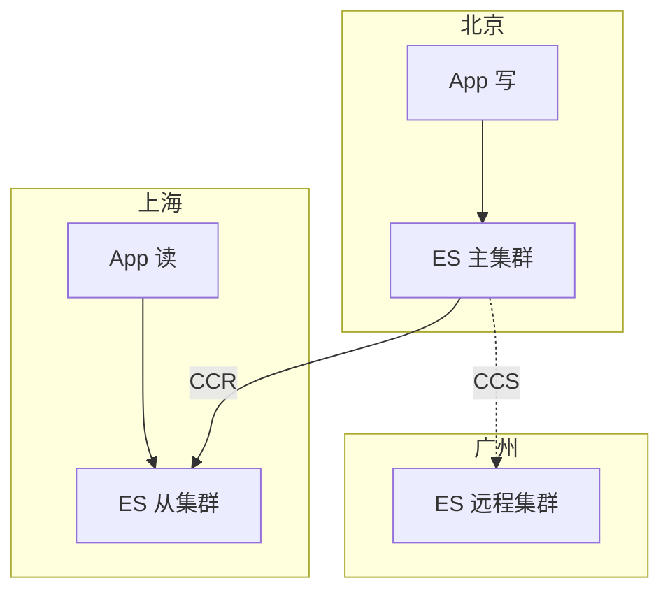

# 第 13 章 跨集群搜索与 CCR / CCS

## 本章目标

学完本章,你能:

- 区分 **CCR(跨集群复制)** 与 **CCS(跨集群搜索)** 的核心区别。
- 配置远程集群,建立 leader / follower。
- 处理 CCR 的 follow 失败、暂停 / 恢复。
- 用 `:_remote_cluster:` 模式做跨集群搜索。
- 设计异地多活 / 容灾 / 读写分离架构。

---

## 13.1 两个能力

| 能力 | 全称 | 用途 | 是否需要 Platinum |
| --- | --- | --- | --- |
| **CCR** | Cross-Cluster Replication | 把 leader 集群的 index **复制**到 follower 集群 | 是 |
| **CCS** | Cross-Cluster Search | 在一个查询里**同时搜**多个集群 | 基础免费 |

简单比喻:

- CCR = "数据搬迁":leader 写一份,follower 实时同步。
- CCS = "远程搜索":一台机器搜 N 个集群。

---

## 13.2 架构示意



---

## 13.3 CCS:跨集群搜索(基础免费)

### 13.3.1 配远程集群

本地集群(`cluster_a`)要搜远程集群(`cluster_b`):

```
PUT /_cluster/settings
{
  "persistent": {
    "cluster.remote.cluster_b.seeds": ["cluster_b_node1:9300", "cluster_b_node2:9300"]
  }
}
```

> 端口是 `transport.port`,不是 HTTP 9200。

### 13.3.2 跨集群查询

```
GET /cluster_b:orders/_search
{
  "query": { "match": { "user": "u001" } }
}
```

> `cluster_b:orders` 是 CCS 语法,跨集群的索引都要加 `远程集群名:` 前缀。

多集群聚合:

```
GET /cluster_b:orders,cluster_c:orders/_search
{
  "size": 0,
  "aggs": {
    "by_status": { "terms": { "field": "status" } }
  }
}
```

### 13.3.3 配额与超时

```
GET /cluster_b:orders/_search?ccs_minimize_roundtrips=true
```

> 多个远程集群时,ES 默认会按顺序问。可设 `ccs_minimize_roundtrips: false` 改并发。

### 13.3.4 失败处理

- 远程集群不可达 → 单集群返回失败,其他集群继续;`?ignore_unavailable=true` 跳过。
- 远程返回 401 → 安全配置问题。

---

## 13.4 CCR:跨集群复制(Platinum)

### 13.4.1 关键概念

- **leader index**:源索引(主)。
- **follower index**:目标索引(从)。
- 自动按 shard 复制,**最终一致**。
- follower 是**只读**的(可设置成只读 + 不接受写)。
- 支持 **auto-follow**(模式匹配自动同步)。

### 13.4.2 启用方式

CCR 是 X-Pack 的 **Platinum 商业**功能。开发测试可在 `xpack.license.self_generated.type: trial` 下试用 30 天。

```
PUT /_license
{ "license": { "type": "trial", "accept": true } }
```

### 13.4.3 单个 follower

```
PUT /cluster_b_remote:follower_index/_ccr/follow
{
  "leader_index": "leader_index",
  "remote_cluster": "cluster_b_remote",
  "settings": {
    "index.number_of_replicas": 0
  }
}
```

> follower 不能保留主分片(因为是复制的)。

### 13.4.4 auto-follow pattern

```
PUT /_ccr/auto_follow/beijing-shanghai
{
  "remote_cluster": "cluster_b_remote",
  "leader_index_patterns": ["orders-*", "users-*"],
  "follow_index_pattern": "{{leader_index}}-copy"
}
```

新匹配模式的 leader index 会自动建 follower。

### 13.4.5 监控

```
GET /_ccr/stats
GET /<follower_index>/_ccr/stats
```

字段:

- `number_of_failed_read_requests`
- `operations_written`
- `time_since_last_fetch_millis`

### 13.4.6 暂停 / 恢复

```
POST /<follower_index>/_ccr/pause_follow
POST /<follower_index>/_ccr/resume_follow
{ "leader_index": "leader_index" }
```

### 13.4.7 把 follower 提升为独立集群

CCR 灾难恢复:主集群挂了,需要从 follower 提供服务。

```
POST /<follower_index>/_close
POST /<follower_index>/_ccr/unfollow
POST /<follower_index>/_open
```

> unfollow 解除 follower 关系,改写 settings;follower 变普通 index,可写。

---

## 13.5 CCR 内部机制

### 13.5.1 复制方式

- 基于 **operation-based**(每个 write 操作 / segment 信息)。
- follower 节点用 `_ccr` API 拉 leader 的变更。
- 内部维护 `shard follow task` 持续跑。

### 13.5.2 一致性保证

- 异步复制 → 最终一致(毫秒级延迟,网络好时更短)。
- 写主集群时如果 follower 慢,可能丢近期数据。
- 生产:用 `?wait_for_active_shards` + 监控 `_ccr/stats`。

### 13.5.3 follower index 的限制

- 不能改 mapping。
- 不能直接写。
- 删除 / shrink / split 等操作受限。
- 改副本数可以。

---

## 13.6 CCS vs CCR vs Snapshot

| 方式 | 用途 | 时延 | 复杂度 |
| --- | --- | --- | --- |
| **CCS** | 一次查多个集群 | 实时(无复制) | 低 |
| **CCR** | 主动复制数据 | 毫秒级 | 中 |
| **Snapshot / Restore** | 灾备 / 迁移 | 分钟 ~ 小时 | 低 |

> - 异地多活读:CCS 即可。
> - 异地多活写(双写):CCR 不行,需要自己双写。
> - 灾备:CCR(实时)或 Snapshot(低频)。

---

## 13.7 异地多活读写方案



策略:

- 北京:写主集群。
- 上海:CCR 复制,本地读。
- 广州:CCS,跨集群读。
- 容灾:北京挂了,上海 unfollow,变主,前端切流量。

---

## 13.8 实战:建立 leader / follower

**前提**:在两套 ES 集群上,已经能互通 9300 端口。

#### 步骤 1:在 follower 集群上配远程

```
PUT /_cluster/settings
{
  "persistent": {
    "cluster.remote.leader_cluster.seeds": ["10.0.0.1:9300"]
  }
}
```

#### 步骤 2:在 leader 上创建测试数据

```
PUT /source_index
{ "settings": { "number_of_shards": 1, "number_of_replicas": 0 } }

POST /source_index/_doc
{ "msg": "hello" }
```

#### 步骤 3:在 follower 上建 follower index

```
PUT /dest_index/_ccr/follow
{
  "remote_cluster": "leader_cluster",
  "leader_index": "source_index"
}
```

#### 步骤 4:验证

```
GET /dest_index/_search
```

leader 上加一条,follower 几秒内出现。

---

## 13.9 踩坑速查

1. **网络层**:跨集群 9300 必须通(防火墙 / 安全组)。
2. **认证**:两边都开 security 时,`xpack.security.transport.ssl` 互相信任。
3. **node version**:leader / follower 版本需兼容(大版本差太多不行)。
4. **leader 不能改 mapping**:改了 CCR 可能会断。
5. **CCR 性能**:每个 follower 都开一个 task,follower 节点数要够。
6. **CCS 误用**:远程集群挂,本地搜索全失败。生产用 `ignore_unavailable=true` 配合 fallback。

---

## 13.10 要点速查

- CCS:基础免费,跨集群搜索,带 `:` 前缀。
- CCR:Platinum,跨集群复制,follower 只读。
- 异地多活读用 CCR / CCS 都很常见。
- 灾备:CCR 实时 / Snapshot 离线。
- follower index 可 `unfollow` 转独立。

---

## 13.11 实操练习

1. 用 docker 起两套 ES,分别命名 cluster_a / cluster_b。
2. 在 cluster_a 配 `cluster_b` 为 remote。
3. cluster_a 上建 index,cluster_b 用 `:` 前缀跨集群搜。
4. (需要 trial 许可证)试 CCR 同步一个 index,看 `/_ccr/stats` 同步状态。

---

## 13.12 思考题

1. CCR 是同步还是异步?如果 leader 挂,follower 数据可能丢多少?
2. 业务场景:你在 A 机房写,在 B 机房读。CCR 还是 CCS?为什么?
3. 如果想做"双写",CCR 不能直接帮上,为什么?你有什么方案?
4. follower 改 mapping 会怎样?为什么?

---

下一章:[第 14 章 安全认证(RBAC / Authentication)→](./14-安全认证.md)
