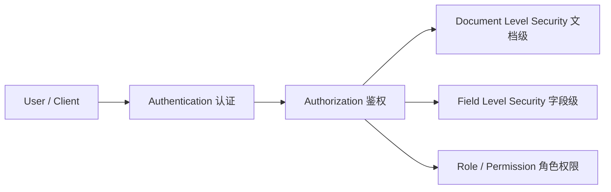
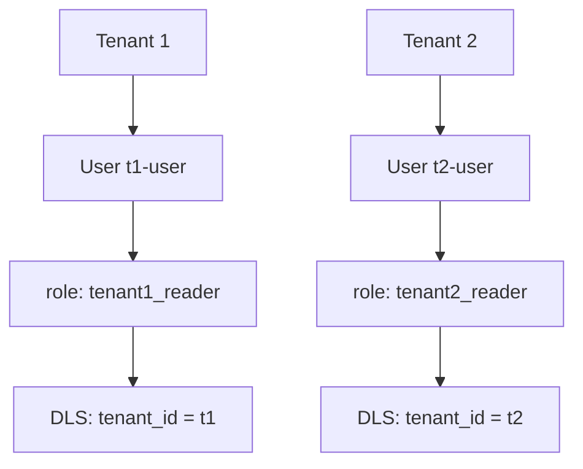

# 第 14 章 安全认证(RBAC / Authentication)

## 本章目标

学完本章,你能:

- 区分 **Authentication** 与 **Authorization**。
- 启用 ES Security,理解内置用户 / 角色。
- 配 TLS / HTTPS,启用节点间加密。
- 写 **RBAC 角色**(索引级 / 字段级 / 文档级安全)。
- 接 LDAP / SAML / OIDC / Kerberos 集成。
- 启用 audit log。

---

## 14.1 安全模型概览



| 概念 | 含义 |
| --- | --- |
| Authentication | 验证身份(你是谁) |
| Authorization | 验证权限(你能干啥) |
| Realm | 认证域(本地 / LDAP / SAML ...) |
| Role | 角色,聚合权限 |
| User | 用户,绑 1..N 角色 |
| API Key | 长期凭证,适合服务间调用 |

> 8.x 默认开启 security:生产必须开,即使开发,也别关。

---

## 14.2 启用安全(简要)

8.x 默认开启。若要显式声明:

```yaml
xpack.security.enabled: true
xpack.security.enrollment.enabled: true
xpack.security.http.ssl:
  enabled: true
  keystore.path: certs/http.p12
xpack.security.transport.ssl:
  enabled: true
  verification_mode: certificate
  keystore.path: certs/transport.p12
```

> 用 `elasticsearch-certutil` 生成证书:

```bash
./bin/elasticsearch-certutil ca
./bin/elasticsearch-certutil cert --ca elastic-stack-ca.p12
mv elastic-certificates.p12 config/certs/
```

---

## 14.3 内置用户

| 用户 | 用途 |
| --- | --- |
| `elastic` | 超级用户,密码 8.x 启动时生成(可 reset) |
| `kibana_system` | Kibana 内部用 |
| `logstash_system` | Logstash 内部用 |
| `apm_system` | APM Server |
| `beats_system` | Beats |
| `remote_monitoring_user` | 监控 |

> 内置用户密码都可 reset:

```bash
./bin/elasticsearch-reset-password -u kibana_system -i
```

---

## 14.4 角色 RBAC

### 14.4.1 内置角色

`superuser` / `admin` / `kibana_admin` / `ingest_admin` / `viewer` 等。

### 14.4.2 自定义角色

```
POST /_security/role/products_read
{
  "indices": [
    {
      "names":    [ "products", "products-*" ],
      "privileges": [ "read", "view_index_metadata" ],
      "field_security": {
        "grant":  ["title", "price", "tags"],
        "except": ["internal_score"]
      },
      "query": "{\"bool\": { \"filter\": [ { \"term\": { \"public\": true } } ] } }"
    }
  ]
}
```

字段 / 文档级安全是 X-Pack 的**付费**功能(Platinum / Enterprise)。

### 14.4.3 权限粒度

- **cluster 权限**:`monitor` / `manage` / `all`。
- **index 权限**:`read` / `write` / `create` / `delete` / `create_index` / `manage`。
- **字段权限**:可"只让看某些字段"。
- **文档权限**(DLS):通过 query 限定能看的文档(类似 SQL 行的 row-level security)。

---

## 14.5 创建用户

```
POST /_security/user/u001
{
  "password":  "p@ssw0rd",
  "roles":     [ "products_read" ],
  "full_name": "Product Reader"
}
```

修改密码:

```
POST /_security/user/u001/_password
{ "password": "newpassword" }
```

---

## 14.6 API Key(服务间凭证)

> 推荐用 API Key 替代"共享密码"。

```
POST /_security/api_key
{
  "name": "ingest-service",
  "role_descriptors": {
    "ingest-role": {
      "indices": [
        { "names": ["logs-*"], "privileges": ["create", "index", "write"] }
      ]
    }
  }
}
```

返回:

```json
{
  "id": "VuaCfGcBCdbkQm-e5aOx",
  "api_key": "ui2lp2axTNmsyakw9tvNnw",
  "encoded": "VnVhQ2ZHY0JDZGJrUW0tZTVhT3g6dWkybHAyYXhUTm1zeWFrdzl0dk5udw=="
}
```

用:

```
curl -H "Authorization: ApiKey VnVhQ2ZHY0JDZGJrUW0tZTVhT3g6dWkybHAyYXhUTm1zeWFrdzl0dk5udw==" \
  http://localhost:9200/logs/_search
```

吊销:

```
DELETE /_security/api_key
{ "id": "VuaCfGcBCdbkQm-e5aOx" }
```

---

## 14.7 加密通信(TLS / HTTPS)

### 14.7.1 生成证书

```bash
# CA
./bin/elasticsearch-certutil ca
# 节点证书(用 CA 签)
./bin/elasticsearch-certutil cert --ca elastic-stack-ca.p12 --name node1 --dns node1
# 拷贝 p12 到 config/certs
```

### 14.7.2 配置

```yaml
xpack.security.transport.ssl:
  enabled: true
  verification_mode: full
  keystore.path: certs/node1.p12
  truststore.path: certs/node1.p12
```

`verification_mode`:

- `certificate`:校验证书是否有效(默认)。
- `full`:校验 hostname / IP。
- `none`:不校验(测试用)。

### 14.7.3 HTTPS 客户端

```bash
curl -k --cacert ca.crt -u elastic:pass https://es:9200
```

> `-k` 跳过自签证书校验(测试);生产用 CA 链。

---

## 14.8 认证域(Realm)

```
PUT /_security/realm/my-ldap/ad1
{
  "type":         "ldap",
  "order":        1,
  "url":          "ldap://ldap.example.com:389",
  "bind_dn":      "cn=es-bind,dc=example,dc=com",
  "bind_password":"...",
  "user_search": {
    "base_dn":       "ou=people,dc=example,dc=com",
    "filter":        "(uid={0})"
  },
  "group_search": {
    "base_dn":       "ou=groups,dc=example,dc=com"
  }
}
```

其它 realm:

- `active_directory`
- `saml`(企业 SSO)
- `oidc`(OpenID Connect,跨域)
- `kerberos`
- `jwt`(8.x)

---

## 14.9 审计日志(Audit Log)

```yaml
xpack.security.audit.enabled: true
xpack.security.audit.outputs: [ index, logfile ]
xpack.security.audit.index.bulk_size: 1000
```

审计索引 `security-auditlog-*` 自动创建。
可查"谁在什么时候搜了什么"。

```
GET /security-auditlog-*/_search
{
  "query": { "match": { "user.name": "u001" } }
}
```

---

## 14.10 节点间认证

集群内部 `transport.ssl` + `xpack.security.transport.ssl.client_authentication: required` + 共享 CA 证书。

> 多节点(尤其是不同机器)必须设对,否则节点间通信失败,集群起不来。

---

## 14.11 多租户场景设计



```
POST /_security/role/tenant1_reader
{
  "indices": [
    {
      "names": ["orders-*"],
      "privileges": ["read"],
      "query": "{\"term\": {\"tenant_id\": \"t1\"}}"
    }
  ]
}
```

> 索引里有 `tenant_id` 字段,query 限定"只能看 t1 的"。

---

## 14.12 客户端集成

### 14.12.1 Java High Level Client

```java
final CredentialsProvider credentialsProvider = new BasicCredentialsProvider();
credentialsProvider.setCredentials(AuthScope.ANY,
    new UsernamePasswordCredentials("elastic", "pass"));

RestClientBuilder builder = RestClient.builder(new HttpHost("localhost", 9200, "https"))
    .setHttpClientConfigCallback(httpClientBuilder -> httpClientBuilder
        .setDefaultCredentialsProvider(credentialsProvider)
        .setSSLContext(sslContext));

RestHighLevelClient client = new RestHighLevelClient(builder);
```

### 14.12.2 Spring Data Elasticsearch

```yaml
spring.elasticsearch.uris=https://es:9200
spring.elasticsearch.username=elastic
spring.elasticsearch.password=pass
spring.elasticsearch.ssl.truststore=classpath:truststore.jks
spring.elasticsearch.ssl.truststore-password=changeit
```

---

## 14.13 常见错误

1. **`401 Unauthorized`**:账号密码错 / API Key 失效。
2. **`403 Forbidden`**:权限不够,角色没分对。
3. **节点间通信失败**:TLS 配错 / CA 不一致。
4. **证书过期**:crontab 提前续签。
5. **`SSLHandshakeException`**:客户端与 server 证书不互信。

---

## 14.14 要点速查

- 8.x 默认开启 security,生产必须保留。
- 内置用户:elastic / kibana_system / logstash_system ...
- RBAC 通过 role / user 组合。
- API Key 替代密码用于服务间调用。
- TLS:HTTP 层 + transport 层都要开。
- 多租户用 DLS(文档级安全)+ index alias 配合。

---

## 14.15 实操练习

1. 创建一个 `reports_user`,只能读 `reports-*` 索引,不能改。
2. 给 `kibana_system` 重新设密码(8.x 启动时自动生成)。
3. 创建一个 API Key,有效期 7 天,吊销后再请求 401。
4. 打开 audit log,搜"过去 1 小时 elastic 用户的请求"。

---

## 14.16 思考题

1. 为什么要用 API Key 而不是共享密码?
2. DLS 与"应用层过滤"有什么区别?各自适用什么场景?
3. SAML / OIDC / LDAP,SSO 时怎么选?
4. audit log 多了影响性能,怎么平衡?

---

下一章:[第 15 章 Elasticsearch 插件开发与扩展 →](./15-插件开发与扩展.md)
