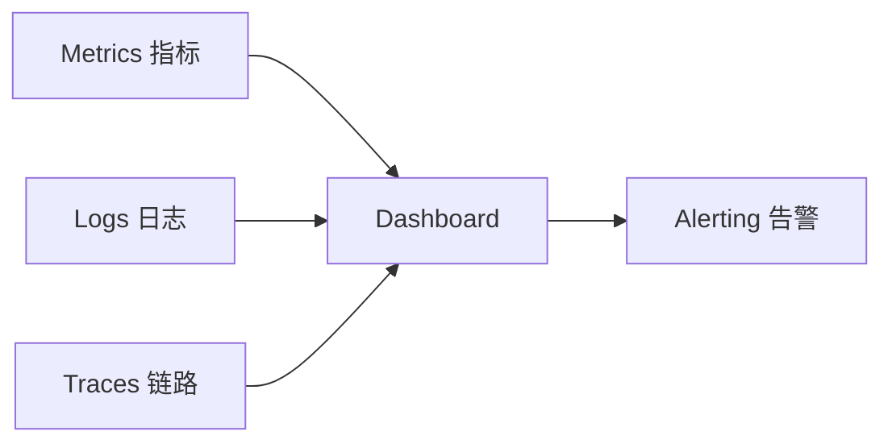
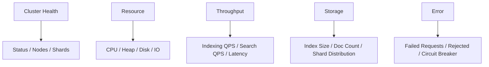

# 第 16 章 运维监控与故障排查

## 本章目标

学完本章,你能:

- 搭建生产级 ES 监控(指标 / 日志 / 告警)。
- 用 **Elasticsearch Monitoring** / **Prometheus** / **Grafana** 监控集群。
- 排查常见的 ES 故障(集群 red / 慢查询 / 内存高 / 磁盘满 / 分片 unassigned)。
- 建立 SLO / 告警矩阵。

---

## 16.1 监控三支柱



| 维度 | 工具 |
| --- | --- |
| Metrics | Elasticsearch Monitoring / Metricbeat + Prometheus + Grafana |
| Logs | ES 慢日志 / GC 日志 / 业务日志 |
| Traces | APM(APM Server + ES) |
| Alerting | ElastAlert / Elastic Alerting / Prometheus Alertmanager |

---

## 16.2 Metricbeat 一键监控(官方推荐)

Metricbeat 内置 ES module,自动采集集群 + 节点 + JVM + 索引级别指标。

```yaml
# metricbeat.yml
metricbeat.modules:
  - module: elasticsearch
    metricsets:
      - node
      - node_stats
      - cluster_stats
      - index
      - shard
      - ml_job
    hosts: ["http://es:9200"]
    username: "elastic"
    password: "pass"
    period: 10s
```

输出到 ES / Logstash:

```yaml
output.elasticsearch:
  hosts: ["http://monitor-es:9200"]
  username: "beats_system"
  password: "..."
```

Kibana 加载 **Elasticsearch dashboards**,自带 cluster / node / JVM / index 视图。

---

## 16.3 Prometheus + Grafana(开源)

ES 暴露指标:`/usr/share/elasticsearch/bin/elasticsearch-exporter`(社区项目),把指标吐给 Prometheus。

```yaml
scrape_configs:
  - job_name: 'elasticsearch'
    static_configs:
      - targets: ['es-exporter:9114']
```

Grafana 社区有 ES dashboard 模板(ID: 2322 / 266 等)。

---

## 16.4 关键指标速查

### 16.4.1 集群级

| 指标 | 含义 | 警戒线 |
| --- | --- | --- |
| `status` | green/yellow/red | red 必告警 |
| `number_of_nodes` | 在线节点数 | < 期望数 |
| `unassigned_shards` | 未分配分片 | > 0 |
| `active_shards_percent` | 可用分片比 | < 100% |
| `pending_tasks` | 待处理的集群状态任务 | > 5 持续 |
| `initializing_shards` | 初始化中 | 突然增加 |

### 16.4.2 节点级

| 指标 | 含义 | 警戒 |
| --- | --- | --- |
| `jvm.mem.heap_used_percent` | 堆使用率 | > 75% 警告,> 90% 危险 |
| `jvm.gc.time` / `jvm.gc.count` | GC 时间 / 次数 | young > 50ms;old 频繁 |
| `os.cpu.percent` | CPU 占用 | > 80% 持续 |
| `indices.store.size` | 节点存储 | > 85% 触发再平衡 |
| `thread_pool.queue` | 队列堆积 | > 阈值 |
| `indices.indexing.index_failed` | 索引失败数 | > 0 |
| `indices.search.fetch_time_in_millis` | 搜索 fetch 时间 | 突增 |
| `fielddata.memory_size_in_bytes` | fielddata 内存 | > 阈值 |

### 16.4.3 索引级

| 指标 | 含义 |
| --- | --- |
| `primaries.docs.count` | 主分片文档数 |
| `total.store.size` | 总存储 |
| `primaries.indexing.index_time_in_millis` | 主分片索引时间 |
| `primaries.merges.current` | merge 中数 |
| `primaries.refresh.total_time_in_millis` | refresh 累计时间 |

---

## 16.5 告警矩阵

| 告警 | 条件 | 严重 |
| --- | --- | --- |
| 集群 red | status=red 持续 1m | P0 |
| 节点宕机 | node down > 1m | P0 |
| 磁盘 > 85% | disk.used_percent > 85 | P1 |
| 堆 > 90% | heap > 90% 持续 5m | P0 |
| 搜索慢 | p99 latency > 2s | P2 |
| 写入失败 | indexing.index_failed > 0 | P0 |
| GC 长暂停 | old GC > 5s | P1 |
| 分片 unassigned | unassigned_shards > 0 持续 5m | P1 |

ES 8.x 自带 **Alerting**(X-Pack Basic 免费),可写 Watcher / Alert Rule。

```
PUT /_watcher/watch/disk-warning
{
  "trigger": { "schedule": { "interval": "1m" } },
  "input": {
    "search": {
      "request": {
        "indices": [".monitoring-*"],
        "body": { "query": { "match": { "type": "node_stats" } } }
      }
    }
  },
  "condition": { ... },
  "actions": { ... }
}
```

---

## 16.6 慢日志(Slow Log)

```
PUT /_all/_settings
{
  "index.search.slowlog.threshold.query.warn":   "10s",
  "index.search.slowlog.threshold.query.info":    "5s",
  "index.search.slowlog.threshold.query.debug":  "2s",
  "index.search.slowlog.threshold.query.trace":  "500ms",
  "index.search.slowlog.threshold.fetch.warn":   "1s",
  "index.indexing.slowlog.threshold.index.warn": "10s"
}
```

> 慢日志写到 `logs/indices_index_search_slowlog.log`,独立于主日志。
> 用 `?include_user=true` 看 user 信息。

---

## 16.7 常见故障排查

### 16.7.1 集群 red

```
GET /_cluster/health
GET /_cluster/allocation/explain
```

unassigned 原因:

| 原因 | 解决 |
| --- | --- |
| 磁盘满 | 清数据 / 扩容 |
| `index.routing.allocation.require.*` 不满足 | 改 allocation 规则 |
| `cluster.routing.allocation.enable=none` | 改回 |
| 节点数 < 副本数 | 加节点 |
| 节点 `version` 不兼容 | 升级 |

### 16.7.2 慢查询

1. `profile=true` 看哪段慢(query / fetch / highlight)。
2. `explain=true` 看打分。
3. 看慢日志 `logs/..._index_search_slowlog.log`。
4. 调索引设计(分片 / routing / 缓存)。
5. 改 DSL(filter / function_score)。

### 16.7.3 堆高 / GC 长

1. `/_nodes/stats/jvm` 看各代堆。
2. `/_nodes/hot_threads` 看热点。
3. heap dump:`jmap -dump:format=b,file=heap.bin <pid>`,用 MAT / VisualVM 分析。
4. 常见原因:
   - 大聚合 → 改 `size` / composite。
   - fielddata 爆 → 用 `.keyword` 替 `text` 聚合。
   - 深分页 → search_after。

### 16.7.4 磁盘满

1. `/_cat/allocation?v` 看节点磁盘。
2. 临时:`PUT /index/_settings {"index.blocks.read": true}` 阻断读(保护)。
3. 找大索引:`GET /_cat/indices?h=index,store.size&bytes=b&s=store.size:desc | head`。
4. 删 / rollover / 归档到 frozen tier。

### 16.7.5 节点 OOM

1. 节点日志:`OutOfMemoryError`。
2. 可能原因:大聚合 / 大量并发 query / fielddata。
3. 缓解:
   - 调小 `indices.query.bool.max_clause_count`。
   - 加 `search.max_open_scroll_context`。
   - 改大 heap(注意 32G 上限)。

### 16.7.6 shard 一直 unassigned

`GET /_cluster/allocation/explain` 通常给出具体原因。

| 错误 | 处理 |
| --- | --- |
| `cannot allocate because allocation is disabled` | 改 `cluster.routing.allocation.enable` |
| `disk threshold exceeded` | 清数据 / 扩磁盘 |
| `node version is older than primary` | 升级 |
| `node is offline` | 启动 / 修复节点 |

强制分配(慎用,会丢数据):

```
POST /_cluster/reroute
{ "commands": [{ "allocate_replica": { "index": "x", "shard": 0, "node": "n1" } }] }
```

### 16.7.7 索引恢复卡住

```
GET /<index>/_recovery?human
```

- 大量小文档 → 慢,正常。
- 慢速网络 → 调 `indices.recovery.max_bytes_per_sec`。
- 源盘 IO 满 → 限源端 IO。

---

## 16.8 故障演练(Chaos)

```bash
# 1) kill 一个 data 节点
docker kill es-data-1
# 2) 制造慢盘
tc qdisc add dev eth0 root netem delay 200ms
# 3) 制造满盘
dd if=/dev/zero of=/es/data/fill bs=1M count=1024
# 4) 制造时钟漂移
date -s "+10 minutes"
# 5) 模拟网络分区
iptables -A INPUT -s 10.0.0.2 -j DROP
```

每次演练前记录 baseline,演练后看:

- 集群多久恢复?
- 是否有数据丢失?
- 告警是否触发?

---

## 16.9 Snapshot 与恢复

### 16.9.1 配 snapshot 仓库

```
PUT /_snapshot/s3_repo
{
  "type": "s3",
  "settings": { "bucket": "es-snapshots", "region": "us-east-1" }
}
```

### 16.9.2 拍 snapshot

```
PUT /_snapshot/s3_repo/snap_2024_01_15
{
  "indices": "orders,users",
  "include_global_state": false
}
```

### 16.9.3 恢复

```
POST /_snapshot/s3_repo/snap_2024_01_15/_restore
{
  "indices":  "orders",
  "rename_pattern": "orders(.+)",
  "rename_replacement": "restored_orders$1"
}
```

### 16.9.4 SLM 自动 snapshot

```
PUT /_slm/policy/daily-snap
{
  "schedule": "0 30 1 * * ?",
  "name": "<nightly-snap-{now/d}>",
  "repository": "s3_repo",
  "config": { "indices": [".ds-logs*", "orders-*"] },
  "retention": {
    "expire_after": "30d",
    "min_count": 5,
    "max_count": 50
  }
}
```

---

## 16.10 容量监控仪表盘示例



推荐 dashboard 字段:

- Cluster Health:status / unassigned / pending_tasks
- JVM:heap_used / gc_time / threads
- Disk:used_percent / free_bytes
- Search:rate / latency / failures
- Indexing:rate / latency / failures
- Indices:store.size / docs.count / segment.count

---

## 16.11 Runbook 模板

每个告警都应有 runbook:

```markdown
# 告警:集群 red

## 影响
搜索部分不可用。

## 立刻
1. GET /_cluster/health 确认。
2. GET /_cluster/allocation/explain 看 unassigned 原因。
3. 检查磁盘 / 节点。

## 恢复步骤
- 磁盘满:清数据 / 扩容。
- 节点 down:重启 / 替换。
- 配置错误:回滚 settings。

## 升级
5min 未恢复 → 通知 SRE Oncall。
```

---

## 16.12 要点速查

- 三支柱:Metrics / Logs / Traces。
- 关键指标:status / heap / disk / latency / 失败率。
- 慢日志 + profile 定位慢查询。
- 集群 red 先看 `/_cluster/allocation/explain`。
- 磁盘满是大忌,要提前告警(85%)。
- SLM 定期 snapshot。

---

## 16.13 实操练习

1. 装 Metricbeat,开 ES module,验证 Kibana dashboard。
2. 写一个 Watcher,集群 red 时发邮件。
3. 制造磁盘满(写一个 fill 文件),看 ES 行为。
4. 制造 unassigned shard(关掉一个数据节点),用 `/_cluster/allocation/explain` 找原因。

---

## 16.14 思考题

1. 集群 red 与 yellow 在生产上的处理优先级?
2. OOM 与 GC 频繁的预警信号有哪些?
3. 如果一个搜索 5s 内返回,但 p99 12s,你怎么排?
4. snapshot 间隔多长合适?为什么 SLM 比 cron 更好?

---

下一章:[第 17 章 与 ELK 生态(Logstash / Kibana)整合 →](./17-ELK生态整合.md)
