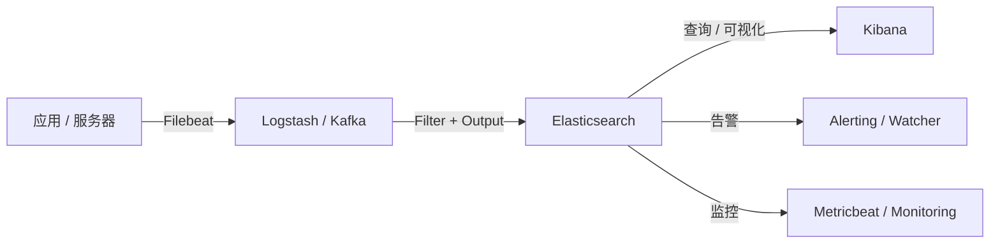

# 第 17 章 与 ELK 生态(Logstash / Kibana)整合

## 本章目标

学完本章,你能:

- 理解 **ELK(Elasticsearch + Logstash + Kibana)** 与 **Elastic Stack** 的关系。
- 用 **Filebeat** 采集日志,送入 ES。
- 用 **Logstash** 写 ETL 管道(解析、转换、富化)。
- 在 Kibana 中画 **Visualize / Dashboard / Lens**。
- 把 Elastic Stack 接入业务系统(自研采集 / Kafka 中转)。

---

## 17.1 整体架构



> **Filebeat + ES + Kibana** 是最轻量组合(无 Logstash);
> **Logstash** 适合"重 ETL"。

---

## 17.2 Filebeat:轻量日志采集

### 17.2.1 安装

```bash
curl -L -O https://artifacts.elastic.co/downloads/beats/filebeat/filebeat-8.13.4-linux-x86_64.tar.gz
tar -xzf filebeat-8.13.4-linux-x86_64.tar.gz
cd filebeat-8.13.4
```

### 17.2.2 配置文件

`filebeat.yml`:

```yaml
filebeat.inputs:
  - type: log
    enabled: true
    paths:
      - /var/log/app/*.log
    fields:
      service: auth
    fields_under_root: true
    multiline.pattern: '^\['
    multiline.negate: true
    multiline.match: after

output.elasticsearch:
  hosts: ["http://es:9200"]
  username: "beats_system"
  password: "..."

setup.kibana:
  host: "kibana:5601"

setup.dashboards.enabled: true
setup.ilm.enabled: true
```

### 17.2.3 启动

```bash
./filebeat setup
./filebeat -e
```

`setup` 会自动建 ILM 策略 / index template / Kibana dashboard。

### 17.2.4 高级特性

- **Module**:预制 nginx / mysql / redis / system / docker module,自动 parse 常见日志格式。
- **Autodiscover**:基于 k8s / docker hints 自动配置。
- **Cloud Auth**:在云上 IAM 鉴权。

---

## 17.3 Logstash:数据 ETL

> Logstash 适合"复杂 ETL":多源输入、字段解析、丰富数据、输出到多个目的地。
> 缺点:JVM 重,横向扩展复杂。

### 17.3.1 架构

```
input → filter → output
```

### 17.3.2 配置示例

`logstash.conf`:

```
input {
  beats { port => 5044 }

  kafka {
    bootstrap_servers => "kafka:9092"
    topics => ["user-event"]
    codec => "json"
  }
}

filter {
  if [fields][service] == "auth" {
    grok {
      match => { "message" => "%{TIMESTAMP_ISO8601:timestamp} %{LOGLEVEL:level} %{GREEDYDATA:msg}" }
    }
    date {
      match => [ "timestamp", "ISO8601" ]
      target => "@timestamp"
    }
  }

  if [user_id] {
    enrich {
      database_name => "users_db"
      enrichment_field => "user_id"
      target_field => "user_profile"
    }
  }

  mutate {
    remove_field => [ "agent", "ecs", "host" ]
  }
}

output {
  elasticsearch {
    hosts => ["http://es:9200"]
    user => "logstash_system"
    password => "..."
    index => "logs-%{+YYYY.MM.dd}"
  }
}
```

### 17.3.3 常用 filter

| 插件 | 用途 |
| --- | --- |
| `grok` | 解析非结构化日志为字段 |
| `date` | 时间字段解析 |
| `json` | 解析 JSON |
| `kv` | key=value 切分 |
| `mutate` | 字段重命名 / 删除 / 类型转换 |
| `geoip` | 加 IP 地理信息 |
| `useragent` | 解析 User-Agent |
| `ruby` | Ruby 脚本,自定义逻辑 |
| `fingerprint` | 文档指纹(去重) |
| `enrich` | 关联外部数据 |

### 17.3.4 性能

- `pipeline.workers = CPU 核数`。
- `pipeline.batch.size = 125`,`pipeline.batch.delay = 50ms`。
- queue 用 `persisted`(走磁盘)或 `memory`(默认)。

### 17.3.5 替代品

- **Fluentd / Fluent Bit**:Go 写的,更轻,生态广。
- **Vector**:Rust 写的,极致性能。
- **Kafka Connect + ES Sink**:Kafka 生态。

---

## 17.4 Kibana:可视化与探索

### 17.4.1 主要功能

- **Discover**:原始数据探索(类 SQL)。
- **Visualize / Lens**:画图。
- **Dashboard**:组合多个 Visualize。
- **Maps**:地图。
- **Canvas**:演示文稿式报表。
- **Graph**:数据关系图(7.x 移除,被 ES 自身 graph API 替代)。
- **Stack Monitoring**:集群监控。
- **Dev Tools**:REST 控制台。
- **Alerting**(8.x):内置告警。
- **ML**:机器学习。

### 17.4.2 Dev Tools

`Ctrl + \` 进入,左侧写 DSL,右侧结果。

> 学习时手写 DSL + 立刻看到结果,效率最高。

### 17.4.3 Lens 画图

拖拽字段即可画图,适合业务 / 运营。

- 维度:keyword / date → 分组。
- 度量:数值 → 求和 / 平均。
- 时间序列:date histogram。
- 透视表、地图、折线、柱状、饼图。

### 17.4.4 KQL(Kibana Query Language)

```
service: "auth" AND status: "fail" AND @timestamp > now-1h
```

Kibana 顶部搜索框默认 KQL。Lucene Query Syntax(LQS)也可在 URL 切换 `?lucene=true`。

### 17.4.5 Spaces

> 8.x 推 Spaces:多租户(团队 / 业务 / 环境)。
> 每个 Space 独立 dashboard / role / index pattern。

### 17.4.6 自定义 dashboard

```
GET /api/saved_objects/_export?type=dashboard
POST /api/saved_objects/_import?overwrite=true
```

> 跨环境迁移 dashboard。

---

## 17.5 自研采集 → ES

> 自研系统 / 业务服务通常用客户端 SDK 写 ES。

### 17.5.1 直接 ES 客户端

Java / Go / Python / Node 都有官方 client。
风险:写入失败 / 集群抖动 影响业务。
> **生产不推荐直写**;中间加 MQ 解耦。

### 17.5.2 Kafka → Logstash → ES

```
业务 -> Kafka(topic) -> Logstash(consumer group) -> ES
```

优势:

- 业务解耦(Kafka 抗写压力)。
- Logstash 复杂解析,不影响业务。
- 重试 / 死信队列可放在 Kafka。

### 17.5.3 Canal / Debezium → Kafka → ES

> MySQL / PostgreSQL 的 binlog CDC。
> Canal(阿里) / Debezium 监听 binlog,送 Kafka,Logstash 解析写 ES。

应用:DB → ES 近实时同步,业务不需要双写。

---

## 17.6 数据建模:Mapping + Template + ILM

ELK 通常不需要每条日志手写 mapping。Filebeat / Logstash 输出时,可用 **index template** 自动套用。

```
PUT /_index_template/logs-template
{
  "index_patterns": ["logs-*"],
  "template": {
    "settings": {
      "number_of_shards":   3,
      "number_of_replicas": 1,
      "index.lifecycle.name": "logs-policy",
      "index.lifecycle.rollover_alias": "logs-write"
    },
    "mappings": {
      "dynamic": true,    // Filebeat 自带字段
      "properties": {
        "@timestamp": { "type": "date" },
        "service":    { "type": "keyword" },
        "level":      { "type": "keyword" },
        "msg":        { "type": "text" }
      }
    }
  }
}
```

> "dynamic": true 在日志场景合理(每条日志 schema 不固定)。

---

## 17.7 安全 / 多租户

### 17.7.1 集成 IdP

Kibana 支持 SAML / OIDC / LDAP:登录 Kibana 直接用企业账号。

### 17.7.2 字段级 / 文档级安全

- DLS:用 `term` query 限定"业务线 X 只能看自己的日志"。
- FLS:屏蔽敏感字段(`password` / `token`)。

### 17.7.3 Spaces

团队 A 看自己的 dashboard,团队 B 看自己的。

---

## 17.8 实战:Filebeat → ES → Kibana 端到端

#### 步骤 1:ES + Kibana 启动

```bash
docker run -d --name es ...  docker.elastic.co/elasticsearch/elasticsearch:8.13.4
docker run -d --name kibana ... docker.elastic.co/kibana/kibana:8.13.4
```

#### 步骤 2:Filebeat 配置 + 启动

```yaml
filebeat.inputs:
  - type: log
    paths: [ /var/log/auth.log ]
    fields: { service: ssh }
output.elasticsearch:
  hosts: ["http://es:9200"]
  username: "beats_system"
  password: "..."

setup.kibana:
  host: "kibana:5601"
setup.ilm.enabled: true
```

```bash
./filebeat setup
./filebeat -e
```

#### 步骤 3:Kibana 看

- Stack Monitoring:看 ES 自身。
- Logs:看 Filebeat 写入的 `filebeat-*` 索引。
- Discover:挑字段。
- Visualize / Dashboard:画图。

---

## 17.9 实战:用 Kafka + Logstash 做订单事件 ETL

```
app -> Kafka(topic: order) -> Logstash -> ES(orders index)
```

`logstash.conf`:

```
input {
  kafka {
    bootstrap_servers => "kafka:9092"
    topics             => "order"
    consumer_group_id  => "es-sink"
    codec              => "json"
  }
}

filter {
  date {
    match => [ "create_time", "ISO8601" ]
    target => "@timestamp"
  }
  mutate {
    add_field => { "ingest_pipeline" => "kafka-v1" }
  }
}

output {
  elasticsearch {
    hosts    => ["http://es:9200"]
    user     => "logstash_system"
    password => "..."
    index    => "orders-%{+YYYY.MM}"
    document_id => "%{order_id}"
  }
}
```

> 写时设 `document_id`,幂等(同一 order_id 多次写不重复)。

---

## 17.10 性能与可靠性

- **Filebeat**:单实例 CPU 5%,内存 200M,几乎不挂。
- **Logstash**:JVM,heap 4~8G,workers 配 CPU 数。瓶颈在 grok(正则)。
- **Kibana**:大查询 / 聚合会卡 Kibana 自身(节点独立部署)。
- **ES**:参考 [第 10 章 性能调优](../02-高级篇/10-性能调优与JVM优化.md)。

---

## 17.11 替代方案

| 需求 | 选 |
| --- | --- |
| 简单日志采集 | Filebeat 直送 ES |
| 复杂 ETL | Logstash 中间层 |
| 高吞吐 / 低延迟 | Vector / Fluent Bit |
| Kafka 解耦 | Kafka → Logstash → ES |
| DB 同步 | Debezium / Canal |

---

## 17.12 要点速查

- Filebeat 轻量,Logstash 重 ETL。
- Kafka 中间层解耦。
- Kibana Dev Tools 写 DSL,Visualize 画图。
- index template + ILM 自动管理。
- 客户端直写生产不推荐,中间加 MQ。

---

## 17.13 实操练习

1. 装 Filebeat 采 `/var/log/auth.log`,看 Kibana 有数据。
2. 加 Logstash,在中间加 `grok` 解析 `nginx access log`。
3. 写个 dashboard,显示"每分钟 SSH 登录失败次数"。
4. 用 Spaces 建两个空间,team-a / team-b,各看自己的 dashboard。

---

## 17.14 思考题

1. 何时选 Logstash,何时选 Filebeat 直送?
2. Kafka 在 ELK 链路里的核心价值是什么?
3. Kibana 8.x 的 Alerting 怎么落地到团队值班?
4. 业务上要不要做"日志字段统一"?(高基数字段对 ES 的影响?)

---

下一章:[第 18 章 实战项目案例 →](./18-实战项目案例.md)
