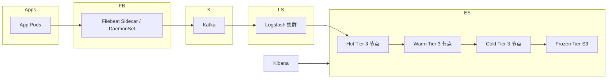

# 第 18 章 实战项目案例

## 本章目标

学完本章,你能:

- 端到端搭建 4 个生产级项目:电商搜索、日志平台、企业知识库 RAG、APM 时序监控。
- 把前面 17 章知识综合运用:Mapping / Query DSL / 聚合 / ILM / 监控。
- 看到真实项目里的"坑"和取舍。

---

## 18.1 案例 1:电商商品搜索

### 18.1.1 需求

- 上亿商品,毫秒级搜索。
- 多字段:标题 / 品牌 / 类目 / 标签 / 描述。
- 多维度筛选:价格区间、品牌、类目、评分、是否在售。
- 个性化排序:相关 + 销量 + 新品 + 距离(可选)。
- 高亮 + 拼写纠错 + 搜索建议。

### 18.1.2 索引设计

```
PUT /products
{
  "settings": {
    "number_of_shards":   6,
    "number_of_replicas": 1,
    "analysis": {
      "analyzer": {
        "ik_smart_synonym": {
          "type":      "custom",
          "tokenizer": "ik_smart",
          "filter":    ["lowercase", "synonym_filter"]
        }
      },
      "filter": {
        "synonym_filter": {
          "type":          "synonym",
          "synonyms_path": "analysis/synonyms.txt"
        }
      }
    }
  },
  "mappings": {
    "dynamic": "strict",
    "properties": {
      "id":          { "type": "long" },
      "title": {
        "type":          "text",
        "analyzer":      "ik_max_word",
        "search_analyzer":"ik_smart_synonym",
        "fields": { "raw": { "type": "keyword", "ignore_above": 256 } }
      },
      "brand":       { "type": "keyword" },
      "category":    { "type": "keyword" },
      "tags":        { "type": "keyword" },
      "price":       { "type": "scaled_float", "scaling_factor": 100 },
      "stock":       { "type": "integer" },
      "on_sale":     { "type": "boolean" },
      "official":    { "type": "boolean" },
      "rating":      { "type": "float" },
      "sales":       { "type": "long" },
      "launched_at": { "type": "date" },
      "specs": {
        "type": "nested",
        "properties": {
          "k": { "type": "keyword" },
          "v": { "type": "keyword" }
        }
      },
      "location":    { "type": "geo_point" },
      "comment": {
        "type":           "text",
        "analyzer":       "ik_smart",
        "index_options":  "freqs"      // 不用 phrase
      },
      "embedding":   { "type": "dense_vector", "dims": 768, "index": false }
    }
  }
}
```

要点:

- `dynamic: strict` 防字段爆炸。
- `ik_max_word` 索引 / `ik_smart` 搜索 + 同义词。
- 金额 `scaled_float`。
- 规格 `nested`。
- 经纬度 + 向量(预留给 RAG)。
- `comment` 不用 phrase,关掉 position 节省空间。

### 18.1.3 写入

```
POST /_bulk
{ "index": { "_index": "products", "_id": "1001" } }
{
  "id": 1001, "title": "iPhone 15 Pro Max 256G",
  "brand": "Apple", "category": "phone",
  "tags": ["5g", "ios"], "price": 999900, "stock": 100,
  "on_sale": true, "official": true, "rating": 4.8, "sales": 12000,
  "launched_at": "2023-09-12", "location": { "lat": 39.9, "lon": 116.4 }
}
```

### 18.1.4 搜索

```
POST /products/_search
{
  "size": 20,
  "from": 0,
  "query": {
    "function_score": {
      "query": {
        "bool": {
          "must": [
            { "multi_match": { "query": "iphone 15 pro", "fields": ["title^3", "comment"], "type": "best_fields" } }
          ],
          "filter": [
            { "term":  { "on_sale": true } },
            { "terms": { "category": ["phone", "tablet"] } },
            { "range": { "price": { "gte": 0, "lte": 1500000 } } }
          ]
        }
      },
      "functions": [
        { "filter": { "term": { "official": true } }, "weight": 2 },
        { "field_value_factor": { "field": "sales",  "modifier": "log1p", "missing": 0 } },
        { "field_value_factor": { "field": "rating", "modifier": "sqrt",   "missing": 3 } },
        { "gauss":  { "launched_at": { "origin": "now", "scale": "60d", "decay": 0.5 } } }
      ],
      "score_mode":  "sum",
      "boost_mode": "sum"
    }
  },
  "highlight": {
    "fields": { "title": { "number_of_fragments": 0 } }
  },
  "suggest": {
    "my-suggest": {
      "text": "iphone 15 pro",
      "term": { "field": "title.raw", "suggest_mode": "always" }
    }
  },
  "_source": ["id", "title", "price", "sales", "rating", "brand"]
}
```

### 18.1.5 性能调优

- **filter context** 走缓存。
- **field_value_factor** 业务权重融合。
- **suggest 走 `.raw`**,避免主索引膨胀。
- **routing 走 brand**(大品牌自营):"只查该品牌"。
- **request_cache** 报表类查询。
- **search_after** 深分页。

### 18.1.6 监控

- `/_cat/indices?v`:看索引大小。
- `/_cat/shards/products?v`:看分片分布。
- `/_tasks?actions=*search&detailed=true`:长跑搜索。
- 慢日志:`index.search.slowlog.threshold.query.warn: 5s`。

---

## 18.2 案例 2:日志分析平台

### 18.2.1 需求

- 每天 10TB+ 日志(NGINX / 应用 / DB)。
- 7 天热查(秒级),30 天温查(分钟级),1 年冷查询。
- 多业务线、多服务。
- Kibana 可视化,告警。

### 18.2.2 架构



### 18.2.3 ILM 策略

```
PUT /_ilm/policy/logs-policy
{
  "policy": {
    "phases": {
      "hot": {
        "min_age": "0ms",
        "actions": {
          "rollover":     { "max_age": "1d", "max_size": "50gb" },
          "set_priority": { "priority": 100 }
        }
      },
      "warm": {
        "min_age": "2d",
        "actions": {
          "shrink":       { "number_of_shards": 1 },
          "forcemerge":   { "max_num_segments": 1 },
          "allocate":     { "require": { "box_type": "warm" } },
          "set_priority": { "priority": 50 }
        }
      },
      "cold": {
        "min_age": "7d",
        "actions": {
          "allocate":     { "require": { "box_type": "cold" } },
          "set_priority": { "priority": 0 }
        }
      },
      "frozen": {
        "min_age": "30d",
        "actions": {
          "searchable_snapshot": { "snapshot_repository": "s3_repo" }
        }
      },
      "delete": {
        "min_age": "365d",
        "actions": { "delete": {} }
      }
    }
  }
}
```

### 18.2.4 索引模板

```
PUT /_index_template/logs
{
  "index_patterns": ["logs-*"],
  "data_stream": {},
  "template": {
    "settings": {
      "number_of_shards":   1,
      "number_of_replicas": 1,
      "index.lifecycle.name": "logs-policy"
    },
    "mappings": {
      "properties": {
        "@timestamp": { "type": "date" },
        "service":    { "type": "keyword" },
        "level":      { "type": "keyword" },
        "msg":        { "type": "text" },
        "trace_id":   { "type": "keyword" }
      }
    }
  }
}
```

### 18.2.5 业务侧调用

- 写:`POST /logs/_create` (data stream 强制 `_create`)。
- 查:Kibana 顶部 KQL `service: "auth" AND level: "error" AND @timestamp >= now-1h`。

### 18.2.6 告警

- 服务错误率 > 1% 持续 5m → 飞书 / 邮件。
- 单个错误日志 1k/min → 短信。
- 集群 yellow / red → oncall。

---

## 18.3 案例 3:企业知识库 + RAG 检索

### 18.3.1 场景

企业内部文档(产品手册 / Wiki / Confluence) + 语义搜索 + 引用溯源。
即"向量召回 + 关键词召回 + 重排"。

### 18.3.2 索引设计

```
PUT /kb_docs
{
  "mappings": {
    "properties": {
      "doc_id":      { "type": "keyword" },
      "title":       { "type": "text", "analyzer": "ik_smart" },
      "content": {
        "type":     "text",
        "analyzer": "ik_smart"
      },
      "embedding":   { "type": "dense_vector", "dims": 1024, "index": true, "similarity": "cosine" },
      "tags":        { "type": "keyword" },
      "source":      { "type": "keyword" },
      "updated_at":  { "type": "date" }
    }
  }
}
```

### 18.3.3 写入

每篇文档先切 chunk(300~500 字),每个 chunk 算 embedding,存一条。

```
POST /kb_docs/_bulk
{ "index": { "_index": "kb_docs", "_id": "c001" } }
{
  "doc_id": "wiki-1001",
  "title":  "新员工入职流程",
  "content": "第 1 步:HR 系统开通账号 ...",
  "embedding": [0.12, -0.05, ...],
  "tags":   ["hr", "onboarding"],
  "source": "wiki",
  "updated_at": "2024-01-15"
}
```

### 18.3.4 混合检索(BM25 + 向量)

```
POST /kb_docs/_search
{
  "size": 20,
  "query": {
    "bool": {
      "should": [
        { "match": { "content": "入职流程" } },
        {
          "knn": {
            "field":          "embedding",
            "query_vector":   [0.13, -0.04, ...],
            "k":              20,
            "num_candidates": 100
          }
        }
      ]
    }
  },
  "highlight": { "fields": { "content": {} } }
}
```

> BM25 找精确词,knn 找语义近,合并即"混合召回"。

### 18.3.5 重排(Cross-encoder)

召回 20 条,送 cross-encoder rerank(如 BGE-reranker),取 top 5。

```python
# 伪代码
hits = es.search(query, size=20)
scores = reranker.predict([(query, hit.content) for hit in hits])
top = sorted(zip(hits, scores), key=lambda x: -x[1])[:5]
```

> ES 不内置 reranker,通常在外层调 cross-encoder 模型。

### 18.3.6 与 LLM 串联

```
User Query -> Hybrid Retrieve -> Top 5 chunks
                              ↓
                          LLM(将 chunks 作为 context,生成回答)
```

效果:语义模糊也能回答,且答案有依据(可显示 source doc_id)。

---

## 18.4 案例 4:APM 监控平台

### 18.4.1 需求

- 服务调用链(traces)。
- 业务指标(metrics)。
- 错误日志。
- 业务大盘(每个服务 QPS / 错误率 / p99)。

### 18.4.2 选型

- **APM Server** + **Elastic APM**:官方 APM 方案,自动采集 traces。
- **Metricbeat**:采集 host / k8s / app 指标。
- **Filebeat**:采集应用日志。

> 都在 ES 里查询,统一大盘。

### 18.4.3 索引

APM Server 自动建索引:

- `apm-*`:traces。
- `apm-metric-*`:metrics。
- `apm-error-*`:errors。
- `logs-*`:日志(由 APM 关联 trace.id)。

### 18.4.4 业务监控

Kibana Lens:

- 每个 service 的 QPS / 错误率。
- 慢请求 p99 / p95 / p50。
- 链路图(Trace view)。
- Service Map(自动生成服务依赖图)。

### 18.4.5 告警

```
PUT /_alerting/rule/apm-latency
{
  "rule_type_id": ".es-query",
  "params": {
    "index": ["apm-*"],
    "esQuery": "{\"query\": {\"bool\": {\"filter\": [{\"range\": {\"transaction.duration.us\": {\"gte\": 1000000}}}]}}}"
  },
  "schedule": { "interval": "1m" },
  "actions": [{ "group": "default", "id": "feishu-webhook" }]
}
```

---

## 18.5 案例 5:物联网(IoT)时序数据

### 18.5.1 需求

- 100 万设备,每 10s 上报一条数据。
- 1.2 亿条 / 天。
- 7 天热 / 30 天温 / 1 年冷。
- 实时聚合(每个设备最近 1h 平均温度)。

### 18.5.2 架构

```
device -> MQTT -> Kafka -> Logstash -> ES(Hot) -> ILM -> Warm/Cold
```

### 18.5.3 索引设计

```
PUT /_index_template/iot
{
  "index_patterns": ["iot-*"],
  "data_stream": {},
  "template": {
    "settings": {
      "number_of_shards":   3,
      "number_of_replicas": 1,
      "index.lifecycle.name": "iot-policy"
    },
    "mappings": {
      "properties": {
        "@timestamp":  { "type": "date" },
        "device_id":   { "type": "keyword" },
        "temperature": { "type": "float" },
        "humidity":    { "type": "float" },
        "battery":     { "type": "integer" },
        "location":    { "type": "geo_point" }
      }
    }
  }
}
```

### 18.5.4 查询

设备最新 1h 平均温度:

```
GET /iot/_search
{
  "size": 0,
  "query": {
    "bool": {
      "filter": [
        { "term":  { "device_id": "d001" } },
        { "range": { "@timestamp": { "gte": "now-1h" } } }
      ]
    }
  },
  "aggs": {
    "avg_temp": { "avg": { "field": "temperature" } },
    "max_temp": { "max": { "field": "temperature" } },
    "min_temp": { "min": { "field": "temperature" } }
  }
}
```

可视化趋势:

```
GET /iot/_search
{
  "size": 0,
  "query": { "term": { "device_id": "d001" } },
  "aggs": {
    "over_time": {
      "date_histogram": { "field": "@timestamp", "fixed_interval": "1m" },
      "aggs": {
        "avg_temp": { "avg": { "field": "temperature" } }
      }
    }
  }
}
```

### 18.5.5 ILM

参考 18.2.3,可适当延长时间(7d hot / 30d warm / 1y frozen)。

---

## 18.6 案例对比表

| 场景 | 关键配置 | 重点能力 |
| --- | --- | --- |
| 电商搜索 | 多字段 + 排序 + 高亮 | 相关性 + 业务权重 |
| 日志平台 | Data Stream + ILM | 大容量 / 滚动 |
| 企业 RAG | dense_vector + hybrid | 向量召回 + 关键词 |
| APM | 官方 APM Server | Trace + 关联 |
| IoT | 时序 + ILM | 高 QPS 写 |

---

## 18.7 通用生产 checklist

**设计**:
- [ ] 数据规模估算(数据量、QPS、QPM)。
- [ ] mapping 显式定义,`dynamic: strict`。
- [ ] 索引模板 + ILM 自动化。

**写入**:
- [ ] bulk 5~15 MB,客户端并发 = 节点数 × 1~2。
- [ ] 强制指定 `_id`(幂等)。
- [ ] refresh_interval 30s+。
- [ ] translog 异步。

**查询**:
- [ ] filter 优先。
- [ ] search_after 替深分页。
- [ ] routing 走热数据。
- [ ] request_cache 报表。
- [ ] text + keyword 多字段。

**集群**:
- [ ] 角色分离。
- [ ] 单 shard 10~50 GB。
- [ ] 3 个 master 节点(odd 数)。
- [ ] 慢日志 + Watcher。
- [ ] Snapshot + SLM。
- [ ] ILM 自动管理。
- [ ] 监控 / 告警。

**安全**:
- [ ] 8.x 默认开启 security。
- [ ] API Key 而非密码。
- [ ] TLS 全开。
- [ ] RBAC / DLS / FLS。

---

## 18.8 总结:从 0 到专家的关键转变

| 阶段 | 标志能力 |
| --- | --- |
| 入门 | 会装集群、写 CRUD、做简单搜索 |
| 进阶 | 设计索引、用 query DSL、写聚合报表 |
| 高级 | 调相关、调性能、设计 ILM、懂集群原理 |
| 专家 | 多集群、安全、插件、监控、端到端业务方案 |

> **专家 = 把 18 个案例的"坑"都踩过**。
> 下一个阶段,开始你的项目实践。

---

## 18.9 实战练习(综合)

1. 选 1 个业务,写出端到端方案(数据流、索引设计、ILM、查询、监控、告警)。
2. 用 docker compose 拉起 ES + Kibana + Filebeat + 应用容器,端到端跑通。
3. 用 esrally 跑 geonames track,看你的 cluster 配置能跑多高 QPS。
4. 在你的测试集群上模拟一个"集群 red"故障,演练恢复。

---

## 18.10 思考题(本教程收尾)

1. 给你一个百亿条订单数据,你如何设计 ES 架构?(按业务切?按时间?按用户?)
2. RAG 场景,BM25 和向量各召回哪些文档?为什么要 hybrid?
3. 日志平台和监控(APM)能用同一套 ES 集群吗?为什么?
4. 想要做到"专家"级别,你还缺什么?下一步要做什么?

---

教程完结,祝你成为 ES 专家!

下一节:[学习路径总图 →](../04-总结资料/学习路径总图.md)
