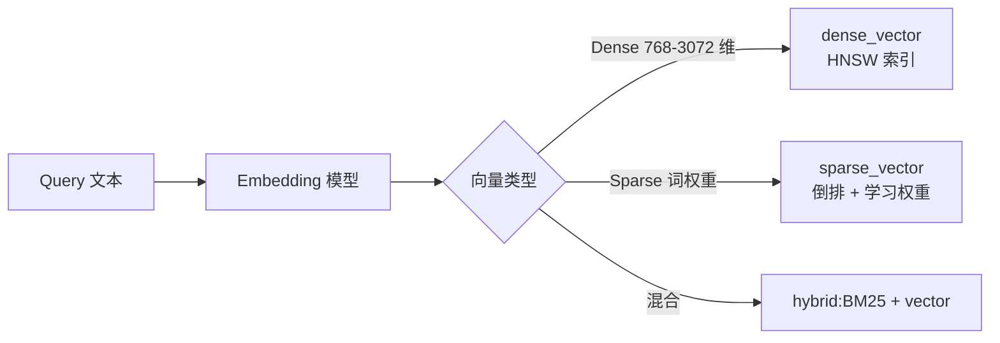
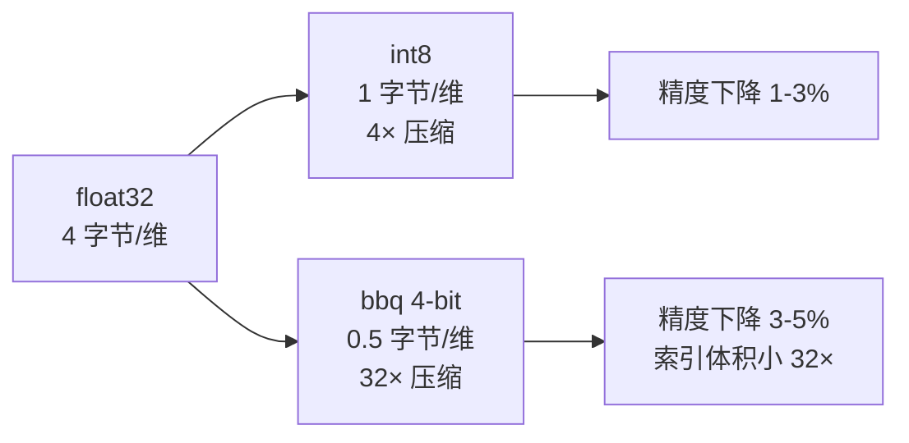

# 第 19 章 向量检索与混合搜索(Hybrid Search)

## 本章目标

学完本章,你能:

- 解释 dense_vector / sparse_vector / 倒排向量 的本质差异与适用边界。
- 独立设计一个 **可生产** 的向量检索系统:embedding 选型、索引参数、量化策略。
- 写出 **混合检索(BM25 + 向量 + 重排)** 的端到端 DSL。
- 评估向量系统的 **成本/质量/延迟** 三角,做出工程取舍。
- 解决 50K 专家面试必考的 5 个向量检索问题。

> 背景:从 8.0 起 `dense_vector` 进入 GA,8.6+ 引入 `bbq_hnsw`(Better Binary Quantization)、`bbq_flat`,8.13+ 引入 `sparse_vector` 改进(Pruning/Rescore)和 `semantic_text`(声明式语义字段)。本章以 8.13+ 为主线。

---

## 19.1 三种向量的对比



| 类型 | 字段 | 索引算法 | 优点 | 缺点 |
| --- | --- | --- | --- | --- |
| **Dense** | `dense_vector` | HNSW / BBQ 量化 | 语义召回,OOV 友好 | 解释性差,索引体积大 |
| **Sparse(ELSER)** | `sparse_vector` + `text_expansion` | 倒排 | 训练数据少时仍可用,可解释 | 性能受训练集分布影响 |
| **Lexical** | `text` | Lucene 倒排 | 解释性强,延迟低 | 不理解语义 |

---

## 19.2 dense_vector 深度

### 19.2.1 字段定义

```
PUT /embeddings
{
  "mappings": {
    "properties": {
      "title":    { "type": "text" },
      "vec_768":  { "type": "dense_vector", "dims": 768, "index": true, "similarity": "cosine" },
      "vec_int8": { "type": "dense_vector", "dims": 1024, "index": true, "similarity": "dot_product", "index_options": { "type": "int8_hnsw", "m": 16, "ef_construction": 100 } },
      "vec_bbq":  { "type": "dense_vector", "dims": 1024, "index": true, "similarity": "cosine", "index_options": { "type": "bbq_hnsw", "m": 16, "ef_construction": 100 } }
    }
  }
}
```

### 19.2.2 相似度算法

| `similarity` | 公式 | 何时用 |
| --- | --- | --- |
| `cosine` | `A·B / (‖A‖×‖B‖)` | 文本 embedding(默认,正交化文本长度影响) |
| `dot_product` | `A·B` | 已归一化的 embedding 或带幅值的图像特征 |
| `l2_norm` | `‖A-B‖²` | 图像、推荐向量(常需先归一化) |
| `max_inner_product` | 归一化 dot | 推荐场景 |

> 经验:同模型内部统一用 **cosine**;跨模型比对、排序统一用 **dot_product**(前提归一化)。

### 19.2.3 量化策略



| 类型 | 内存 | 召回 | 何时用 |
| --- | --- | --- | --- |
| 不量化(`hnsw` 默认) | 4 字节/维 | 100% baseline | 小规模、QPS 极致 |
| `int8_hnsw` | 1 字节/维 | 97-99% | 主流生产(8.12+) |
| `bbq_hnsw` | 0.5 字节/维 + rescoring | 90-95% | 千万级以上,预算敏感 |
| `int4_hnsw`(8.13+) | 0.5 字节/维 | 95-98% | int8 体积敏感时替代 |

### 19.2.4 索引参数

| 参数 | 默认 | 建议 | 含义 |
| --- | --- | --- | --- |
| `m` | 16 | 16-48 | HNSW 邻居数,越大越准越大 |
| `ef_construction` | 100 | 100-200 | 建图时候选数,越大越准越慢建 |
| `ef_search`(查询) | 100 | 50-500 | 搜索时候选数 |

查询时通过 `?hnsw_ef` 调整:

```
POST /embeddings/_search
{
  "knn": { "field": "vec_768", "query_vector": [...], "k": 10, "num_candidates": 100, "similarity": 0.78 },
  "size": 10
}
```

`num_candidates` ≥ `k`,通常 10×-50× `k` 即可接近 100% recall。

---

## 19.3 sparse_vector 与 ELSER

### 19.3.1 ELSER 原理

Elastic Learned Sparse EncodeR(ELSER)v2 是 Elastic 训练好的 **稀疏向量模型**。输入文本,输出 term → weight 的稀疏表示,在 ES 内部用倒排 + 权重查询。

- **无需 GPU**,CPU 即可推理。
- **支持中文**(v2 起,准确度优于 v1)。
- **零样本冷启动**,无需训练。

### 19.3.2 部署 ELSER

```
# 1) 部署 ELSER 模型(首次需要,默认会在 Eland 拉取)
PUT /_ml/trained_models/.elser_model_2
{ "input": { "field_names": ["text_field"] } }

# 2) 启动部署
POST /_ml/trained_models/.elser_model_2/deployment/_start?wait_for=started

# 3) 字段定义
PUT /docs
{
  "mappings": {
    "properties": {
      "text": { "type": "text" },
      "text_embedding": {
        "type": "sparse_vector",
        "index_options": { "prune": true, "pruning_config": { "frequent_terms": 0.05, "max_tokens_per_doc": 1000 } }
      }
    }
  }
}

# 4) 摄取时自动推理
PUT /_ingest/pipeline/elser-pipeline
{
  "processors": [
    { "inference": { "model_id": ".elser_model_2", "input_output": { "input_field": "text", "output_field": "text_embedding" } } }
  ]
}

# 5) 查询
POST /docs/_search
{
  "query": {
    "sparse_vector": {
      "field": "text_embedding",
      "inference_id": ".elser_model_2",
      "query": "如何优化分片数量"
    }
  }
}
```

---

## 19.4 混合检索(Hybrid Search)

### 19.4.1 为什么需要混合

- **BM25** 准在词面,但召回不到同义词/语义。
- **Dense** 准在语义,但丢失精确词面(如错误码、ID)。
- **生产实践**:BM25 召回 → Dense 召回 → RRF 重排(或 Cross-Encoder 重排)→ Top-K。

### 19.4.2 RRF(Reciprocal Rank Fusion)

公式:`score = Σ 1 / (k + rank_i)`,k 通常取 60。

```
POST /hybrid_idx/_search
{
  "size": 20,
  "query": {
    "bool": {
      "should": [
        { "multi_match": { "query": "elasticsearch 调优", "fields": ["title^3", "body"] } }
      ]
    }
  },
  "knn": {
    "field": "title_vec",
    "query_vector": [0.12, 0.88, ...],
    "k": 50,
    "num_candidates": 200,
    "boost": 0.7
  },
  "rank": {
    "rrf": { "window_size": 100, "rank_constant": 60 }
  }
}
```

### 19.4.3 显式 RRF(8.8+ sub_searches)

```
POST /hybrid_idx/_search
{
  "size": 10,
  "sub_searches": [
    {
      "query": { "match": { "body": "elasticsearch 调优" } }
    },
    {
      "query": {
        "sparse_vector": {
          "field": "body_embedding",
          "inference_id": ".elser_model_2",
          "query": "elasticsearch 调优"
        }
      }
    }
  ],
  "rank": { "rrf": { "window_size": 50, "rank_constant": 60 } }
}
```

### 19.4.4 Linear Combination(线性加权)

ES 8.10+ 弃用 RRF-like 手动加权,推荐用 **Linear Retriever**(8.14+):

```
POST /hybrid_idx/_search
{
  "retriever": {
    "linear": {
      "query":     { "match": { "body": "elasticsearch 调优" } },
      "normalizer": "minmax",
      "weight": 0.4
    }
  }
}
```

实际项目里:BM25 + Dense + ELSER + Function(时间衰减/销量)四路,RRF 融合,**Linear 适合已知权重,A/B 友好**。

### 19.4.5 Cross-Encoder 重排(端到端最佳质量)

```
# 1) 检索粗排(BM25 + KNN, Top 100)
# 2) 取出 title + body 拼接
# 3) 调外部 bge-reranker / cohere rerank
# 4) 用 _update_by_query 写回 final_score
```

> **50K 面试要点**:Hybrid 不是"加两个 query",而是 **召回 + 重排** 的两阶段架构;BM25 不可被向量替代,向量也不能脱离 BM25。

---

## 19.5 端到端案例:语义 + 关键词商品搜索

### 19.5.1 索引设计

```
PUT /products_semantic
{
  "settings": { "number_of_shards": 6, "number_of_replicas": 1 },
  "mappings": {
    "properties": {
      "title":      { "type": "text", "analyzer": "ik_max_word" },
      "title_vec":  { "type": "dense_vector", "dims": 1024, "index": true, "similarity": "cosine", "index_options": { "type": "int8_hnsw", "m": 16, "ef_construction": 100 } },
      "category":   { "type": "keyword" },
      "price":      { "type": "scaled_float", "scaling_factor": 100 },
      "sales":      { "type": "long" }
    }
  }
}
```

### 19.5.2 摄取

```
POST /_bulk
{ "index": { "_index": "products_semantic", "_id": "1" } }
{ "title": "iPhone 15 Pro Max 256G", "title_vec": [0.1, 0.2, ...], "category": "phone", "price": 999900, "sales": 12000 }
```

向量由 **Ingest Pipeline** 调外部 Embedding API 或本地模型生成。

### 19.5.3 查询(BM25 + 向量 + RRF + 业务加权)

```
POST /products_semantic/_search
{
  "size": 20,
  "query": {
    "function_score": {
      "query": {
        "bool": {
          "must": [
            { "multi_match": { "query": "苹果手机 续航", "fields": ["title^2"] } }
          ],
          "filter": [
            { "term":  { "category": "phone" } },
            { "range": { "price": { "lte": 1500000 } } }
          ]
        }
      },
      "functions": [
        { "field_value_factor": { "field": "sales", "modifier": "log1p", "missing": 1 } }
      ],
      "score_mode": "sum"
    }
  },
  "knn": {
    "field": "title_vec",
    "query_vector": [0.15, 0.33, ...],
    "k": 50, "num_candidates": 200,
    "filter": { "bool": { "filter": [ { "term": { "category": "phone" } } ] } }
  },
  "rank": { "rrf": { "window_size": 100, "rank_constant": 60 } }
}
```

### 19.5.4 评估与离线评测

用 `elasticsearch-labs` 提供的 `RankingEvaluator` 跑 NDCG@10 / MRR:

```python
from elasticsearch import Elasticsearch
from elasticsearch.helpers import eval_ranking

results = eval_ranking(
    es=Elasticsearch("http://localhost:9200"),
    index="products_semantic",
    query_set=labeled_queries,   # [{"query": "...", "relevant": [doc_ids]}]
    metric="ndcg@10",
    retriever=retriever_lambda
)
```

离线评测指标:

| 指标 | 含义 | 目标 |
| --- | --- | --- |
| NDCG@10 | 排序质量 | 业务 P95 接受 |
| MRR | 第一个相关文档的位置 | 头部 query 提升 |
| Recall@100 | 召回率 | 单纯 BM25 至少 0.7 |

---

## 19.6 性能与成本

### 19.6.1 内存估算公式

- 1 亿条 1024 维 `float32`:**1e8 × 1024 × 4 = 400 GB**(HNSW 还要 ×1.5)
- 改 `int8_hnsw`:**100 GB**
- 改 `bbq_hnsw`:**50 GB**

> 千万级 1024 维 int8 是甜点;过亿请用 **int4 / bbq + rescoring**。

### 19.6.2 构建时间

- 1 千万 768 维 HNSW,`m=16, ef_construction=100`:单 shard 30-60 min。
- 批量摄取(每批 1000):`_bulk` 即可,但**向量必须先计算**(离线或 pipeline)。

### 19.6.3 延迟

| 阶段 | 延迟 |
| --- | --- |
| BM25 filter 10M → 100 | 5-20 ms |
| KNN HNSW 10M → 100 | 20-50 ms |
| RRF 融合 | < 1 ms |
| Cross-Encoder 重排(50 候选) | 100-300 ms |
| **端到端 P99** | 200-500 ms |

---

## 19.7 高级主题

### 19.7.1 分片/分段与向量

向量 HNSW 图是 **per-segment** 的,segment merge 会重建图——频繁 merge 会让 **CPU 抖**。生产建议:

- 减少 force merge 频次(默认 1,不要激进调 0)。
- 静态索引(`index.refresh_interval: -1`,构建完再打开)避开持续 merge。

### 19.7.2 Quantized retrieval 误差补救

`bbq_hnsw` 召回率比 `int8_hnsw` 低 2-5%。生产方案:

```
"knn": { "field": "vec_bbq", "query_vector": [...], "k": 100, "num_candidates": 500, "similarity": 0.75 }
```
**重召回 5×** 然后用 RRF 融合前 100 与 BM25 排序。

### 19.7.3 多向量(ColBERT / SPLADE)

- **ColBERT**:对每个 token 都建向量,精细但内存爆炸(100×+)。8.13 引入 `rescore` 参数。
- **SPLADE v2**:稀疏可学习,比 ELSER 更准但需要自训。
- 8.x 当前主线:**单向量 + ELSER + Rerank** 已经够 90% 业务。

### 19.7.4 过滤向量查询

KNN 支持前置 `filter`,与 BM25 不同,**filter 不影响距离**,但会降低 recall:

```
"knn": {
  "field": "vec", "query_vector": [...], "k": 10, "num_candidates": 200,
  "filter": { "term": { "category": "phone" } }
}
```

> 经验:`filter` 命中 ≤ 20% 数据集时,`num_candidates` 提到 500+。

---

## 19.8 50K 面试 5 大问题

1. **BM25 和向量检索的边界在哪里?**
   - BM25 准在"硬事实"(型号、错误码、ID);向量准在"软语义"。生产 **必须组合**,不可互替。

2. **量化召回率下降怎么办?**
   - 增大 `num_candidates`、开启 rescoring、用 RRF 与 BM25 互补;A/B 上线前必须离线测 Recall@K。

3. **跨语言/多语种怎么做?**
   - Embedding 用多语模型(bge-m3 / mE5 / Cohere multilingual v3);BM25 用 `icu_analyzer` 标准化不同语言 token;不要混语言索引。

4. **向量索引怎么分片?**
   - 按 **业务主键**(用户/租户)路由;每 shard HNSW 图控制在 < 1GB 内存;不要按时间分片(向量合并代价高)。

5. **如何评估向量系统上线?**
   - 构造 **3 层级评测集**:专家标注 200 条(质量)/ 用户点击日志 1w 条(行为)/ Synthetic 10w 条(回归)。**NDCG@10 + p99 延迟 + 单文档成本** 三件套同时看。

---

## 19.9 速查清单

- [ ] Embedding 模型选型与归一化策略已文档化。
- [ ] 量化方案与目标 Recall 已对齐。
- [ ] 离线评测 pipeline 已接入 CI。
- [ ] Rerank 服务的 P99 SLA 已定义。
- [ ] KNN `num_candidates` 已根据 filter 比例调过。
- [ ] 监控包含向量 QPS / P99 / 单查询候选数。

---

## 19.10 练习

1. 给 `products` 索引加 `dense_vector` 字段,跑 5 万条 embedding,比较 int8 / bbq 的 Recall@10。
2. 用 RRF 把 BM25 + KNN 融合,写 A/B 评测脚本对比单 BM25 的 NDCG@10。
3. 制造 1000 条含错误码的查询,验证 BM25 召回优于纯 KNN(回答面试题 1)。
4. 把 `ef_construction` 从 100 调到 200,观察索引时间和 Recall 变化。

---

下一章:[第 20 章 Painless 脚本与 Runtime Field 深入 →](./20-Painless脚本与Runtime-Field深入.md)
