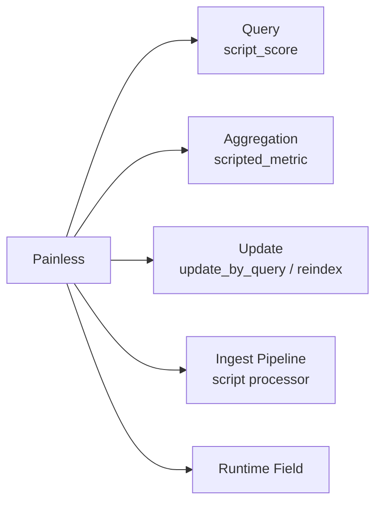

# 第 20 章 Painless 脚本与 Runtime Field 深入

## 本章目标

学完本章,你能:

- 写生产级 Painless 脚本,知道 **性能陷阱、缓存机制、安全边界**。
- 设计 **runtime fields** 解决"在线加字段"问题。
- 解释 script 内 `doc_values` / `_source` / `params` 的差异。
- 调通 `script_score` / `script_aggregation` / `update_by_query` / `reindex` 里的脚本。
- 给出 50K 面试中 Painless 的标准回答。

---

## 20.1 Painless 基础

### 20.1.1 是什么

- ES 内置 **白名单 + 沙箱** 脚本语言,语法类似 Groovy/Java 简化版。
- 编译后字节码缓存(`script.cache.max_size` 控制条目,默认 3000)。
- **不能** import 任意类,只能用 `painless` 提供的白名单包。

### 20.1.2 必备 API

| API | 用途 |
| --- | --- |
| `doc['field'].value` | 读 doc_values(快,推荐) |
| `doc['field'].size()` | 多值字段长度 |
| `params._source.field` | 读 _source(慢,慎用) |
| `ctx._source.field` | update 场景写 _source |
| `emit(value)` | 在 painless 聚合中产出值 |
| `Instant.ofEpochMilli(...)` | 时间处理 |

---

## 20.2 三种使用场景



---

## 20.3 script_score(打分调权)

### 20.3.1 典型用法:多业务因子加权

```
POST /products/_search
{
  "query": {
    "script_score": {
      "query": { "match_all": {} },
      "script": {
        "lang": "painless",
        "source": """
          double score = 1.0;
          if (doc['on_sale'].size() == 0 || doc['on_sale'].value == false) {
            return 0.0;
          }
          score *= Math.log1p(params.doc['sales'].size() > 0 ? params.doc['sales'].value : 0);
          score *= Math.sqrt(doc['rating'].size() > 0 ? doc['rating'].value : 3.0);
          if (doc['official'].size() > 0 && doc['official'].value) {
            score *= 1.5;
          }
          // 热度衰减
          long ageMs = params.now - doc['launched_at'].value.toInstant().toEpochMilli();
          score *= Math.exp(-ageMs / (double)params.halfLifeMs);
          return score;
        """,
        "params": {
          "now": 1717000000000,
          "halfLifeMs": 2592000000
        }
      }
    }
  }
}
```

### 20.3.2 性能准则

1. **优先用 `doc['x']`,不要 `_source.x`**——`_source` 要反序列化 JSON。
2. **三元 `size() > 0` 判空**——missing 字段 `doc['x'].value` 会抛 NPE。
3. **避免 String 拼接**——重场景会爆 CPU。
4. **避免 `Math.pow(a, 2)`**——直接 `a*a`。
5. **params 传入常量**——查询里的 `now` 不要 `Instant.now()`,会被 **cache key 串**;用 `params.now` + 客户端动态注入。

### 20.3.3 性能开关

```
PUT /_cluster/settings
{
  "transient": {
    "script.context.score.cache_max_size": 2000,
    "script.context.score.cache_expire": "5m"
  }
}
```

---

## 20.4 scripted_metric(自定义聚合)

### 20.4.1 求 "用户最近 3 单均价的方差" 这种变态聚合

```
POST /orders/_search
{
  "size": 0,
  "aggs": {
    "user_price_variance": {
      "scripted_metric": {
        "init_script": "state.totals = new HashMap(); state.counts = new HashMap();",
        "map_script": """
          def user = doc['user_id'].value;
          double price = doc['price'].value;
          if (state.totals.containsKey(user)) {
            state.totals.put(user, state.totals.get(user) + price);
            state.counts.put(user, state.counts.get(user) + 1);
          } else {
            state.totals.put(user, price);
            state.counts.put(user, 1);
          }
        """,
        "combine_script": """
          double sumTotals = 0; long sumCounts = 0;
          for (t in state.totals.values()) { sumTotals += t; }
          for (c in state.counts.values()) { sumCounts += c; }
          return sumTotals / (double)sumCounts;
        """,
        "reduce_script": """
          double total = 0; int n = 0;
          for (s in states) {
            if (s != null) { total += s; n++; }
          }
          return n == 0 ? 0 : total / n;
        """
      }
    }
  }
}
```

### 20.4.2 警告

- `state` 序列化经过 JSON,**大对象会爆 heap**。
- 替代:能用 `terms` + `stats` 解决的 **不要用** scripted_metric。
- 性能:1 亿 doc 跑 `scripted_metric` 单聚合 **分钟级**,慎用。

---

## 20.5 update_by_query + script

### 20.5.1 批量修改字段

```
POST /products/_update_by_query?wait_for_completion=false
{
  "script": {
    "source": "ctx._source.price = (int)(ctx._source.price * params.discount)",
    "lang": "painless",
    "params": { "discount": 0.9 }
  },
  "query": { "term": { "category": "phone" } }
}
```

### 20.5.2 异步与控制

```
# 提交后拿到 task_id
GET /_tasks/<task_id>

# 限速,避免打到集群
POST /_update_by_query?requests_per_second=1000&wait_for_completion=false
```

### 20.5.3 版本冲突处理

```
POST /_update_by_query?conflicts=proceed
{ ... }
```

- `abort`(默认):遇到冲突停止。
- `proceed`:跳过冲突文档继续。
- 生产强烈建议 **先 dry run** 用 `_reindex` + `version_type=external` 走新索引,然后双写切换。

---

## 20.6 Runtime Fields

### 20.6.1 是什么

8.x 起,字段可以在 **查询时** 由脚本计算,**不写盘**。适合:

- 在线增加新字段,无需 reindex。
- 临时 A/B 加权因子。
- 把 `_source` 已有字段拼成新字段。

### 20.6.2 索引级 runtime field

```
PUT /logs/_mapping
{
  "runtime": {
    "hour_of_day": {
      "type": "keyword",
      "script": {
        "source": "emit(doc['@timestamp'].value.getHour());"
      }
    }
  }
}
```

### 20.6.3 查询级 runtime field(8.4+)

```
GET /logs/_search
{
  "runtime_mappings": {
    "vip_flag": {
      "type": "boolean",
      "script": { "source": "emit(doc['user_level'].value >= 5);" }
    }
  },
  "query": { "term": { "vip_flag": true } },
  "aggs": { "vip_count": { "value_count": { "field": "vip_flag" } } }
}
```

### 20.6.4 性能与限制

| 维度 | 说明 |
| --- | --- |
| 延迟 | 每次 query 重新计算,比 doc_values 慢 5-20× |
| 缓存 | `request_cache` 不命中;`query_cache` 不命中 |
| 聚合 | 可聚合但慢;`top_metrics`/percentile 都重算 |
| 写入 | 不写盘,refreshing 0 |
| 适合 | 临时维度、低 QPS 报表,高 QPS 不推荐 |

### 20.6.5 "提升为" 索引字段(热路径优化)

```
# 1) runtime 验证业务
PUT /logs/_mapping { "runtime": { "vip_flag": {...} } }

# 2) 用 update_by_query 把结果写回 _source
POST /logs/_update_by_query
{ "script": "ctx._source.vip_flag = ctx._source.user_level >= 5;", "query": { "range": { "user_level": { "gte": 5 } } } }

# 3) 提升为 doc_values
PUT /logs/_mapping
{
  "properties": { "vip_flag": { "type": "boolean" } }
}
```

---

## 20.7 实战案例

### 20.7.1 案例 A:在线 A/B 加权(新因子灰度)

```
POST /products/_search
{
  "query": {
    "script_score": {
      "query": { "match": { "title": "iPhone" } },
      "script": {
        "source": """
          double base = _score;
          if (params.ab_bucket.contains(doc['user_id'].value)) {
            base *= params.exp_weight;
          }
          return base;
        """,
        "params": { "ab_bucket": ["u1","u2","u3"], "exp_weight": 1.2 }
      }
    }
  }
}
```

### 20.7.2 案例 B:跨字段联合打分(全文 + 业务)

```
POST /articles/_search
{
  "query": {
    "script_score": {
      "query": { "match": { "body": "elasticsearch" } },
      "script": {
        "source": """
          double s = _score;
          long views = doc['view_count'].size() > 0 ? doc['view_count'].value : 0;
          s *= Math.log1p(views);
          long ageDays = (params.now - doc['publish_at'].value.toInstant().toEpochMilli()) / 86400000L;
          if (ageDays < 7) s *= 1.5;
          return s;
        """,
        "params": { "now": 1717000000000 }
      }
    }
  }
}
```

### 20.7.3 案例 C:跨索引复制特定字段(替代一段 ETL)

```
POST /_reindex
{
  "source": { "index": "users_v1" },
  "dest":   { "index": "users_v2" },
  "script": {
    "source": "ctx._source.full_name = ctx._source.first_name + ' ' + ctx._source.last_name; ctx._source.remove('first_name'); ctx._source.remove('last_name');"
  }
}
```

---

## 20.8 安全与稳定性

### 20.8.1 限制

```
script.painless.regex.enabled: false        # 默认 false,禁 regex 防 ReDoS
script.painless.regex.limit-factor: 6
script.context.score.cache_max_size: 3000
script.context.update.max_fields_in_script: 100
```

### 20.8.2 监控

- `/_nodes/stats/indices/script`:看 `compilations` / `cache_evictions` / `compilation_limit_triggered`。
- 大量 `compilation_limit_triggered` 表明 **inline script 太多**,应改为 **stored script**。

### 20.8.3 最佳实践

- **存到 `/_scripts/{id}`**,再用 `{"id": "..."}` 引用,提升缓存命中率。
- `params` 传常量,不传表达式。
- 不在 painless 内做 IO/网络。
- 大批量改写走 `_reindex` + script,不要 `_update_by_query` 全表。

---

## 20.9 50K 面试 5 大问题

1. **Painless 与 Groovy 区别?**
   - 白名单沙箱、不允许 import 任意类、有专门优化(`def` 退化为 Object,基本类型自动装箱优化)。

2. **`doc['x'].value` vs `_source.x`?**
   - `doc` 读 doc_values,O(1),无反序列化;`_source` 走 JSON 反序列化,慢 5-10×,但能读未索引字段。

3. **script_score 和 function_score 选谁?**
   - `function_score` 是 DSL,固定几种衰减/加权,够用且快;`script_score` 完全自定义,代价高、需小心 NPE。

4. **Runtime field 何时上生产?**
   - **永远先 runtime 验证**,验证 OK 再 update_by_query 写回;不要长期让高 QPS 路径走 runtime。

5. **Painless 的 OOM 怎么排查?**
   - 看 GC 日志,heap dump;通常 root cause 是 scripted_metric 的 `state` 巨大;改用 composite / terms 替代。

---

## 20.10 速查清单

- [ ] 所有 script_score 走 `doc['x']`。
- [ ] params 传常量,无内联表达式。
- [ ] 高频 script 改为 stored script。
- [ ] Runtime field 仅用于灰度/低 QPS。
- [ ] `compilation_limit_triggered` 监控已挂上。
- [ ] `update_by_query` 任务有 task_id + alerts。

---

## 20.11 练习

1. 写一个 script_score,综合 `sales / log1p` + `rating * 0.3` + 时间衰减,参数通过 stored script 注入。
2. 在 `orders` 索引加 runtime field `profit_margin`,聚合按月统计。
3. 把上述 runtime field 提升为 doc_values 字段,对比前后查询延迟。
4. 制造 OOM:在 scripted_metric 中累计百万级 list 到 state,观察 heap 曲线。

---

下一章:[第 21 章 客户端 SDK 与生产集成(Java / Python / Go) →](./21-客户端SDK与生产集成.md)
