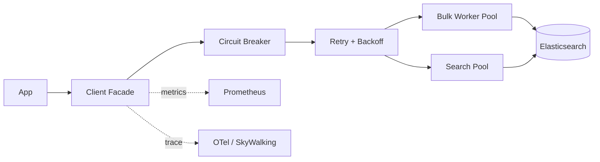

# 第 21 章 客户端 SDK 与生产集成(Java / Python / Go)

## 本章目标

学完本章,你能:

- 在 Java / Python / Go 三种生产语言里正确使用官方 Elasticsearch 客户端。
- 掌握 **连接池、retry / sniff、超时、bulk 异步、错误分类**。
- 设计 **客户端层封装**(限流、熔断、链路追踪、审计日志)。
- 给出 50K 面试中"如何选型 + 上线要点"的标准答案。

---

## 21.1 客户端家族

| 客户端 | 状态 | 协议 | 适用 |
| --- | --- | --- | --- |
| **Java API Client(`co.elastic.clients:elasticsearch-java`)** | 8.x 推荐 | HTTP(REST) | Java 11+ 主力,类型安全 |
| `org.elasticsearch.client:elasticsearch-rest-high-level-client` | **7.x only, 8.x 移除** | HTTP | 老项目 |
| `elasticsearch-py` (Python) | 8.x 推荐 | HTTP | Python 主力 |
| `go-elasticsearch` (Go) | 8.x 推荐 | HTTP | Go 主力 |
| `TransportClient` | **废弃** | TCP | 5.x 遗物 |

> 8.x 移除 TransportClient 与 HighLevelClient。**新项目一律用 Java API Client**。

---

## 21.2 Java 客户端

### 21.2.1 依赖

```xml
<dependency>
  <groupId>co.elastic.clients</groupId>
  <artifactId>elasticsearch-java</artifactId>
  <version>8.13.4</version>
</dependency>
<dependency>
  <groupId>com.fasterxml.jackson.core</groupId>
  <artifactId>jackson-databind</artifactId>
  <version>2.16.1</version>
</dependency>
<dependency>
  <groupId>jakarta.json</groupId>
  <artifactId>jakarta.json-api</artifactId>
  <version>2.1.3</version>
  <dependency>
```

### 21.2.2 客户端构造

```java
// 1) 基础
RestClient httpClient = RestClient.builder(
    new HttpHost("es-1", 9200, "https"),
    new HttpHost("es-2", 9200, "https"),
    new HttpHost("es-3", 9200, "https"))
  .setHttpClientConfigCallback(b -> b
    .setSSLContext(sslContext)
    .setDefaultCredentialsProvider(credsProvider))
  .build();

ElasticsearchTransport transport = new RestClientTransport(
    httpClient, new JacksonJsonpMapper());
ElasticsearchClient es = new ElasticsearchClient(transport);
```

### 21.2.3 索引

```java
CreateIndexResponse resp = es.indices().create(c -> c
    .index("products")
    .withJson(new StringReader("""
      {
        "settings": { "number_of_shards": 3, "number_of_replicas": 1 },
        "mappings": {
          "properties": {
            "title":  { "type": "text", "analyzer": "ik_max_word" },
            "price":  { "type": "scaled_float", "scaling_factor": 100 },
            "tags":   { "type": "keyword" }
          }
        }
      }
    """)));
```

### 21.2.4 文档 CRUD

```java
// 索引(等价 PUT /products/_doc/1)
Product p = new Product("1", "iPhone 15", 999900, List.of("5g", "ios"));
IndexResponse ir = es.index(i -> i.index("products").id(p.id()).document(p));
System.out.println(ir.result());  // created / updated

// 批量
BulkRequest.Builder br = new BulkRequest.Builder();
for (Product x : batch) {
    br.operations(op -> op.index(idx -> idx.index("products").id(x.id()).document(x)));
}
BulkResponse bResp = es.bulk(br.build());
if (bResp.errors()) {
    for (BulkResponseItem item : bResp.items()) {
        if (item.error() != null) log.warn("failed id={} reason={}", item.id(), item.error().reason());
    }
}
```

### 21.2.5 搜索

```java
SearchResponse<Product> resp = es.search(s -> s
    .index("products")
    .size(20)
    .query(q -> q.bool(b -> b
        .must(m -> m.match(mt -> mt.field("title").query("iPhone")))
        .filter(f -> f.term(t -> t.field("on_sale").value(true))))),
    Product.class);

for (Hit<Product> hit : resp.hits().hits()) {
    System.out.println(hit.id() + " " + hit.score() + " " + hit.source());
}
```

### 21.2.6 异步 / Reactive

```java
CompletableFuture<SearchResponse<Product>> future = es.searchAsync(...);
future.whenComplete((r, e) -> { if (e != null) log.error("search err", e); });
```

底层基于 `HttpAsyncClient`,生产建议用 **批量异步** + **CompletableFuture 聚合** 控制并发。

### 21.2.7 客户端层封装(生产推荐)

```java
@Component
public class EsClient {
    private final ElasticsearchClient client;
    private final CircuitBreaker breaker;
    private final MeterRegistry meter;

    public <T> T execute(Function<ElasticsearchClient, T> action) {
        return breaker.executeSupplier(() -> {
            Timer.Sample s = Timer.start(meter);
            try {
                T r = action.apply(client);
                s.stop(meter.timer("es.call.ok"));
                return r;
            } catch (Exception e) {
                s.stop(meter.timer("es.call.err"));
                throw new EsBizException(e);
            }
        });
    }

    public <T> List<T> bulkIndex(String index, List<T> docs, int batchSize) {
        List<T> failed = new ArrayList<>();
        for (int i = 0; i < docs.size(); i += batchSize) {
            List<T> sub = docs.subList(i, Math.min(i + batchSize, docs.size()));
            BulkResponse r = execute(c -> {
                BulkRequest.Builder b = new BulkRequest.Builder();
                for (T d : sub) b.operations(op -> op.index(idx -> idx.index(index).document(d)));
                return c.bulk(b.build());
            });
            for (BulkResponseItem it : r.items()) {
                if (it.error() != null) failed.add(sub.get(r.items().indexOf(it)));
            }
        }
        return failed;
    }
}
```

要点:
- 走 Resilience4j 或 Sentinel 做 **熔断**。
- 每次 ES 调用打 Micrometer/Prom 指标,error rate / p99 必看。
- bulk 失败 **不重试** 的 doc 走 **死信队列** (Kafka/Redis),人工/批处理兜底。

---

## 21.3 Python 客户端

### 21.3.1 安装与连接

```bash
pip install elasticsearch==8.13.*
```

```python
from elasticsearch import Elasticsearch

es = Elasticsearch(
    ["https://es-1:9200", "https://es-2:9200", "https://es-3:9200"],
    basic_auth=("elastic", "pass"),
    ca_certs="/etc/es/ca.crt",
    request_timeout=30,
    max_retries=3,
    retry_on_timeout=True,
    sniff_before_requests=True,
    sniff_on_node_failure=True,
    sniff_timeout=10,
    min_delay_between_sniffing_requests=60,
)
```

### 21.3.2 写入与搜索

```python
from elasticsearch import helpers

es.index(index="products", id="1", document={
    "title": "iPhone 15", "price": 999900, "tags": ["5g","ios"]
})

actions = [
    {"_index": "products", "_id": str(i), "_source": {"title": f"item {i}", "price": i*100}}
    for i in range(10000)
]
helpers.bulk(es, actions, chunk_size=1000, request_timeout=60)
```

### 21.3.3 异步(async)

```python
from elasticsearch import AsyncElasticsearch
import asyncio

a_es = AsyncElasticsearch(hosts=["https://es-1:9200"], basic_auth=("elastic","pass"))

async def main():
    r = await a_es.search(index="products", query={"match": {"title":"iPhone"}}, size=20)
    for h in r["hits"]["hits"]:
        print(h["_id"], h["_score"], h["_source"])

asyncio.run(main())
```

### 21.3.4 高级用法

- `helpers.async_streaming_bulk`:流式 bulk,适合 ETL/导入。
- `helpers.parallel_bulk`:多 worker 加速导入(注意 ES 端拒绝风险)。
- `helpers.reindex`:跨集群 reindex。

---

## 21.4 Go 客户端

### 21.4.1 安装

```bash
go get github.com/elastic/go-elasticsearch/v8
```

### 21.4.2 连接

```go
cfg := elasticsearch.Config{
    Addresses: []string{"https://es-1:9200","https://es-2:9200"},
    Username:  "elastic",
    Password:  "pass",
    Transport: &http.Transport{
        MaxIdleConnsPerHost: 10,
        ResponseHeaderTimeout: 5 * time.Second,
    },
    RetryOnStatus: []int{502, 503, 504, 429},
    MaxRetries:    3,
}
es, _ := elasticsearch.NewClient(cfg)
```

### 21.4.3 搜索(typed API)

```go
res, err := es.Search(
    es.Search.WithIndex("products"),
    es.Search.WithBody(strings.NewReader(`{
        "query": { "match": { "title": "iPhone" } },
        "size": 20
    }`)),
    es.Search.WithTrackTotalHits(true),
    es.Search.WithPretty(),
)
defer res.Body.Close()
```

### 21.4.4 Bulk

```go
var buf bytes.Buffer
for _, p := range products {
    meta := fmt.Sprintf(`{"index":{"_index":"products","_id":"%s"}}`, p.ID)
    data, _ := json.Marshal(p)
    buf.Write(meta + "\n" + string(data) + "\n")
}
res, _ := es.Bulk(bytes.NewReader(buf.Bytes()),
    es.Bulk.WithIndex("products"),
    es.Bulk.WithRefresh("false"))
```

### 21.4.5 高阶:typed API / esutil

- `go-elasticsearch/v8/typedapi`:结构化 builder,类似 Java API Client。
- `go-elasticsearch/v8/esutil`:JSON reader / BulkIndexer 工具。

---

## 21.5 通用生产要点

### 21.5.1 连接池 / Sniffer

- **Sniff**:客户端定期 GET `/_nodes/http` 拉取节点列表,**动态发现扩容**。
- **关闭 Sniff 场景**:K8s + Service mesh + sidecar 代理时,客户端只能连一个 endpoint(由 mesh 路由),开 sniff 反而引起震荡。

### 21.5.2 超时分层

| 阶段 | 建议值 |
| --- | --- |
| `connect_timeout` | 500ms-1s |
| `socket_timeout`(单请求) | 5-30s |
| `bulk` timeout | 60-120s |
| `search` timeout | 5-10s(查询);60s+(scroll/PIT) |

### 21.5.3 Retry

- 仅 retry **幂等** 请求:`GET` / `search` / `index` 带 ID。
- 不 retry:**bulk**(部分成功)+ **update_by_query**(任务模型)。
- 4xx 一般不 retry(除 429),5xx 退避重试 **3 次**,exponential + jitter。

### 21.5.4 错误分类

| 状态码 | 含义 | 处理 |
| --- | --- | --- |
| 400 | 业务/语法错 | 不 retry,打日志 |
| 401/403 | 鉴权失败 | 检查 token/证书 |
| 404 | 索引/文档不存在 | 业务判空 |
| 409 | 版本冲突 | retry with new seq_no |
| 429 | 限流 | 退避,看 CircuitBreaker |
| 500/503 | 集群问题 | retry 短退避 |
| 504 | 节点超时 | retry |

### 21.5.5 Bulk 性能

| 维度 | 经验值 |
| --- | --- |
| batch size | 5-15 MB 或 1000-5000 doc |
| 并发 worker | CPU 核数 / 2(每 worker 一条连接) |
| 限流 | `requests_per_second` 配合 `index.translog.flush_threshold_size` |
| 失败处理 | 单条 doc 失败入死信,**不要**整批重发 |

### 21.5.6 安全

- TLS + Basic / API Key / OAuth2。
- 客户端证书不落代码,**K8s Secret / Vault 注入**。
- 走 `/_security/profile` 做审计。

---

## 21.6 客户端层通用架构



关键点:

1. **客户端只连一个集群一个 endpoint**(走 service mesh 负载均衡)。
2. **业务调用走 facade**,不允许业务直连 `ElasticsearchClient`,这样换 SDK / 升级 ES 零修改业务。
3. **可观测性**:`es.call.{cluster}.{op}` 打点,含 p50/p95/p99、error rate、bulk 成功条数。
4. **Bulk 限流**:按 `cluster.routing.allocation.total_shards_per_node` 算并发上限,避免打爆。

---

## 21.7 50K 面试 5 大问题

1. **8.x 客户端为什么不再用 HighLevelClient?**
   - HighLevelClient 与 TransportClient 严重耦合 ES 内部 API,版本不兼容频繁;Java API Client 基于 REST + Jackson,稳定可演进。

2. **Bulk 失败如何处理?**
   - 按 item 遍历,error item 走死信队列,其余 item 已成功,不需要整体重试。重试会导致版本冲突和数据重复。

3. **Sniff 什么时候开?**
   - 直连 ES 节点时开;走 K8s Service / mesh 时关,否则 sniff 出来的节点 IP 客户端不可达。

4. **客户端连接数怎么算?**
   - 每个 client 通常 1-2 个连接/节点,bulk 异步可加到 4-8;总连接数 = 客户端实例数 × 每实例连接 × 节点数 ≤ ES `http.max_content_length` 与 fd 上限。

5. **P99 怎么稳在 100ms?**
   - 控制 request size(避免大聚合 / 大 _source)、query 走 filter context、客户端预热、限流 + 熔断、超时分层、连接复用。

---

## 21.8 速查清单

- [ ] 客户端 SDK 走 facade,业务不直接 new。
- [ ] 熔断 / 限流 / 重试 / 监控四件套齐全。
- [ ] Bulk 失败 item 走死信。
- [ ] TLS / 凭据 / IP 白名单全启用。
- [ ] Sniff 模式按部署方式选对。
- [ ] 客户端版本 = ES 主版本(8.x ↔ 8.x)。

---

## 21.9 练习

1. 用 Java API Client 实现一个 `EsClient.bulkIndex(index, docs, batchSize=1000)`,记录失败率。
2. 在 Python 用 `helpers.async_streaming_bulk` 导入 10 万条 doc,看 QPS。
3. 写 Go 的 BulkIndexer,完成 50 万条导入,统计 p99。
4. 模拟 ES 节点宕机,观察客户端 sniff / 重试行为。

---

下一章:[第 22 章 Schema 演进与零停机 Reindex →](./22-Schema演进与零停机Reindex.md)
