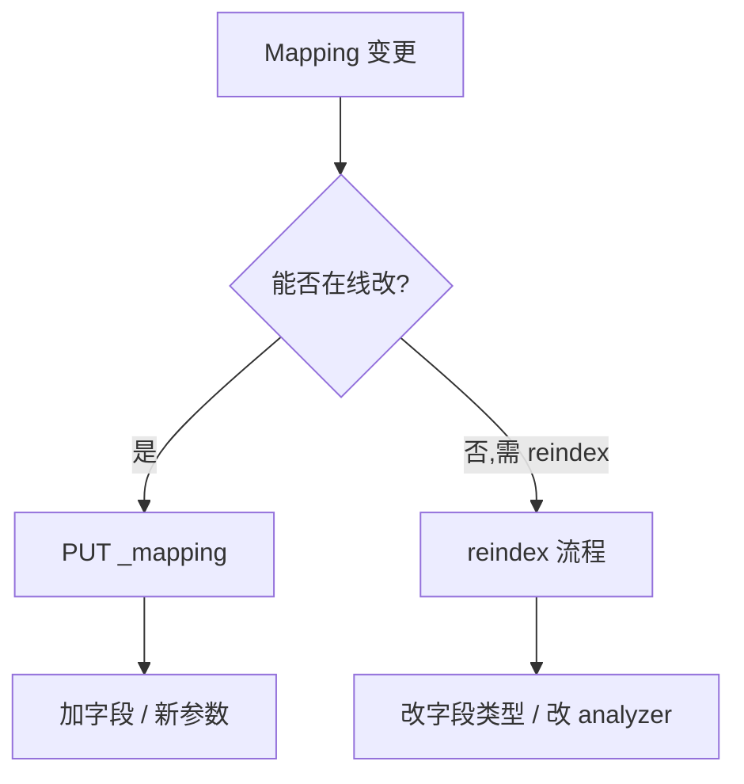
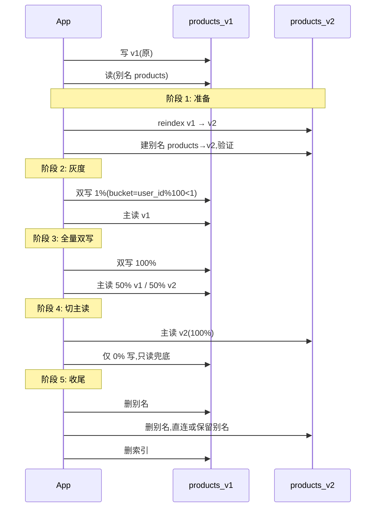

# 第 22 章 Schema 演进与零停机 Reindex

## 本章目标

学完本章,你能:

- 判断 **哪些 mapping 变更可在线做,哪些必须 reindex**。
- 设计 **零停机** schema 升级流程(双写 / 切读 / 收尾)。
- 处理大索引 reindex 的 **时间、内存、流量** 问题。
- 在 50K 面试中,清晰回答"如何零停机改字段类型"。

---

## 22.1 Mapping 变更矩阵



| 变更 | 是否可在线 | 说明 |
| --- | --- | --- |
| **新增字段** | ✅ | 直接 `PUT _mapping`,不需 reindex |
| **新增 multi-fields** | ✅ | `properties.x.fields` 加 |
| **改 `index: false` → `true`** | ✅ | 需要 reindex 后才可搜索 |
| **改 `index: true` → `false`** | ❌ | 数据丢失,需 reindex 回到 true 索引 |
| **改 `analyzer`** | ❌ | 必须 reindex,老 doc 走老分析器 |
| **改字段类型(long → keyword)** | ❌ | 必须 reindex |
| **`null_value` 改** | ✅(部分) | 不影响已有 |
| **加 `format` 到 date** | ✅ | 不重写旧值,只影响新写入 |
| **改 `dynamic` 策略** | ✅ | 立即生效 |
| **改 `_source` enabled** | ❌ | 不可回退,需 reindex |
| **改 `norms` / `doc_values`** | ❌ | 必须 reindex |
| **改 `similarity`** | ❌ | 必须 reindex |
| **加 copy_to** | ✅ | 仅影响新写入 |
| **加 new parent/child join 字段** | ✅ | 数据要 backfill 时仍需 reindex |

> 经验法则:能 **不改类型** 就不改;能 **加 multi-field** 就不改主字段。

---

## 22.2 Reindex 基础

### 22.2.1 同集群 reindex

```
POST /_reindex?wait_for_completion=false
{
  "source": { "index": "products_v1", "size": 1000 },
  "dest":   { "index": "products_v2", "version_type": "external" },
  "script": {
    "source": """
      if (ctx._source.title == null) {
        ctx._source.title = ctx._source.name;
      }
      ctx._source.create_ts = ctx._source.create_ts == null ? 0L : ctx._source.create_ts;
    """
  }
}
```

### 22.2.2 跨集群 reindex(remote)

```
POST /_reindex?wait_for_completion=false
{
  "source": {
    "remote": { "host": "http://src-es:9200", "username":"u","password":"p" },
    "index": "products"
  },
  "dest": { "index": "products_new" }
}
```

> 跨集群需在 `elasticsearch.yml` 配 `reindex.remote.whitelist: ["src-es:9200"]`。

### 22.2.3 任务管理

```
GET /_tasks/<task_id>
POST /_tasks/<task_id>/_cancel
POST /_update_by_query?wait_for_completion=false&requests_per_second=1000
```

### 22.2.4 性能调参

| 参数 | 默认 | 建议 |
| --- | --- | --- |
| `source.size` | 1000 | 5000-10000(IO 提升) |
| `requests_per_second` | -1(无限制) | 5000-20000(防打爆源) |
| `scroll_size` | 1000 | 5000 |
| `slices` | 1 | `auto`(≤ 节点 shard 数) |

`slices=auto` 启用并行,**前提源 cluster 足够闲**。

---

## 22.3 零停机切换流程(双写 + 别名)

### 22.3.1 整体时序



### 22.3.2 别名(alias)机制

```
POST /_aliases
{
  "actions": [
    { "add":    { "index": "products_v2", "alias": "products", "is_write_index": false } },
    { "add":    { "index": "products_v1", "alias": "products", "is_write_index": true  } }
  ]
}
```

切写:

```
POST /_aliases
{
  "actions": [
    { "set":    { "index": "products_v2", "alias": "products", "is_write_index": true  } },
    { "set":    { "index": "products_v1", "alias": "products", "is_write_index": false } }
  ]
}
```

> **核心**:业务永远读写 **别名**,不直连物理索引,这样切版本只动别名。

### 22.3.3 双写与一致性

双写会遇到 3 个问题:

1. **部分失败**:v1 写成功,v2 失败 → 业务重试到 v2,需要 **幂等 key**(`_id` + `version_type=external`)。
2. **乱序**:v1 后到的 update 覆盖 v2 后到的 create → 用 `if_seq_no` / `if_primary_term` 校验,或全量回放。
3. **数据倾斜**:reindex 时源端持续写 → 用 `reindex` + `version_type=external`,新版本号胜出。

代码模板(Java):

```java
public void dualWrite(Doc d) {
  long v = System.currentTimeMillis();
  IndexRequest v1 = new IndexRequest("products_v1").id(d.id())
      .source(d.jsonMap()).setRefreshPolicy(RefreshPolicy.NONE);
  IndexRequest v2 = new IndexRequest("products_v2").id(d.id())
      .source(d.jsonMap()).versionType(VersionType.EXTERNAL).version(v);
  // v1 失败抛错(主写)
  es.index(v1);
  try { es.index(v2); }
  catch (Exception e) { deadLetter.send("v2", d); }
}
```

---

## 22.4 大索引 Reindex 优化

### 22.4.1 时间估算

```
时间 ≈ 数据量 / (源 read 吞吐) × (1 + GC / 合并 / 索引开销)
例:1 TB 数据,源 read 200 MB/s → 5000 s ≈ 1.4 h
```

### 22.4.2 流量控制

```
POST /_reindex?wait_for_completion=false&requests_per_second=10000
```

按 **源端 IO** 而非目标 IO 控制:

- SSD:50-200 MB/s/节点 → 10000 req/s 大致 30-100 MB/s。
- HDD:8-30 MB/s/节点 → 2000-5000 req/s。

### 22.4.3 切片并行

```
"source": { "index": "products_v1", "size": 5000 },
"slices": "auto"
```

注意:`slices > shard 数`不会带来更多并行,反而协调开销上升。

### 22.4.4 减少 IO 放大

- **关闭 refresh**:目标索引 `index.refresh_interval: -1`,reindex 完再打开。
- **关闭副本**:reindex 期间 `number_of_replicas: 0`,完成后再 1。
- **临时调 translog**:`index.translog.durability: async`,但要保证源可恢复。

### 22.4.5 完成后处理

```
POST /products_v2/_settings
{ "index": { "refresh_interval": "1s", "number_of_replicas": 1 } }

POST /products_v2/_forcemerge?max_num_segments=1
```

> 一次性 reindex 完,**不要** 持续 forcemerge,会把写入路径打断。

---

## 22.5 实战案例

### 22.5.1 案例 A:`text` 字段改 `keyword` 索引(纠错)

背景:某字段历史用 `text`,后来发现都是 ID,不需要分词。

1. 新建 `products_v2` 索引,`{ "id": { "type": "keyword" } }`。
2. `_reindex` 加 `script: ctx._source.id = doc['id'].value`。
3. 双写 + 别名切换(3.2 流程)。
4. 下线 `products_v1`。

### 22.5.2 案例 B:加 `dense_vector` 字段(对历史数据回填)

1. `_mapping` 新增 `embedding` 字段,`index: false`(免回填时建图)。
2. 离线生成 embedding,`_update_by_query` 写入 `embedding` + 设 `index: true`。
3. 业务双写后切别读 `embedding` 走 KNN。

### 22.5.3 案例 C:改 analyzer(ik_smart → ik_max_word + synonym)

1. 新索引 `docs_v2` 应用新 analyzer。
2. reindex + 重建 synonym。
3. 双写 7 天,验证搜索相关性提升后再切主读。
4. 用 **同义词语义化** 替代品 ELSER 可避免此类升级。

---

## 22.6 升级 / 回滚预案

| 场景 | 操作 |
| --- | --- |
| 升级中发现 P99 飙升 | 别名切回 v1,关闭 v2 写,保留数据 |
| 升级后 7 天发现数据漂移 | 用 v1 snapshot 恢复关键 subset |
| 升级失败但别名已切 | 把 v1 重新 `add` 回别名并 `is_write_index=true` |
| 索引间数据不一致 | 全量 reindex 兜底 + 业务对账脚本 |

> **黄金法则**:生产永远保留 **回滚路径**;升级前必做 **snapshot**;灰度时长按业务重要性 1-7 天。

---

## 22.7 50K 面试 5 大问题

1. **什么情况必须 reindex,什么不必?**
   - 改字段类型、analyzer、norms、doc_values、_source enabled → 必须;加字段、加 multi-field、改 dynamic 策略 → 不必。

2. **1 亿 doc 升级 analyzer 要多久?**
   - 看源 IO 与目标 IO。1 亿 1KB 文档 ≈ 100GB,源 200MB/s,目标 100MB/s(因为要索引) → 1000-3000s ≈ 1 小时。需要并行 + 限流 + 关闭 refresh。

3. **零停机切索引的最小步骤?**
   - 写别名 → 双写 → 切别读 → 收尾。**3 个别名动作 + 1 次 reindex** 即可,关键是双写幂等。

4. **怎么保证双写一致?**
   - `_id` + `version_type=external` + 时钟单调递增;失败 doc 走死信;切换前对账 `count` / 抽样 `_id` 校验。

5. **为什么不用 update_by_query 改全表?**
   - update_by_query 是 **原地** 改,版本号与原文档冲突,且会**部分失败**导致脏数据。**reindex + 别名切换** 是更可控的方式。

---

## 22.8 速查清单

- [ ] 业务读写一律走别名。
- [ ] 升级前 snapshot 必做。
- [ ] Reindex 关闭 refresh、临时副本 0。
- [ ] 限流 `requests_per_second`,按源 IO 算。
- [ ] 灰度双写 1% → 100% → 主读。
- [ ] 死信队列监控 + 对账脚本。

---

## 22.9 练习

1. 准备 `products_v1`(text 字段)+ `products_v2`(keyword 字段),reindex + 切别名,记录 P99。
2. 在 K8s 部署一个 5 亿 doc 索引,模拟 reindex 升级 analyzer,观察 IO。
3. 双写方案跑 1 小时,做对账脚本验证 v1、v2 doc count 差异。
4. 故意写错 v2 索引配置,触发回滚流程。

---

下一章:[第 23 章 容量规划与成本工程 →](./23-容量规划与成本工程.md)
