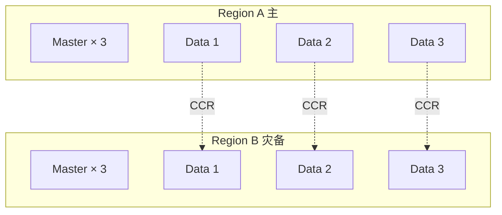

# 第 24 章 SRE 实战:RTO/RPO、灾备与故障复盘

## 本章目标

学完本章,你能:

- 定义 ES 集群的 **RTO / RPO** 并落到工程方案。
- 编写 **生产级 Runbook**,在故障时 5-10 分钟恢复。
- 复盘 6 类典型故障,知道根因与处理。
- 搭建 **灾备演练(Chaos)** 流程,做到月度演练。
- 在 50K 面试中,清晰回答"你们如何保证不丢数据 / 多久能恢复"。

---

## 24.1 RTO / RPO 定义

| 指标 | 含义 | 业务常见值 |
| --- | --- | --- |
| **RTO**(Recovery Time Objective) | 故障到恢复的时长 | 1-4 h(核心),24 h(边缘) |
| **RPO**(Recovery Point Objective) | 最多可丢失的数据时长 | 0(强一致),5 min / 1 h(常见) |

ES 实现:

- **RPO = 0**:同步副本 + 事务一致性(`wait_for_active_shards=all`)。
- **RPO = 分钟级**:snapshot 周期 + 副本异步。
- **RTO = 分钟级**:多 AZ + 自动重启 + 自动化运维。
- **RTO = 小时级**:跨 region 灾备 + 人工切换。

---

## 24.2 高可用架构



要点:

- **3 个 master + 2 个 data 起步**(3 master 是法定数最小值,2 master 脑裂)。
- **跨 AZ 部署**:master 跨 3 AZ。
- **CCR 跨 region**:异步复制,RPO 在秒级到分钟级。
- **DNS 切流**:Route53 / SLB / K8s Service 切读。

---

## 24.3 Snapshot / SLM

### 24.3.1 仓库

```
PUT /_snapshot/s3_repo
{
  "type": "s3",
  "settings": {
    "bucket": "es-snapshots",
    "region": "us-east-1",
    "base_path": "es/",
    "compress": true,
    "chunk_size": "1gb"
  }
}
```

> **生产必做**: `compress: true` + `chunk_size: 1gb`,节省 S3 存储费 30%。

### 24.3.2 SLM(Snapshot Lifecycle Management)

```
PUT /_slm/policy/daily-snap
{
  "name": "daily-snap",
  "schedule": "0 30 1 * * ?",
  "repository": "s3_repo",
  "config": {
    "indices": ["products-*", "orders-*"],
    "include_global_state": false,
    "ignore_unavailable": true,
    "partial": false
  },
  "retention": {
    "expire_after": "30d",
    "min_count": 5,
    "max_count": 30
  }
}
```

### 24.3.3 跨 region snapshot

```
PUT /_snapshot/s3_repo_replica
{
  "type": "s3",
  "settings": { "bucket": "es-snapshots-replica", "region": "us-west-2" }
}
```

跨 region 复制可用 **S3 Cross-Region Replication (CRR)** 异步同步,或 ES 端 `clone snapshot`(8.6+):

```
POST /_snapshot/s3_repo/snap-2024-01-15/_clone/s3_repo_replica
```

### 24.3.4 Restore 演练

每季度必做,分 3 种:

1. **同集群 restore**(索引误删) → 5 min。
2. **同 region 重建集群**(整集群崩溃) → 30-60 min。
3. **跨 region 切换** → 1-2 h(含 DNS 切流 + 数据校验)。

---

## 24.4 故障 Runbook(生产可拷贝)

### 24.4.1 P0:集群 RED

```text
# 1) 看健康
GET /_cluster/health
GET /_cluster/allocation/explain
GET /_cat/shards?h=index,shard,prirep,state,unassigned.reason

# 2) 常见原因速判
- unassigned.reason = INDEX_CREATED: 初始化慢
- unassigned.reason = CLUSTER_RECOVERED: 恢复中
- unassigned.reason = NODE_LEFT: 节点离开
- unassigned.reason = ALLOCATION_FAILED: 调度失败
- unassigned.reason = NO_VALID_SHARD_COPY: 副本损坏(高危)

# 3) 临时止血
PUT /<index>/_settings { "index.blocks.write": true }   # 防止扩大脏写
POST /_cluster/reroute { "commands": [ { "allocate_replica": { ... } } ] }  # 慎用

# 4) 长期修复
- 加节点 → 触发自动重平衡
- 调整 allocation require/tag
- 重建损坏副本
```

### 24.4.2 P0:写入慢/拒绝

```text
# 1) 线程池
GET /_cat/thread_pool/write?v&h=node_name,name,active,queue,rejected

# 2) 看 bulk rejected
GET /_nodes/stats/thread_pool/write?human

# 3) 临时
PUT /_cluster/settings { "transient": { "thread_pool.write.queue_size": "2000" } }

# 4) 长期
- 客户端限流(rejected 不重试,直接返回)
- 加大 bulk batch size 与并发
- 看 mapping 字段是否膨胀(动态 mapping 关掉)
```

### 24.4.3 P0:节点 OOM

```text
# 1) 看 GC
GET /_nodes/stats/jvm?human
# 2) 看 hot threads
GET /_nodes/hot_threads
# 3) heap dump
jmap -dump:format=b,file=/tmp/heap.bin <pid>

# 4) 临时
- 重启节点(快速恢复,但不解决根因)
- 改大 heap(若物理允许)

# 5) 根因
- fielddata 爆 → 改 .keyword
- 大聚合 → 加 size 上限,composite 分页
- 大量 deep scroll → search_after + PIT
```

### 24.4.4 P1:磁盘 > 85%

```text
# 1) 找大索引
GET /_cat/indices?h=index,store.size&bytes=b&s=store.size:desc | head -20

# 2) 找大 shard
GET /_cat/shards?h=index,shard,store,node&s=store:desc | head -20

# 3) 临时阻断写
PUT /<index>/_settings { "index.blocks.read": true }   # 读阻断保护(慎用)

# 4) 长期
- rollover 老索引(ILM)
- 缩副本(0 → 1)
- 删无用索引 / 走 frozen
- 加节点 / 扩盘
```

### 24.4.5 P1:集群 Yellow

```text
- 单节点集群 → 正常
- 多节点集群 yellow → 副本未分配
GET /_cluster/allocation/explain

# 原因
- 副本超过节点数
- allocation filter 卡住
- 磁盘阈值
```

### 24.4.6 P1:Master 频繁切换

```text
GET /_cluster/stats
GET /_nodes/stats/thread_pool/management?human

# 集群状态太大
- 减少索引 / 分片数
- master 单独节点(独立 node.roles)
- 调大 cluster.publish.timeout
```

### 24.4.7 P2:搜索 P99 飙升

```text
# 1) profile 找瓶颈
POST /<index>/_search { "profile": true, "query": ... }

# 2) 慢日志
GET /<index>/_settings?include_defaults=true
# 改 index.search.slowlog.threshold.query.warn: 5s

# 3) cache 命中
GET /_nodes/stats/indices/query_cache,request_cache?human

# 4) 长任务
GET /_tasks?actions=*search*&detailed=true
```

---

## 24.5 6 类故障复盘(真实场景改编)

### 24.5.1 案例 1:Mapping 字段爆炸

**现象**:索引从 1 GB 一夜涨到 50 GB,查询 P99 从 50ms 涨到 8s。

**根因**:新接入业务 `dynamic: true`,每条 doc 带入 `tags.<uuid>` 唯一字段,生成 100w+ 字段。

**修复**:
1. `PUT _mapping { "dynamic": "strict" }`(紧急)
2. 重建索引 `_reindex` + 配 mapping
3. 写监控:字段数 / 索引大小 / shard 大小

**反思**:dynamic mapping 必关;index.mapping.total_fields_limit 必设。

### 24.5.2 案例 2:写入节点被 GC 拖垮

**现象**:CPU 飙到 90%,bulk 拒绝 30%。

**根因**:某 index 配置了 50 个分词字段 + 5 个 nested,GC pause 1.5s,写入放大。

**修复**:
1. nested 数量减到 1,mapping 瘦身。
2. 调小 `indices.memory.index_buffer_size` 到 5%。
3. bulk batch 调到 5000。
4. 上 G1GC `-XX:+UseG1GC`(已默认)+ `-XX:MaxGCPauseMillis=200`。

**反思**:nested 慎用;buffer_size 默认 10% 在大内存机器会拉满 heap。

### 24.5.3 案例 3:磁盘满导致 red

**现象**:数据节点磁盘 96%,集群 RED。

**根因**:日志索引未设 ILM,长期积累;forcemerge 没做。

**修复**:
1. 老索引 `indices.blocks.read=true`,临时止血。
2. 删 6 个月前 indices。
3. 上 ILM(frozen) 策略。
4. 报警:`disk.used_percent > 70%` 触发。

**反思**:日志必须有 ILM;`disk.watermark.low` 默认 85% 偏激进。

### 24.5.4 案例 4:Master 抖动

**现象**:每 30s 一次 master 切换,集群 yellow。

**根因**:master 节点兼任 data,索引更新触发的 cluster state 推送超过阈值。

**修复**:
1. master 节点 `node.roles: [ master ]` 独立。
2. 减少不必要的 `_settings` 改动。
3. `cluster.publish.timeout` 调大到 1 min。

**反思**:**3 节点 = 1 master + 2 data** 是错的,3 节点应全 master;data 至少 3 独立节点。

### 24.5.5 案例 5:跨 region CCR 落后

**现象**:DR 集群延迟从 5s 涨到 30 min。

**根因**:源端做大 reindex 引起 translog 暴增,CCR 拉取慢。

**修复**:
1. reindex 期间暂停 CCR(`POST /_ccr/<follower_index>/_pause`)。
2. 调大 `ccr.indices.recovery.max_bytes_per_sec`。
3. 完成后 resume。

**反思**:大操作期间要监控 CCR lag(`GET /_ccr/stats`)。

### 24.5.6 案例 6:向量索引内存爆

**现象**:32 GB 机器 12 节点 OOM,查询失败。

**根因**:dense_vector 1024 维 × 5000w doc × int8 = 50 GB,远超预估。

**修复**:
1. 切到 `bbq_hnsw` 量化(0.5 字节/维)。
2. 切片拆索引(按业务键路由)。
3. 升机器 64 GB 物理,heap 保持 31 GB。

**反思**:向量内存按 公式 估,**留 50% 余量**;上量化前先 POC 测 recall。

---

## 24.6 Chaos 演练清单

| 演练 | 频率 | 检查项 |
| --- | --- | --- |
| kill 1 个 data 节点 | 每周 | 集群多久恢复 green,数据是否丢 |
| 制造 1 个 network partition | 每月 | master 行为,半数失联时是否脑裂 |
| 制造 disk 满 | 每月 | 索引是否自动 read block |
| kill master 节点 | 每月 | 是否 30s 内重新选主 |
| 制造高 JVM 压力 | 每季 | GC 行为,业务 P99 |
| 制造 50% shard unassigned | 每季 | allocation 修复时间 |
| 切 region(CCR follower 提升) | 半年 | RTO < 目标,RPO < 目标 |

工具:

- **Chaos Monkey for Elasticsearch**(社区)。
- **Litmus / Gremlin** 通用 chaos。
- **toxiproxy** 制造网络延迟/丢包。
- **Linux `tc` / `iptables`** 网络故障。

---

## 24.7 Runbook 模板

```markdown
# Runbook: <故障名>

## 现象
- 监控: ...
- 业务: ...
- 用户反馈: ...

## 严重级
P0 / P1 / P2

## 值班
- 主: oncall
- 备: 主管

## 影响范围
- 集群 / 索引: ...
- 业务: ...

## 立刻操作 (5 min 内)
1. ...
2. ...

## 排查命令
\`\`\`
curl -XGET 'http://es:9200/_cluster/health?pretty'
\`\`\`

## 根因分析
- ...

## 临时止血
- ...

## 长期方案
- [ ] issue 链接
- [ ] PR 链接
- [ ] 复盘时间
```

每个 P0/P1 故障 **必须** 沉淀到 Runbook,3 个月后做 review。

---

## 24.8 50K 面试 5 大问题

1. **你们 RTO / RPO 怎么定的?**
   - 按业务分级:核心 RTO 1h / RPO 5min;边缘 24h / 1h。技术用 CCR + snapshot + 自动化切流保障。

2. **集群 red 了你第一步做什么?**
   - `GET /_cluster/health` + `GET /_cluster/allocation/explain`,1 分钟内判断 unassigned 原因;不盲目 reroute,先止血(blocks.write),再修根因。

3. **怎么避免 OOM?**
   - 上限(heap 31 GB)+ 监控(jvm.mem.heap_used_percent > 75% 警告)+ 业务治理(避免 fielddata、避免大聚合)。

4. **如果数据丢了能恢复吗?**
   - 有 snapshot(每日)+ 副本(2 副本)+ translog 5min flush,RPO 5 分钟;无 snapshot 的话只能从源重新灌。

5. **SRE 怎么考核 ES 团队的 SLA?**
   - 99.95% 可用(每月停机 < 22 min)+ P99 延迟 + 故障 MTTR(mean time to recovery) < 30 min + 演练频次。

---

## 24.9 速查清单

- [ ] RTO / RPO 文档化,业务对齐。
- [ ] Snapshot + SLM 已配置,周期 + 保留策略。
- [ ] 每月一次恢复演练,记录耗时。
- [ ] Runbook 至少 7 类故障,每类有 5 min 急救步骤。
- [ ] 监控覆盖:集群 / 节点 / JVM / 磁盘 / 慢查询。
- [ ] Chaos 演练月度化。
- [ ] Master / Data 节点分离。
- [ ] 跨 region CCR / 异地 snapshot。

---

## 24.10 练习

1. 写一个 7 类故障的 Runbook,每类含 5 min 急救 + 根因。
2. 用 `tc` 制造 200ms 网络延迟,观察 master 行为。
3. 关闭一个 data 节点,测集群恢复 green 时间。
4. 删除 1 个测试索引,从 snapshot 恢复,记录 RTO。
5. 用 `jmap` dump heap,用 VisualVM 看 OOM 根因。

---

完结语:学完 1-24 章 + 总结资料,你已具备 **生产级 ES 专家** 的能力,具备 50K 级别的工程视野与故障应对能力。建议结合 `examples/` 与 `diagrams/` 实操。

[返回 README →](../README.md)
