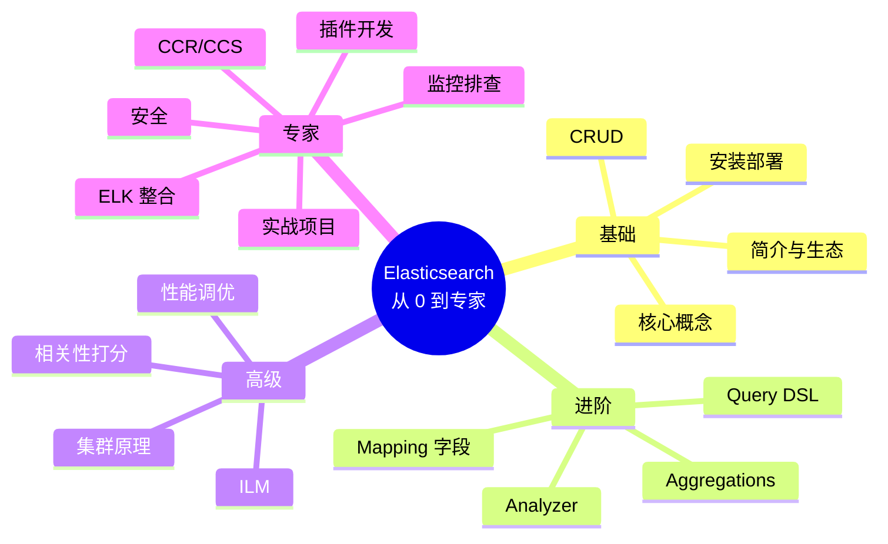
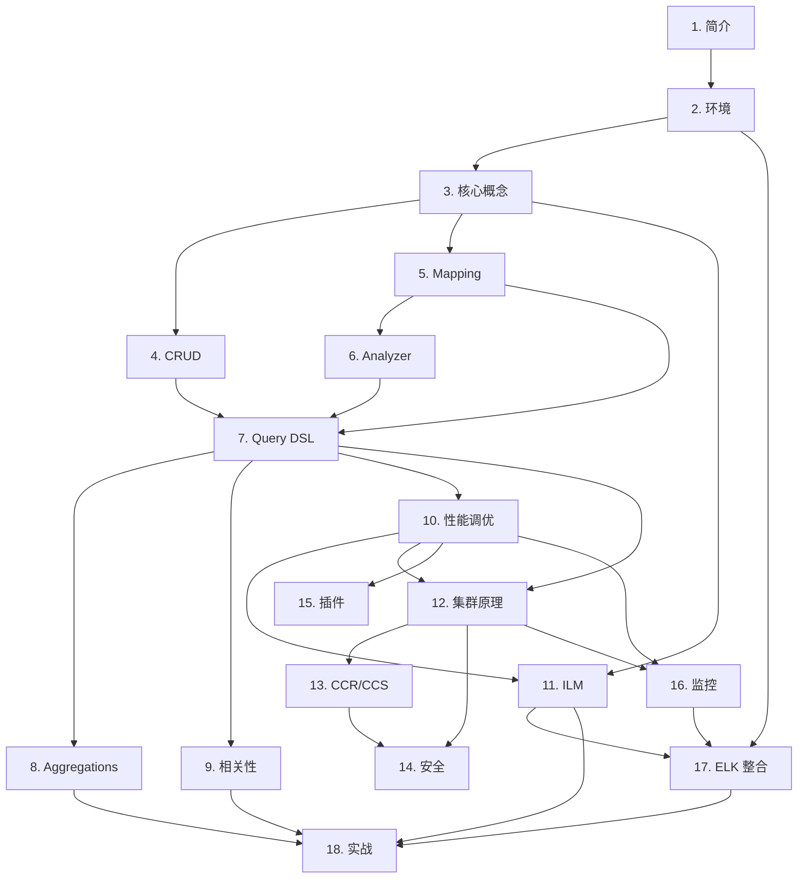

# Elasticsearch 学习路径总图

> 把 18 章串成"能力进阶图"。按 4 个阶段对应 4 个角色画像:
> **入门(会用)** → **进阶(用好)** → **高级(用深)** → **专家(用透)**

---

## 一、角色画像对照表

| 阶段 | 角色 | 能干什么 | 典型产出 |
| --- | --- | --- | --- |
| 入门 | "我能跑起来" | 装 ES、CRUD、简单搜索 | Demo 项目 |
| 进阶 | "我能做搜索 / 报表" | 设计索引、复杂 query、聚合分析 | 商品搜索 / 业务报表 |
| 高级 | "我能调优 / 设计" | 调相关性、调性能、ILM、集群架构 | 高性能生产集群 |
| 专家 | "我能交付生产方案" | 多集群、安全、插件、端到端方案 | 跨地域搜索 / 大数据平台 |

---

## 二、知识结构(脑图形式)

---

## 三、章节依赖图

---

## 四、按场景反查章节

### 4.1 "我要做站内搜索"

| 顺序 | 章节 | 学什么 |
| --- | --- | --- |
| 1 | [5. Mapping](../01-进阶篇/05-Mapping与字段类型详解.md) | 设计多字段 mapping |
| 2 | [6. Analyzer](../01-进阶篇/06-分词器深入.md) | 装 IK / 拼音 / 同义词 |
| 3 | [7. Query DSL](../01-进阶篇/07-搜索与Query-DSL.md) | multi_match / bool / suggester |
| 4 | [9. 相关性](../02-高级篇/09-相关性打分与排序机制.md) | function_score / 业务权重 |
| 5 | [10. 调优](../02-高级篇/10-性能调优与JVM优化.md) | filter / search_after / request_cache |
| 6 | [18. 案例 1](../03-专家篇/18-实战项目案例.md) | 电商搜索完整方案 |

### 4.2 "我要做日志平台"

| 顺序 | 章节 | 学什么 |
| --- | --- | --- |
| 1 | [2. 环境](../00-入门篇/02-环境搭建与基本配置.md) | ES + Kibana + Filebeat 起步 |
| 2 | [3. 核心概念](../00-入门篇/03-核心概念.md) | shard / replica |
| 3 | [11. ILM](../02-高级篇/11-索引设计与生命周期管理.md) | 滚动 + 冷热分层 |
| 4 | [16. 监控](../03-专家篇/16-运维监控与故障排查.md) | Metricbeat / Watcher |
| 5 | [17. ELK 整合](../03-专家篇/17-ELK生态整合.md) | Logstash / Kafka |
| 6 | [18. 案例 2](../03-专家篇/18-实战项目案例.md) | 日志平台完整方案 |

### 4.3 "我要做企业知识库 / RAG"

| 顺序 | 章节 | 学什么 |
| --- | --- | --- |
| 1 | [5. Mapping](../01-进阶篇/05-Mapping与字段类型详解.md) | dense_vector |
| 2 | [6. Analyzer](../01-进阶篇/06-分词器深入.md) | IK 中文分词 |
| 3 | [7. Query DSL](../01-进阶篇/07-搜索与Query-DSL.md) | knn query / hybrid |
| 4 | [8. Aggregations](../01-进阶篇/08-聚合分析.md) | top_hits / filter |
| 5 | [18. 案例 3](../03-专家篇/18-实战项目案例.md) | 完整 RAG 方案 |

### 4.4 "我要做 APM 监控"

| 顺序 | 章节 | 学什么 |
| --- | --- | --- |
| 1 | [7. Query DSL](../01-进阶篇/07-搜索与Query-DSL.md) | 时序 query |
| 2 | [11. ILM](../02-高级篇/11-索引设计与生命周期管理.md) | 时序数据管理 |
| 3 | [17. ELK 整合](../03-专家篇/17-ELK生态整合.md) | APM Server |
| 4 | [18. 案例 4](../03-专家篇/18-实战项目案例.md) | APM 完整方案 |

### 4.5 "我要做 IoT 时序"

| 顺序 | 章节 | 学什么 |
| --- | --- | --- |
| 1 | [5. Mapping](../01-进阶篇/05-Mapping与字段类型详解.md) | date / geo_point |
| 2 | [10. 调优](../02-高级篇/10-性能调优与JVM优化.md) | 写入性能 |
| 3 | [11. ILM](../02-高级篇/11-索引设计与生命周期管理.md) | Data Stream + 滚动 |
| 4 | [18. 案例 5](../03-专家篇/18-实战项目案例.md) | IoT 完整方案 |

---

## 五、自测 checklist

### 入门(必须全 √)

- [ ] 能用 docker 拉起单节点 ES + Kibana
- [ ] 创建一个 index,写 10 条文档,搜索出来
- [ ] 用 `match` / `term` / `bool` 写搜索
- [ ] 解释 `_id` / `_source` / `_score`
- [ ] 解释倒排索引

### 进阶

- [ ] 设计一份业务 mapping(`dynamic: strict` + 多字段)
- [ ] 装 IK,写 custom analyzer
- [ ] 写 multi_match + bool + function_score
- [ ] 用 terms / date_histogram 写聚合报表

### 高级

- [ ] 用 `explain` 调试 BM25 打分
- [ ] 用 `profile` 调慢查询
- [ ] 设计 ILM 策略,Data Stream / Rollover
- [ ] 解释集群启动 / master 选举
- [ ] 调过 heap、GC、swap

### 专家

- [ ] 配过 TLS + RBAC + API Key
- [ ] 配过 CCR / CCS
- [ ] 写过自定义分词器 / RestHandler / IngestProcessor
- [ ] 写一份完整的端到端方案(从数据流到监控告警)
- [ ] 处理过集群 red / unassigned / OOM 等故障

---

## 六、学习时长建议(每天 2 小时)

| 阶段 | 周数 | 总计 |
| --- | --- | --- |
| 入门 | 1 周 | 7 天 |
| 进阶 | 2 周 | 14 天 |
| 高级 | 2 周 | 14 天 |
| 专家 | 3 周 | 21 天 |
| 实战 / 复习 | 2 周 | 14 天 |
| **合计** | **10 周** | **约 70 天** |

> 实际上"真专家"需要 1~2 年真实项目经验。本教程帮你把知识体系搭好。

---

## 七、推荐学习资源

- **官方文档**:<https://www.elastic.co/guide/en/elasticsearch/reference/current/index.html>
- **官方示例数据**:`elasticsearch / _sample_data / kibana_sample_data_*` 索引。
- **esrally 基准测试**:<https://github.com/elastic/rally>
- **Elastic Discuss 论坛**:<https://discuss.elastic.co/>
- **Elastic 官方视频**:`elastic.co/training/`
- **GitHub awesome-elasticsearch**:社区资源汇总。
- **OpenSearch 文档**(可对比学习):<https://opensearch.org/docs/>

---

## 八、晋级路线(从入门到架构师)

1. **入门(0-3 月)**:会用 ES,做小型项目。
2. **进阶(3-6 月)**:能独立负责业务搜索/日志接入。
3. **高级(6-12 月)**:能调优、做容量规划、跨部门支持。
4. **专家(1-2 年)**:能设计跨集群架构、推动大型项目。
5. **架构师(2+ 年)**:结合 OLAP、向量数据库、消息队列做统一数据平台。

---

下一节:[面试题汇总 →](./面试题汇总.md)
