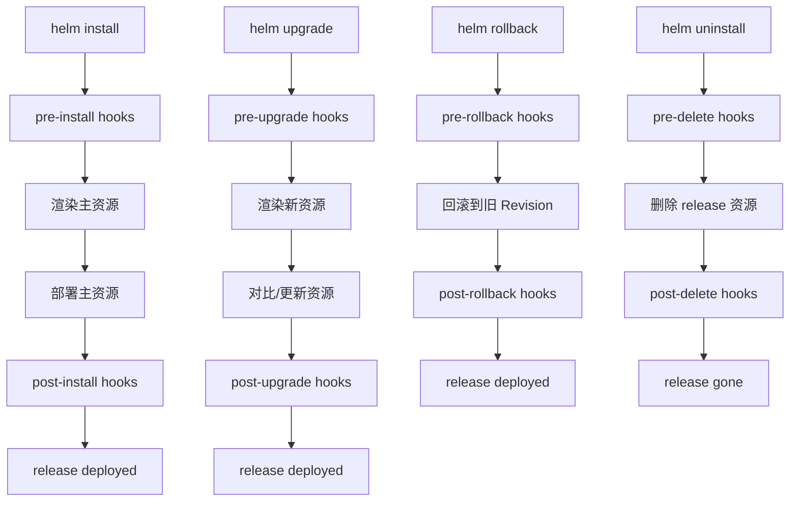

# 07. Hooks 与生命周期

## 7.1 Hook 是什么

**Hook** 是一种特殊注解的资源,让 Helm 在 release 生命周期的特定时间点执行它们。

常见场景:
- 安装前:跑数据库 schema 初始化 Job
- 升级前:执行数据库 migration
- 删除前:备份数据
- 安装后:发通知 / 跑 smoke test

## 7.2 所有可用的 Hook 类型

| Hook 注解 | 触发时机 |
|-----------|----------|
| `pre-install` | `helm install` 渲染后,资源创建前 |
| `post-install` | `helm install` 所有资源 Ready 后 |
| `pre-delete` | `helm delete` 资源删除前(执行 helm uninstall 时) |
| `post-delete` | `helm delete` 资源删除后 |
| `pre-upgrade` | `helm upgrade` 资源更新前 |
| `post-upgrade` | `helm upgrade` 资源更新后 |
| `pre-rollback` | `helm rollback` 前 |
| `post-rollback` | `helm rollback` 后 |
| `test` | `helm test` 显式触发 |

**注意**:
- `install` hook 在 `helm install --dry-run` 和 `helm install --wait` 时也会触发
- `upgrade` hook 在 `helm upgrade` 任何时候都会触发(版本相同也算)
- `test` hook 是 helm test 专用的

## 7.3 第一个 Hook:数据库初始化 Job

```yaml
# templates/job-preinstall.yaml
apiVersion: batch/v1
kind: Job
metadata:
  name: {{ include "myapp.fullname" . }}-init-db
  labels:
    {{- include "myapp.labels" . | nindent 4 }}
  annotations:
    "helm.sh/hook": pre-install,pre-upgrade
    "helm.sh/hook-weight": "-5"     # 见下节
    "helm.sh/hook-delete-policy": before-hook-creation,hook-succeeded
spec:
  template:
    spec:
      restartPolicy: Never
      containers:
        - name: init
          image: "{{ .Values.initImage.repository }}:{{ .Values.initImage.tag }}"
          command: ["/bin/sh", "-c"]
          args:
            - |
              echo "Running migrations..."
              psql -h {{ .Values.postgresql.host }} -U {{ .Values.postgresql.user }} -d {{ .Values.postgresql.database }} -f /migrations/init.sql
          env:
            - name: PGPASSWORD
              valueFrom:
                secretKeyRef:
                  name: {{ include "myapp.fullname" . }}-pg
                  key: password
```

## 7.4 Hook 删除策略

```yaml
annotations:
  "helm.sh/hook-delete-policy": before-hook-creation,hook-succeeded
```

可选值:

| 策略 | 行为 |
|------|------|
| `before-hook-creation` | 同一 hook 资源在新一轮 hook 触发前删除(默认) |
| `hook-succeeded` | hook 成功完成后删除 |
| `hook-failed` | hook 失败时删除 |
| `before-hook-creation,hook-succeeded` | 两者都执行 |

**实战配置**:

```yaml
# Job 通常用:删除老的 + 成功保留
"helm.sh/hook-delete-policy": before-hook-creation,hook-succeeded

# Pod 通常用:成功后立即清理
"helm.sh/hook-delete-policy": hook-succeeded

# CRD 操作:删除老的
"helm.sh/hook-delete-policy": before-hook-creation
```

## 7.5 Hook 权重:控制执行顺序

当一个阶段有多个 hook 时,用 `hook-weight` 控制顺序。**数值越小越先执行**。

```yaml
# pre-install 阶段
# - weight: -10 → 先跑(创建 namespace/secrets)
# - weight: 0   → 再跑(应用配置)
# - weight: 10  → 最后跑(应用启动 Job)
```

```yaml
# templates/00-pre-install-namespace.yaml
apiVersion: v1
kind: Namespace
metadata:
  name: {{ .Values.namespace }}
  annotations:
    "helm.sh/hook": pre-install
    "helm.sh/hook-weight": "-10"
    "helm.sh/hook-delete-policy": before-hook-creation,hook-succeeded
---
# templates/10-pre-install-secrets.yaml
apiVersion: v1
kind: Secret
metadata:
  name: {{ include "myapp.fullname" . }}-bootstrap
  annotations:
    "helm.sh/hook": pre-install
    "helm.sh/hook-weight": "0"
    "helm.sh/hook-delete-policy": before-hook-creation,hook-succeeded
```

## 7.6 实战:数据库 Migration

```yaml
# templates/migration-job.yaml
{{- if .Values.migration.enabled }}
apiVersion: batch/v1
kind: Job
metadata:
  name: {{ include "myapp.fullname" . }}-migrate
  labels:
    {{- include "myapp.labels" . | nindent 4 }}
  annotations:
    "helm.sh/hook": pre-upgrade
    "helm.sh/hook-weight": "0"
    "helm.sh/hook-delete-policy": before-hook-creation,hook-succeeded
spec:
  backoffLimit: 3
  activeDeadlineSeconds: 600
  template:
    spec:
      restartPolicy: Never
      serviceAccountName: {{ include "myapp.serviceAccountName" . }}
      containers:
        - name: migrate
          image: "{{ .Values.image.repository }}:{{ .Values.image.tag | default .Chart.AppVersion }}"
          command: ["./migrate", "up"]
          env:
            {{- range $k, $v := .Values.migration.env }}
            - name: {{ $k }}
              value: {{ $v | quote }}
            {{- end }}
            - name: DB_URL
              valueFrom:
                secretKeyRef:
                  name: {{ include "myapp.fullname" . }}-db
                  key: url
{{- end }}
```

## 7.7 Helm Test 实战

```yaml
# templates/tests/smoke-test.yaml
apiVersion: v1
kind: Pod
metadata:
  name: "{{ include "myapp.fullname" . }}-smoke-test"
  labels:
    {{- include "myapp.labels" . | nindent 4 }}
  annotations:
    "helm.sh/hook": test
    "helm.sh/hook-delete-policy": before-hook-creation,hook-succeeded
spec:
  restartPolicy: Never
  containers:
    - name: smoke
      image: "{{ .Values.testImage.repository }}:{{ .Values.testImage.tag }}"
      command: ["sh", "-c"]
      args:
        - |
          set -e
          echo "Testing connection..."
          curl -fsS http://{{ include "myapp.fullname" . }}:{{ .Values.service.port }}/healthz
          echo "PASS"
```

```bash
helm test my-release
# 等待 pod 退出码 0
```

## 7.8 Hook 失败处理

```bash
# 默认: hook 失败,release 进入 failed 状态
helm install myapp ./mychart

# 跳过 hook 失败的资源
helm install myapp ./mychart --no-hooks

# 强制安装(忽略之前的 failed 状态)
helm install myapp ./mychart --replace
```

## 7.9 Hook 调试

```bash
# 1. 看 hook 资源是否渲染
helm template myrelease ./mychart | grep -A 5 "helm.sh/hook"

# 2. 只跑 install 阶段
helm install myapp ./mychart --debug

# 3. 用 kubectl 看 hook 资源
kubectl get job -l "helm.sh/hook" --all-namespaces
kubectl describe job myapp-init-db

# 4. hook pod 的日志
kubectl logs -f job/myapp-init-db
```

## 7.10 Hook 限制与陷阱

| 陷阱 | 说明 |
|------|------|
| 不能用 `lookup` | hook 渲染时 release 状态特殊,`lookup` 可能返回 nil |
| Secret 在 hook 里可能未创建 | 顺序要安排好 |
| Hook 资源不算 release 状态 | 卸载时除非 `helm uninstall --keep-history`,否则会清理 |
| Job backoffLimit | migration job 一定要设,失败别无限重试 |
| activeDeadlineSeconds | 防止 hook 卡住 release |
| `helm.sh/hook` 多值 | 逗号分隔,**不能**有空格 |
| `helm.sh/hook-delete-policy` 多值 | 逗号分隔,空格会报错 |

## 7.11 完整生命周期图



## 7.12 本章小结

- Hook = 带 `helm.sh/hook` 注解的 K8s 资源
- 9 种 hook 类型,覆盖 install/upgrade/rollback/delete/test
- `hook-weight` 控制同阶段执行顺序(数值小=先执行)
- `hook-delete-policy` 控制 hook 资源何时清理
- 实战场景:数据库 migration、初始化、smoke test、备份
- 注意限制:`lookup` 不可用、Job 一定要设超时
