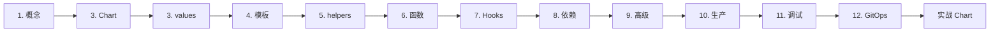

# Helm 专家级教程

> 从零开始,学完直接成为 Helm 专家。本教程以 **原理 → 模板 → 进阶 → 生产** 为主线,所有示例都可在 minikube / kind 集群中跑通。

## 你将学到

- Helm 底层原理与 4 大核心概念
- Chart 目录结构与 Chart.yaml 全字段
- values 设计哲学 + 多环境管理 + schema 校验
- Go template 完整语法与函数/管道
- 命名模板 + `_helpers.tpl` 工程化
- Hooks(数据库迁移、smoke test)
- Chart 依赖(Repository / 本地 / OCI)
- Library Chart、Helm+Kustomize、Flux
- Secret 管理、签名验证、Pod 安全
- 调试排错 + Helm diff / helm unittest
- Helmfile 多 release 编排 + ArgoCD / Flux GitOps
- 完整生产级微服务 Chart 示例

## 目录

### 基础篇

| # | 主题 | 重点 |
|---|------|------|
| [01](./01-核心概念与架构.md) | 核心概念与架构 | Helm 是什么 / 4 大概念 / 内部架构 |
| [02](./02-Chart目录结构与Chart.yaml.md) | Chart 目录结构 | 逐文件详解 / Chart.yaml 全字段 / apiVersion v1 vs v2 |
| [03](./03-values.yaml与多环境配置.md) | values 与多环境 | 5 种覆盖方式 / dev-staging-prod / schema 校验 |

### 模板篇

| # | 主题 | 重点 |
|---|------|------|
| [04](./04-模板语法与控制流.md) | 模板语法与控制流 | `{{ }}` 表达式 / `with` / `range` / 空白控制 / `$` 限定符 |
| [05](./05-命名模板与helpers.tpl.md) | 命名模板与 helpers.tpl | `define` / `include` / `dict` 多参数 |
| [06](./06-函数与管道.md) | 函数与管道 | 100+ 函数 / Sprig / `lookup` / `tpl` / `toYaml` |

### 进阶篇

| # | 主题 | 重点 |
|---|------|------|
| [07](./07-Hooks与生命周期.md) | Hooks 与生命周期 | 9 种 hook / 权重 / 删除策略 / 数据库迁移 |
| [08](./08-Chart依赖管理.md) | Chart 依赖管理 | Repository / 本地 / OCI / condition / tags / alias |
| [09](./09-高级模式.md) | 高级模式 | Library Chart / Helm+Kustomize / Flux / 多租户 |

### 生产篇

| # | 主题 | 重点 |
|---|------|------|
| [10](./10-生产最佳实践与安全.md) | 生产最佳实践与安全 | Secret / 资源限制 / HPA / PDB / 签名 |
| [11](./11-调试与排错.md) | 调试与排错 | lint / template / diff / 8 大错误速查 |
| [12](./12-Helmfile与GitOps集成.md) | Helmfile 与 GitOps | Helmfile / ArgoCD / Flux / CI/CD |

### 实战

| # | 主题 | 说明 |
|---|------|------|
| [完整微服务 Chart](./examples/microservice-chart/) | 真实可运行 | Deployment / Service / Ingress / HPA / PDB / NetworkPolicy / ServiceMonitor / 三环境 values |

## 学习路径



| 阶段 | 文档 | 学完能 |
|------|------|--------|
| 上手 | 01-03 | 5 分钟 release 一个 nginx,理解 helm 渲染机制 |
| 进阶 | 04-06 | 写健壮模板,告别复制粘贴 |
| 高级 | 07-09 | 处理 migration、依赖管理、跨 chart 复用 |
| 生产 | 10-12 | 上生产不踩坑,接入 GitOps |

## 速查表(收藏)

### 命令

```bash
# 仓库
helm repo add bitnami https://charts.bitnami.com/bitnami
helm repo update
helm search repo nginx

# Chart
helm create mychart
helm lint ./mychart --strict
helm package ./mychart
helm show all bitnami/nginx

# 部署
helm install myrel ./mychart -f values.yaml -n myns --create-namespace
helm upgrade myrel ./mychart -f values.yaml --atomic
helm rollback myrel 2
helm history myrel
helm status myrel
helm get values myrel
helm get manifest myrel
helm uninstall myrel --keep-history

# 调试
helm template myrel ./mychart
helm template myrel ./mychart --validate
helm install myrel ./mychart --dry-run --debug
helm diff upgrade myrel ./mychart
```

### 模板必记

```yaml
# 空白控制
{{- ... -}}     # 吃两侧空白

# 引用
{{ .Values.x.y }}
{{ .Chart.AppVersion }}
{{ .Release.Name }}
{{ .Files.Get "config.json" | quote }}

# 控制流
{{- if .Values.x }}
{{- else if ... }}
{{- else }}
{{- end }}

{{- range $k, $v := .Values.list }}
{{- end }}

{{- with .Values.x }}   # 进入上下文
  {{- .y }}              # x.y
  {{- $.Release.Name }}  # 根访问
{{- end }}

# 函数
{{ .Values.x | default "fallback" }}
{{ .Values.x | quote }}
{{ .Values.x | toYaml | nindent 4 }}
{{ required "msg" .Values.x }}
{{ include "mychart.labels" . | nindent 4 }}
{{ include "mychart.foo" (dict "a" 1 "b" 2) }}
{{ tpl .Values.greeting . }}        # 递归模板
{{ lookup "v1" "Secret" "ns" "name" }}  # 读集群(慢)
```

### 命名模板

```yaml
{{- define "mychart.fullname" -}}
{{- if .Values.fullnameOverride -}}
{{- .Values.fullnameOverride | trunc 63 | trimSuffix "-" -}}
{{- else -}}
{{- printf "%s-%s" .Release.Name .Chart.Name | trunc 63 | trimSuffix "-" -}}
{{- end -}}
{{- end -}}

# 调用
{{- include "mychart.fullname" . -}}
```

### Hook

```yaml
metadata:
  annotations:
    "helm.sh/hook": pre-install,pre-upgrade
    "helm.sh/hook-weight": "0"
    "helm.sh/hook-delete-policy": before-hook-creation,hook-succeeded
```

## 必装插件

```bash
helm plugin install https://github.com/databus23/helm-diff          # diff
helm plugin install https://github.com/helm-unittest/helm-unittest   # 单测
helm plugin install https://github.com/jkroepke/helm-secrets         # SOPS 加密
helm plugin install https://github.com/norwoodj/helm-docs            # 自动生成 README
```

## 工具链

| 工具 | 用途 |
|------|------|
| [pluto](https://github.com/FairwindsOps/pluto) | 检测弃用 k8s API |
| [polaris](https://github.com/FairwindsOps/polaris) | best practice 打分 |
| [kubeconform](https://github.com/yannh/kubeconform) | yaml 校验 |
| [helm-diff](https://github.com/databus23/helm-diff) | 渲染对比 |
| [helm-unittest](https://github.com/helm-unittest/helm-unittest) | 模板单测 |
| [helm-secrets](https://github.com/jkroepke/helm-secrets) | SOPS 集成 |
| [helm-docs](https://github.com/norwoodj/helm-docs) | 自动文档 |

## 实战练习清单

完成下面所有项,你就是 Helm 专家:

- [ ] `helm create` 自己的第一个 chart
- [ ] 写 `values.schema.json` 校验配置
- [ ] 用 `_helpers.tpl` 抽离 labels
- [ ] 写一个 `pre-install` Hook 做 schema 初始化
- [ ] 写一个 `pre-upgrade` Hook 做 DB migration
- [ ] 把 chart 推到 OCI 仓库
- [ ] 用 Library Chart 共享标准 labels
- [ ] 用 `helm-secrets` + SOPS 加密 secret
- [ ] CI 集成 `helm lint` + `helm diff` + `helm unittest`
- [ ] 用 Helmfile 编排 5+ release / 3 环境
- [ ] 接入 ArgoCD 或 Flux
- [ ] 处理一次生产事故并写复盘
- [ ] 用 cosign 给 chart 签名

## 进阶阅读

- [官方文档](https://helm.sh/docs/)
- [Artifact Hub](https://artifacthub.io/)
- [CNCF TAG App Delivery](https://github.com/cncf/tag-app-delivery)
- [Go template 语法](https://pkg.go.dev/text/template)
- [Sprig 函数](https://masterminds.github.io/sprig/)
