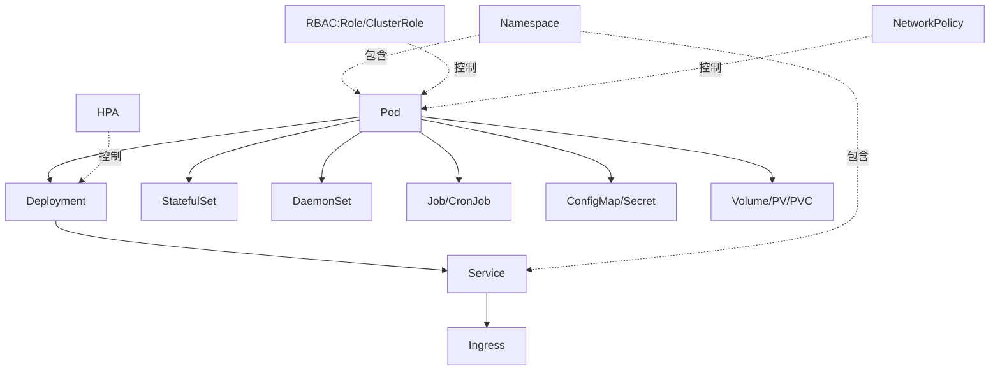

# 01. Kubernetes 核心概念与架构

## 1.1 Kubernetes 是什么

**Kubernetes(K8s)** 是一个**开源的容器编排平台**,用于自动化部署、扩展和管理容器化应用。它源自 Google 内部 15 年生产经验(Borg 系统),2014 年开源,现由 CNCF 托管,是事实上的容器编排标准。

### 解决什么问题

| 阶段 | 工具 | 痛点 |
|------|------|------|
| 物理机时代 | 物理机 + shell 脚本 | 资源浪费、部署慢、环境不一致 |
| 虚拟机时代 | VM + Ansible/Puppet | 启动慢、镜像大、迁移难 |
| 容器时代 | Docker + docker-compose | 单机编排,跨主机不行 |
| **容器编排时代** | **Kubernetes** | **跨主机、自动伸缩、自愈、滚动升级** |

### 一句话定义

> **Kubernetes = 一个声明式容器编排系统,以 API 为中心,让你定义"想要什么",它负责"如何实现"。**

## 1.2 声明式 vs 命令式

K8s 的核心设计哲学是**声明式(Declarative)**:

```bash
# 命令式:告诉它"怎么做"
kubectl run nginx --image=nginx:1.25
kubectl scale deploy nginx --replicas=5
kubectl set image deploy/nginx nginx=nginx:1.26

# 声明式:告诉它"想要什么"(推荐)
cat > nginx.yaml <<EOF
apiVersion: apps/v1
kind: Deployment
metadata: { name: nginx }
spec:
  replicas: 5
  template:
    spec:
      containers:
      - { name: nginx, image: nginx:1.26 }
EOF
kubectl apply -f nginx.yaml
```

**声明式的优势**:
- **幂等性**:`apply` 多次结果一致
- **可审计**:YAML 进 Git,所有变更可追溯
- **可回滚**:`kubectl apply` 旧 YAML 即回滚
- **可对比**:`kubectl diff` 看到具体差异

## 1.3 整体架构

```mermaid
┌────────────────────────────────────────────────────┐
│                 Control Plane (控制面)              │
│                                                     │
│  ┌──────────┐ ┌──────────┐ ┌──────────┐ ┌────────┐ │
│  │ kube-apiserver │ │ scheduler │ │ controller- │ │etcd│ │
│  │   (API 网关)    │  (调度器)  │   manager    │ │KV │ │
│  └──────────┘ └──────────┘ └──────────┘ └────────┘ │
│       ▲                              │              │
└───────┼──────────────────────────────┼──────────────┘
        │                              │ watch/inform
        │ HTTPS                        ▼
┌───────┴────────────────────────────────────────────┐
│              Worker Nodes (数据面)                   │
│                                                     │
│  ┌──────────┐    ┌────────────────────────────┐    │
│  │  kubelet │    │   kube-proxy               │    │
│  │  (代理)  │    │   (网络代理/iptables/IPVS)  │    │
│  └──────────┘    └────────────────────────────┘    │
│       │                                            │
│       ▼                                            │
│  ┌────────┐ ┌────────┐ ┌────────┐                  │
│  │  Pod   │ │  Pod   │ │  Pod   │  ...             │
│  │ ┌────┐ │ │ ┌────┐ │ │ ┌────┐ │                  │
│  │ │ctr │ │ │ │ctr │ │ │ │ctr │ │                  │
│  │ └────┘ │ │ └────┘ │ │ └────┘ │                  │
│  └────────┘ └────────┘ └────────┘                  │
│                                                     │
│  Container Runtime: containerd / CRI-O             │
└─────────────────────────────────────────────────────┘
```

## 1.4 控制面组件(Control Plane)

| 组件 | 作用 | 关键点 |
|------|------|--------|
| **kube-apiserver** | API 网关,所有组件的唯一入口 | 唯一和 etcd 通信的组件;水平扩展;提供 OpenAPI |
| **etcd** | 分布式 KV 存储,集群唯一真实状态源 | 基于 Raft;强一致;必须备份 |
| **kube-scheduler** | 决定 Pod 调度到哪个 Node | 过滤 + 打分;支持自定义 scheduler |
| **controller-manager** | 跑所有内置控制器 | Deployment / StatefulSet / Node / Endpoint... |
| **cloud-controller-manager** | 云厂商集成 | LB / 存储卷 / 节点生命周期 |

### 控制器模式(Controller Pattern)

每个控制器就是一个**调谐循环(Reconcile Loop)**:

```text
观察(desired state) → 对比(实际状态) → 行动(diff)
       ↑                              │
       └──────── 持续 watch ──────────┘
```

```go
// 伪代码:Deployment 控制器
for {
    desired := getDeploymentFromAPI()  // desired
    actual := listPodsByLabel()         // actual
    if len(actual) < desired.Replicas {
        createPod(desired.Template)     // 行动
    } else if len(actual) > desired.Replicas {
        deletePod(actual[0])
    }
    if imageChanged(desired) {
        rollingUpdate(...)
    }
    sleep(1 * time.Second)
}
```

## 1.5 数据面组件(Worker Node)

| 组件 | 作用 |
|------|------|
| **kubelet** | 节点代理,接受 apiserver 指令,调用 CRI 启停容器 |
| **kube-proxy** | 维护节点上的网络规则(iptables/IPVS),实现 Service 转发 |
| **容器运行时(CRI)** | containerd / CRI-O,实际运行容器(containerd 是主流) |
| **CNI 插件** | 跨节点 Pod 网络(flannel/calico/cilium) |

## 1.6 核心对象模型

K8s 一切都是**资源(Resource)**,通过 YAML 描述:



### 对象三大属性

每个 K8s 对象都有:

```yaml
apiVersion: apps/v1              # 1. 属于哪个 API 组
kind: Deployment                 # 2. 什么类型
metadata:                        # 3. 元数据(name/namespace/labels/annotations)
  name: nginx
  namespace: default
  labels: { app: nginx }
spec:                            # 4. 期望状态(Desired State)
  replicas: 3
  template:
    spec: { containers: [...] }
status:                          # 5. 实际状态(由控制器维护,不能手动改)
  replicas: 3
  readyReplicas: 3
```

**控制器的工作就是让 `status` 趋近 `spec`**。

## 1.7 Pod:最小调度单元

**Pod 不是容器,是容器的"逻辑主机"**。一个 Pod 共享:

- **网络命名空间**(同一 IP,localhost 互通)
- **存储卷**
- **生命周期**(一起启停)

```yaml
apiVersion: v1
kind: Pod
metadata: { name: web }
spec:
  containers:
  - name: app
    image: nginx:1.25
    ports: [{ containerPort: 80 }]
  - name: log-sidecar
    image: busybox
    command: ["sh", "-c", "tail -f /var/log/app.log"]
```

通常不会直接创建 Pod,而是用 Deployment/StatefulSet 等**控制器**管理。

## 1.8 集群两种交互模式

### Imperative(命令式)
```bash
kubectl run nginx --image=nginx
kubectl expose deploy nginx --port=80
kubectl scale deploy nginx --replicas=3
```

### Declarative(声明式,生产推荐)
```bash
# 1. 写 YAML
# 2. 提交
kubectl apply -f app/
# 3. 验证
kubectl get -f app/
```

**专家法则**:能用 `apply -f` 就用 `apply -f`,所有 YAML 进 Git。

## 1.9 K8s 的"长板"

| 能力 | 体现 |
|------|------|
| **自动装箱** | 基于资源请求智能调度,提高密度 |
| **自愈** | 容器崩了自动重启,节点挂了自动迁移 |
| **水平扩展** | HPA/VPA/KEDA 多种方式 |
| **服务发现** | 内置 DNS(Service 名字直接访问) |
| **滚动升级** | 零停机部署 + 一键回滚 |
| **密钥管理** | Secret 注入,不落盘 |
| **配置管理** | ConfigMap 热更新 |
| **存储编排** | 任意存储后端即插即用 |
| **批处理** | Job + CronJob 完整支持 |
| **多租户** | Namespace + RBAC + ResourceQuota |

## 1.10 K8s 的"短板"(诚实面对)

| 问题 | 应对 |
|------|------|
| 学习曲线陡 | 25 章教程,理解后再上手 |
| 运维复杂 | 用托管 K8s(EKS/AKS/GKE)或 K8s 发行版 |
| 资源占用 | 控制面至少 3 节点 × 2C4G |
| 网络模型有学习成本 | 用成熟 CNI(calico/cilium) |
| 安全面广 | PodSecurityStandards + 镜像扫描 + RBAC |
| 存储 StatefulSet 仍偏弱 | 用 Operator(Mysql Operator/Redis Operator) |

## 1.11 版本与生态

| 周期 | 说明 |
|------|------|
| 当前稳定 | 1.30 / 1.31(2025 年) |
| 发布节奏 | 每年 3-4 个版本,每个约 14 个月支持期 |
| API 弃用窗口 | 至少 9 个月(参考 [deprecation guide](https://kubernetes.io/docs/reference/using-api/deprecation-guide/)) |

### 主流发行版

| 发行版 | 厂商 | 特点 |
|--------|------|------|
| **Kubernetes(原生)** | CNCF | 上游版本,需自己装 |
| **EKS** | AWS | 托管控制面,集成 AWS |
| **AKS** | Azure | 托管控制面,Azure 集成 |
| **GKE** | GCP | 最成熟托管服务,Autopilot 模式 |
| **ACK** | 阿里云 | 国内首选 |
| **TKE** | 腾讯云 | 国内 |
| **OpenShift** | Red Hat | 企业级,内置 CI/CD |
| **Rancher** | SUSE | 多集群管理 |
| **K3s** | Rancher | 轻量级,边缘场景 |
| **K0s** | Mirantis | 零依赖单二进制 |
| **kubeadm** | CNCF | 官方安装工具,生产推荐 |

## 1.12 专家级理解:K8s = 分布式状态机

把整个集群看成一个分布式状态机:

- **etcd** = 状态存储
- **apiserver** = 状态读写 API
- **每个对象** = 状态的一个字段
- **每个控制器** = 状态转移函数

整个 K8s 生态的扩展点(CRD + Operator)都是**往这个状态机里加新的字段和转移函数**。理解这一点,看任何 Operator 都会豁然开朗(详见 22 章)。

## 1.13 本章小结

- K8s = 声明式容器编排系统,以 API 为中心
- 控制面:apiserver + etcd + scheduler + controller-manager
- 数据面:kubelet + kube-proxy + 容器运行时 + CNI
- 核心对象:Pod / Deployment / Service / ConfigMap ...
- 控制器模式:持续 reconcile 让 status 趋近 spec
- 主流发行版:EKS/AKS/GKE 托管,kubeadm 自建,k3s 边缘
