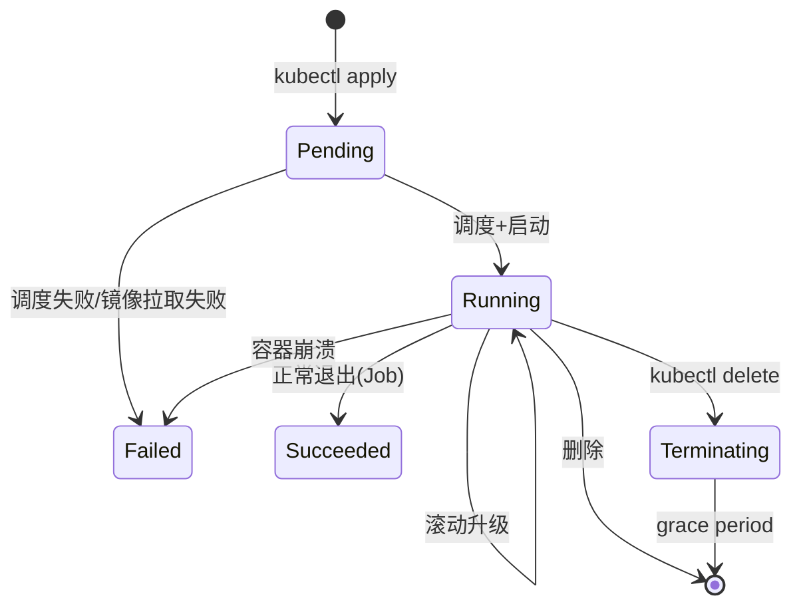

# 03. Pod 深度解析与生命周期

## 3.1 为什么是 Pod 而不是容器

**核心问题**:容器设计上是单进程的,但实际应用常常需要多个进程协作(应用 + 日志采集 + 配置初始化)。

**Pod 的本质**:**共享网络和存储的容器组**,是 K8s 调度的最小单位。

```mermaid
┌─────────────────── Pod ───────────────────┐
│  Network: 10.244.1.5                      │
│  ┌──────────────┐  ┌──────────────────┐  │
│  │   app        │  │   log-sidecar    │  │
│  │   :8080      │  │   (共享 /var/log) │  │
│  └──────────────┘  └──────────────────┘  │
│  Volume: /var/log (emptyDir)             │
└──────────────────────────────────────────┘
       ↑ localhost 互通
```

**Pod 内容器共享**:
- **Network namespace**:同一 IP,同一端口空间,localhost 互通
- **IPC namespace**:可通过 SystemV IPC 或 POSIX 共享内存通信
- **PID namespace**(可选):看到彼此进程
- **Volumes**:共享文件系统
- **UTS**:共享 hostname

## 3.2 Pod 的 5 种状态

| 状态 | 含义 |
|------|------|
| `Pending` | 已接受,但容器还没启动(可能镜像拉取中/调度中) |
| `Running` | 至少一个容器已启动 |
| `Succeeded` | 所有容器都成功退出(0),且不会重启(Job) |
| `Failed` | 至少一个容器退出非 0 |
| `Unknown` | apiserver 无法获取状态(通常是节点失联) |

## 3.3 Pod 完整生命周期



### 详细阶段

1. **调度**:`scheduler` 选择 Node → Pod 进入 `Initializing`
2. **网络初始化**:CNI 分配 IP
3. **Init Containers**:按顺序执行,所有成功才下一步
4. **PostStart Hook**(可选)
5. **容器启动**:并行启动
6. **Readiness/Liveness/Startup Probe** 开始探测
7. **Service 开始转发流量**:`ready=true` 时
8. **运行中**:持续被监控
9. **PreStop Hook** + `SIGTERM` + `terminationGracePeriodSeconds`
10. **强制 `SIGKILL`**:超过宽限期

## 3.4 Init Container

**用途**:主容器启动前,完成初始化(等待依赖、生成配置、迁移)。

```yaml
apiVersion: v1
kind: Pod
metadata: { name: app }
spec:
  initContainers:
  - name: wait-db
    image: busybox
    command: ['sh', '-c', 'until nc -z db 5432; do sleep 2; done']
  - name: init-config
    image: busybox
    command: ['sh', '-c', 'envsubst < /tmp/template > /config/app.conf']
    volumeMounts:
    - name: config
      mountPath: /config
  containers:
  - name: app
    image: myapp:1.0
    volumeMounts:
    - name: config
      mountPath: /etc/app
  volumes:
  - name: config
    emptyDir: {}
```

**特征**:
- 多个 init container **按顺序**执行
- 都成功后才启动主容器
- 失败会重试,直到成功(除非 restartPolicy: Never)
- 有独立的 `image` / `command` / `resources`
- 不能用 `lifecycle` / `livenessProbe` 等

## 3.5 探针(Probe)三剑客

| 探针 | 失败后果 | 用途 |
|------|---------|------|
| **startupProbe** | 容器重启 | 慢启动应用(如 Java) |
| **livenessProbe** | 容器重启 | "我还活着吗?" |
| **readinessProbe** | Pod 摘流 | "我能接活吗?" |

**专家法则**:
- **慢启动**:加 startupProbe(给 60-300s 缓冲)
- **健康检查**:`livenessProbe` 不要过激(否则会被误杀)
- **流量控制**:`readinessProbe` 必须有,否则重启时会有请求失败

### 三种探测方式

```yaml
# 1. httpGet(应用暴露 HTTP 健康端点,推荐)
livenessProbe:
  httpGet:
    path: /healthz
    port: 8080
    httpHeaders:
    - name: X-Custom-Header
      value: Awesome
  initialDelaySeconds: 0
  periodSeconds: 10
  timeoutSeconds: 1
  successThreshold: 1
  failureThreshold: 3

# 2. tcpSocket(端口能连就行,粗粒度)
livenessProbe:
  tcpSocket: { port: 8080 }
  periodSeconds: 10

# 3. exec(脚本退出 0 = 健康)
livenessProbe:
  exec:
    command: ["sh", "-c", "cat /tmp/healthy"]
  initialDelaySeconds: 5
```

### gRPC / HTTP 探针(K8s 1.24+)

```yaml
livenessProbe:
  grpc:
    port: 9090
    service: "my-service"

# readiness 用 httpGet 也可加 headers
readinessProbe:
  httpGet:
    path: /ready
    port: 8080
    httpHeaders:
    - { name: Authorization, value: Bearer xxx }
```

## 3.6 Lifecycle Hook

```yaml
apiVersion: v1
kind: Pod
spec:
  containers:
  - name: app
    image: myapp:1.0
    lifecycle:
      postStart:           # 容器启动后(异步,不保证在 ENTRYPOINT 前完成)
        exec:
          command: ["/bin/sh", "-c", "echo 'started' > /tmp/marker"]
      preStop:             # 容器终止前(同步,执行完才发 SIGTERM)
        exec:
          command: ["/bin/sh", "-c", "sleep 10 && /usr/local/bin/drain.sh"]
```

### 优雅终止完整流程

```text
1. kubectl delete pod
2. apiserver 更新 grace period(默认 30s)
3. endpoint controller 从 Service Endpoints 摘除该 Pod IP
4. kubelet 触发 preStop Hook
5. 容器收到 SIGTERM
6. 进程应在 grace period 内退出
7. 超过 grace period,kubelet 发 SIGKILL
8. 容器真正销毁
```

**PreStop 的核心作用**:给应用时间从 Service 注册中心摘除 + 处理完现有请求。

### Java/Spring Boot 优雅终止示例

```yaml
lifecycle:
  preStop:
    exec:
      command: ["sh", "-c", "sleep 10"]
# 配合 JVM 参数
env:
- name: JAVA_TOOL_OPTIONS
  value: "-XX:+ExitOnOutOfMemoryError -Djava.security.egd=file:/dev/./urandom"
# 配合 Spring Boot 优雅关闭
# application.yml:
# server.shutdown=graceful
# spring.lifecycle.timeout-per-shutdown-phase=20s
```

**注意**:`sleep 10` 让流量有时间从 Service Endpoints 移除(因为 endpoint 更新有 1-2s 延迟)。

## 3.7 RestartPolicy

| 值 | 适用对象 | 行为 |
|----|---------|------|
| `Always` | Deployment/StatefulSet/DaemonSet | 任何退出都重启 |
| `OnFailure` | Job | 非 0 才重启 |
| `Never` | Job/Pod | 不重启 |

**`restartPolicy` 决定 Pod 怎么响应容器失败**,控制器用它决定整个 Deployment 怎么处理。

## 3.8 资源限制(必填)

```yaml
spec:
  containers:
  - name: app
    resources:
      requests:           # 调度依据
        cpu: 100m         # 0.1 核
        memory: 128Mi
      limits:             # 硬上限
        cpu: 500m
        memory: 512Mi
```

| 资源 | request | limit |
|------|---------|-------|
| **作用** | 调度决策 / OOM score | 硬上限(超出被杀) |
| **CPU** | 份额 | 限流(压缩时间片,不杀) |
| **内存** | OOM 优先级 | 超出 OOMKill |

**专家配置**:
- `requests` = **正常运行时长 50-70% 峰值**
- `limits` = 预留 30-50% buffer
- 内存 `requests == limits`(避免 OOM 抖动)
- CPU `limits` 不要设死(用 `requests` 限即可,避免节流)

## 3.9 QoS 等级(服务质量)

K8s 根据 `requests/limits` 自动给 Pod 标 QoS 等级,**决定 OOM 时的被杀顺序**:

| QoS | 条件 | 优先 |
|-----|------|------|
| **Guaranteed** | 所有容器 `requests == limits`(且都设了) | 最后杀 |
| **Burstable** | 部分设置 | 中间 |
| **BestEffort** | 都没设置 | **最先杀** |

**生产铁律**:
- 关键业务 → Guaranteed
- 普通服务 → Burstable
- **永远不要生产用 BestEffort**

## 3.10 SecurityContext

```yaml
apiVersion: v1
kind: Pod
metadata: { name: secure-pod }
spec:
  securityContext:                     # Pod 级
    runAsUser: 1000
    runAsGroup: 1000
    runAsNonRoot: true
    fsGroup: 1000
    seccompProfile:
      type: RuntimeDefault
  containers:
  - name: app
    image: myapp:1.0
    securityContext:                   # Container 级
      allowPrivilegeEscalation: false
      privileged: false
      readOnlyRootFilesystem: true
      capabilities:
        drop: ["ALL"]
        add: ["NET_BIND_SERVICE"]      # 极少数需要
```

**`readOnlyRootFilesystem: true`** 配合 `emptyDir` 写临时文件:

```yaml
volumeMounts:
- { name: tmp, mountPath: /tmp }
- { name: cache, mountPath: /var/cache/myapp }
volumes:
- { name: tmp, emptyDir: {} }
- { name: cache, emptyDir: {} }
```

## 3.11 Pod 中断与驱逐

Pod 可能因为以下原因终止:

| 原因 | 主动 | 怎么应对 |
|------|------|----------|
| 应用崩溃 | ❌ | 控制器重建 |
| 资源不足 | ❌ | 设置 `requests` + 扩容 |
| 节点 NotReady | ❌ | `PodDisruptionBudget`(见下) |
| 滚动升级 | ✅ | `maxSurge` / `maxUnavailable` |
| 节点 drain | ✅ | `PodDisruptionBudget` |
| 抢占 | ✅ | `PriorityClass` |

### PodDisruptionBudget(PDB)

**关键**:`kubectl drain` 时 K8s 会参考 PDB,确保不会同时杀掉太多 Pod。

```yaml
apiVersion: policy/v1
kind: PodDisruptionBudget
metadata: { name: web-pdb }
spec:
  minAvailable: 2        # 或 maxUnavailable: 1
  selector:
    matchLabels:
      app: web
```

**专家法则**:
- 关键服务**必须**有 PDB
- `minAvailable` 用绝对值(如 `minAvailable: 2`)比百分比更稳定
- 不要和 HPA 冲突:`minAvailable` 永远要 ≤ HPA minReplicas

## 3.12 静态 Pod(Static Pod)

K8s 启动时由 kubelet 直接管理的 Pod,**不走 apiserver**:

```bash
# kubelet 启动参数
--pod-manifest-path=/etc/kubernetes/manifests

# 镜像方式
--manifest-url=https://...
```

**用途**:
- 控制面组件(kube-apiserver/etcd/scheduler)以 static pod 形式运行
- 不需要认证,无需 apiserver 在线

**怎么看**:
```bash
# 它们在 apiserver 也能看到(被 mirror)
kubectl get pods -n kube-system
# 但你不能删它们,删了 kubelet 会重建
```

## 3.13 容器设计模式

### 1. Sidecar(边车)

```yaml
# 应用 + 日志采集
containers:
- name: app
  image: myapp
- name: log-shipper
  image: fluentbit
  volumeMounts:
  - { name: log, mountPath: /var/log }
volumes:
- { name: log, emptyDir: {} }
```

### 2. Ambassador(大使)

```yaml
# 应用 + 本地代理(连外部服务的代理)
containers:
- name: app
  image: myapp
- name: ambassador
  image: redis-ambassador  # 把 redis 访问代理到外部
```

### 3. Adapter(适配器)

```yaml
# 应用 + 指标适配(把应用指标转成 Prometheus 格式)
containers:
- name: app
  image: myapp
- name: metrics-adapter
  image: prometheus-exporter
```

### 4. Initializer

前面 Init Container 模式,典型用途:
- 等待 DB 启动
- 拉取配置
- 注册到服务发现
- 跑数据库 migration

## 3.14 Pod Preset(已弃用)与 PodOverhead

```yaml
# K8s 1.18+ 引入,代替 PodPreset
spec:
  overhead:
    pod:
      memory: "100Mi"
      cpu: "200m"
# 调度时会把 overhead 加到 request 里(给 runtime/sidecar 留资源)
```

## 3.15 Pod 调度相关字段概览

| 字段 | 作用 | 详见 |
|------|------|------|
| `nodeName` | 强制调度到指定节点 | - |
| `nodeSelector` | 简单节点选择 | 12 章 |
| `affinity` | 节点/Pod 亲和/反亲和 | 12 章 |
| `tolerations` | 容忍污点 | 12 章 |
| `priorityClassName` | 调度优先级 | 16 章 |
| `topologySpreadConstraints` | 拓扑打散 | 12 章 |
| `schedulerName` | 自定义调度器 | - |

## 3.16 真实故障案例

### 案例 1:readinessProbe 失败导致流量完全中断

```yaml
# 错误:readiness 间隔太短,网络抖动时误判
readinessProbe:
  httpGet: { path: /health, port: 8080 }
  periodSeconds: 1          # 太频繁
  failureThreshold: 1       # 失败 1 次就摘流
# 正确:宽松一点
readinessProbe:
  httpGet: { path: /health, port: 8080 }
  periodSeconds: 5
  failureThreshold: 3
  timeoutSeconds: 2
```

### 案例 2:limit 设错导致 OOMKill

```yaml
# 错误:limit 太小
resources:
  requests: { memory: 256Mi }
  limits: { memory: 256Mi }  # 进程峰值得 512Mi → OOMKill
# 正确:留 buffer
resources:
  requests: { memory: 256Mi }
  limits: { memory: 512Mi }
```

### 案例 3:preStop 缺失导致请求失败

```yaml
# 错误:应用收不到 SIGTERM,直接被 SIGKILL,处理中的请求失败
# 正确:
lifecycle:
  preStop:
    exec:
      command: ["sh", "-c", "sleep 10"]   # 给 endpoint 控制器时间摘流
terminationGracePeriodSeconds: 30
```

## 3.17 专家检查清单

部署一个 Pod 前,确认:

- [ ] `resources.requests` 和 `limits` 都设了
- [ ] 至少一个 `readinessProbe`(推荐 liveness + readiness + startup)
- [ ] `securityContext.runAsNonRoot: true`
- [ ] `readOnlyRootFilesystem: true`(配合 emptyDir)
- [ ] `lifecycle.preStop` 处理优雅终止
- [ ] 推荐标签 `app.kubernetes.io/*` 都打了
- [ ] 镜像用 digest(`@sha256:...`)或具体 tag,不要用 `latest`
- [ ] 没有用 `hostNetwork`(除非真的需要)
- [ ] PDB 已配置(无状态服务)
- [ ] imagePullSecrets 已配置(私有仓库)

## 3.18 本章小结

- Pod = 共享网络/存储的容器组,不是单个容器
- 生命周期:Pending → Running → Succeeded/Failed/Terminating
- Init Container 做前置初始化,按顺序
- 三个探针:startup(慢启动)/ liveness(活着)/ readiness(能接活)
- `lifecycle.preStop` 实现优雅终止,grace period 30s 默认
- `requests/limits` 决定调度和 OOM 顺序;QoS 等级 Guaranteed > Burstable > BestEffort
- `securityContext` 加固容器安全
- PDB 防止 drain 时服务中断
- 容器设计模式:Sidecar / Ambassador / Adapter / Initializer
