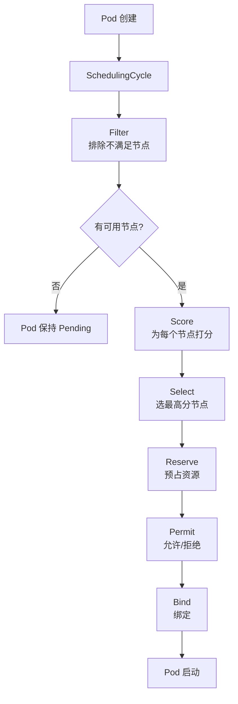
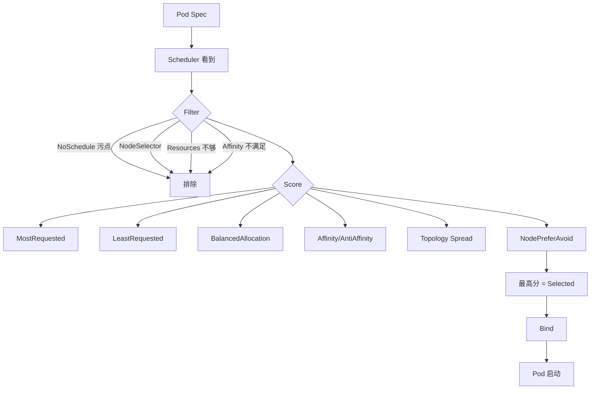

# 12. 调度器与污点容忍

## 12.1 调度器在做什么

**Scheduler** 决定**新创建的 Pod 调度到哪个 Node**。

```text
Pod spec (containers, resources, affinity, tolerations...)
            ↓
       kube-scheduler
            ↓
   ┌──────┴──────┐
   │  过滤(Filtering)  │ ← 排除不满足条件的节点
   │  打分(Scoring)    │ ← 给节点打分
   │  绑定(Binding)   │ ← apiserver 更新 pod.spec.nodeName
   └──────┬──────┘
          ↓
   选最佳节点
```

### 调度流程详解



## 12.2 默认调度流程

### 1. Predicate(过滤)阶段

每个节点跑"能跑吗"检查:
- `NodeUnschedulable`:节点是否禁用调度
- `NodeName`:是否指定了节点
- `NodeSelector`:节点 label 匹配
- `NodeAffinity`:节点亲和性
- `Taint`:污点(无对应 toleration 就排除)
- `PodFitsHost`:hostNetwork/hostPort 匹配
- `PodFitsHostPorts`:端口冲突
- `MatchNodeSelectorRequirements`:综合 label 要求
- `PodFitsResources`:CPU/内存/自定义资源够吗
- `PodTopologySpread`:拓扑打散
- `NodePorts`:NodePort 冲突
- `VolumeRestrictions`:卷限制
- `EBSLimits`(云厂商) / `MaxCSIVolumeCount` / ...

### 2. Priority(打分)阶段

每个通过过滤的节点打分(0-10):
- `LeastRequestedPriority`:CPU/内存用得少的分数高
- `BalancedResourceAllocation`:CPU/内存均衡的高
- `NodePreferAvoidPodsPriority`:避免 pod 多的节点
- `NodeAffinityPriority`:亲和性匹配
- `TaintTolerationPriority`:容忍污点给加分
- `InterPodAffinityPriority`:Pod 亲和性
- `MostRequestedPriority`(默认关):用得多的优先(适合大节点)

### 3. 选最高分节点

分数相同时随机选。

## 12.3 nodeName(强制调度)

```yaml
spec:
  nodeName: node1              # 强制调度到 node1
```

**用途**:调试、特殊 Pod。

**生产**:**不用**——节点挂了 Pod 不会迁移。

## 12.4 nodeSelector(简单节点选择)

```yaml
spec:
  nodeSelector:
    disktype: ssd
    gpu: "true"
```

**用法**:

```bash
# 1. 给节点打 label
kubectl label node node1 disktype=ssd
kubectl label node node2 gpu=true

# 2. Pod 用 selector
# 调度到有这些 label 的节点
```

**限制**:`nodeSelector` 是**硬要求**,必须满足。复杂需求用 affinity。

## 12.5 Affinity(亲和性)——推荐

**nodeSelector 的升级版**,支持:
- `In/NotIn/Exists/DoesNotExist` 操作符
- 软优先(`preferred`)和硬必须(`required`)
- 多种条件组合

### 节点亲和性(nodeAffinity)

```yaml
spec:
  affinity:
    nodeAffinity:
      requiredDuringSchedulingIgnoredDuringExecution:    # 硬必须
        nodeSelectorTerms:
        - matchExpressions:
          - { key: kubernetes.io/os, operator: In, values: [linux] }
          - { key: topology.kubernetes.io/zone, operator: In, values: [us-east-1a, us-east-1b] }
      preferredDuringSchedulingIgnoredDuringExecution:    # 软优先
      - weight: 80
        preference:
          matchExpressions:
          - { key: disktype, operator: In, values: [ssd] }
      - weight: 20
        preference:
          matchExpressions:
          - { key: team, operator: In, values: [payments] }
```

**规则**:
- `required...`:必须满足,否则 Pod 不可调度
- `preferred...`:尽量满足(weight 1-100),不满足也能跑
- 多个 term 之间是 **OR**,term 内多个表达式是 **AND**
- 多个 preference 之间是 **OR**(按 weight 计分)

### 操作符速查

| 操作符 | 含义 |
|--------|------|
| `In` | label 值在列表里 |
| `NotIn` | label 值不在列表里 |
| `Exists` | label 存在(忽略值) |
| `DoesNotExist` | label 不存在 |
| `Gt` | 大于(数值) |
| `Lt` | 小于(数值) |

### Pod 间亲和性(podAffinity / podAntiAffinity)

**关键能力**:基于**已有 Pod** 的位置调度。

```yaml
spec:
  affinity:
    podAffinity:
      requiredDuringSchedulingIgnoredDuringExecution:
      - labelSelector:
          matchLabels:
            app: cache
        topologyKey: kubernetes.io/hostname      # 同节点
        namespaces: [default]                    # 范围
    podAntiAffinity:
      preferredDuringSchedulingIgnoredDuringExecution:
      - weight: 100
        podAffinityTerm:
          labelSelector:
            matchLabels:
              app: web
          topologyKey: kubernetes.io/hostname    # 跨节点
```

**经典场景**:

```yaml
# 1. web 跟 cache 放一起(减少网络)
podAffinity:
  required...:
  - labelSelector: { matchLabels: { app: cache } }
    topologyKey: kubernetes.io/hostname

# 2. web 副本之间不放在同节点(高可用)
podAntiAffinity:
  required...:
  - labelSelector: { matchLabels: { app: web } }
    topologyKey: kubernetes.io/hostname
```

## 12.6 Taint(污点)与 Toleration(容忍)

**反过来的关系**:
- **Taint 打节点**:"我不欢迎这种 Pod"
- **Toleration 写 Pod**:"我能容忍这种污点"

```text
节点打污点 = node.kubernetes.io/unreachable=true:NoExecute
     ↓
Pod 没 toleration → 不会调度到此节点
Pod 有 toleration → 可调度,且污点 NoExecute 时不驱逐
```

### 给节点打污点

```bash
# kubectl taint nodes <name> <key>=<value>:<effect>
kubectl taint nodes node1 dedicated=payment:NoSchedule
kubectl taint nodes node2 dedicated=ml:NoSchedule
kubectl taint nodes node3 gpu=true:NoSchedule
kubectl taint nodes node4 app=old:PreferNoSchedule      # 软拒绝
kubectl taint nodes node5 has-issue=true:NoExecute      # 强制驱逐已有 Pod

# 删
kubectl taint nodes node1 dedicated-
```

### 三种 Effect

| Effect | 调度 | 已有 Pod |
|--------|------|----------|
| `NoSchedule` | 不调度到此节点 | 不影响(已跑的继续跑) |
| `PreferNoSchedule` | 尽量不调度 | 不影响 |
| `NoExecute` | 不调度 | **驱逐**已有 Pod(没 toleration 的) |

### Pod 加 toleration

```yaml
spec:
  tolerations:
  - key: "dedicated"
    operator: "Equal"           # Equal / Exists
    value: "payment"
    effect: "NoSchedule"
  - key: "gpu"
    operator: "Exists"          # Exists 不需要 value
    effect: "NoSchedule"
  - key: "node.kubernetes.io/unreachable"   # 关键!通用 toleration
    operator: "Exists"
    effect: "NoExecute"
    tolerationSeconds: 30        # 30s 后才驱逐(让其他 controller 接管)
```

**关键 toleration**:

```yaml
# 系统污点(自动打)
# node.kubernetes.io/not-ready
# node.kubernetes.io/unreachable
# node.kubernetes.io/out-of-disk
# node.kubernetes.io/memory-pressure
# node.kubernetes.io/disk-pressure
# node.kubernetes.io/pid-pressure
# node.kubernetes.io/network-unavailable
# node.kubernetes.io/unschedulable
# node.cloudprovider.kubernetes.io/uninitialized

# 容忍所有污点(DaemonSet 必备)
tolerations:
- operator: Exists
```

### 实战:GPU 节点专跑 ML 任务

```bash
# 1. 节点打污点
kubectl taint nodes gpu-node1 nvidia.com/gpu=present:NoSchedule
```

```yaml
# 2. ML Pod 容忍
spec:
  tolerations:
  - key: nvidia.com/gpu
    operator: Exists
    effect: NoSchedule
  nodeSelector:
    nvidia.com/gpu: "true"        # 双保险
  containers:
  - name: ml
    resources:
      limits:
        nvidia.com/gpu: 1         # 申请 1 张 GPU
```

## 12.7 Topology Spread Constraints(拓扑打散)

**场景**:把 Pod 均匀分到不同 zone/node/rack。

```yaml
spec:
  topologySpreadConstraints:
  - maxSkew: 1                                  # 最大倾斜度
    topologyKey: topology.kubernetes.io/zone    # 按 zone 分
    whenUnsatisfiable: DoNotSchedule            # 不满足就 pending
    labelSelector:
      matchLabels:
        app: web
    minDomains: 2                               # 最少跨 2 个域
```

**规则**:
- `maxSkew`:任意两个域的 Pod 数差不能超过这个
- `topologyKey`:节点 label(zone/hostname/rack...)
- `whenUnsatisfiable`:
  - `DoNotSchedule`(硬)
  - `ScheduleAnyway`(软,尽量满足)
- `labelSelector`:选 Pod 的标准
- `minDomains`:最少的域数(要求多可用区,但集群只有 1 zone 时也能跑)

**示例**:

```text
# 3 zone (a/b/c),6 个 web Pod
# maxSkew=1
# 分布: a=2, b=2, c=2 ✅

# 加到 7 个 Pod
# 分布: a=3, b=2, c=2 (倾斜 1) ✅
# 不能再多,否则不调度
```

## 12.8 Pod Scheduling Readiness(K8s 1.26+)

**问题**:Pod 创建时立刻调度,但 PVC 还没 ready,挂载失败。

**解决**:延迟调度

```yaml
spec:
  schedulingGates:
  - name: "wait-for-data"
  containers:
  - ...
```

**用法**:运维/Operator 控制调度时机。

## 12.9 Scheduling Framework 扩展点

K8s 1.19+ 引入,可自定义插件:

```text
Pre-filter → Filter → Post-filter → Reserve → Permit → Pre-bind → Bind → Post-bind
```

**常用自定义 scheduler**:
- **Kube-scheduler-simulator**:模拟调度
- **scheduler-plugins**:官方扩展(容量调度、coscheduling 等)
- **DRA**(Dynamic Resource Allocation):GPU 等资源细粒度分配

### Coscheduling(Gang Scheduling)

**场景**:Spark/Flink 任务,所有 executor 一起跑才有意义。

```yaml
apiVersion: scheduling.sigs.k8s.io/v1alpha1
kind: PodGroup
metadata: { name: spark-job }
spec:
  scheduleTimeoutSeconds: 300
  minMember: 5                    # 5 个 Pod 一起调度
```

## 12.10 多调度器

```yaml
# 用非默认调度器
spec:
  schedulerName: custom-scheduler
```

**安装第二个 scheduler**:

```bash
# 部署 kube-scheduler 的二实例,加 --leader-elect=false
# 或用 scheduler-plugins
```

**生产场景**:
- 不同应用用不同调度策略(GPU 调度、批调度)
- 隔离关键业务

## 12.11 调度性能调优

### apiserver 端

```yaml
# 减少 Scheduling 失败重试
--default-not-ready-toleration-seconds=30
--default-unreachable-toleration-seconds=30
```

### 调度器参数

```yaml
# kube-scheduler 启动参数
--leader-elect=true                          # 高可用
--scheduler-name=default-scheduler
--v=4
--feature-gates=...
--config=/etc/kubernetes/scheduler-config.yaml
```

```yaml
# scheduler-config.yaml
apiVersion: kubescheduler.config.k8s.io/v1
kind: KubeSchedulerConfiguration
profiles:
- schedulerName: default-scheduler
  plugins:
    multiPoint:
      enabled:
      - name: DefaultPodTopologySpread
      - name: InterPodAffinity
      disabled:
      - name: NodeResourcesFit    # 关闭,自定义
```

## 12.12 实战:生产级调度策略

### 场景 1:多 zone 部署 Web

```yaml
apiVersion: apps/v1
kind: Deployment
metadata: { name: web }
spec:
  replicas: 9
  template:
    spec:
      affinity:
        podAntiAffinity:                       # 同节点不重复
          requiredDuringSchedulingIgnoredDuringExecution:
          - labelSelector:
              matchLabels: { app: web }
            topologyKey: kubernetes.io/hostname
        nodeAffinity:                          # 多 zone
          requiredDuringSchedulingIgnoredDuringExecution:
            nodeSelectorTerms:
            - matchExpressions:
              - { key: topology.kubernetes.io/zone, operator: In, values: [us-east-1a, us-east-1b, us-east-1c] }
      topologySpreadConstraints:               # 均匀分
      - maxSkew: 1
        topologyKey: topology.kubernetes.io/zone
        whenUnsatisfiable: ScheduleAnyway
        labelSelector:
          matchLabels: { app: web }
```

### 场景 2:核心服务专节点

```bash
# 1. 核心节点打污点
kubectl taint nodes core-node1 dedicated=core:NoSchedule
```

```yaml
# 2. 核心服务容忍 + 优先
spec:
  tolerations:
  - { key: dedicated, operator: Equal, value: core, effect: NoSchedule }
  nodeSelector:
    dedicated: core
  priorityClassName: system-cluster-critical    # 高优先级
```

### 场景 3:ML 任务专 GPU 节点

```yaml
spec:
  nodeSelector:
    nvidia.com/gpu: "true"
  tolerations:
  - { key: nvidia.com/gpu, operator: Exists, effect: NoSchedule }
  containers:
  - name: train
    resources:
      limits:
        nvidia.com/gpu: 1
```

### 场景 4:批处理任务填满低优先级资源

```yaml
apiVersion: scheduling.k8s.io/v1
kind: PriorityClass
metadata: { name: low-priority }
value: -10
globalDefault: false
description: "批处理任务,资源紧张时被驱逐"
```

```yaml
spec:
  priorityClassName: low-priority
  nodeSelector:
    workload: batch
```

## 12.13 调度器监控

```bash
# 看调度器日志
kubectl -n kube-system logs -f kube-scheduler-<master-node>

# 看节点上 Pod 分布
kubectl get pods -A -o jsonpath='{range .items[*]}{.spec.nodeName}{"\n"}{end}' | sort | uniq -c

# 找 Pending Pod
kubectl get pods -A --field-selector=status.phase=Pending
kubectl describe pod <pending-pod>
# Events: 0/N nodes are available: ... Insufficient cpu, ...
```

## 12.14 故障案例

### 案例 1:Pod 一直 Pending

```bash
# 1. 查 describe
kubectl describe pod <pod>
# Events:
#   Warning  FailedScheduling  0/3 nodes are available:
#     1 Insufficient cpu (3)
#     2 node(s) had taint {dedicated: ml}, that the pod didn't tolerate

# 解决:
# 1. 加资源
# 2. 加 toleration
# 3. 加 affinity 选别的节点
```

### 案例 2:Pod 调度不均

```bash
# 现象: node1: 10 pods, node2: 0 pods
# 原因: ResourceFit 算法在节点多资源时倾向 node1

# 解决:
# 1. 用 topologySpreadConstraints
# 2. 用 podAntiAffinity
# 3. 关 MostRequestedPriority(部分场景)
```

### 案例 3:节点 NotReady 后 Pod 一直没迁走

```bash
# 1. 节点 unreachable,默认 5min 标记 NotReady
# 2. 之后 Pod 5min 启动 toleration
# 3. controller-manager 才删 Pod

# 加速:
spec:
  tolerations:
  - key: node.kubernetes.io/unreachable
    operator: Exists
    effect: NoExecute
    tolerationSeconds: 30        # 30s 就驱逐
```

## 12.15 调度器知识图谱



## 12.16 专家清单

- [ ] Pod 设了 `resources.requests`
- [ ] 关键 Pod 设 `priorityClassName`
- [ ] 用 `topologySpreadConstraints` 均匀分布
- [ ] 用 `podAntiAffinity` 避免单点
- [ ] DaemonSet 加通用 toleration
- [ ] 关键服务优先节点(nodeSelector + 节点打 label)
- [ ] 特殊节点打污点(避免普通服务占用)
- [ ] 监控 Pending Pod 数量,及时告警
- [ ] 配 `tolerationSeconds: 30` 加快节点失联处理
- [ ] 大集群调优 scheduler 配置(bind interval, percentageOfNodesToScore)

## 12.17 本章小结

- 调度流程:Filter → Score → Bind
- 调度手段:nodeName(强)/ nodeSelector(简单)/ affinity(复杂)/ taint+toleration(反向)/ topologySpread(打散)
- nodeAffinity 节点亲和,`required` 硬约束,`preferred` 软优先
- podAffinity / podAntiAffinity 副本间关系
- Taint 三种 effect:NoSchedule/PreferNoSchedule/NoExecute
- 污点用于节点专用(GPU/ML),toleration 用于特殊 Pod
- Topology Spread Constraints 强制均匀分布
- 调度器可扩展:Scheduling Framework + custom scheduler
- 故障:查 Events(描述清楚),主要原因是资源、污点、亲和性
