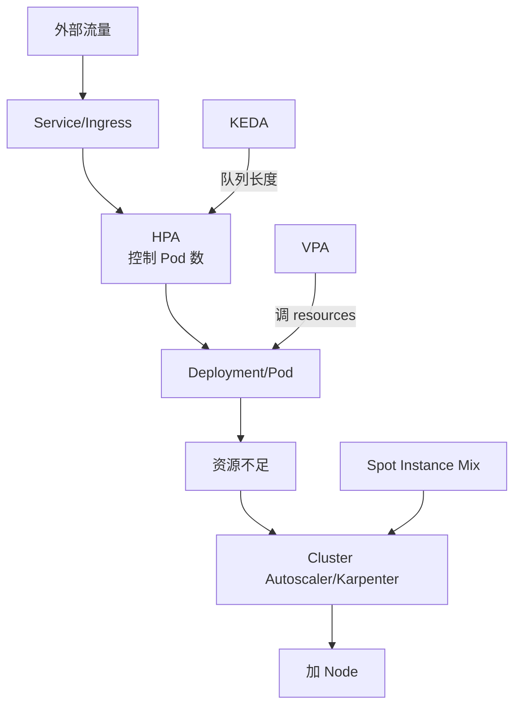

# 13. HPA / VPA 自动扩缩容

## 13.1 扩缩容三大方案

| 方案 | 维度 | 实现 | 适用 |
|------|------|------|------|
| **HPA**(Horizontal Pod Autoscaler) | 水平(增删 Pod) | 改 replicas | 绝大多数场景 |
| **VPA**(Vertical Pod Autoscaler) | 垂直(改 Pod 资源) | 改 requests/limits | 资源难调 |
| **KEDA** | 事件驱动 | 0→N 副本 | 队列/流量突发 |

**K8s 集群层面**:

| 方案 | 说明 |
|------|------|
| **CA**(Cluster Autoscaler) | 节点级扩缩(加/删 Node) |
| **Karpenter** | 下一代,更快更灵活 |
| **vCluster** | 虚拟集群 |

## 13.2 HPA 工作原理

```text
┌─────────┐  metrics  ┌──────────────┐
│ Metrics │ ←──────── │ metrics-server│
│ Server  │           └──────┬───────┘
└────┬────┘                  │
     │                       │
     │ pull                  │
     ▼                       ▼
┌─────────────────────────────────┐
│  HPA Controller (control-loop)  │
│                                   │
│  if current > target:            │
│      scale UP                    │
│  if current < target:            │
│      scale DOWN                  │
└────────────┬────────────────────┘
             │
             ▼
     ┌───────────────┐
     │   Deployment  │  replicas = N+1
     └───────────────┘
```

**默认**:
- 每 15s 同步一次
- 用 metrics-server 或 KEDA / Prometheus Adapter

## 13.3 必备前置:metrics-server

```bash
# minikube
minikube addons enable metrics-server

# kubeadm
kubectl apply -f https://github.com/kubernetes-sigs/metrics-server/releases/latest/download/components.yaml

# 验证
kubectl top nodes
kubectl top pods -A
```

## 13.4 第一个 HPA

```yaml
apiVersion: autoscaling/v2
kind: HorizontalPodAutoscaler
metadata:
  name: web-hpa
spec:
  scaleTargetRef:
    apiVersion: apps/v1
    kind: Deployment
    name: web
  minReplicas: 3
  maxReplicas: 20
  metrics:
  - type: Resource
    resource:
      name: cpu
      target:
        type: Utilization
        averageUtilization: 70
  - type: Resource
    resource:
      name: memory
      target:
        type: AverageValue
        averageValue: 500Mi
```

```bash
# 命令行创建
kubectl autoscale deploy web --min=3 --max=20 --cpu-percent=70

# 查
kubectl get hpa
kubectl describe hpa web
```

### 四种 metric 类型

| Type | 含义 | 用法 |
|------|------|------|
| `Resource`(CPU/内存) | 节点维度 | K8s 内置 |
| `ContainerResource` | 容器维度 | K8s 1.20+ |
| `Object`(任意 K8s 对象) | Ingress, Service 等 | 自定义 |
| `Pods` | 同 namespace 的其他 Pod | 自定义 |
| `External` | 外部指标(Prometheus) | KEDA / Adapter |

## 13.5 HPA 公式

```text
desiredReplicas = ceil[currentReplicas * (currentMetricValue / desiredMetricValue)]
```

**示例**:
```text
currentReplicas = 3
currentMetricValue = 90% CPU
desiredMetricValue = 70%
desiredReplicas = ceil[3 * (90/70)] = ceil[3.86] = 4
```

## 13.6 高级:行为控制

```yaml
spec:
  behavior:
    scaleUp:
      stabilizationWindowSeconds: 0        # 立刻扩
      policies:
      - type: Percent
        value: 100                         # 一次翻倍
        periodSeconds: 30                  # 至少 30s 一次
      - type: Pods
        value: 4                           # 一次加 4 个
        periodSeconds: 30
      selectPolicy: Max                    # 多个 policy 时取最大
    scaleDown:
      stabilizationWindowSeconds: 300      # 5min 稳定才缩(防抖动)
      policies:
      - type: Percent
        value: 10                          # 一次最多缩 10%
        periodSeconds: 60                  # 至少 1min 一次
      - type: Pods
        value: 2
        periodSeconds: 60
      selectPolicy: Min
```

**生产铁律**:
- `scaleDown.stabilizationWindowSeconds`:至少 300s(5 分钟)
- `scaleUp.stabilizationWindowSeconds`:0 或 60
- 防"快速扩容 → 立即缩容 → 又扩"的抖动

## 13.7 高级:基于自定义指标(Prometheus)

### 用 Prometheus Adapter

```bash
helm install prometheus-adapter prometheus-community/prometheus-adapter \
  -n monitoring
```

```yaml
# prometheus-adapter ConfigMap
rules:
- seriesQuery: 'http_requests_total{namespace!="",pod!=""}'
  resources:
    overrides:
      namespace: { resource: namespace }
      pod: { resource: pod }
  name:
    matches: "^(.*)_total"
    as: "${1}_per_second"
  metricsQuery: 'sum(rate(<<.Series>>{<<.LabelMatchers>>}[2m])) by (<<.GroupBy>>)'
```

```yaml
# HPA
apiVersion: autoscaling/v2
kind: HorizontalPodAutoscaler
metadata: { name: web-hpa }
spec:
  scaleTargetRef: { apiVersion: apps/v1, kind: Deployment, name: web }
  minReplicas: 3
  maxReplicas: 20
  metrics:
  - type: Pods
    pods:
      metric:
        name: http_requests_per_second    # Prometheus 指标
      target:
        type: AverageValue
        averageValue: "1000"               # 每 Pod 平均 1000 QPS
```

## 13.8 KEDA(事件驱动扩缩容)

**KEDA** = 基于**外部事件源**的扩缩容(队列深度、消息延迟、流量峰值、cron)。

```bash
helm install keda kedacore/keda --namespace keda --create-namespace
```

### 场景:RabbitMQ 队列长度扩缩容

```yaml
apiVersion: keda.sh/v1alpha1
kind: ScaledObject
metadata: { name: worker-scaler }
spec:
  scaleTargetRef:
    name: worker
  pollingInterval: 10         # 10s 检查一次
  cooldownPeriod: 60          # 队列空 60s 后缩到 0
  minReplicaCount: 0          # 关键!可以从 0 扩
  maxReplicaCount: 50
  triggers:
  - type: rabbitmq
    metadata:
      protocol: amqp
      queueName: tasks
      mode: QueueLength
      value: "100"            # 每 100 条消息扩 1 个 Pod
      host: rabbitmq.default.svc.cluster.local
      username: user
      passwordFromSecret: rabbit-pass
```

### 场景:Kafka 消费 lag

```yaml
triggers:
- type: kafka
  metadata:
    bootstrapServers: kafka.default.svc.cluster.local:9092
    consumerGroup: my-group
    topic: orders
    lagThreshold: "100"
```

### 场景:Cron(定时)

```yaml
triggers:
- type: cron
  metadata:
    timezone: Asia/Shanghai
    start: 0 8 * * *          # 8 点起
    end: 0 20 * * *           # 20 点止
    desiredReplicas: "10"
```

### 场景:Prometheus 查询

```yaml
triggers:
- type: prometheus
  metadata:
    serverAddress: http://prometheus.monitoring:9090
    query: |
      sum(rate(http_requests_total{job="web"}[2m]))
    threshold: "1000"
```

## 13.9 VPA(垂直扩缩)

**VPA** = 自动调整 Pod 的 `resources.requests/limits`。

**三种模式**:

| 模式 | 行为 |
|------|------|
| `Off` | 只推荐,不实际改 |
| `Initial` | Pod 创建时设资源,之后不改 |
| `Auto` | 自动调整(要重启 Pod) |

```bash
helm install vpa autoscaler/vertical-pod-autoscaler --namespace vpa
```

```yaml
apiVersion: autoscaling.k8s.io/v1
kind: VerticalPodAutoscaler
metadata: { name: web-vpa }
spec:
  targetRef:
    apiVersion: apps/v1
    kind: Deployment
    name: web
  updatePolicy:
    updateMode: Auto                  # Auto / Off / Initial
  resourcePolicy:
    containerPolicies:
    - containerName: web
      minAllowed:
        cpu: 100m
        memory: 128Mi
      maxAllowed:
        cpu: 4
        memory: 8Gi
      controlledResources: ["cpu", "memory"]
```

**查看推荐**(`Off` 模式):

```bash
kubectl describe vpa web-vpa
# Recommendation:
#   Container Recommendations:
#     Target:
#       Cpu:     250m
#       Memory:  262144k
#     Lower Bound:
#       Cpu:     25m
#       Memory:  26214k
#     Upper Bound:
#       Cpu:     587m
#       Memory:  700Mi
```

**重要**:
- **VPA 和 HPA 不能同时用同一个 resource**(CPU/内存)
- VPA 会改 `requests`,HPA 看不到真实使用率
- VPA 触发更新 = **Pod 重启**(会停服)
- **生产**:**Off 模式**(只看推荐,人工调整)

## 13.10 Cluster Autoscaler(节点级扩缩)

```bash
# AWS
helm install cluster-autoscaler autoscaler/cluster-autoscaler \
  --namespace kube-system \
  --set autoDiscovery.clusterName=my-eks \
  --set awsRegion=us-east-1

# 阿里云
helm install cluster-autoscaler autoscaler/cluster-autoscaler \
  --set cloudProvider=alicloud
```

```yaml
# CA ConfigMap
data: |
  --nodes=1:10:my-asg          # min:max:ASG
  --scale-down-enabled=true
  --scale-down-utilization-threshold=0.5
  --scale-down-delay-after-add=10m
  --balance-similar-node-groups=true
  --skip-nodes-with-local-storage=false
  --expander=least-waste
```

**原理**:
- 看到 Pod 调度不了(资源不足)→ 触发 ASG 扩容
- 看到节点资源利用率低 → 触发 ASG 缩容

**坑**:
- 缩容慢(默认 10min 冷却)
- 有 local storage / DaemonSet 的节点不能缩
- PDB 阻止缩容

## 13.11 Karpenter(下一代 CA)

**Karpenter** = 比 CA 更快、更灵活、更省钱。

```bash
helm install karpenter karpenter/karpenter \
  --namespace kube-system \
  --set settings.aws.clusterName=my-eks \
  --set serviceAccount.annotations."eks\.amazonaws\.com/role-arn"=arn:aws:iam::xxx
```

```yaml
# NodePool(替代 ASG)
apiVersion: karpenter.sh/v1beta1
kind: NodePool
metadata: { name: default }
spec:
  template:
    spec:
      requirements:
      - key: kubernetes.io/arch
        operator: In
        values: [amd64, arm64]
      - key: karpenter.sh/capacity-type
        operator: In
        values: [spot, on-demand]
      - key: karpenter.k8s.aws/instance-category
        operator: In
        values: [c, m, r]
      - key: karpenter.k8s.aws/instance-generation
        operator: Gt
        values: ["4"]
      nodeClassRef:
        name: default
  limits:
    cpu: "1000"
    memory: 1000Gi
  disruption:
    consolidationPolicy: WhenUnderutilized
    expireAfter: 720h        # 30d 强制换
```

**Karpenter 优势**:
- 5s 内扩容(比 CA 快)
- 直接调用 EC2 API(无需 ASG)
- 智能合并(consolidation)
- 支持 Spot/On-Demand 混合
- 支持 GPU/特殊实例

## 13.12 HPA 实战:完整配置

```yaml
apiVersion: apps/v1
kind: Deployment
metadata: { name: web }
spec:
  replicas: 3
  selector: { matchLabels: { app: web } }
  template:
    metadata: { labels: { app: web } }
    spec:
      containers:
      - name: web
        image: web:1.0
        resources:
          requests: { cpu: 200m, memory: 256Mi }
          limits:   { cpu: 1, memory: 1Gi }      # CPU 限流,内存硬限制
---
apiVersion: policy/v1
kind: PodDisruptionBudget
metadata: { name: web-pdb }
spec:
  minAvailable: 2
  selector: { matchLabels: { app: web } }
---
apiVersion: autoscaling/v2
kind: HorizontalPodAutoscaler
metadata: { name: web-hpa }
spec:
  scaleTargetRef:
    apiVersion: apps/v1
    kind: Deployment
    name: web
  minReplicas: 3
  maxReplicas: 50
  behavior:
    scaleUp:
      stabilizationWindowSeconds: 0
      policies:
      - type: Percent
        value: 100
        periodSeconds: 30
      - type: Pods
        value: 4
        periodSeconds: 30
      selectPolicy: Max
    scaleDown:
      stabilizationWindowSeconds: 300
      policies:
      - type: Percent
        value: 10
        periodSeconds: 60
      selectPolicy: Min
  metrics:
  - type: Resource
    resource:
      name: cpu
      target:
        type: Utilization
        averageUtilization: 70
  - type: Resource
    resource:
      name: memory
      target:
        type: AverageValue
        averageValue: 800Mi
```

## 13.13 扩缩容常见问题

### 1. HPA 不工作

```bash
# 1. 查 events
kubectl describe hpa web-hpa

# 2. 常见错误:
# "missing request for cpu" → 容器没设 resources.requests
# "failed to get cpu utilization" → metrics-server 没装
# "unable to fetch metrics" → metrics-server 异常

# 验证 metrics
kubectl top pod <pod>
```

### 2. HPA 抖动

```text
# 现象:扩容 → 缩容 → 扩容
# 原因:扩/缩窗口太短,流量波动

# 解决:
# 1. scaleDown.stabilizationWindowSeconds ≥ 300
# 2. scaleDown policies 慢一点
# 3. requests 调高(让扩的门槛提高)
# 4. 用 KEDA 基于业务指标(更准)
```

### 3. HPA 扩容后 Pod Pending

```text
# 现象: replicas 改了,但 Pod Pending
# 原因:节点资源不够

# 解决:
# 1. CA 扩容节点
# 2. 减少 resources.requests
# 3. 减少 maxReplicas
# 4. 加 node
```

### 4. 冷启动慢

```text
# 现象:HPA 扩了,但流量来了服务还没 ready
# 解决:
# 1. startupProbe 给足时间
# 2. readinessProbe 早一点
# 3. minReplicas 不要太小(保底容量)
# 4. Pod 预热(Cluster Proportional Autoscaler)
```

## 13.14 容量规划与成本

**生产铁律**:

```text
稳态容量 = 高峰流量 × 1.3 (留 30% buffer)
最大扩缩 = 稳态 × 3 (应对突发)
minReplicas = 至少 2-3 (HA)
```

**省钱技巧**:

1. **非高峰缩容**:`minReplicas: 0`(用 KEDA)
2. **Spot 实例**:用 Karpenter 混部 Spot,便宜 60-90%
3. **HPA + 节点合并**:Karpenter consolidation 自动合并
4. **VPA**:把 request 调准,避免超配

## 13.15 完整扩缩容架构



## 13.16 本章小结

- HPA = 水平扩缩,基于 CPU/内存/自定义指标
- 必备前置:metrics-server
- 行为控制:扩快缩慢,`scaleDown.stabilizationWindowSeconds` ≥ 300s
- 自定义指标:Prometheus Adapter / KEDA
- KEDA = 事件驱动,支持 60+ scaler,可以从 0 扩
- VPA = 垂直扩缩,生产推荐 Off(只推荐,不自动改)
- CA 节点级扩缩,慢但稳
- Karpenter 下一代节点扩缩,快且智能
- 配合:`minReplicas: 2-3` + PDB + readiness + 监控
- 容量规划:稳态 1.3x,突发 3x,Karpenter Spot 混部省钱
