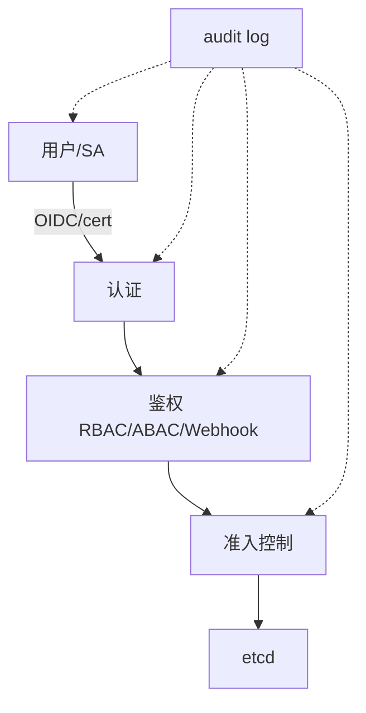

# 14. RBAC 权限管理

## 14.1 为什么需要 RBAC

**核心问题**:谁(Subject)能对什么资源(Resource)做什么操作(Verbs)。

K8s 不只是给开发者用,还有:
- 应用(SA 调用 apiserver)
- CI/CD 流水线
- 监控组件
- 运维人员
- 多租户团队

**没有 RBAC** = `cluster-admin` 给所有人,出事故 = 全责。

## 14.2 RBAC 三大对象

| 对象 | 作用 | 范围 |
|------|------|------|
| **Subject**(主体) | 谁:User / Group / ServiceAccount | - |
| **Role** / **ClusterRole** | 权限集合 | Role=namespace,ClusterRole=集群 |
| **RoleBinding** / **ClusterRoleBinding** | 把 Role 绑给 Subject | 同上 |

```text
User/Group/SA ──Binding──→ Role/ClusterRole
                                  ↓
                          资源 + verbs
                          (pods, get/list)
```

## 14.3 内置对象快速理解

```yaml
# Role: 命名空间内权限
apiVersion: rbac.authorization.k8s.io/v1
kind: Role
metadata:
  namespace: default
  name: pod-reader
rules:
- apiGroups: [""]                       # "" 表示 core API group
  resources: ["pods"]
  verbs: ["get", "watch", "list"]
- apiGroups: [""]
  resources: ["pods/log"]               # 子资源
  verbs: ["get"]
- apiGroups: ["apps"]                   # apps/v1
  resources: ["deployments"]
  verbs: ["get", "list"]
```

**关键概念**:
- `apiGroups`:API 组(`""`=core, `apps`, `batch`, `rbac.authorization.k8s.io`...)
- `resources`:资源类型(`pods`, `deployments`...)
- `resourceNames`(可选):限到具体资源
- `verbs`:操作(`get`, `list`, `watch`, `create`, `update`, `patch`, `delete`, `deletecollection`)
- `subresources**:`:`pods/log`, `pods/exec`, `deployments/scale`...

## 14.4 ServiceAccount(服务账号)

**每个 Pod 都默认关联一个 SA**:`default`(在每个 namespace)。

```bash
# 看 SA
kubectl get sa -A
kubectl get sa default -o yaml

# 关键字段
secrets:
- name: default-token-xxxxx     # 自动生成,挂到 /var/run/secrets/kubernetes.io/serviceaccount
```

### 创建 SA

```bash
kubectl create sa my-app
```

```yaml
apiVersion: v1
kind: ServiceAccount
metadata:
  name: my-app
  namespace: prod
# K8s 1.24+: 默认不自动创建 secret,需要手动 token
imagePullSecrets:               # 拉镜像凭证
- name: my-registry
automountServiceAccountToken: true   # 自动挂 token(默认 true)
```

### Pod 用 SA

```yaml
spec:
  serviceAccountName: my-app
```

**Pod 里能看到的**:
```text
/var/run/secrets/kubernetes.io/serviceaccount/
├── token              # JWT token(给 apiserver 用)
├── ca.crt             # apiserver CA
└── namespace          # 当前 namespace
```

**应用使用**:
```python
# Python
from kubernetes import client, config
config.load_incluster_config()  # 自动读 /var/run/secrets/...
v1 = client.CoreV1Api()
v1.list_namespaced_pod("prod")   # 需 RBAC 允许
```

## 14.5 Role + RoleBinding

```yaml
# Role: 读 prod namespace 的 Pod
apiVersion: rbac.authorization.k8s.io/v1
kind: Role
metadata:
  name: pod-reader
  namespace: prod
rules:
- apiGroups: [""]
  resources: ["pods", "pods/log"]
  verbs: ["get", "list", "watch"]
---
# RoleBinding: 给 user alice
apiVersion: rbac.authorization.k8s.io/v1
kind: RoleBinding
metadata:
  name: read-pods
  namespace: prod
subjects:
- kind: User
  name: alice@example.com
  apiGroup: rbac.authorization.k8s.io
- kind: Group
  name: dev-team
  apiGroup: rbac.authorization.k8s.io
- kind: ServiceAccount
  name: my-app
  namespace: prod
roleRef:
  kind: Role
  name: pod-reader
  apiGroup: rbac.authorization.k8s.io
```

## 14.6 ClusterRole + ClusterRoleBinding

```yaml
# ClusterRole: 读所有 namespace 的 Pod
apiVersion: rbac.authorization.k8s.io/v1
kind: ClusterRole
metadata:
  name: pod-reader-global
rules:
- apiGroups: [""]
  resources: ["pods", "pods/log"]
  verbs: ["get", "list", "watch"]
---
apiVersion: rbac.authorization.k8s.io/v1
kind: ClusterRoleBinding
metadata:
  name: read-pods-global
subjects:
- kind: Group
  name: dev-team
  apiGroup: rbac.authorization.k8s.io
roleRef:
  kind: ClusterRole
  name: pod-reader-global
  apiGroup: rbac.authorization.k8s.io
```

**ClusterRole 的另一用法**:**通过 RoleBinding 跨 namespace 复用**。

```yaml
# ClusterRole(可被多个 RoleBinding 引用)
kind: ClusterRole
metadata: { name: pod-reader }
rules:
- apiGroups: [""]
  resources: ["pods"]
  verbs: ["get", "list", "watch"]
---
# RoleBinding 引用 ClusterRole(限定到 prod namespace)
kind: RoleBinding
metadata: { name: read-pods, namespace: prod }
subjects:
- { kind: User, name: bob, apiGroup: rbac.authorization.k8s.io }
roleRef:
  kind: ClusterRole            # 注意:RoleBinding 也能引用 ClusterRole
  name: pod-reader
  apiGroup: rbac.authorization.k8s.io
```

## 14.7 实战:完整多租户权限设计

### 场景:3 个团队共享一个集群

```yaml
# 1. 3 个 namespace
apiVersion: v1
kind: Namespace
metadata:
  name: team-a
---
apiVersion: v1
kind: Namespace
metadata:
  name: team-b
---
apiVersion: v1
kind: Namespace
metadata:
  name: team-c

# 2. 团队成员(通常对接企业 IdP:LDAP/OIDC)
# Group: team-a-dev, team-a-sre
---
# 3. ClusterRole: 团队内全权
apiVersion: rbac.authorization.k8s.io/v1
kind: ClusterRole
metadata: { name: team-developer }
rules:
- apiGroups: ["", "apps", "batch", "networking.k8s.io"]
  resources: ["*"]
  verbs: ["*"]
- apiGroups: [""]
  resources: ["namespaces"]    # 显式不能创建/删 namespace
  verbs: ["get", "list"]
- apiGroups: ["rbac.authorization.k8s.io"]
  resources: ["*"]            # 团队内 RBAC
  verbs: ["*"]
---
# 4. RoleBinding: 限制到本 namespace
apiVersion: rbac.authorization.k8s.io/v1
kind: RoleBinding
metadata:
  name: team-a-devs
  namespace: team-a
subjects:
- { kind: Group, name: team-a-dev, apiGroup: rbac.authorization.k8s.io }
- { kind: Group, name: team-a-sre, apiGroup: rbac.authorization.k8s.io }
roleRef:
  kind: ClusterRole
  name: team-developer
  apiGroup: rbac.authorization.k8s.io
```

**再为 team-b / team-c 各加 RoleBinding 即可**。

### 场景:CI/CD ServiceAccount

```yaml
# 1. 专用 SA
apiVersion: v1
kind: ServiceAccount
metadata:
  name: ci-deployer
  namespace: ci
---
# 2. 限定权限:只能 deploy 特定 Deployment
apiVersion: rbac.authorization.k8s.io/v1
kind: Role
metadata:
  name: deployer
  namespace: prod
rules:
- apiGroups: ["apps"]
  resources: ["deployments", "replicasets"]
  verbs: ["get", "list", "watch", "update", "patch"]
  resourceNames: ["web", "api"]   # 限到具体资源
- apiGroups: [""]
  resources: ["pods"]
  verbs: ["get", "list", "watch"]
- apiGroups: ["autoscaling"]
  resources: ["horizontalpodautoscalers"]
  verbs: ["get", "update", "patch"]
  resourceNames: ["web-hpa"]
---
# 3. 绑定
apiVersion: rbac.authorization.k8s.io/v1
kind: RoleBinding
metadata:
  name: ci-deployer-binding
  namespace: prod
subjects:
- { kind: ServiceAccount, name: ci-deployer, namespace: ci }
roleRef:
  kind: Role
  name: deployer
  apiGroup: rbac.authorization.k8s.io
```

## 14.8 实战:监控组件 SA

```yaml
# Prometheus Operator SA
apiVersion: v1
kind: ServiceAccount
metadata:
  name: prometheus
  namespace: monitoring
---
# 集群级读权限
apiVersion: rbac.authorization.k8s.io/v1
kind: ClusterRole
metadata: { name: prometheus }
rules:
- apiGroups: [""]
  resources: ["nodes", "nodes/proxy", "nodes/metrics", "services", "endpoints", "pods"]
  verbs: ["get", "list", "watch"]
- apiGroups: ["extensions", "networking.k8s.io"]
  resources: ["ingresses"]
  verbs: ["get", "list", "watch"]
- nonResourceURLs: ["/metrics"]     # 抓 /metrics 端点
  verbs: ["get"]
---
apiVersion: rbac.authorization.k8s.io/v1
kind: ClusterRoleBinding
metadata: { name: prometheus }
subjects:
- { kind: ServiceAccount, name: prometheus, namespace: monitoring }
roleRef:
  kind: ClusterRole
  name: prometheus
  apiGroup: rbac.authorization.k8s.io
```

## 14.9 实战:Pod exec / debug 权限

```yaml
# 给开发者 debug 权限
apiVersion: rbac.authorization.k8s.io/v1
kind: ClusterRole
metadata: { name: developer-debug }
rules:
- apiGroups: [""]
  resources: ["pods", "pods/log", "pods/exec", "pods/portforward", "pods/eviction"]
  verbs: ["get", "list", "watch", "create"]
- apiGroups: [""]
  resources: ["pods/exec", "pods/portforward"]
  verbs: ["get", "create"]
- apiGroups: [""]
  resources: ["events"]
  verbs: ["get", "list", "watch"]
- apiGroups: ["apps"]
  resources: ["deployments", "replicasets", "statefulsets"]
  verbs: ["get", "list", "watch", "rollout"]
```

## 14.10 K8s 1.22+ 新增:Auto-Generate Bound Service Account Token(K8s 1.24+)

**K8s 1.24+**:**默认不创建 SA 的 Secret**(避免泄露)。

```bash
# K8s 1.24+
kubectl create sa my-app
# 不会自动创建 Secret(token)
```

**申请 token(K8s 1.24+ 方式)**:

```yaml
apiVersion: v1
kind: Secret
metadata:
  name: my-app-token
  annotations:
    kubernetes.io/service-account.name: my-app
type: kubernetes.io/service-account-token
```

```bash
kubectl apply -f my-app-token.yaml
# Secret 中会自动填充 token
```

### TokenRequest API(更短生命周期)

```yaml
spec:
  serviceAccountName: my-app
  containers:
  - name: app
    volumeMounts:
    - name: sa-token
      mountPath: /var/run/secrets/tokens
  volumes:
  - name: sa-token
    projected:
      sources:
      - serviceAccountToken:
          path: token
          audience: api
          expirationSeconds: 3600     # 1h 过期
```

**应用使用**:在 1h 内用 token 访问 apiserver,过期后自动从 kubelet 拿到新 token。

**专家推荐**:K8s 1.21+ 用 `BoundServiceAccountTokenVolumeProjection`,**避免永久 token**。

## 14.11 RBAC 排错

### 1. Forbidden 错误

```bash
# 1. 用 auth can-i 检查
kubectl auth can-i get pods
kubectl auth can-i get pods --as=alice -n prod
kubectl auth can-i list secrets --as=system:serviceaccount:default:my-sa

# 2. 看 audit 日志
kubectl get events --field-selector reason=Forbidden
```

### 2. Token 不工作

```bash
# 1. 看 SA
kubectl get sa my-app -o yaml

# 2. 看是否自动 mount
kubectl get pod -o jsonpath='{.spec.automountServiceAccountToken}'
# false → 没 mount

# 3. K8s 1.24+: token 是 ProjectedVolume 形式
# 查 SA token
TOKEN=$(kubectl create token my-app --duration=1h)
curl -k -H "Authorization: Bearer $TOKEN" https://kubernetes.default.svc/api/v1/namespaces
```

### 3. roleRef 不可改

```text
roleRef 一旦创建就**不可变**(改要删了重建)
```

## 14.12 高级:用户/组(K8s 没有 User 对象)

**K8s 不存用户信息**——靠外部认证:

| 方式 | 说明 |
|------|------|
| **X.509 证书** | `kubeconfig` 里 CA 签名证书,CN 是用户,O 是组 |
| **Bearer Token** | ServiceAccount token / OIDC token |
| **OIDC** | 集成企业 IdP(Keycloak, Okta, Auth0) |
| **Webhook** | 外部认证服务 |
| **静态 token** | `--token-auth-file` (不推荐) |

**生产**:**OIDC**(Keycloak / Okta / Azure AD),RBAC 用 Group 绑定。

### 集成 OIDC(Keycloak)

```bash
# kube-apiserver 启动参数
--oidc-issuer-url=https://keycloak.example.com/realms/k8s
--oidc-client-id=kubernetes
--oidc-username-claim=email
--oidc-groups-claim=groups
```

```bash
# 用户登录
kubectl oidc-login setup                     # 配置 kubeconfig
# 浏览器登录 → 拿到 token
kubectl get pods
```

## 14.13 RBAC 安全最佳实践

### 1. 最小权限

```yaml
# ❌ 不好
- apiGroups: ["*"]
  resources: ["*"]
  verbs: ["*"]

# ✅ 限定到具体 resource 和 verb
- apiGroups: [""]
  resources: ["pods"]
  verbs: ["get", "list", "watch"]
```

### 2. 默认 deny

```yaml
# 加 system:masters 之外的 Group 不能做任何事
# 通常依赖 K8s 默认(没有 permission 就是 deny)
```

### 3. 不用 cluster-admin

```yaml
# ❌ 开发者给 cluster-admin
# ✅ 给 team-developer(限定 namespace + 资源)
```

### 4. 启用 audit

```yaml
# kube-apiserver
--audit-log-maxage=30
--audit-log-maxbackup=10
--audit-log-maxsize=100
--audit-log-path=/var/log/kubernetes/audit/audit.log
--audit-policy-file=/etc/kubernetes/audit-policy.yaml
```

```yaml
# audit-policy.yaml
apiVersion: audit.k8s.io/v1
kind: Policy
rules:
- level: Metadata            # 记录 metadata,不要 request/response
  resources:
  - group: ""
    resources: ["secrets", "configmaps"]
- level: RequestResponse
  verbs: ["delete"]          # 所有 delete 操作详细记录
```

### 5. Pod Security Standards

```yaml
# 替代 PodSecurityPolicy(已废弃)
apiVersion: pod-security.admission.enforcement
kind: PodSecurityConfiguration    # v1.25+
metadata: { name: default }
# 不会,这个要 PSS webhook
# 实际通过 namespace label
```

```bash
# 命名空间级别启用 PSS
kubectl label ns prod pod-security.kubernetes.io/enforce=restricted
kubectl label ns dev pod-security.kubernetes.io/warn=baseline
```

### 6. Pod SA 自动绑定(K8s 1.21+)

```yaml
# 默认 SA 自动 mount(可关)
spec:
  automountServiceAccountToken: false
```

## 14.14 工具:Kubernetes RBAC 审计

```bash
# rback-tool
# kubeaudit
brew install kubeaudit
kubeaudit all -f ./manifests

# rbac-tool
go install github.com/alcideio/rbac-tool@latest
rbac-tool who-can get pods
rbac-tool policy-rules -e ServiceAccount -n prod
```

## 14.15 实战:K8s 1.24+ SA Token 完整流程

```yaml
# 1. 创建 SA
apiVersion: v1
kind: ServiceAccount
metadata:
  name: my-app
  namespace: prod
automountServiceAccountToken: true
---
# 2. 短期 token(K8s 1.24+ 推荐)
# 命令行
kubectl create token my-app --duration=1h --namespace=prod
# 给 CI 用
---
# 3. Pod 内自动 mount(K8s 1.21+)
spec:
  serviceAccountName: my-app
  containers:
  - name: app
    volumeMounts:
    - { name: sa-token, mountPath: /var/run/secrets/tokens, readOnly: true }
  volumes:
  - name: sa-token
    projected:
      sources:
      - serviceAccountToken:
          audience: api
          expirationSeconds: 3600
          path: api-token
```

## 14.16 完整权限模型



## 14.17 专家清单

- [ ] 不用 cluster-admin 给开发者
- [ ] 团队权限用 Group 绑定(不是单个 User)
- [ ] 命名空间隔离(team-a / team-b)
- [ ] 默认 deny + 显式 allow
- [ ] SA 配 RBAC 限定资源(不是 `*`)
- [ ] K8s 1.24+ 用 BoundServiceAccountToken(短期)
- [ ] 启用 audit log(记录敏感操作)
- [ ] 启用 PSS(PodSecurityStandards)
- [ ] 不用 `default` SA 给生产应用
- [ ] 定期审计:`kubectl auth can-i --list`
- [ ] 集成 OIDC(企业 IdP)
- [ ] 用工具(rbac-tool, kubeaudit)定期扫描

## 14.18 本章小结

- RBAC 三大对象:Subject / Role(+ClusterRole) / Binding
- Role 限 namespace,ClusterRole 集群级
- ServiceAccount 给 Pod 身份,默认挂 token
- 最小权限 + 显式 allow + 默认 deny
- K8s 1.24+ 默认不创建 SA Secret,需手动 token
- 短期 token(BoundServiceAccountTokenVolumeProjection)优于长期
- 集成企业 IdP 用 OIDC,RBAC 用 Group
- 工具:kubeaudit / rbac-tool 定期审计
- 必开:audit log + PodSecurityStandards
- 实战:CI SA 限定资源(避免拿到集群权限)
