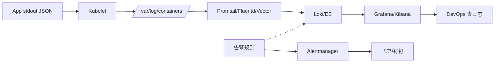

# 18. Loki 日志收集与 EFK

## 18.1 为什么需要集中日志

**没有集中日志**:
- 出问题要 SSH 到每台机器看日志
- 容器被调度到任意节点,日志在节点本地
- 容器重启日志丢失
- 多服务调用关系难追踪

**集中日志解决**:
- 统一存储(Elasticsearch / Loki)
- 统一查询(Kibana / Grafana)
- 容器消失日志不丢
- 多服务关联(trace ID)

## 18.2 K8s 日志基础

### 容器日志路径

```text
/var/log/containers/<pod-name>_<namespace>_<container>-<id>.log
# 软链
/var/log/pods/<pod-uid>/<container>/0.log
```

**stdout / stderr** → containerd 收集 → 写到节点 `/var/log/containers`

**应用日志**:
- **直接 stdout/stderr**(推荐,K8s 友好)
- **写文件**(需要额外 sidecar 收集)

### 推荐:应用写 stdout

```python
# Python(用 logging 而不是 print)
import logging
logging.basicConfig(level=logging.INFO, format='%(asctime)s %(levelname)s %(message)s')
logger = logging.getLogger(__name__)
logger.info("Processing order %s", order_id)
```

**JSON 格式**(便于结构化查询):

```python
import json, logging
class JSONFormatter(logging.Formatter):
    def format(self, record):
        return json.dumps({
            "ts": record.created,
            "level": record.levelname,
            "msg": record.getMessage(),
            "logger": record.name,
        })
```

**Java logback 配置**(JSON):

```xml
<configuration>
  <appender name="STDOUT" class="ch.qos.logback.core.ConsoleAppender">
    <encoder class="ch.qos.logback.classic.encoder.JsonEncoder">
      <timestampPattern>yyyy-MM-dd'T'HH:mm:ss.SSSXXX</timestampPattern>
    </encoder>
  </appender>
  <root level="INFO">
    <appender-ref ref="STDOUT"/>
  </root>
</configuration>
```

## 18.3 EFK 栈(Elasticsearch + Fluentd + Kibana)

**传统日志栈**,功能强但重。

```bash
helm repo add elastic https://helm.elastic.co
helm install elasticsearch elastic/elasticsearch -n logging --create-namespace
helm install kibana elastic/kibana -n logging
helm install fluentd elastic/fluentd -n logging
```

**架构**:
```text
Pod stdout → Fluentd (DaemonSet) → Elasticsearch → Kibana 查询
```

**优点**:
- 全文搜索强
- 聚合分析能力强
- Kibana 仪表盘丰富

**缺点**:
- 资源重(ES 集群 3 节点 × 8C16G+)
- 索引管理复杂
- 运维成本高

## 18.4 Loki + Promtail(轻量级,推荐)

**Loki 哲学**:**只索引元数据,不索引内容**(像 Prometheus 但是日志)。

```text
Pod stdout → Promtail (DaemonSet) → Loki (存储) → Grafana 查询
```

**优势**:
- **极低成本**(只索引 label,不索引内容)
- Grafana 集成(Loki + Prometheus + Tempo 同一 UI)
- 水平扩展(对象存储做后端)
- 标签维度查(类似 Prometheus)

**劣势**:
- 全文搜索弱(只能按 label 过滤)
- 复杂查询能力不如 ES

## 18.5 安装 Loki Stack

```bash
helm repo add grafana https://grafana.github.io/helm-charts
helm install loki grafana/loki-stack \
  --namespace logging --create-namespace \
  --set promtail.enabled=true \
  --set loki.persistence.enabled=true \
  --set loki.persistence.size=50Gi
```

**包含**:
- Loki(服务端)
- Promtail(DaemonSet,采集)
- Grafana 集成

**Loki 单体模式**适合小规模;大规模用 **loki-distributed**(微服务部署)。

## 18.6 Promtail 配置

```yaml
# promtail ConfigMap
apiVersion: v1
kind: ConfigMap
metadata:
  name: promtail-config
  namespace: logging
data:
  promtail.yaml: |
    server:
      http_listen_port: 9080
    positions:
      filename: /tmp/positions.yaml
    clients:
      - url: http://loki:3100/loki/api/v1/push
        batchwait: 1s
        batchsize: 1048576
    scrape_configs:
    - job_name: kubernetes-pods
      kubernetes_sd_configs:
      - role: pod
      relabel_configs:
      - source_labels: [__meta_kubernetes_pod_label_app_kubernetes_io_name]
        target_label: app
      - source_labels: [__meta_kubernetes_namespace]
        target_label: namespace
      - source_labels: [__meta_kubernetes_pod_name]
        target_label: pod
      - source_labels: [__meta_kubernetes_pod_container_name]
        target_label: container
      - source_labels: [__meta_kubernetes_pod_phase]
        target_label: phase
      pipeline_stages:
      # JSON 解析(应用输出 JSON 时)
      - match:
          selector: '{app="web"}'
          stages:
          - json:
              expressions:
              level: level
              msg: msg
              trace_id: trace_id
          - labels:
              level:
              trace_id:
```

## 18.7 Grafana 查询 Loki

```logql
# 所有 namespace=web 的 ERROR
{namespace="web"} |= "ERROR"

# 关键字"failed"
{app="web"} |= "failed"

# JSON 字段过滤
{app="web"} | json | level="error"

# 速率
rate({app="web", level="error"}[5m])

# 解析 + 聚合
sum(rate({app="web", level="error"}[5m])) by (pod)
```

## 18.8 日志架构对比

| 特性 | EFK | Loki |
|------|-----|------|
| 索引 | 全文 | 仅 label |
| 存储成本 | 高 | 低 5-10x |
| 全文搜索 | ✅ 强 | ⚠️ 弱(`|=` 子串) |
| 聚合分析 | ✅ 强 | ⚠️ 一般 |
| 资源消耗 | 高(ES 3 节点+) | 低(单节点可起) |
| 部署复杂度 | 高 | 低 |
| 适用 | 全文搜索、合规审计 | 简单聚合、metric-like 查询 |

**生产选择**:
- **轻量首选**:Loki(配 Grafana)
- **强搜索/合规**:EFK
- **超大规模**:Loki + S3 存储 / Elastic + ES Operator

## 18.9 高级:多租户 + 长存储

### Loki 多租户

```yaml
# Loki 启动参数
--auth.enabled=true
--tenant-id=fake  # 开发用
```

生产用 **OIDC / mTLS / API key** 鉴权。

### 长存储(S3/MinIO)

```yaml
# values.yaml
loki:
  storage:
    type: s3
    s3:
      endpoint: minio.logging.svc:9000
      accessKey: xxx
      secretKey: xxx
      bucketnames: loki
      region: us-east-1
      s3forcepathstyle: true
```

## 18.10 应用日志最佳实践

### 1. 结构化日志(JSON)

```json
{
  "ts": "2024-01-15T10:00:00.000Z",
  "level": "info",
  "msg": "Order processed",
  "order_id": "ord-123",
  "user_id": "u-456",
  "duration_ms": 23,
  "trace_id": "abc-def-ghi"
}
```

**好处**:
- Loki 用 `| json` 解析
- 字段可以当 label 索引
- 聚合/统计方便

### 2. 必带字段

```text
ts           时间戳
level        级别
msg          消息
service      服务名
env          环境
trace_id     分布式追踪 ID
span_id      子调用 ID
user_id      用户 ID(可选)
```

### 3. 不要日志里写

```text
- 密码 / token
- 完整信用卡号
- 身份证号
- 用户手机号
- PII(个人身份信息)
```

**脱敏**:用 log filter 在 stdout 前处理。

### 4. 控制日志量

```python
# 限制速率
logging.getLogger("urllib3").setLevel(logging.WARNING)
logging.getLogger("kafka").setLevel(logging.WARNING)
```

```yaml
# K8s 限制容器日志大小
spec:
  containers:
  - name: app
    resources:
      limits:
        ephemeral-storage: 1Gi
```

## 18.11 真实故障案例

### 案例 1:磁盘爆

```text
# 原因:日志没限制
/var/log/containers/ 持续写,占满磁盘

# 解决:
# 1. 容器 ephemeral-storage limit
# 2. 节点日志轮转(部署 logrotate)
# 3. 集中收集后清节点日志
```

### 案例 2:日志丢

```text
# 原因:容器输出太快,kubelet 跟不上
# 容器写 100MB/s,kubelet 默认慢

# 解决:
# 1. 应用限制日志输出
# 2. 调 kubelet 参数(--container-log-max-files, --container-log-max-size)
# 3. 用 stdout 限流
```

### 案例 3:日志格式混乱

```text
# 原因:不同服务格式不同
# 一会儿 print,一会儿 logging,有的 JSON,有的纯文本

# 解决:
# 1. 统一日志库 + 格式(JSON)
# 2. 强制使用 structlog / logback JSON / logrus
# 3. Loki pipeline 解析
```

## 18.12 高级:Vector(替代 Fluentd/Promtail)

**Vector** = 高性能日志收集器(Rust 写)。

```yaml
# vector.yaml
sources:
  kubernetes_logs:
    type: kubernetes_logs

transforms:
  parse_json:
    type: remap
    inputs: [kubernetes_logs]
    source: |
      . = parse_json!(.message) ?? {}

sinks:
  loki:
    type: loki
    inputs: [parse_json]
    endpoint: http://loki:3100
    labels:
      app: '{{`{{ kubernetes.pod_labels.app }}`}}'
      namespace: '{{`{{ kubernetes.pod_namespace }}`}}'
```

**优势**:
- 比 Fluentd 快 5-10x
- 资源占用更低
- 统一 metrics/logs/traces 处理

## 18.13 集中式日志的工程化



## 18.14 三大可观测性整合(Grafana 全家桶)

```bash
# 一键装 Grafana 全家桶
helm install k8s-mon prometheus-community/kube-prometheus-stack -n monitoring
helm install loki grafana/loki-stack -n monitoring
helm install tempo grafana/tempo -n monitoring
```

**Grafana 集成**:
- Prometheus → Metrics
- Loki → Logs
- Tempo → Traces

**Trace 跳转 Log 跳转 Metric**:
```text
Grafana
  Tempo trace 详情
    → 看 span 详情
      → 跳到 Loki 看这个 span 的日志
        → 跳到 Prometheus 看这个 span 的指标
```

## 18.15 日志架构选型决策

```text
你的场景是什么?
├─ 简单查询 + 低成本
│   └─ Loki + Promtail
├─ 全文搜索 + 强聚合
│   └─ EFK
├─ 超大规模
│   ├─ Loki + S3 + 微服务模式
│   └─ Elastic + ES Operator
├─ 多语言/多云
│   └─ Vector + Loki/ES
└─ 已有 ELK
    └─ 沿用
```

## 18.16 专家清单

- [ ] 应用日志输出 stdout(不写文件)
- [ ] 日志用 JSON 格式
- [ ] 必带 trace_id(关联 trace)
- [ ] Promtail/Fluentd 装好
- [ ] 配日志保留策略
- [ ] 配日志告警(关键错误)
- [ ] 敏感信息脱敏
- [ ] 容器 ephemeral-storage limit
- [ ] 节点日志轮转
- [ ] Grafana 配置 Loki datasource
- [ ] 定期 review 日志量
- [ ] 告警:"ERROR 日志 > X 条/分钟"

## 18.17 本章小结

- 应用日志写 stdout(JSON 格式),K8s 自动收
- EFK:功能强,资源重,全文搜索好
- Loki:轻量,成本低,Grafana 集成好
- Promtail / Fluentd / Vector 选一个
- 结构化日志(JSON)+ trace_id 关联
- 集中存储 + 告警 + 保留策略
- 配 ephemeral-storage limit 防止节点爆
- 集成 Tempo(trace) + Prometheus(metric) = 全家桶
- 选型:Loki 主流,EFK 重搜索场景
