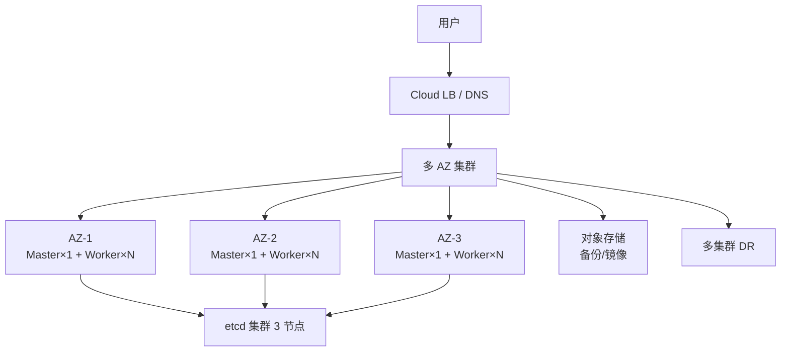

# 20. 集群高可用与备份恢复

## 20.1 高可用架构全景



**生产级 HA 三层**:
1. **节点 HA**:3 节点 Master(etcd)
2. **跨 AZ HA**:Pod 跨可用区
3. **跨区域 HA**:多集群(DR)

## 20.2 控制面 HA

### etcd 集群

```text
3 节点(投票) - 容忍 1 节点挂
5 节点(投票) - 容忍 2 节点挂
奇数节点(Raft 要求)
```

**生产建议**:
- 3 节点起(每节点独立 AZ)
- 5 节点(更大集群)
- **不要 2 节点**(分裂脑)
- **不要 4 节点**(同 3 节点效果,浪费)

### Master 节点

```text
3 个 Master 节点,各跑:
- kube-apiserver (静态 Pod)
- kube-scheduler (Deployment)
- kube-controller-manager (Deployment,单实例 + leader election)
- etcd(同节点或独立)
```

**Cloud LB 指向 3 个 apiserver 节点**:
```text
LB (TCP 6443)
  ├─ master-1:6443
  ├─ master-2:6443
  └─ master-3:6443
```

## 20.3 工作节点 HA

### 副本 + 拓扑打散

```yaml
apiVersion: apps/v1
kind: Deployment
metadata: { name: web }
spec:
  replicas: 6                  # 至少 2 副本每 AZ(3 AZ)
  template:
    spec:
      topologySpreadConstraints:
      - maxSkew: 1
        topologyKey: topology.kubernetes.io/zone
        whenUnsatisfiable: DoNotSchedule
        labelSelector: { matchLabels: { app: web } }
      affinity:
        podAntiAffinity:
          requiredDuringSchedulingIgnoredDuringExecution:
          - labelSelector: { matchLabels: { app: web } }
            topologyKey: kubernetes.io/hostname
      containers:
      - { name: web, image: web:1.0 }
```

**目的**:
- 6 副本(2/AZ × 3 AZ)
- 同一节点不重复(避免单点)
- 同一 AZ 不超过 2 副本
- **1 个 AZ 挂了,还有 4 副本**(66% 容量)

### PodDisruptionBudget

```yaml
apiVersion: policy/v1
kind: PodDisruptionBudget
metadata: { name: web-pdb }
spec:
  minAvailable: 4              # 永远至少 4 副本
  selector: { matchLabels: { app: web } }
```

**配合**:`kubectl drain` 时 K8s 会参考 PDB,不会同时杀超过 2 个 Pod。

## 20.4 etcd 备份与恢复(基础)

### 1. 手动备份

```bash
# 备份命令
ETCDCTL_API=3 etcdctl \
  --endpoints=https://127.0.0.1:2379 \
  --cacert=/etc/kubernetes/pki/etcd/ca.crt \
  --cert=/etc/kubernetes/pki/etcd/server.crt \
  --key=/etc/kubernetes/pki/etcd/server.key \
  snapshot save /backup/etcd-$(date +%Y%m%d-%H%M%S).db

# 看快照
etcdctl snapshot status /backup/etcd-20240115.db
```

### 2. 定时备份(自动化)

```yaml
apiVersion: batch/v1
kind: CronJob
metadata:
  name: etcd-backup
  namespace: kube-system
spec:
  schedule: "0 2 * * *"           # 每天 2 点
  concurrencyPolicy: Forbid
  successfulJobsHistoryLimit: 3
  failedJobsHistoryLimit: 1
  jobTemplate:
    spec:
      template:
        spec:
          hostNetwork: true
          nodeSelector:
            node-role.kubernetes.io/control-plane: ""
          restartPolicy: OnFailure
          containers:
          - name: etcd-backup
            image: k8s.gcr.io/etcd:3.5.10
            command:
            - sh
            - -c
            - |
              set -ex
              BACKUP_DIR="/backup/etcd-$(date +%Y%m%d-%H%M%S)"
              mkdir -p $BACKUP_DIR
              ETCDCTL_API=3 etcdctl \
                --endpoints=https://127.0.0.1:2379 \
                --cacert=/etc/kubernetes/pki/etcd/ca.crt \
                --cert=/etc/kubernetes/pki/etcd/server.crt \
                --key=/etc/kubernetes/pki/etcd/server.key \
                snapshot save $BACKUP_DIR/snap.db
              # 上传到 S3
              aws s3 cp $BACKUP_DIR/snap.db s3://my-k8s-backups/etcd/
            env:
            - name: AWS_ACCESS_KEY_ID
              valueFrom: { secretKeyRef: { name: aws-cred, key: access-key } }
            - name: AWS_SECRET_ACCESS_KEY
              valueFrom: { secretKeyRef: { name: aws-cred, key: secret-key } }
            volumeMounts:
            - name: etcd-certs
              mountPath: /etc/kubernetes/pki/etcd
              readOnly: true
            - name: backup
              mountPath: /backup
          volumes:
          - name: etcd-certs
            hostPath: { path: /etc/kubernetes/pki/etcd }
          - name: backup
            hostPath: { path: /var/lib/etcd-backup }
```

### 3. etcd 恢复(危险操作!)

```bash
# 1. 停所有 apiserver(避免数据竞争)
# 在每个 master:
systemctl stop kubelet
# 或(master 是静态 Pod,直接 mv manifest)
mv /etc/kubernetes/manifests/kube-apiserver.yaml /tmp/

# 2. 恢复快照
ETCDCTL_API=3 etcdctl snapshot restore /backup/snap.db \
  --data-dir=/var/lib/etcd-restore \
  --name=master-1 \
  --initial-cluster=master-1=https://10.0.0.1:2380,master-2=https://10.0.0.2:2380,master-3=https://10.0.0.3:2380 \
  --initial-advertise-peer-urls=https://10.0.0.1:2380

# 3. 替换 etcd 数据
mv /var/lib/etcd /var/lib/etcd.bak
mv /var/lib/etcd-restore /var/lib/etcd

# 4. 改 etcd manifest 的 data-dir,重启 etcd Pod
# 5. 启动 apiserver
mv /tmp/kube-apiserver.yaml /etc/kubernetes/manifests/
systemctl start kubelet
```

**⚠️ 风险**:恢复会覆盖当前所有数据!**先全量备份再操作**。

### 4. 用 etcd-manager / etcd-backup operator

```bash
# etcd-backup operator(自动备份)
helm install etcd-backup etcd-backup/etcd-backup -n kube-system
```

## 20.5 Velero(全集群备份与恢复)

**Velero** = K8s 资源 + PV 数据备份与恢复。

### 安装

```bash
helm repo add vmware-tanzu https://vmware-tanzu.github.io/helm-charts
helm install velero vmware-tanzu/velero \
  --namespace velero --create-namespace \
  --set credentials.existingSecret=velero-credentials \
  --set configuration.backupStorageLocation[0].name=default \
  --set configuration.backupStorageLocation[0].provider=aws \
  --set configuration.backupStorageLocation[0].bucket=my-k8s-backups \
  --set configuration.backupStorageLocation[0].config.region=us-east-1 \
  --set configuration.volumeSnapshotLocation[0].name=default \
  --set configuration.volumeSnapshotLocation[0].provider=aws \
  --set deployRestic=true                    # 备份 PV 数据
```

### 备份

```bash
# 1. 备份整个集群
velero backup create full-20240115 \
  --include-namespaces '*' \
  --default-volumes-to-restic

# 2. 备份特定 namespace
velero backup create prod-20240115 \
  --include-namespaces prod \
  --default-volumes-to-restic

# 3. 备份特定 label
velero backup create web-20240115 \
  --selector app=web \
  --default-volumes-to-restic

# 4. 定时备份
velero schedule create daily-backup \
  --schedule="0 2 * * *" \
  --include-namespaces prod \
  --ttl 720h
```

### 恢复

```bash
# 1. 完整恢复
velero restore create --from-backup full-20240115

# 2. 改 namespace 恢复
velero restore create --from-backup prod-20240115 \
  --namespace-mappings prod:prod-restored

# 3. 部分恢复(选资源)
velero restore create --from-backup full-20240115 \
  --include-resources pods,services
```

### 迁移集群

```bash
# 1. 老集群备份
velero backup create cluster-migration

# 2. 备份传到新集群能访问的存储

# 3. 新集群装 Velero(同配置)

# 4. 恢复
velero restore create --from-backup cluster-migration
```

### 备份验证

```bash
# 备份状态
velero backup get
velero backup describe full-20240115 --details

# 验证恢复(在 test namespace)
velero restore create test-restore \
  --from-backup full-20240115 \
  --include-namespaces web
```

## 20.6 实战:Velero + S3 全量备份

```bash
# 1. 创建 S3 凭证
cat > credentials-velero <<EOF
[default]
aws_access_key_id = xxx
aws_secret_access_key = xxx
EOF
kubectl create secret generic velero-credentials \
  -n velero --from-file=credentials-velero

# 2. 安装 Velero
helm install velero vmware-tanzu/velero \
  --namespace velero --create-namespace \
  --set credentials.existingSecret=velero-credentials \
  --set configuration.backupStorageLocation[0].name=default \
  --set configuration.backupStorageLocation[0].provider=aws \
  --set configuration.backupStorageLocation[0].bucket=k8s-prod-backup \
  --set configuration.backupStorageLocation[0].config.region=us-east-1 \
  --set deployRestic=true

# 3. 备份
velero backup create full-$(date +%Y%m%d) \
  --default-volumes-to-restic
```

## 20.7 多集群灾备(DR)

### 模式 1:Active-Passive(主备)

```text
Primary cluster ──(Velero)──> S3 ──(restore)──> DR cluster (冷)
                                                  ↓
                                            故障时手动切
```

### 模式 2:Active-Active(双活)

```text
Cluster-A (us-east)  ──replicate──> Cluster-B (us-west)
              ↓                            ↓
              └──── Global LB ────────────┘
                  (Route53 / GSLB)
```

**工具**:
- **Submariner**(跨集群 Pod 通信)
- **Cilium ClusterMesh**(跨集群 Pod + Policy)
- **Istio Multi-Cluster**(Service Mesh)
- **Cluster API**(集群生命周期)
- **Velero Mirror**(异步备份)

### 模式 3:备份恢复(最简)

```text
生产集群 ──(定时 Velero)──> S3
                          ↓ 故障时
                  全新集群 ──(restore)──> 服务恢复
```

**RTO** = 几小时
**RPO** = 24 小时(看备份频率)

## 20.8 升级策略

### 升级前

```text
1. 看 release notes
2. 检查 API 弃用
   pluto detect
3. 测试环境先升
4. 备份 etcd + Velero
5. 看 CVE 公告
```

### 控制面升级

```bash
# kubeadm 升级
kubeadm upgrade plan
kubeadm upgrade apply v1.30.0
systemctl restart kubelet
```

### 节点升级(滚动)

```bash
# 1. 排水
kubectl drain node1 --ignore-daemonsets --delete-emptydir-data

# 2. 升级 kubeadm / kubelet
yum upgrade -y kubeadm kubelet

# 3. 升级节点
kubeadm upgrade node

# 4. 重启 kubelet
systemctl restart kubelet

# 5. 取消 cordon
kubectl uncordon node1
```

**用 Cluster API 自动化**(生产推荐)。

## 20.9 容量规划与扩容

### 监控容量

```bash
# 节点资源
kubectl describe nodes | grep -E "Allocated|Allocatable"

# Prometheus 指标
# node_cpu_utilization = 1 - avg(rate(node_cpu_seconds_total{mode="idle"}[5m]))
# node_memory_utilization = 1 - node_memory_MemAvailable_bytes / node_memory_MemTotal_bytes

# 容量预警
# - CPU > 70% 持续 1h → 触发扩容
# - 内存 > 80% 持续 30min → 触发扩容
```

### 自动扩(CA / Karpenter)

详见 13 章。

## 20.10 故障场景应对

### 场景 1:节点挂了

```text
# 现象: 1 个 worker 节点 NotReady
# 应对:
# 1. K8s 自动迁移 Pod(超过 tolerationSeconds 后)
# 2. 看 Pod 是否能调度到其他节点
# 3. 看是否资源紧张
# 4. 修节点 / 加节点
```

### 场景 2:apiserver 短暂不可用

```text
# 现象: 30s 内 kubectl 无响应
# 应对:
# 1. 客户端自动重试
# 2. apiserver 自动恢复(其他节点接管)
# 3. 流量端通常无感知(已有连接)
```

### 场景 3:etcd 1 节点挂

```text
# 现象: etcd 集群 2/3 健康
# 应对:
# 1. 集群继续工作
# 2. 修复挂的 etcd
# 3. 补节点
```

### 场景 4:数据误删

```bash
# 立即用 Velero 恢复
velero restore create --from-backup before-accident

# 或单 namespace 恢复
velero restore create --from-backup before-accident \
  --include-namespaces prod
```

### 场景 5:全集群灾难

```bash
# 1. 在新区域起新集群
# 2. 装 Velero
# 3. 恢复最近备份
# 4. 验证
# 5. 切 DNS
```

## 20.11 多集群管理

### Cluster API(集群生命周期)

```bash
# 集群即 K8s 资源(CRD)
# 声明式管理集群生命周期
kubectl apply -f my-cluster.yaml
```

```yaml
apiVersion: cluster.x-k8s.io/v1beta1
kind: Cluster
metadata: { name: prod-cluster }
spec:
  clusterNetwork:
    pods: { cidrBlocks: [10.244.0.0/16] }
    serviceDomain: cluster.local
  infrastructureRef:
    apiVersion: infrastructure.cluster.x-k8s.io/v1beta1
    kind: AWSManagedCluster
    name: prod-cluster
  controlPlaneRef:
    apiVersion: controlplane.cluster.x-k8s.io/v1beta1
    kind: KubeadmControlPlane
    name: prod-cluster
```

### Rancher / Cluster Manager

- 集中管理多集群
- 统一 RBAC
- 应用商店

## 20.12 备份策略矩阵

| 资源 | 频率 | 工具 | 保留 |
|------|------|------|------|
| **etcd** | 每日 | etcdctl / etcd-backup | 7-30 天 |
| **K8s 资源** | 每日 | Velero | 7-30 天 |
| **PV 数据** | 每日 | Velero + Restic | 7-30 天 |
| **配置(Git)** | 实时 | Git 本身 | 永久 |
| **应用 DB** | 每日 | mysqldump / pg_dump + 对象存储 | 30-90 天 |
| **日志** | 实时 | Loki/S3 | 30-90 天 |
| **镜像** | 实时 | Registry 本身 | 永久 |

## 20.13 实战:RTO / RPO 定义

| 业务 | RPO(数据丢失) | RTO(恢复时间) |
|------|----------------|----------------|
| 核心支付 | 0(主主) | 5min |
| 普通业务 | 1h | 4h |
| 内部工具 | 24h | 24h |

**RPO = 数据丢失容忍**
**RTO = 停机时间容忍**

按业务分级设计备份策略。

## 20.14 专家清单

- [ ] 3 Master + 跨 AZ
- [ ] etcd 5 副本(或 3 副本跨 AZ)
- [ ] 关键服务 ≥ 3 副本(每 AZ ≥ 1)
- [ ] PodDisruptionBudget 配好
- [ ] topologySpreadConstraints 配好
- [ ] Velero 定时备份(每日)
- [ ] 备份验证(每月演练)
- [ ] 跨区域灾备方案(主动)
- [ ] 升级演练(测试环境)
- [ ] 监控告警(节点/CPU/内存/磁盘)
- [ ] 自动扩(CI / Karpenter)
- [ ] 应急 SOP(常见故障处理)
- [ ] RTO/RPO 明确
- [ ] 混沌演练(Chaos Mesh / Litmus)

## 20.15 本章小结

- HA 三层:控制面(3 master)/ 跨 AZ / 跨区域
- etcd 备份:etcdctl / etcd-backup operator,定时 + 跨区域
- Velero 备份:K8s 资源 + PV 数据
- 跨集群:Submariner / Cluster API / Velero
- 升级前:pluto + 测试 + 备份
- 故障应对:Node 挂 / apiserver 不可用 / etcd 故障 / 数据误删 / 集群灾难
- 备份策略矩阵:etcd + 资源 + 数据 + DB
- 容量监控 + 自动扩(CA/Karpenter)
- RTO/RPO 业务分级设计
- 每月演练(chaos 演练)
