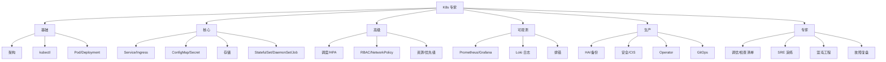

# 25. SRE 实战与故障演练

## 25.1 SRE 是什么

**SRE = Site Reliability Engineering**,Google 提出的工程学科,核心是:

> **用软件工程方法解决运维问题**,让系统可靠、可扩展。

**核心原则**:
1. **运维也是代码**(Infrastructure as Code)
2. **消除重复劳动**(自动化)
3. **拥抱风险**(SLO 允许 99.9% 不是 100%)
4. **事故是学习机会**(无指责复盘)
5. **变更渐进**(灰度发布)

## 25.2 SLI / SLO / SLA

### SLI(Service Level Indicator,**服务等级指标**)

**可量化**的服务质量指标。

| 类别 | 示例 SLI |
|------|---------|
| **可用性** | 成功请求 / 总请求 |
| **延迟** | P50/P95/P99 延迟 |
| **吞吐** | QPS / TPS |
| **错误** | 错误率 / 错误数 |
| **饱和度** | 队列长度 / CPU 使用率 |

### SLO(Service Level Objective,**服务等级目标**)

**SLI 的目标值**。

```text
例:
可用性 SLO: 99.9%
- 月度允许停机: 43.2 分钟
- 季度允许停机: 129.6 分钟

延迟 SLO: P99 < 200ms
错误率 SLO: < 0.1%
```

### SLA(Service Level Agreement,**服务等级协议**)

**对外的合同**。SLA 永远比 SLO **严格**(留 buffer)。

```text
SLA 99.9%   →  SLO 99.95%   → 内部目标
(对外承诺)   (内部目标)    (开发)
```

### Error Budget(错误预算)

```text
Error Budget = 1 - SLO
99.9% SLO → 0.1% Error Budget
月度: 43.2 分钟停机时间
```

**用尽 Error Budget**:
- 暂停变更
- 集中精力做稳定性
- 不新功能

## 25.3 SLO 实战:Web 服务

```yaml
# Sloth SLO 定义
apiVersion: sloth.slok.dev/v1alpha1
kind: ServiceLevelObjective
metadata: { name: web-slo }
spec:
  service: web
  labels:
    tier: frontend
  slos:
  - name: availability
    objective: 99.9
    description: "Web 服务可用性"
    sli:
      events:
        error_query: sum(rate(http_requests_total{job="web",code=~"5.."}[{{.window}}]))
        total_query: sum(rate(http_requests_total{job="web"}[{{.window}}]))
  - name: latency
    objective: 99
    description: "Web P99 < 200ms 占比 99%"
    sli:
      events:
        error_query: sum(rate(http_request_duration_seconds_bucket{job="web",le="0.2"}[{{.window}}]))
        total_query: sum(rate(http_request_duration_seconds_count{job="web"}[{{.window}}]))
```

**Prometheus 监控**:
```promql
# 可用性 SLI
sum(rate(http_requests_total{status!~"5.."}[5m])) / sum(rate(http_requests_total[5m]))

# Error Budget 剩余
100 - (100 * (sum(rate(http_requests_total{status=~"5.."}[30d])) / sum(rate(http_requests_total[30d])))) - 99.9
```

## 25.4 错误预算策略

| 月度可用性 | 状态 | 行动 |
|-----------|------|------|
| > 99.95% | ✅ 健康 | 正常迭代 |
| 99.9-99.95% | ⚠️ 注意 | 关注变化 |
| 99.5-99.9% | 🟡 预警 | 暂停非紧急变更 |
| < 99.5% | 🔴 危机 | 全面冻结,修复 |

**Google 的 SRE 文化**:
- SLO 用尽 = 停止功能开发
- 经验证明:这反而让团队更快达到稳定
- 不可用是变更带来的(数据支持)

## 25.5 事故响应流程

### 1. 检测(Detection)

```text
- 监控告警(Prometheus Alertmanager)
- 用户反馈(客服/工单)
- 内部发现(开发测试)
```

### 2. 响应(Response)

```text
1. Oncall 收到告警
2. 5 分钟内 ack
3. 启动战时指挥(IM 战时频道)
4. 拉相关人(开发/SRE/DB/产品)
5. 战时角色:
   - Incident Commander(总指挥)
   - Operations Lead(执行修复)
   - Communications Lead(内外沟通)
6. 15 分钟内初步判断
```

### 3. 缓解(Mitigation)

**优先恢复,后根因**。

```text
- 回滚(最常用)
- 限流(降级)
- 切流量
- 屏蔽故障节点
- 重启服务
```

### 4. 根因分析(RCA)

```text
- 5 Why
- 时间线分析
- 找根本原因
```

### 5. 复盘(Postmortem)

**48 小时内完成**。

```text
- 无指责文化
- 关注系统而非个人
- 改进行动 + 负责人 + 截止时间
```

## 25.6 战时 Oncall 工具

### 战时频道

```bash
# Slack
/alerts channel:incidents

# 战时机器人
# - 自动拉战时角色
# - 战时时间线记录
# - 状态页面更新
```

### 状态页

```bash
# Statuspage / Status.io
# 自动同步告警
```

### 战时文档

```markdown
# Incident YYYY-MM-DD-NN

## 概况
- 标题: API 错误率 30% 持续 1h
- 严重度: SEV-1
- 影响: 100% 用户,核心 API 不可用
- 时间: 10:00 - 11:00
- IC: 张三
- Ops: 李四
- Comm: 王五

## 时间线
- 10:00: Alert 触发 "API 错误率 > 10%"
- 10:02: 收到, 战时频道建立
- 10:05: IC 介入
- 10:10: 发现是新版本 DB 连接池泄漏
- 10:15: 决定回滚
- 10:20: 回滚完成
- 10:25: 错误率下降到 < 0.1%
- 10:30: 监控继续观察
- 11:00: 恢复稳定, 战时结束

## 根因
新版本中,DB 连接在异常分支未关闭,持续累积直到连接池满。

## 影响
- 100% 核心 API 失败
- 持续 1h
- 估算损失: ¥XX 万

## 改进
- [ ] 加连接池监控(负责人: 张三, 截止: 3 天)
- [ ] DB 泄漏集成测试(负责人: 李四, 截止: 1 周)
- [ ] 蓝绿发布 + 灰度(负责人: 王五, 截止: 2 周)
- [ ] 自动回滚(负责人: 赵六, 截止: 1 月)
```

## 25.7 故障演练(Chaos Engineering)

### 1. 工具

| 工具 | 特点 |
|------|------|
| **Chaos Mesh** | K8s 原生,功能强 |
| **LitmusChaos** | 复杂场景 |
| **ChaosBlade** | 阿里出品 |
| **Gremlin** | 商业,UI 强 |
| **Steadybit** | 商业 |
| **Kube Monkey** | 简单 |

### 2. Chaos Mesh 实战

```bash
# 安装
helm install chaos-mesh chaos-mesh/chaos-mesh \
  --namespace chaos-mesh --create-namespace
```

### 3. 实验:Pod 杀除

```yaml
apiVersion: chaos-mesh.org/v1alpha1
kind: PodChaos
metadata:
  name: pod-kill-test
  namespace: chaos-mesh
spec:
  action: pod-kill
  mode: one
  selector:
    namespaces: [prod]
    labelSelectors:
      app: web
  duration: "30s"
  scheduler:
    cron: "@every 1m"
```

### 4. 实验:网络延迟

```yaml
apiVersion: chaos-mesh.org/v1alpha1
kind: NetworkChaos
metadata: { name: net-delay }
spec:
  action: delay
  mode: all
  selector:
    namespaces: [prod]
    labelSelectors:
      app: api
  delay:
    latency: "200ms"
    jitter: "50ms"
    correlation: "75"
  duration: "5m"
```

### 5. 实验:CPU 压力

```yaml
apiVersion: chaos-mesh.org/v1alpha1
kind: StressChaos
metadata: { name: cpu-stress }
spec:
  mode: one
  selector:
    namespaces: [prod]
    labelSelectors:
      app: web
  stressors:
    cpu:
      workers: 2
      load: 80
  duration: "5m"
```

### 6. GameDay(故障演练日)

```text
GameDay 流程:
1. 计划(选定日期 + 场景)
2. 通知相关方(客户/支持/管理)
3. 准备回滚方案
4. 注入故障
5. 观察团队响应
6. 收集数据
7. 复盘
8. 改进

频率: 季度 1-2 次
场景:
- 节点宕机
- AZ 故障
- 数据库主从切换
- 镜像仓库不可用
- 网络分区
- 配置文件错误
- 流量激增 10x
```

## 25.8 SRE 工具链

```text
监控:       Prometheus + Grafana
日志:       Loki / EFK
追踪:       Tempo / Jaeger
告警:       Alertmanager
OnCall:     PagerDuty / Opsgenie
状态页:     Statuspage
战时:       Slack/飞书 + Bot
混沌:       Chaos Mesh
压测:       k6 / vegeta / Locust
文档:       Confluence / Notion
代码:       Git
部署:       ArgoCD
```

## 25.9 SRE 关键指标(Meta SRE)

**SRE 团队自身指标**:
- **MTTD**(Mean Time To Detect):平均发现时间
- **MTTR**(Mean Time To Repair):平均修复时间
- **MTTA**(Mean Time To Acknowledge):平均确认时间
- **MTBF**(Mean Time Between Failures):平均故障间隔

**目标**:
- MTTD < 5min
- MTTA < 5min
- MTTR < 30min(SEV-1)
- MTBF 持续增加(系统变稳定)

## 25.10 容量规划与预测

```bash
# 季度容量 review
# 1. 业务增长(用户/流量)
# 2. 资源使用(集群利用率)
# 3. 性能趋势
# 4. 成本趋势
# 5. 计划:
#    - 新业务
#    - 升级
#    - 缩容
#    - 优化
```

**预测模型**:
- 业务增长 30% / Q → 集群扩 30% + buffer
- 新业务 → 提前 1 Q 规划
- 退役服务 → 资源回收

## 25.11 Runbook 实战

**Runbook** = 标准操作手册,每个告警对应一个。

```markdown
# Runbook: API 错误率 > 5%

## 告警
Prometheus: HighErrorRate
条件: sum(rate(http_requests_total{status=~"5.."}[5m])) / sum(rate(http_requests_total[5m])) > 0.05
持续: 5min

## 影响
API 用户受影响,可能有 5% 失败

## 立即行动
1. 看 Pod 状态
   kubectl get pods -l app=api
2. 看 Pod 日志
   kubectl logs -l app=api --tail=100
3. 看 Endpoints
   kubectl get ep api
4. 看上下游
   - 上游:web (Ingress 流量)
   - 下游:db, cache

## 可能原因 + 解决方案
### 1. 应用错误
   现象: Pod 重启 / 异常日志
   解决: 回滚(查最近 deployment)
   kubectl rollout undo deploy/api

### 2. DB 慢
   现象: DB QPS 高,慢查询
   解决: 看 slow log,优化查询

### 3. 资源不够
   现象: Pod OOM / CPU throttle
   解决: 加副本(HPA)/ 加节点

### 4. 上下游挂
   现象: 调下游报错
   解决: 看下游,绕开

### 5. 配置错
   现象: 配置变更后报错
   解决: 回滚 ConfigMap

## 升级
如未在 15min 内解决 → SEV-1 → IC 介入
```

## 25.12 Production Excellence 文化

### 1. 无指责文化

```text
✅ 关注系统
"为什么系统让我们能部署带 bug 的代码?"

❌ 指责个人
"张三又把 bug 推到生产了"
```

### 2. 失败是学习机会

```text
- 鼓励尝试(灰度 + 回滚)
- 失败快速恢复
- 事后复盘学习
- 改进系统而不是人
```

### 3. 自动化一切

```text
- 重复 2 次的事 → 自动化
- 重复 3 次的事 → 必须自动化
- 工具:Shell / Python / Ansible / Terraform / Helm / Kustomize
```

### 4. 文档即代码

```text
- 文档进 Git
- Review 文档
- CI 验证文档链接
- 自动生成(OpenAPI / kubectl explain)
```

## 25.13 专家级:从工程师到 SRE

**SRE 关键能力**:
- **深度 K8s**:理解控制面,排错
- **Linux/网络**:内核参数,TCP/IP
- **编程**:Go/Python/Bash 自动化
- **数据库**:理解 SQL 调优
- **安全**:威胁建模
- **业务理解**:为什么这样设计
- **沟通**:战时协调,清晰表达
- **持续学习**:技术更新快

**学习路径**:
```text
0. 基础(K8s/容器/网络)
1. 工具链(Prometheus/Grafana/Loki/ArgoCD)
2. 自动化(Golang/Python/Ansible)
3. 安全(CIS/SOC2/合规)
4. 混沌工程
5. SRE 文化(SLO/复盘)
6. 成本优化
7. 跨团队协作
```

## 25.14 真实案例

### 案例 1:配置变更导致全站 500

```text
时间: 14:00
触发: 错误率告警
调查: 5min
根因: ConfigMap 改了数据库地址(笔误)
影响: 30min
解决: 回滚 ConfigMap
改进:
  - ConfigMap 改用 GitOps + PR review
  - 配 PDB
  - 配错误率告警
```

### 案例 2:节点 OOM 导致服务不可用

```text
时间: 02:00
触发: NodeNotReady 告警
调查: 10min
根因: 节点上其他应用占内存,触发 OOM
影响: 2h
解决: 重启 / 迁移 / 调大 limit
改进:
  - 节点资源预留
  - 监控告警节点内存
  - 重要服务专用节点
```

### 案例 3:版本升级导致兼容性

```text
时间: 10:00
触发: 错误率告警
调查: 15min
根因: 升级应用版本,DB schema 不兼容
影响: 1h
解决: 回滚 + 修复 migration
改进:
  - DB migration 用 Job 单独跑
  - 蓝绿发布
  - Pre-migration 测试
```

## 25.15 K8s 专家完整技能图谱



## 25.16 持续学习资源

```text
官方:
- kubernetes.io/docs
- kubernetes.io/blog
- kubernetes.io/community

视频:
- KubeCon 录像(每年 2 次)
- "KubeAcademy"
- "CNCF webinars"

书籍:
- "Kubernetes in Action"(入门)
- "Kubernetes Patterns"(进阶)
- "Production Kubernetes"(生产)
- "Programming Kubernetes"(CRD/Operator)
- "Site Reliability Engineering"(Google)
- "The Site Reliability Workbook"

认证:
- CKA(管理员)
- CKAD(开发者)
- CKS(安全)
- KCNA(K8s 基础)

社区:
- CNCF Slack
- K8s SIG meetings
- Kubernetes Reddit
- Hacker News

博客:
- 近南(微软)
- The New Stack
- Container Journal
```

## 25.17 实战清单(成为 K8s 专家)

学完所有 25 章 + 实战:

- [ ] CKA 证书
- [ ] CKS 证书
- [ ] 主导一次集群搭建
- [ ] 主导一次跨 AZ 部署
- [ ] 配置完整的可观测体系
- [ ] 部署 GitOps 工作流
- [ ] 主导一次故障复盘
- [ ] 主导一次混沌演练
- [ ] 写一份 SLO 报告
- [ ] 实施一次集群升级
- [ ] 实施一次安全审计
- [ ] 实施一次成本优化
- [ ] 写一份 Runbook
- [ ] 在 CNCF 分享 / 写博客
- [ ] 主导一个 Operator 项目

## 25.18 终章:道与术

**术**(技术):
- kubectl 命令
- YAML 字段
- 工具使用
- 排错步骤

**道**(思维):
- 声明式思维
- 终态调谐
- 可观测驱动
- 自动化一切
- 拥抱失败
- 持续学习

**专家 = 术 + 道 + 经验**。

学完本教程,你具备了:
- 全面的 K8s 知识(基础→专家)
- 实际操作能力(命令 / yaml / 架构)
- 生产经验(HA/安全/可观测/GitOps)
- SRE 思维(SLO/复盘/混沌)

接下来:
- 多实操(光看不够)
- 参与社区
- 持续学习(K8s 一直在变)
- 传授他人(教学相长)

**祝你在 K8s 之路上**`kubectl apply -f success.yaml`! 🚀

## 25.19 教程总结

```text
基础篇 (01-05):  架构 / kubectl / Pod / Deployment / Label
核心篇 (06-11):  Service / Ingress / Config / 存储 / StatefulSet / DaemonSet&Job
调度篇 (12-16):  调度 / HPA / RBAC / 网络 / 资源
可观测 (17-19):  监控 / 日志 / 排错
生产篇 (20-23):  HA / 安全 / Operator / GitOps
专家篇 (24-25):  调优 / SRE

学完 = 25 章节
读完 = 1 遍
跑通 = 3 遍
教人 = 1 遍

总投入: 100+ 小时
回报: Kubernetes 专家
```
