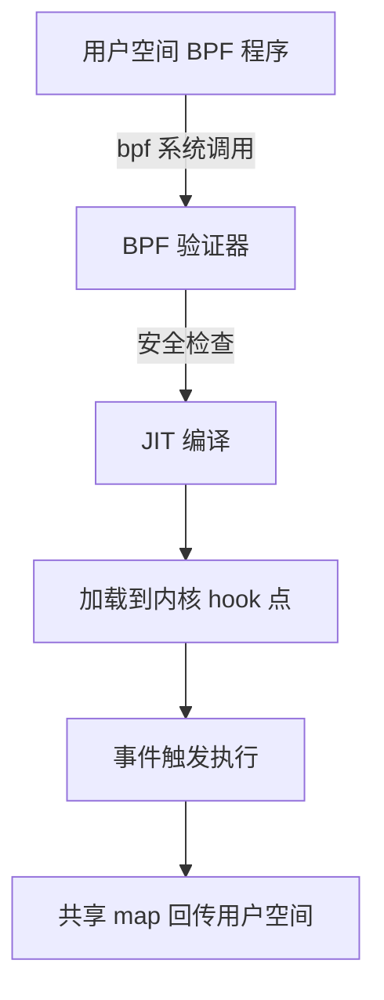

# 26. eBPF 深度与云原生可观测性

## 26.1 eBPF 是什么

**eBPF(extended Berkeley Packet Filter)** = 允许在内核中**安全运行沙箱程序**的技术,无需修改内核源码、无需加载内核模块。

```text
传统内核开发:
  改内核源码 → 编译 → 重启 → 测试  (慢、风险大)

eBPF:
  写 BPF 程序 → 验证器检查 → 加载到内核 → 触发执行  (安全、动态)
```

**核心能力**:
- **网络**:高性能包处理、负载均衡(XDP)、Service Mesh
- **可观测性**:无侵入埋点(系统调用、网络、调度)
- **安全**:运行时检测(Falco/Tetragon)
- **调度**:eBPF-aware scheduler

### 为什么 K8s 需要 eBPF

```text
传统 Sidecar 模式(Istio):
  Pod → iptables 拦截 → sidecar(envoy) → 业务容器
  代价: 2 次上下文切换、内存翻倍、延迟 +1-3ms

eBPF 模式(Cilium):
  Pod → 内核 BPF 程序直接重定向  (零侵入)
  优势: 1 次跳转、零拷贝、延迟 +<0.1ms
```

## 26.2 eBPF 工作原理



**关键组件**:
- **BPF 程序**:C/Rust 写的受限程序
- **Verifier**:静态检查,确保不 crash 内核
- **JIT**:编译为机器码
- **Map**:内核态 ↔ 用户态数据共享
- **Hook 点**:`kprobe`/`uprobe`/`tracepoint`/`XDP`/`tc`/`socket`

### 常用 Hook 点

| Hook | 触发时机 | 用途 |
|------|----------|------|
| **XDP** | 网卡驱动收到包 | 防火墙、LB、DDoS |
| **tc** | 流量控制 | 网络策略、QoS |
| **socket** | socket 操作 | 连接重定向 |
| **kprobe** | 内核函数调用 | 性能分析、安全 |
| **uprobe** | 用户态函数 | 应用埋点 |
| **tracepoint** | 静态 trace 点 | 稳定跟踪 |

## 26.3 Cilium:eBPF 驱动的 K8s 网络

**Cilium** = 用 eBPF 替代 kube-proxy + iptables 的 CNI。

### 安装

```bash
# Helm 安装
helm repo add cilium https://helm.cilium.io
helm install cilium cilium/cilium --namespace kube-system --set kubeProxyReplacement=true
```

### 核心优势

| 维度 | iptables (kube-proxy) | eBPF (Cilium) |
|------|----------------------|---------------|
| 规则数 | 线性扫描 O(n) | Hash 查 O(1) |
| 1 万 Service | 30 秒更新 | < 1 秒 |
| 延迟 | +1ms | +0.1ms |
| L7 策略 | 不支持 | HTTP/gRPC/Kafka |
| 可观测性 | 仅 conntrack | Hubble 全链路 |

### Cilium NetworkPolicy(L7 增强)

```yaml
apiVersion: cilium.io/v2
kind: CiliumNetworkPolicy
metadata:
  name: l7-policy
  namespace: prod
spec:
  endpointSelector:
    matchLabels:
      app: api
  ingress:
  - fromEndpoints:
    - matchLabels:
        app: web
    toPorts:
    - ports:
      - port: "80"
        protocol: TCP
      rules:
        http:
        - method: "GET"
          path: "/api/v1/.*"
        - method: "POST"
          path: "/api/v1/orders"
```

**L7 可见性**:
```bash
# Hubble 看到 HTTP 方法、状态码、延迟
hubble observe --namespace prod --protocol http
```

## 26.4 Hubble:可观测性 UI

**Hubble** = Cilium 的可观测层,基于 eBPF 收集网络流。

```bash
# 安装 Hubble UI
cilium hubble enable --ui
cilium hubble port-forward &

# 实时观察
hubble observe --namespace prod
hubble observe --follow --pod app/web --verdict DROPPED
```

**可视化**:
```bash
# 服务依赖图
hubble map
```

## 26.5 Pixie:零代码应用可观测

**Pixie**(New Relic 出品) = 自动收集应用 trace/profile,无需改代码。

### 安装

```bash
# 一键安装
helm repo add newrelic https://helm-charts.newrelic.com
helm install pixie newrelic/pixie-operator --namespace newrelic --create-namespace --set newrelic_pixie_cluster=<cluster-name>

# 安装 px CLI
bash -c "$(curl -fsSL https://dl.getpx.io/install.sh)"
```

### 自动捕获的数据

```text
- HTTP/gRPC 请求(无代码埋点)
- DNS 查询
- 数据库查询(MySQL/PostgreSQL/Redis)
- 进程资源(CPU/内存/IO)
- 系统调用(慢调用)
```

### px CLI 查询

```bash
# 看 HTTP 错误率
px run -f px/http_data

# 慢查询
px run -f px/mysql_data

# 实时火焰图
px live flame

# 黄金信号
px run -f px/gold_signal
```

**生产场景**:
- 不知道应用埋点 → 用 Pixie 临时分析
- 排错时快速看 trace
- 性能基线采集

## 26.6 Tetragon:实时安全 + 可观测

**Tetragon** = Cilium 出品的 eBPF 运行时安全/可观测引擎。

### 核心能力

```text
✅ 零侵入 syscall 监控(不依赖 sidecar)
✅ 内核级过滤(不丢事件)
✅ 内核态阻断(不等用户态)
✅ 与 K8s 资源关联(Pod/Service)
```

### 安装

```bash
helm install tetragon cilium/tetragon --namespace kube-system
```

### 实战:检测反弹 Shell

```yaml
apiVersion: cilium.io/v1alpha1
kind: TracingPolicy
metadata:
  name: detect-reverse-shell
spec:
  kprobes:
  - call: "security_sk_clone"
    syscall: false
    args:
    - index: 0
      type: "nop"
  tracepoints:
  - subsystem: "sched"
    event: "sched_process_exec"
    args:
    - index: 0
      type: "nop"
    selectors:
    - matchArgs:
      - index: 0
        operator: "Not"
        values:
        - "/usr/bin/bash"
        - "/bin/sh"
        - "/usr/bin/curl"
        - "/usr/bin/wget"
```

### 实战:阻断容器逃逸

```yaml
apiVersion: cilium.io/v1alpha1
kind: TracingPolicy
metadata:
  name: block-ptrace
spec:
  kprobes:
  - call: "ptrace_check_attach"
    syscall: false
    args:
    - index: 0
      type: "nop"
  tracepoints:
  - subsystem: "raw_syscalls"
    event: "sys_enter"
    selectors:
    - matchArgs:
      - index: 6
        operator: "Equal"
        values:
        - 101   # ptrace
      matchNamespaces:
      - namespace: "pid"
        operator: "NotIn"
        values:
        - "host"
      matchActions:
      - action: Sigkill
```

## 26.7 eBPF 性能调优实战

### 工具链

```bash
# 1. bpftool - 内核 BPF 工具
bpftool prog show
bpftool map show
bpftool prog profile id <id> duration 5

# 2. bcc/BPFtrace - 写 BPF 程序
bpftrace -e 'kprobe:do_sys_open { printf("%s %s\n", comm, strarg0); }'

# 3. perf + eBPF
perf record -e 'kprobes:do_sys_open' -a
```

### 实战:分析 K8s 节点 CPU

```bash
# 看哪些进程在耗 CPU
bpftrace -e 'profile:hz:99 { @[comm] = count(); }'
# Ctrl-C 后:
# @[containerd-shim]: 1234
# @[kubelet]: 567

# 看系统调用热点
bpftrace -e 'tracepoint:raw_syscalls:sys_enter { @[comm] = count(); }'
```

### 实战:网络延迟排查

```bash
# TCP 重传率
bpftrace -e 'tracepoint:tcp:tcp_retransmit_skb { @[args->sport] = count(); }'

# 连接耗时
bpftrace -e 'kprobe:tcp_connect { @start[tid] = nsecs; }
             kretprobe:tcp_connect /@start[tid]/ {
               printf("%d us\n", (nsecs - @start[tid])/1000);
               delete(@start[tid]);
             }'
```

## 26.8 eBPF 在 Service Mesh 中

### Linkerd + eBPF

```bash
# Linkerd 2.14+ 支持 eBPF 数据平面(proxy-free)
linkerd install --set proxyInjector=false --set values.linkerd2-proxy.version=''
```

**对比 Envoy Sidecar**:

| 维度 | Envoy | eBPF |
|------|-------|------|
| 内存 | 50-100MB/Pod | < 1MB |
| 启动延迟 | 200ms+ | < 10ms |
| CPU | 1-5% | < 0.1% |
| L7 能力 | 完整 | 部分(HTTP/gRPC) |

### Cilium Service Mesh

```bash
# 启用 L7 代理
helm install cilium cilium/cilium \
  --set l7Proxy=true \
  --set ingressController.enabled=true
```

## 26.9 eBPF 排错实战案例

### 案例 1:DNS 解析慢

```bash
# Hubble 看 DNS 延迟
hubble observe --namespace kube-system --protocol dns \
  --verdict ANY | grep -v 1ms
```

**根因**:CoreDNS 副本数不够 + NodeLocal DNSCache 没启用。

**解决**:
```bash
# 启用 NodeLocal DNSCache
kubectl apply -f https://k8s.io/examples/admin/dns/dns-horizontal-autoscaling.yaml
```

### 案例 2:网络策略不生效

```bash
# Hubble 看被丢的包
hubble observe --verdict DROPPED --namespace prod
```

输出:
```
TIMESTAMP             SOURCE                    DESTINATION               TYPE     VERDICT
Mar 12 10:00:01.123   prod/web-7d4f8-xyz        prod/api-9c5d2-abc        L4       DROPPED
```

**根因**:`web` → `api` 端口 8080 没在 policy 中 allow。

### 案例 3:服务连接被 RST

```bash
# 看 TCP 错误
bpftrace -e 'tracepoint:tcp:tcp_send_active_reset { printf("%s -> %s:%d\n", comm, args->daddr, args->dport); }'
```

## 26.10 eBPF 生态全景

```text
CNI:
  - Cilium (eBPF-native,主流)
  - Calico eBPF dataplane (v3.16+)
  - Flannel eBPF mode

可观测性:
  - Pixie (零代码)
  - Parca (profile,基于 eBPF)
  - Inspektor Gadget (BPF 工具集)
  - bpftrace (脚本)
  - kubectl-trace (K8s 集成)

安全:
  - Tetragon (Cilium 官方)
  - Falco + eBPF driver (4.x+)
  - Tracee (Aqua 出品)

网络/性能:
  - Katran (FB LB)
  - XDP 工具链
  - Cloudflare eBPF
```

## 26.11 eBPF 内核要求

| 内核版本 | eBPF 能力 |
|---------|----------|
| 4.19+ | 基础 BPF、kprobe、tracepoint |
| 5.4+ | 生产推荐 |
| 5.10+ | BTF 增强、CO-RE 完整 |
| 5.15+ | 新 hook 点、K8s 1.27+ 推荐 |

**生产 K8s 节点**:建议 `5.15+` LTS 内核。

## 26.12 eBPF 专家清单

- [ ] 理解 eBPF 工作原理(Verifier + JIT + Map)
- [ ] 部署 Cilium 替代 kube-proxy
- [ ] 用 Hubble 排网络问题
- [ ] 装 Pixie 零代码分析应用
- [ ] 部署 Tetragon 做运行时安全
- [ ] 能写基础 bpftrace 脚本
- [ ] 理解 BPF CO-RE(BTF-based)
- [ ] 知道哪些 hook 点适合什么场景

## 26.13 本章小结

- eBPF = 内核沙箱程序,零侵入 + 高性能
- K8s 生态核心:Cilium(CNI)、Hubble(可观测)、Pixie(应用)、Tetragon(安全)
- L4/L7 网络策略不靠 iptables,直接 BPF
- 性能优势:延迟 < 0.1ms,内存 0 overhead
- 内核要求 5.4+ 推荐,5.10+ 最佳
