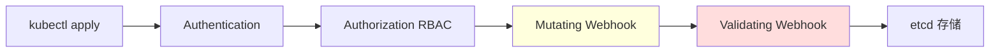

# 28. 策略即代码(OPA / Kyverno / ValidatingAdmissionPolicy)

## 28.1 策略即代码(Policy as Code)

**Policy as Code** = 用代码定义**安全/合规/运维策略**,自动强制执行。

```text
传统:
  "不要在生产用 latest 镜像"
  → 文档/Slack 通知,无人执行

策略即代码:
  - name: deny-latest-tag
    message: "禁止 latest 镜像"
  → API 拒绝创建,完全强制
```

**核心价值**:
- **强制执行**:违反直接拒绝(无需人工)
- **可审计**:策略进 Git,变更可追溯
- **可测试**:像测试代码一样测试策略
- **跨环境一致**:同一套策略管 dev/staging/prod

## 28.2 Kubernetes 准入控制(Admission Control)流程



**两类准入控制**:
- **Mutating**:可修改对象(如自动加 sidecar、加 label)
- **Validating**:只读验证(拒绝或通过)

## 28.3 三种主流方案对比

| 方案 | 类型 | 语言 | 适用 |
|------|------|------|------|
| **OPA / Gatekeeper** | 通用策略引擎 | Rego | 复杂策略、跨系统 |
| **Kyverno** | K8s 原生 | YAML | K8s 专属、简单 |
| **ValidatingAdmissionPolicy(VAP)** | K8s 1.26+ 内置 | CEL 表达式 | 轻量、内置 |

## 28.4 OPA(Open Policy Agent)

**OPA** = 通用策略引擎,核心语言 **Rego**。

### Gatekeeper(K8s 集成)

```bash
# 安装
kubectl apply -f https://raw.githubusercontent.com/open-policy-agent/gatekeeper/release-3.17/deploy/gatekeeper.yaml
```

### ConstraintTemplate(策略模板)

```yaml
apiVersion: templates.gatekeeper.sh/v1
kind: ConstraintTemplate
metadata:
  name: k8scontainterlimits
spec:
  crd:
    spec:
      names:
        kind: K8sContainerLimits
      validation:
        openAPIV3Schema:
          type: object
          properties:
            cpu:    { type: string }
            memory: { type: string }
  targets:
  - target: admission.k8s.gatekeeper.sh
    rego: |
      package k8scontainterlimits
      
      violation[{"msg": msg, "details": {}}] {
        container := input.review.object.spec.containers[_]
        not container.resources.limits.cpu
        msg := sprintf("容器 %v 必须设置 CPU limit", [container.name])
      }
      
      violation[{"msg": msg, "details": {}}] {
        container := input.review.object.spec.containers[_]
        not container.resources.limits.memory
        msg := sprintf("容器 %v 必须设置 memory limit", [container.name])
      }
```

### Constraint(具体约束)

```yaml
apiVersion: constraints.gatekeeper.sh/v1beta1
kind: K8sContainerLimits
metadata:
  name: container-must-have-limits
spec:
  enforcementAction: deny
  match:
    kinds:
    - apiGroups: [""]
      kinds: ["Pod"]
```

### 实战:禁止 latest 标签

```yaml
apiVersion: templates.gatekeeper.sh/v1
kind: ConstraintTemplate
metadata:
  name: k8sno latesttag
spec:
  crd:
    spec:
      names: { kind: K8sNoLatestTag }
  targets:
  - target: admission.k8s.gatekeeper.sh
    rego: |
      package k8sno latesttag
      
      violation[{"msg": msg}] {
        container := input.review.object.spec.containers[_]
        endswith(container.image, ":latest")
        msg := sprintf("镜像 %v 禁止 latest 标签", [container.image])
      }
---
apiVersion: constraints.gatekeeper.sh/v1beta1
kind: K8sNoLatestTag
metadata:
  name: no-latest-tag
spec:
  enforcementAction: deny
```

### Rego 核心语法

```rego
# 规则:if condition then result
allow {
    input.user.role == "admin"  # 条件
}

# 遍历
violation[msg] {
    container := input.review.object.spec.containers[_]  # 数组遍历
    container.image == "nginx:latest"
    msg := "禁止 latest"
}

# 函数
get_image_name(image) = name {
    parts := split(image, ":")
    name := parts[0]
}

# 测试
test_latest_denied {
    result := deny with input as {"image": "nginx:latest"}
    result == true
}
```

## 28.5 Kyverno(K8s 原生策略)

**Kyverno** = 专为 K8s 设计,**不用学新语言**,直接写 YAML。

### 安装

```bash
helm repo add kyverno https://kyverno.github.io/kyverno
helm install kyverno kyverno/kyverno --namespace kyverno --create-namespace
```

### 实战 1:强制资源限制

```yaml
apiVersion: kyverno.io/v1
kind: ClusterPolicy
metadata:
  name: require-resources
spec:
  validationFailureAction: Enforce
  rules:
  - name: check-resources
    match:
      any:
      - resources:
          kinds: ["Pod"]
    validate:
      message: "必须设置 CPU/Memory limits"
      pattern:
        spec:
          containers:
          - resources:
              limits:
                memory: "?*"
                cpu: "?*"
```

### 实战 2:禁止 latest 镜像

```yaml
apiVersion: kyverno.io/v1
kind: ClusterPolicy
metadata:
  name: restrict-image-registries
spec:
  validationFailureAction: Enforce
  rules:
  - name: allowed-registries
    match:
      any:
      - resources:
          kinds: ["Pod"]
    validate:
      message: "只允许使用公司镜像仓库"
      pattern:
        spec:
          containers:
          - image: "registry.company.com/*"
```

### 实战 3:自动注入 sidecar

```yaml
apiVersion: kyverno.io/v1
kind: ClusterPolicy
metadata:
  name: inject-sidecar
spec:
  rules:
  - name: add-log-sidecar
    match:
      any:
      - resources:
          kinds: ["Pod"]
    mutate:
      patchStrategicMerge:
        spec:
          containers:
          - name: log-shipper
            image: fluentd:1.16
            (name): "{{request.object.spec.containers[0].name}}"
```

### 实战 4:验证镜像签名(cosign)

```yaml
apiVersion: kyverno.io/v1
kind: ClusterPolicy
metadata:
  name: verify-image-signatures
spec:
  validationFailureAction: Enforce
  rules:
  - name: verify-signature
    match:
      any:
      - resources:
          kinds: ["Pod"]
    verifyImages:
    - imageReferences: ["registry.company.com/*"]
      attestors:
      - entries:
        - keys:
            publicKeys: |-
              -----BEGIN PUBLIC KEY-----
              ...
              -----END PUBLIC KEY-----
```

### 实战 5:生成资源(类似 init)

```yaml
apiVersion: kyverno.io/v1
kind: ClusterPolicy
metadata:
  name: add-default-networkpolicy
spec:
  rules:
  - name: deny-all-traffic
    match:
      any:
      - resources:
          kinds: ["Namespace"]
    generate:
      apiVersion: networking.k8s.io/v1
      kind: NetworkPolicy
      name: default-deny
      synchronize: true
      data:
        spec:
          podSelector: {}
          policyTypes: ["Ingress", "Egress"]
```

## 28.6 ValidatingAdmissionPolicy(K8s 1.26+)

**VAP** = K8s 内置的策略机制,用 **CEL(Common Expression Language)** 表达式。

### 实战:镜像白名单

```yaml
apiVersion: admissionregistration.k8s.io/v1
kind: ValidatingAdmissionPolicy
metadata:
  name: allowed-registries
spec:
  failurePolicy: Fail
  matchConstraints:
    resourceRules:
    - apiGroups: [""]
      resources: ["pods"]
      operations: ["CREATE", "UPDATE"]
  validations:
  - expression: |
      object.spec.containers.all(c, c.image.startsWith("registry.company.com/"))
    message: "镜像必须来自 registry.company.com"
```

**优势**:
- K8s 内置,无外部依赖
- 性能好(无网络调用)
- 简单(用 CEL 表达式)

**限制**:
- 1.26 才 GA
- 只能 read-only 验证,不能 mutate
- CEL 表达力有限

## 28.7 OPA / Kyverno / VAP 选型

| 场景 | 推荐 |
|------|------|
| 简单 K8s 规则 | **Kyverno**(YAML 友好) |
| 复杂跨系统策略 | **OPA**(Rego 强大) |
| 轻量内置 | **VAP**(K8s 1.26+) |
| 已有 OPA 栈 | OPA |
| 刚起步 | **Kyverno** |
| 自动 mutate | Kyverno / OPA Mutating |
| 性能敏感 | VAP / Kyverno |

## 28.8 策略测试

### Kyverno 测试

```yaml
# kyverno-test.yaml
apiVersion: v1
kind: Pod
metadata: { name: test }
spec:
  containers:
  - name: app
    image: nginx:latest  # 应被拒绝
---
apiVersion: v1
kind: Pod
metadata: { name: ok }
spec:
  containers:
  - name: app
    image: nginx:1.25    # 应通过
```

```bash
kyverno test ./policies
```

### OPA 测试

```rego
# policy_test.rego
test_deny_latest {
    result := deny with input as {"image": "nginx:latest"}
    result == true
}
```

```bash
opa test policy_test.rego
```

## 28.9 实战:完整策略库

```yaml
---
# 1. 必须有资源限制
apiVersion: kyverno.io/v1
kind: ClusterPolicy
metadata:
  name: p1-require-limits
spec:
  validationFailureAction: Enforce
  rules:
  - name: check-limits
    match:
      any: [{resources: {kinds: ["Pod"]}}]
    validate:
      message: "必须设资源 limits"
      pattern:
        spec:
          containers:
          - resources:
              limits: {cpu: "?*", memory: "?*"}

---
# 2. 禁止特权容器
apiVersion: kyverno.io/v1
kind: ClusterPolicy
metadata:
  name: p2-no-privileged
spec:
  validationFailureAction: Enforce
  rules:
  - name: deny-privileged
    match:
      any: [{resources: {kinds: ["Pod"]}}]
    validate:
      message: "禁止特权容器"
      pattern:
        spec:
          containers:
          - securityContext:
              privileged: "false|nil"

---
# 3. 镜像仓库白名单
apiVersion: kyverno.io/v1
kind: ClusterPolicy
metadata:
  name: p3-image-allowlist
spec:
  validationFailureAction: Enforce
  rules:
  - name: allowlist
    match:
      any: [{resources: {kinds: ["Pod"]}}]
    validate:
      message: "镜像必须来自允许的仓库"
      pattern:
        spec:
          containers:
          - image: "registry.company.com/* | gcr.io/myorg/*"

---
# 4. 必须有 readiness probe
apiVersion: kyverno.io/v1
kind: ClusterPolicy
metadata:
  name: p4-require-readiness
spec:
  validationFailureAction: Audit  # 警告但不阻断
  rules:
  - name: check-readiness
    match:
      any: [{resources: {kinds: ["Pod"]}}]
    validate:
      message: "建议设置 readinessProbe"
      pattern:
        spec:
          containers:
          - readinessProbe: "?*"

---
# 5. Pod 必须有 app label
apiVersion: kyverno.io/v1
kind: ClusterPolicy
metadata:
  name: p5-require-app-label
spec:
  validationFailureAction: Enforce
  rules:
  - name: check-labels
    match:
      any: [{resources: {kinds: ["Pod"]}}]
    validate:
      message: "Pod 必须有 app.kubernetes.io/name label"
      pattern:
        metadata:
          labels:
            app.kubernetes.io/name: "?*"
```

## 28.10 策略治理最佳实践

```text
1. Audit 模式先行(先观察,再 Enforce)
   validationFailureAction: Audit → Enforce

2. 命名规范:p{数字}-{描述} 或 {team}-{category}

3. 例外机制:
   - exempt namespaces: kube-system, monitoring
   - exempt image registries: 内部允许
   - 用 exempt 资源(annotations 标记)

4. 报告/告警:
   - PolicyReports (kyverno)
   - Slack 通知 violation

5. 策略库版本管理:
   - Git 管理
   - 用 Helm/Kustomize 部署
   - 变更要 review
```

### Exempt 例外

```yaml
# 给特定 Pod 加例外
metadata:
  annotations:
    policies.kyverno.io/exclude: "p1-require-limits,p3-image-allowlist"
```

## 28.11 实战:PolicyReport 监控

```bash
# 查策略违规报告
kubectl get policyreport -A

# 集群级报告
kubectl get clusterpolicyreport

# 详细
kubectl describe policyreport web-pod -n prod
```

**生产部署**:
```yaml
apiVersion: apps/v1
kind: Deployment
metadata:
  name: kyverno-reports
spec:
  template:
    spec:
      containers:
      - name: reporter
        image: ghcr.io/kyverno/kyverno:latest
        args: ["policy-report"]
```

## 28.12 策略即代码工具链

```text
测试:
  - kyverno test
  - opa test
  - conftest (OPA)

CI 集成:
  - conftest --policy policies/ deployment.yaml
  - kyverno apply policies/ --resource deployment.yaml

可视化:
  - Kyverno Policy Reporter (UI)
  - Polaris (best practice 扫描)

预提交钩子:
  - pre-commit framework
  - conftest 在 commit 前跑
```

## 28.13 专家清单

- [ ] 理解准入控制流程(Authn → Authz → Mutating → Validating)
- [ ] 部署 Kyverno 或 Gatekeeper
- [ ] 写 5+ 基础策略(资源限制、镜像白名单、label 等)
- [ ] 配置 Audit → Enforce 灰度
- [ ] 测试策略(test cases)
- [ ] 集成到 CI/CD(部署前扫描)
- [ ] 监控 PolicyReport
- [ ] 设计团队策略库 + 例外流程

## 28.14 本章小结

- 策略即代码 = 自动强制执行策略,杜绝违规
- 三种方案:**Kyverno**(K8s 原生,YAML)、**OPA**(通用,Rego)、**VAP**(内置,CEL)
- 实战:资源限制、镜像白名单、安全上下文、镜像签名
- 流程:Audit 观察 → Enforce 强制
- 必须有:测试、CI 集成、报告、例外机制
- 与 RBAC/PSP/PSA 配合,形成完整安全体系
