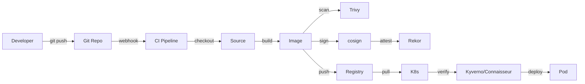

# 29. 供应链安全(SLSA / sigstore / cosign)

## 29.1 软件供应链攻击

**供应链攻击** = 攻击者不直接攻击目标,而是攻击**开发/构建/分发**链路中的薄弱环节。

```text
经典案例:
  - SolarWinds (2020): 攻击构建系统 → 18000 客户中招
  - Codecov (2021): 攻击 CI 脚本 → 客户凭证泄露
  - 3CX (2023): 攻击依赖 → 600 万用户受影响
  - xz utils (2024): 攻击开源维护者 → 几乎成为后门
```

**K8s 场景**:
- 镜像被注入恶意代码
- CI 系统被攻破,签名伪造
- 依赖库(基础镜像)被污染

## 29.2 SLSA(Supply chain Levels for Software Artifacts)

**SLSA** = Google/CNCF 推出的供应链安全框架,4 个等级。

| 等级 | 要求 | 防护能力 |
|------|------|---------|
| **L0** | 无声明 | 无保护 |
| **L1** | 构建过程文档化 | 防止"假装" |
| **L2** | 构建过程防篡改 | 防止构建被改 |
| **L3** | 防篡改 + 来源认证 | 防止源头被攻破 |

**核心概念**:
- **Source**:源代码
- **Build**:构建过程
- **Provenance**:来源证明(谁、什么时候、怎么构建的)
- **Artifact**:产物(镜像、二进制)

## 29.3 Sigstore:免费签名基础设施

**Sigstore** = Linux Foundation 项目,提供**免费**的代码签名 + 验证。

**三大组件**:
- **cosign**:镜像签名
- **Rekor**:透明日志(防抵赖)
- **Fulcio**:短期证书(身份绑定)

```text
传统签名:
  - 自己建 CA
  - 自己管私钥
  - 私钥泄露 = 全完

Sigstore:
  - 私钥用 OIDC 身份短时间生成
  - 签名记录在 Rekor(可查)
  - 验证无需信任 CA
```

## 29.4 cosign:镜像签名

### 安装

```bash
# 安装 cosign
curl -O -L "https://github.com/sigstore/cosign/releases/latest/download/cosign-linux-amd64"
sudo mv cosign-linux-amd64 /usr/local/bin/cosign
sudo chmod +x /usr/local/bin/cosign
```

### 签名镜像

```bash
# 1. 生成密钥对
cosign generate-key-pair

# 2. 签名镜像
cosign sign --key cosign.key registry.company.com/web:v1.0.0

# 3. 验证镜像
cosign verify --key cosign.pub registry.company.com/web:v1.0.0

# 4. 查看签名
cosign triangulate registry.company.com/web:v1.0.0
```

### 无密钥签名(Keyless,OIDC)

```bash
# 用 GitHub/Google 登录签
COSIGN_EXPERIMENTAL=1 cosign sign registry.company.com/web:v1.0.0

# 浏览器完成 OIDC 登录,自动用短期证书
# 证书记录在 Rekor
```

**生产推荐**:**Keyless 模式**,无需管理私钥。

### K8s 准入验证(配合 Kyverno)

```yaml
apiVersion: kyverno.io/v1
kind: ClusterPolicy
metadata:
  name: verify-cosign-signature
spec:
  validationFailureAction: Enforce
  rules:
  - name: verify-signature
    match:
      any:
      - resources:
          kinds: ["Pod"]
    verifyImages:
    - imageReferences: ["registry.company.com/*"]
      attestors:
      - entries:
        - keys:
            publicKeys: |-
              -----BEGIN PUBLIC KEY-----
              MFkwEwYHKoZIzj0CAQYIKoZIzj0DAQcDQgAE...
              -----END PUBLIC KEY-----
```

### cosign 高级功能

```bash
# 1. SBOM 签名
cosign sign --key cosign.key registry.company.com/web:v1.0.0
cosign attach sbom --key cosign.key registry.company.com/web:v1.0.0 sbom.spdx.json

# 2. 验证 SBOM
cosign verify-attestation --key cosign.pub \
  --type https://spdx.dev/Document \
  registry.company.com/web:v1.0.0

# 3. 签名多个平台
cosign sign --key cosign.key registry.company.com/web:v1.0.0 --rekor-url https://rekor.sigstore.dev
```

## 29.5 SBOM(Software Bill of Materials)

**SBOM** = 软件物料清单,列出镜像里**所有依赖**。

### 工具

```bash
# syft - 生成 SBOM
curl -sSfL https://raw.githubusercontent.com/anchore/syft/main/install.sh | sh -s -- -b /usr/local/bin
syft registry.company.com/web:v1.0.0 -o spdx-json > sbom.spdx.json

# grype - 扫描漏洞
curl -sSfL https://raw.githubusercontent.com/anchore/grype/main/install.sh | sh -s -- -b /usr/local/bin
grype registry.company.com/web:v1.0.0
```

### SBOM 在 K8s 治理

```text
镜像构建 → 生成 SBOM → 签名 SBOM → 准入时验证
                                     ↓
                              比对依赖,白名单
```

## 29.6 漏洞扫描

### Trivy(综合扫描)

```bash
# 装
brew install trivy

# 镜像扫描
trivy image registry.company.com/web:v1.0.0

# 文件系统
trivy fs ./app

# K8s 资源
trivy config deployment.yaml

# IaC
trivy terraform ./infra

# 综合
trivy k8s --report summary
```

**严重度等级**:`CRITICAL` / `HIGH` / `MEDIUM` / `LOW` / `UNKNOWN`

**K8s 集成**(Trivy Operator):
```bash
helm repo add trivy-operator https://aquasecurity.github.io/trivy-operator
helm install trivy-operator trivy-operator/trivy-operator \
  --namespace trivy-system --create-namespace
```

```bash
# 查漏洞报告
kubectl get vulnerabilityreports -A
```

### Grype + Syft(Anchore)

```bash
# 在 CI 中
syft dir:. -o spdx-json | grype -i -
```

## 29.7 Tekton Chains:SLSA L3 级别

**Tekton Chains** = Tekton 的供应链安全,自动生成 provenance + 签名。

### 安装

```bash
# 装 Tekton + Chains
kubectl apply -f https://storage.googleapis.com/tekton-releases/pipeline/latest/release.yaml
kubectl apply -f https://storage.googleapis.com/tekton-releases/chains/latest/release.yaml
```

### 配置 cosign 签名

```yaml
apiVersion: v1
kind: ConfigMap
metadata:
  name: chains-config
  namespace: tekton-chains
data:
  chains-config: |
    artifacts:
      oci:
        format: slsa/v1
    signers:
      cosign:
        keyless:
          fulcioUrl: https://fulcio.sigstore.dev
          rekorUrl: https://rekor.sigstore.dev
```

### PipelineRun 自动签名

```yaml
apiVersion: tekton.dev/v1beta1
kind: TaskRun
metadata:
  generateName: build-
spec:
  taskSpec:
    steps:
    - name: build-and-push
      image: gcr.io/kaniko-project/executor:latest
      args: ["--context=.", "--destination=registry.company.com/web:v1.0.0"]
```

```bash
# 构建完成后,Chains 自动:
# 1. 收集 provenance(SLSA 格式)
# 2. 用 Fulcio 申请短期证书
# 3. 用 cosign 签名
# 4. 记录到 Rekor
```

## 29.8 SLSA 级别实战

### 达到 SLSA L3 的实践

```text
✅ L0 → L1:
   - 用 Git 管源代码
   - 文档化构建过程

✅ L1 → L2:
   - CI/CD 流水线(Hardened runner)
   - 镜像签名(cosign)
   - SBOM 生成
   - 漏洞扫描

✅ L2 → L3:
   - 构建环境隔离(临时 runner)
   - 防止构建脚本被改
   - 来源认证(Provenance + Sigstore)
   - 不可变基础设施
```

### GitHub Actions 示例(达到 L3)

```yaml
name: Build & Sign
on: { push: { branches: [main] } }

jobs:
  build:
    runs-on: ubuntu-22.04  # 临时 VM
    permissions:
      id-token: write       # OIDC token for Fulcio
      contents: read
    steps:
    - uses: actions/checkout@v4
    
    - name: Build with SLSA
      uses: slsa-framework/slsa-github-builder/.github/workflows/builder_maven.yml@v1.9.0
      with:
        image: registry.company.com/web
        tag: ${{ github.sha }}
    
    - name: Sign with cosign
      env:
        COSIGN_EXPERIMENTAL: "1"
      run: |
        cosign sign registry.company.com/web@${{ steps.build.outputs.digest }}
```

## 29.9 镜像构建最佳实践

### 多阶段构建(减小攻击面)

```dockerfile
# Build 阶段
FROM golang:1.22 AS build
WORKDIR /app
COPY . .
RUN CGO_ENABLED=0 go build -o web

# Runtime 阶段
FROM gcr.io/distroless/static:nonroot
COPY --from=build /app/web /web
USER 65532:65532
ENTRYPOINT ["/web"]
```

### Chainguard(零 CVE 镜像)

```dockerfile
# 极简、签名、零 CVE
FROM cgr.dev/chainguard/go:latest AS build
# ...
FROM cgr.dev/chainguard/static:latest
COPY --from=build /app/web /web
```

**优势**:
- 几乎 0 CVE(基础组件最少)
- 内置签名
- 默认非 root
- 自动更新

## 29.10 运行时镜像扫描

### Admission 阶段(部署前)

```yaml
# Kyverno + Trivy
apiVersion: kyverno.io/v1
kind: ClusterPolicy
metadata:
  name: check-cve
spec:
  validationFailureAction: Audit
  rules:
  - name: deny-critical-cve
    match:
      any: [{resources: {kinds: ["Pod"]}}]
    context:
    - name: trivy
      apiCall:
        urlPath: "/scan/image"
        method: POST
        data:
          image: "{{request.object.spec.containers[0].image}}"
    validate:
      message: "镜像存在 CRITICAL 漏洞"
      deny:
        condition:
          any:
          - "{{trivy.results.criticalCount > 0}}"
```

### 持续扫描(运行中)

```yaml
# Trivy Operator 自动生成报告
apiVersion: aquasecurity.github.io/v1alpha1
kind: ClusterComplianceReport
metadata:
  name: cis-compliance
spec:
  cron: "0 */6 * * *"  # 每 6 小时
  reportType: cis
```

## 29.11 完整 SLSA 流水线



## 29.12 实战:从零搭建供应链安全

### Step 1: 镜像构建

```dockerfile
# Dockerfile
FROM golang:1.22 AS build
WORKDIR /app
COPY go.mod go.sum ./
RUN go mod download
COPY . .
RUN CGO_ENABLED=0 GOOS=linux go build -ldflags="-s -w" -o web

FROM gcr.io/distroless/static:nonroot
COPY --from=build /app/web /web
EXPOSE 8080
USER 65532
ENTRYPOINT ["/web"]
```

### Step 2: CI 流水线

```yaml
# .github/workflows/build.yml
name: build
on: { push: { branches: [main] } }
jobs:
  build:
    runs-on: ubuntu-22.04
    permissions:
      contents: read
      packages: write
      id-token: write
    steps:
    - uses: actions/checkout@v4
    
    - name: Login to Registry
      uses: docker/login-action@v3
      with:
        registry: registry.company.com
        username: ${{ secrets.REGISTRY_USER }}
        password: ${{ secrets.REGISTRY_PASS }}
    
    - name: Build and Push
      uses: docker/build-push-action@v5
      with:
        push: true
        tags: registry.company.com/web:${{ github.sha }}
        provenance: true
        sbom: true
    
    - name: Scan
      run: |
        trivy image --exit-code 1 --severity CRITICAL registry.company.com/web:${{ github.sha }}
    
    - name: Sign with cosign
      env: { COSIGN_EXPERIMENTAL: "1" }
      run: |
        cosign sign registry.company.com/web@${{ steps.build.outputs.digest }}
```

### Step 3: K8s 准入验证

```yaml
# Kyverno Policy
apiVersion: kyverno.io/v1
kind: ClusterPolicy
metadata:
  name: verify-signatures
spec:
  validationFailureAction: Enforce
  rules:
  - name: verify-cosign
    match:
      any: [{resources: {kinds: ["Pod"]}}]
    verifyImages:
    - imageReferences: ["registry.company.com/*"]
      attestors:
      - entries:
        - keyless:
            subject: https://github.com/myorg
            issuer: https://token.actions.githubusercontent.com
            rekorUrl: https://rekor.sigstore.dev
```

## 29.13 工具速查

| 工具 | 用途 | 备注 |
|------|------|------|
| **cosign** | 镜像签名 | Sigstore 官方 |
| **Trivy** | 漏洞/IaC 扫描 | Aqua 出品 |
| **Grype** | 漏洞扫描 | Anchore |
| **Syft** | SBOM 生成 | Anchore |
| **SLSA** | 框架 | Google/CNCF |
| **Tekton Chains** | SLSA 流水线 | Tekton 配套 |
| **in-toto** | 来源证明 | NYU |
| **Witness** | 替代 in-toto | Sigstore |
| **Kyverno** | 策略 | 见 28 章 |
| **Connaisseur** | 镜像验证 | 替代 Kyverno 验证 |

## 29.14 实战清单(从 0 到 SLSA L3)

- [ ] 所有镜像用 distroless 或 alpine
- [ ] CI 中跑 Trivy 扫描,CRITICAL 阻断
- [ ] cosign 签名所有生产镜像
- [ ] SBOM 生成 + 签名 + 验证
- [ ] K8s 准入时验证签名(Kyverno/Connaisseur)
- [ ] 用 Tekton Chains 或 SLSA GitHub Builder
- [ ] 持续漏洞扫描(Trivy Operator)
- [ ] 关键依赖有 attestation(SBOM + 来源)
- [ ] 私有 registry 启用 TLS + 认证

## 29.15 本章小结

- 供应链安全 = 防止**构建/分发**链路被攻破
- **SLSA** 框架 4 级,生产目标 L3
- **Sigstore** 免费签名(cosign/Rekor/Fulcio)
- 关键实践:cosign 签名 + Trivy 扫描 + SBOM + 准入验证
- **Kyverno** 在 K8s 入口强制验证
- Chainguard 镜像 = 零 CVE 基础
- Tekton Chains 或 SLSA GitHub Builder 自动生成 provenance
