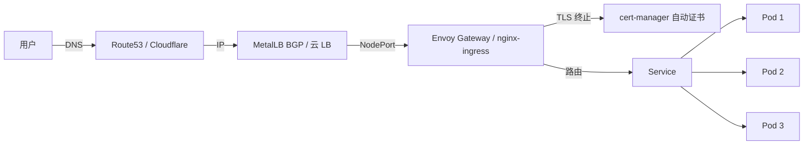

# 34. Gateway API / ExternalDNS / Cert-Manager / Reloader

## 34.1 Gateway API 深入(替代 Ingress)

**Gateway API** = K8s 官方推出的下一代 L4/L7 API,**角色分离** + **多协议** + **可移植**(不只是 nginx)。

### 与 Ingress 对比

| 维度 | Ingress | Gateway API |
|------|---------|-------------|
| 协议 | HTTP/HTTPS only | HTTP/gRPC/TCP/UDP/TLS |
| 角色 | 单个 | 多角色(Provider/Admin/Developer) |
| 多租户 | annotation hack | 命名空间隔离 |
| CRD | 1 个 | 5 个(分类) |
| 跨命名空间 | 不支持 | Routes 跨 Namespace |
| 厂商支持 | 各 Controller 私有 | 标准化,EnvoyGateway/Istio/Cilium 都支持 |
| 状态 | GA | GA(K8s 1.24+) |

### 核心 CRD

```text
GatewayClass        ─── 集群级,定义"用哪个 Controller 实现"
   ↓
Gateway             ─── 集群/命名空间级,"部署哪个 LB"
   ↓
HTTPRoute/TCPRoute  ─── 命名空间级,"流量规则"
   ↓
Service             ─── 实际后端
```

### GatewayClass(基础设施)

```yaml
apiVersion: gateway.networking.k8s.io/v1
kind: GatewayClass
metadata:
  name: eg                              # Envoy Gateway
spec:
  controllerName: gateway.envoyproxy.io/gatewayclass
  parametersRef:
    group: gateway.envoyproxy.io
    kind: EnvoyProxy
    name: eg-config
```

### Gateway(部署 LB)

```yaml
apiVersion: gateway.networking.k8s.io/v1
kind: Gateway
metadata:
  name: prod-gateway
  namespace: infra
spec:
  gatewayClassName: eg
  listeners:                            # 监听端口
  - name: http
    port: 80
    protocol: HTTP
    allowedRoutes:
      namespaces:
        from: Selector
        selector:
          matchLabels:
            gateway-access: "true"
  - name: https
    port: 443
    protocol: HTTPS
    tls:
      mode: Terminate
      certificateRefs:
      - name: prod-tls
    allowedRoutes:
      namespaces:
        from: Selector
        selector:
          matchLabels:
            gateway-access: "true"
  - name: tcp-mysql
    port: 3306
    protocol: TCP
    allowedRoutes:
      namespaces:
        from: All
```

### HTTPRoute(应用路由)

```yaml
apiVersion: gateway.networking.k8s.io/v1
kind: HTTPRoute
metadata:
  name: web
  namespace: prod
  labels:
    gateway-access: "true"              # 必须,Gateway allowedRoutes 限制
spec:
  parentRefs:
  - name: prod-gateway
    namespace: infra
    sectionName: http
  hostnames: ["app.example.com", "www.example.com"]
  rules:
  - matches:
    - path: { type: PathPrefix, value: /api }
    backendRefs:
    - name: api
      port: 80
      weight: 90
    - name: api-v2
      port: 80
      weight: 10                          # 10% 流量到 v2(金丝雀)
  - matches:
    - path: { type: Exact, value: /healthz }
    backendRefs:
    - name: api
      port: 80
  - matches:
    - headers:
      - name: x-user
        value: vip
    backendRefs:
    - name: web-vip
      port: 80
```

### TCPRoute / UDPRoute

```yaml
apiVersion: gateway.networking.k8s.io/v1alpha2
kind: TCPRoute
metadata: { name: mysql, namespace: prod }
spec:
  parentRefs:
  - name: prod-gateway
    sectionName: tcp-mysql
  rules:
  - backendRefs:
    - name: mysql
      port: 3306
```

### BackendTLSPolicy(mTLS 后端)

```yaml
apiVersion: gateway.networking.k8s.io/v1alpha3
kind: BackendTLSPolicy
metadata:
  name: api-tls
  namespace: prod
spec:
  targetRefs:
  - group: ""
    kind: Service
    name: api
  tls:
    clientCertRefs:
    - name: client-cert
      kind: Secret
    hostname: api.prod.svc
```

### Envoy Gateway 实战

```bash
# 安装
helm install eg oci://docker.io/envoyproxy/gateway-helm \
  --version v1.0.0 \
  -n envoy-gateway-system --create-namespace

# 用 GatewayClass 触发
kubectl apply -f gatewayclass.yaml
kubectl apply -f gateway.yaml
kubectl apply -f httproute.yaml
```

### Gateway API 跨 Namespace 路由

```yaml
# infra namespace 的 Gateway
# 接受所有 namespace 的 HTTPRoute
apiVersion: gateway.networking.k8s.io/v1
kind: Gateway
metadata:
  name: shared
  namespace: infra
spec:
  listeners:
  - allowedRoutes:
      namespaces:
        from: All                        # 所有 namespace
```

```yaml
# prod namespace 的 HTTPRoute
# 通过 parentRefs 引用其他 namespace 的 Gateway
apiVersion: gateway.networking.k8s.io/v1
kind: HTTPRoute
metadata: { name: app, namespace: prod }
spec:
  parentRefs:
  - name: shared
    namespace: infra                     # 跨 namespace
```

### Gateway API 选型

| Controller | 特点 |
|-----------|------|
| **Envoy Gateway** | 官方推荐,Envoy,新 |
| **Istio** | 已有 Istio 可用 |
| **Cilium** | eBPF 驱动 |
| **NGINX Gateway Fabric** | nginx 演进 |
| **Traefik** | 简单,小集群 |
| **HashiCorp Consul** | 多 DC |

## 34.2 cert-manager 深入

**cert-manager** = K8s 证书生命周期管理(签发/续期/吊销)。

### 核心概念

```text
Issuer / ClusterIssuer   证书颁发者(Let's Encrypt / Vault / 自签)
   ↓
Certificate              证书申请
   ↓
Secret (tls.crt/tls.key)  生成的证书
```

### ClusterIssuer 实战

#### Let's Encrypt(ACME)

```bash
helm repo add jetstack https://charts.jetstack.io
helm install cert-manager jetstack/cert-manager \
  --namespace cert-manager --create-namespace \
  --set installCRDs=true
```

```yaml
apiVersion: cert-manager.io/v1
kind: ClusterIssuer
metadata: { name: letsencrypt-prod }
spec:
  acme:
    server: https://acme-v02.api.letsencrypt.org/directory
    email: admin@example.com
    privateKeySecretRef:
      name: letsencrypt-prod-account
    solvers:
    - http01:
        ingress:
          class: nginx
    # 或 dns01(通配符)
    - dns01:
        route53:                          # AWS
          region: us-east-1
          accessKeyIDSecretRef: { name: aws-credentials, key: access-key-id }
          secretAccessKeySecretRef: { name: aws-credentials, key: secret-access-key }
```

#### 自签(内部 CA)

```yaml
apiVersion: cert-manager.io/v1
kind: ClusterIssuer
metadata: { name: selfsigned }
spec:
  selfSigned: {}
---
apiVersion: cert-manager.io/v1
kind: Certificate
metadata: { name: internal-ca, namespace: cert-manager }
spec:
  isCA: true
  commonName: internal-ca
  secretName: internal-ca-secret
  issuerRef:
    name: selfsigned
    kind: ClusterIssuer
  duration: 87600h                       # 10 年
---
apiVersion: cert-manager.io/v1
kind: ClusterIssuer
metadata: { name: internal-ca-issuer }
spec:
  ca:
    secretName: internal-ca-secret
```

#### HashiCorp Vault

```yaml
apiVersion: cert-manager.io/v1
kind: ClusterIssuer
metadata: { name: vault }
spec:
  vault:
    server: https://vault.example.com
    path: pki/sign/example               # Vault PKI 路径
    auth:
      kubernetes:
        mountPath: /v1/auth/kubernetes
        role: cert-manager
        serviceAccountRef:
          name: cert-manager
```

### Certificate 实战

```yaml
apiVersion: cert-manager.io/v1
kind: Certificate
metadata:
  name: example-com
  namespace: prod
spec:
  secretName: example-com-tls
  issuerRef:
    name: letsencrypt-prod
    kind: ClusterIssuer
  commonName: example.com
  dnsNames:
  - example.com
  - "*.example.com"
  duration: 2160h                        # 90 天
  renewBefore: 720h                      # 提前 30 天续期
  usages:
  - digital signature
  - key encipherment
  - server auth
```

### Ingress 自动签发

```yaml
apiVersion: networking.k8s.io/v1
kind: Ingress
metadata:
  name: web
  annotations:
    cert-manager.io/cluster-issuer: letsencrypt-prod
spec:
  tls:
  - hosts: [app.example.com]
    secretName: app-tls                  # cert-manager 自动签发到这里
  rules:
  - host: app.example.com
    http:
      paths:
      - path: /
        pathType: Prefix
        backend:
          service: { name: web, port: { number: 80 } }
```

### Gateway API + cert-manager

```yaml
apiVersion: gateway.networking.k8s.io/v1
kind: Gateway
metadata: { name: web, namespace: infra }
spec:
  listeners:
  - name: https
    port: 443
    protocol: HTTPS
    tls:
      mode: Terminate
      certificateRefs:
      - name: app-tls
        kind: Secret
```

### cert-manager 高级

#### 证书监控

```bash
# 状态
kubectl get certificates -A

# 即将过期(< 7 天)
kubectl get certificates -A -o json | \
  jq -r '.items[] | select(.status.notAfter < (now + 604800 | strftime("%Y-%m-%dT%H:%M:%SZ"))) | .metadata.namespace + "/" + .metadata.name'

# 续期
kubectl annotate certificate example-com cert-manager.io/issue-temporary-certificate="true"
```

#### cert-manager + SPIFFE

```yaml
# 签发 SVID(SPIFFE Workload Identity)
apiVersion: cert-manager.io/v1
kind: Certificate
metadata: { name: pod-svid, namespace: prod }
spec:
  secretName: pod-svid-secret
  issuerRef: { name: spiffe-issuer, kind: ClusterIssuer }
  isCA: false
  duration: 1h                           # 短期
  privateKey:
    algorithm: ECDSA
    size: 256
  usages:
  - digital signature
  - key encipherment
  - server auth
  - client auth
```

## 34.3 ExternalDNS:外部 DNS 自动化

**ExternalDNS** = 监听 K8s Service/Ingress,自动同步到 DNS 提供商。

### 安装

```bash
helm repo add external-dns https://kubernetes-sigs.github.io/external-dns
helm install external-dns external-dns/external-dns \
  --namespace external-dns --create-namespace \
  --set provider=aws                        # 选 provider
```

### 支持的 DNS

```text
- AWS Route 53
- Google Cloud DNS
- Azure DNS
- Cloudflare
- DigitalOcean
- DNSPod(腾讯)
- Aliyun DNS
- RFC2136(自建 BIND)
- CoreDNS(内网)
```

### Service 自动 DNS

```yaml
apiVersion: v1
kind: Service
metadata:
  name: web
  annotations:
    external-dns.alpha.kubernetes.io/hostname: app.example.com
    external-dns.alpha.kubernetes.io/ttl: "300"
spec:
  type: LoadBalancer
  ports:
  - port: 80
```

→ 5 分钟后:`dig app.example.com` 拿到 LB IP

### Ingress 自动 DNS

```yaml
apiVersion: networking.k8s.io/v1
kind: Ingress
metadata:
  name: web
  annotations:
    external-dns.alpha.kubernetes.io/hostname: app.example.com
spec:
  rules:
  - host: app.example.com
    http: { paths: [{ path: /, pathType: Prefix, backend: { service: { name: web, port: { number: 80 }}}}]}
```

→ ExternalDNS 自动创建 Route53 记录

### 多区域 / 通配符

```yaml
metadata:
  annotations:
    external-dns.alpha.kubernetes.io/hostname: app.example.com
    external-dns.alpha.kubernetes.io/aws-alias: "true"            # 用 Alias
    external-dns.alpha.kubernetes.io/ttl: "60"
    external-dns.alpha.kubernetes.io/set-identifier: web-prod    # 多实例区分
spec:
  type: LoadBalancer
```

### TXT Owner Record

```bash
# 查 owner(避免冲突)
dig TXT example.com
# → "external-dns/owner=external-dns,resource=service/web"

# 看同步日志
kubectl logs -n external-dns -l app=external-dns
```

## 34.4 Reloader:配置变更自动重启

**Reloader** = 监控 ConfigMap/Secret 变化,自动 rollout restart Deployment/StatefulSet/DaemonSet。

### 安装

```bash
helm repo add stakater https://stakater.github.io/stakater-charts
helm install reloader stakater/reloader --namespace reloader --create-namespace
```

### 实战

```yaml
# Deployment 引用 ConfigMap
# ConfigMap 变化 → 自动重启
apiVersion: apps/v1
kind: Deployment
metadata:
  name: web
  annotations:
    reloader.stakater.com/auto: "true"    # 自动发现所有 configmap/secret
    # 或显式:
    # configmap.reloader.stakater.com/reload: "web-config"
    # secret.reloader.stakater.com/reload: "web-secret"
spec:
  template:
    spec:
      containers:
      - name: web
        envFrom:
        - configMapRef: { name: web-config }
        - secretRef: { name: web-secret }
```

### 高级:SHA 滚动

```yaml
# 用 SHA 触发而非 restart
apiVersion: apps/v1
kind: Deployment
metadata:
  name: web
  annotations:
    reloader.stakater.com/match: "true"
spec:
  template:
    metadata:
      annotations:
        configmap-checksum: "PLACEHOLDER"  # 会被 Reloader 替换为 SHA
```

## 34.5 MetalLB 高级:生产级 LB

### 架构

```text
Speaker (DaemonSet, 每节点一个)
   ↓
ARP / BGP
   ↓
路由器/交换机
   ↓
外部流量
```

### L2 模式(简单)

```yaml
apiVersion: metallb.io/v1beta1
kind: IPAddressPool
metadata: { name: prod-pool }
spec:
  addresses:
  - 192.168.1.100-192.168.1.200         # LB 分配的 IP 范围
---
apiVersion: metallb.io/v1beta1
kind: L2Advertisement
metadata: { name: l2 }
spec:
  ipAddressPools: [prod-pool]
```

### BGP 模式(生产推荐)

```yaml
apiVersion: metallb.io/v1beta2
kind: BGPPeer
metadata: { name: router1, namespace: metallb-system }
spec:
  myASN: 64500
  peerASN: 64501
  peerAddress: 10.0.0.1
---
apiVersion: metallb.io/v1beta1
kind: IPAddressPool
metadata: { name: bgp-pool }
spec:
  addresses:
  - 10.10.0.0/24
---
apiVersion: metallb.io/v1beta1
kind: BGPAdvertisement
metadata: { name: bgp-advert }
spec:
  ipAddressPools: [bgp-pool]
  aggregationLength: 32
  communities:
  - 64500:100
```

### MetalLB 高级:服务共享 IP

```yaml
# 多个 Service 共享一个 VIP(主备)
apiVersion: v1
kind: Service
metadata: { name: web-primary }
spec:
  type: LoadBalancer
  loadBalancerIP: 10.10.0.100
  ports: [{ port: 80 }]
---
apiVersion: v1
kind: Service
metadata: { name: web-standby }
spec:
  type: LoadBalancer
  loadBalancerIP: 10.10.0.100
  ports: [{ port: 80 }]
```

### MetalLB 监控

```yaml
# Prometheus ServiceMonitor
apiVersion: monitoring.coreos.com/v1
kind: ServiceMonitor
metadata: { name: metallb, namespace: metallb-system }
spec:
  selector:
    matchLabels: { app: metallb }
  endpoints:
  - port: monitoring
```

## 34.6 Headless Services 高级应用

### 用途

```text
1. StatefulSet(给 Pod 稳定 DNS)
2. 服务发现(任何需要 DNS-LB 场景)
3. 自定义负载均衡(在客户端做)
4. 数据库代理(ProxySQL/PgBouncer 前置)
```

### 实战:外部 LB + Headless

```yaml
apiVersion: v1
kind: Service
metadata: { name: web-headless }
spec:
  clusterIP: None                       # Headless
  selector: { app: web }
  ports: [{ port: 80, targetPort: 8080 }]
---
# DNS 查询: web-headless.default.svc.cluster.local
# 返回: web-0.web-headless.default.svc.cluster.local
#       web-1.web-headless.default.svc.cluster.local
```

### 客户端负载均衡(自定义)

```python
# Python 客户端 - 用 Headless Service 自己做 LB
import socket
import random

def get_pod_ips():
    """DNS 查询拿到所有 Pod IP"""
    try:
        infos = socket.getaddrinfo("web-headless.default.svc.cluster.local", 80)
        return list(set(i[4][0] for i in infos))
    except:
        return []

def call_service():
    ips = get_pod_ips()
    if not ips:
        return None
    target = random.choice(ips)         # 自定义 LB
    return requests.get(f"http://{target}:8080")
```

### Service External Traffic Policy

```yaml
apiVersion: v1
kind: Service
metadata: { name: web }
spec:
  type: LoadBalancer
  externalTrafficPolicy: Local           # 保留源 IP(只本地节点 Pod 接收)
```

## 34.7 实战案例:完整对外服务



### 一站式部署

```yaml
# 1. cert-manager
apiVersion: cert-manager.io/v1
kind: ClusterIssuer
metadata: { name: letsencrypt-prod }
spec: { acme: { ... } }
---
# 2. ExternalDNS
# 通过 IAM Role 自动同步
---
# 3. Gateway / Ingress
apiVersion: gateway.networking.k8s.io/v1
kind: Gateway
metadata: { name: prod, namespace: infra }
spec:
  gatewayClassName: eg
  listeners:
  - name: https
    port: 443
    protocol: HTTPS
    tls:
      mode: Terminate
      certificateRefs:
      - name: prod-tls
---
# 4. HTTPRoute
apiVersion: gateway.networking.k8s.io/v1
kind: HTTPRoute
metadata: { name: app, namespace: prod }
spec:
  parentRefs:
  - name: prod
    namespace: infra
  hostnames: [app.example.com]
  rules:
  - backendRefs:
    - name: app
      port: 80
```

**全自动化**:
1. 创建 HTTPRoute → cert-manager 自动签证书
2. HTTPRoute 就绪 → ExternalDNS 自动创建 DNS 记录
3. 用户访问 → DNS 解析 → LB → Gateway → 后端

## 34.8 专家清单

### Gateway API
- [ ] 部署 Envoy Gateway 或 Istio
- [ ] 写 GatewayClass + Gateway + HTTPRoute
- [ ] 跨 namespace 路由
- [ ] 理解角色分离(infra/team)
- [ ] 灰度发布(weight)

### cert-manager
- [ ] 部署 cert-manager
- [ ] 配 Let's Encrypt(ACME)
- [ ] 自签内部 CA
- [ ] 自动续期监控
- [ ] Gateway API 集成

### ExternalDNS
- [ ] 部署 ExternalDNS
- [ ] Service/Ingress 自动同步
- [ ] 通配符 + 多区域
- [ ] Owner TXT 记录

### Reloader
- [ ] 部署 Reloader
- [ ] ConfigMap/Secret 触发滚动

### MetalLB
- [ ] L2 或 BGP 配置
- [ ] 节点多 NIC 隔离
- [ ] IPv6 支持
- [ ] 监控告警

## 34.9 本章小结

- **Gateway API** = 下一代入口,角色分离,跨 ns
- **cert-manager** = 证书生命周期自动化
- **ExternalDNS** = K8s 资源自动同步到 DNS
- **Reloader** = 配置变更自动重启
- **MetalLB** = 裸金属 LoadBalancer(BGP/L2)
- 完整链路:ExternalDNS + cert-manager + Gateway API + MetalLB
- 全部 GitOps(ArgoCD/Flux)管理
