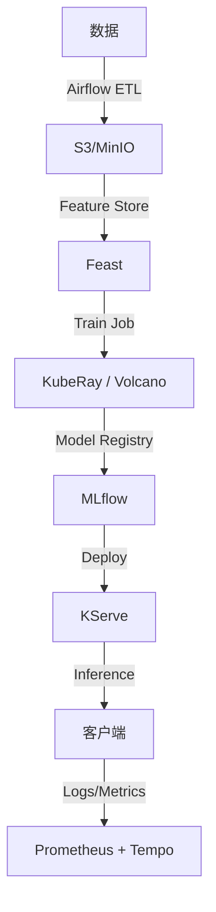

# 35. 大数据 / AI / ML 工作负载

## 35.1 为什么 K8s 是 AI/大数据的事实标准

```text
传统 Hadoop/Spark:
  - 物理机/VM 静态分配
  - 资源浪费 50%+
  - 弹性差
  - 难用 CI/CD

K8s 模式:
  - Pod 即用即起
  - GPU/计算资源池化
  - 弹性伸缩(KEDA)
  - GitOps 统一管理
```

## 35.2 KubeRay:Ray on K8s

**Ray** = 分布式 AI/ML 框架,被 OpenAI/字节/Anthropic 用于大模型训练。

### 安装 KubeRay Operator

```bash
helm repo add kuberay https://ray-project.github.io/kuberay-helm
helm install kuberay-operator kuberay/kuberay-operator --version 1.0.0 \
  --namespace ray-system --create-namespace
```

### RayCluster 实战

```yaml
apiVersion: ray.io/v1alpha1
kind: RayCluster
metadata:
  name: ray-cluster
  namespace: ml
spec:
  rayVersion: '2.9.0'
  headGroupSpec:
    rayStartParams:
      dashboard-host: '0.0.0.0'
    template:
      spec:
        containers:
        - name: ray-head
          image: rayproject/ray:2.9.0-py310
          ports:
          - { containerPort: 6379, name: gcs }
          - { containerPort: 8265, name: dashboard }
          - { containerPort: 10001, name: client }
          resources:
            limits: { cpu: 4, memory: 8Gi }
            requests: { cpu: 2, memory: 4Gi }
  workerGroupSpecs:
  - groupName: workers
    replicas: 4
    rayStartParams: {}
    template:
      spec:
        containers:
        - name: ray-worker
          image: rayproject/ray:2.9.0-py310
          resources:
            limits:
              cpu: 8
              memory: 32Gi
              nvidia.com/gpu: 1
```

### 提交 Ray Job

```yaml
apiVersion: ray.io/v1alpha1
kind: RayJob
metadata:
  name: train-job
  namespace: ml
spec:
  entrypoint: python train.py --epochs 10
  clusterSelector: { ray.io/cluster-name: ray-cluster }
  runtimeEnv: |
    pip:
      packages: [torch, transformers, datasets]
  ttlSecondsAfterFinished: 100
```

### RayService(在线推理)

```yaml
apiVersion: ray.io/v1alpha1
kind: RayService
metadata: { name: llm-service }
spec:
  serveConfig: |
    applications:
    - name: chatbot
      route_prefix: /
      import_path: serve_deployment:app
      args:
        llm_model: llama-3-70b
  rayClusterConfig:
    rayVersion: '2.9.0'
    headGroupSpec: { ... }
    workerGroupSpecs: [...]
```

### Ray Dashboard

```bash
kubectl port-forward svc/ray-cluster-head-svc 8265:8265 -n ml
# 浏览器: http://localhost:8265
```

## 35.3 Volcano:批处理调度(K8s 缺 gang scheduling)

**问题**:Spark/Flink 任务,500 个 executor 一起跑才有意义,跑 1 个不跑等于失败。

**Volcano** = 提供 Gang Scheduling / Task Topology / Fair Scheduling。

### 安装

```bash
helm repo add volcano-sh https://volcano-sh.github.io/helm-charts
helm install volcano volcano-sh/volcano -n volcano-system --create-namespace
```

### VolcanoJob(Critical Pod)

```yaml
apiVersion: batch.volcano.sh/v1alpha1
kind: Job
metadata: { name: spark-job }
spec:
  minAvailable: 10                        # 至少 10 个 Pod 才能启动
  schedulerName: volcano
  tasks:
  - name: spark-driver
    replicas: 1
    template:
      spec:
        containers:
        - name: driver
          image: spark:3.5
          command: ["/opt/spark/bin/spark-submit", "--master", "k8s://https://k8s", ...]
        restartPolicy: Never
  - name: spark-executor
    replicas: 50                          # 50 个 executor
    template:
      spec:
        containers:
        - name: executor
          image: spark:3.5
          resources:
            limits: { cpu: 2, memory: 4Gi }
        restartPolicy: OnFailure
```

### Queue(队列)

```yaml
apiVersion: scheduling.volcano.sh/v1beta1
kind: Queue
metadata: { name: ml-team }
spec:
  weight: 1
  reclaimable: false
  capability:
    cpu: 100
    memory: 1000Gi
    nvidia.com/gpu: 20
```

```yaml
apiVersion: batch.volcano.sh/v1alpha1
kind: Job
metadata: { name: my-job }
spec:
  queue: ml-team                          # 提交到队列
  minAvailable: 10
  tasks: [...]
```

### Gang Scheduling(关键!)

```yaml
# 指定任务组:driver + 10 executors
# 10 个 executor 全部就绪才能启动 driver
apiVersion: batch.volcano.sh/v1alpha1
kind: Job
metadata: { name: gang-demo }
spec:
  minAvailable: 11                        # 1 driver + 10 executors
  tasks:
  - name: driver
    replicas: 1
  - name: worker
    replicas: 10
  plugins:
    gang: { }                             # 启用 gang
    priority: { }                         # 优先级
```

### Fair Scheduling(队列间)

```yaml
apiVersion: scheduling.volcano.sh/v1beta1
kind: Queue
metadata: { name: team-a }
spec:
  weight: 2                               # team-a 拿 2 份
---
apiVersion: scheduling.volcano.sh/v1beta1
kind: Queue
metadata: { name: team-b }
spec:
  weight: 1                               # team-b 拿 1 份
```

## 35.4 Apache Spark on K8s

### 提交方式

```bash
# 1. spark-submit 到 K8s
spark-submit \
  --master k8s://https://k8s-api:6443 \
  --deploy-mode cluster \
  --name spark-pi \
  --conf spark.executor.instances=5 \
  --conf spark.kubernetes.container.image=spark:3.5 \
  --conf spark.kubernetes.namespace=spark \
  local:///opt/spark/examples/src/main/python/pi.py
```

### spark-on-k8s-operator

```bash
helm install spark-operator spark-on-k8s/spark-operator -n spark-operator --create-namespace
```

```yaml
apiVersion: sparkoperator.k8s.io/v1beta2
kind: SparkApplication
metadata: { name: spark-pi, namespace: spark }
spec:
  type: Python
  pythonVersion: "3"
  mode: cluster
  image: "spark:3.5"
  imagePullPolicy: Always
  mainApplicationFile: "local:///opt/spark/examples/src/main/python/pi.py"
  sparkVersion: "3.5.0"
  restartPolicy:
    type: OnFailure
    onFailureRetries: 2
    onFailureRetryInterval: 10
    onSubmissionFailureRetries: 3
    onSubmissionFailureRetryInterval: 10
  driver:
    cores: 1
    coreLimit: 1200m
    memory: 1g
    serviceAccount: spark
  executor:
    cores: 1
    instances: 5
    memory: 1g
```

### Spark 历史服务

```yaml
apiVersion: apps/v1
kind: Deployment
metadata: { name: spark-history }
spec:
  template:
    spec:
      containers:
      - name: history
        image: spark:3.5
        command: ["/opt/spark/bin/spark-class", "org.apache.spark.deploy.history.HistoryServer"]
        env:
        - name: SPARK_HISTORY_OPTS
          value: "-Dspark.history.fs.logDirectory=s3a://spark-logs/"
```

## 35.5 Apache Airflow on K8s

### 两种模式

```text
1. Airflow 跑在 K8s(Scheduler + Worker)
2. Airflow 通过 KubernetesExecutor 调度 K8s Pod 跑 task
```

### Helm 安装

```bash
helm repo add apache-airflow https://airflow.apache.org
helm install airflow apache-airflow/airflow \
  --namespace airflow --create-namespace \
  --set executor=KubernetesExecutor
```

### DAG 实战

```python
# dags/etl.py
from airflow import DAG
from airflow.providers.cncf.kubernetes.operators.kubernetes_pod import KubernetesPodOperator
from datetime import datetime, timedelta

with DAG(
    'etl_dag',
    start_date=datetime(2024, 1, 1),
    schedule_interval='@daily',
    default_args={'retries': 2, 'retry_delay': timedelta(minutes=5)}
) as dag:
    
    extract = KubernetesPodOperator(
        namespace='airflow',
        image='myorg/extract:v1',
        cmds=['python', 'extract.py'],
        name='extract-task',
        task_id='extract',
        resources={'request_memory': '512Mi', 'request_cpu': '500m'},
    )
    
    transform = KubernetesPodOperator(
        namespace='airflow',
        image='myorg/transform:v1',
        cmds=['python', 'transform.py'],
        name='transform-task',
        task_id='transform',
    )
    
    load = KubernetesPodOperator(
        namespace='airflow',
        image='myorg/load:v1',
        cmds=['python', 'load.py'],
        name='load-task',
        task_id='load',
    )
    
    extract >> transform >> load
```

### Airflow + GitSync

```yaml
# values.yaml
dags:
  gitSync:
    enabled: true
    repo: https://github.com/myorg/airflow-dags
    branch: main
    subPath: dags
    syncInterval: 60
```

## 35.6 JupyterHub on K8s

### Zero to JupyterHub(官方方案)

```bash
helm repo add jupyterhub https://jupyterhub.github.io/helm-chart
helm install jupyterhub jupyterhub/jupyterhub \
  --namespace jupyter --create-namespace \
  --version 3.0.0 \
  --values config.yaml
```

```yaml
# config.yaml
proxy:
  service:
    type: LoadBalancer
  https:
    enabled: true
    letsencrypt:
      email: admin@example.com
singleuser:
  defaultUrl: "/lab"
  storage:
    homeMountPath: /home/jovyan
  image:
    name: jupyter/datascience-notebook
    tag: latest
  cpu:
    limit: 2
    guarantee: 1
  memory:
    limit: 4G
    guarantee: 2G
  extraEnv:
    JUPYTER_ENABLE_LAB: "yes"
hub:
  config:
    Authenticator:
      admin_users:
        - admin@example.com
```

### 用户画像(资源)

```yaml
# user profile
singleuser:
  profileList:
  - display_name: "Small"
    default: true
    description: "1 CPU, 2G"
    kubespawner_overrides:
      cpu_limit: 1
      memory_limit: 2G
  - display_name: "GPU"
    description: "GPU A100"
    kubespawner_overrides:
      cpu_limit: 4
      memory_limit: 16G
      nvidia.com/gpu: 1
      image: jupyter/tensorflow-notebook:latest
```

## 35.7 KServe:模型服务化

**KServe** = K8s 上的标准模型服务(原 KFServing,被 Kubeflow 接纳)。

### 安装

```bash
helm install kserve oci://ghcr.io/kserve/charts/kserve \
  --version v0.11.0 \
  -n kserve --create-namespace
```

### InferenceService

```yaml
apiVersion: serving.kserve.io/v1beta1
kind: InferenceService
metadata: { name: sklearn-iris, namespace: ml }
spec:
  predictor:
    model:
      modelFormat: { name: sklearn }
      runtime: kserve-mlserver
      storageUri: s3://models/iris/model.joblib
      resources:
        requests: { cpu: 100m, memory: 256Mi }
        limits: { cpu: 1, memory: 1Gi }
```

### Transformer(预处理)

```yaml
apiVersion: serving.kserve.io/v1beta1
kind: InferenceService
metadata: { name: with-transformer }
spec:
  transformer:
    containers:
    - image: myorg/transformer:v1
      name: transformer
  predictor:
    model:
      modelFormat: { name: tensorflow }
      storageUri: s3://models/mnist/
```

### Canary Rollout

```yaml
apiVersion: serving.kserve.io/v1beta1
kind: InferenceService
metadata: { name: canary }
spec:
  predictor:
    canaryTrafficPercent: 20             # 20% 到 v2
    model:
      modelFormat: { name: onnx }
      storageUri: s3://models/v2/
```

### 流量管理

```yaml
# Gateway API 自动生成
apiVersion: serving.kserve.io/v1beta1
kind: InferenceService
metadata: { name: with-route }
spec:
  predictor:
    model:
      modelFormat: { name: pytorch }
      storageUri: s3://models/llm/
  router:
    gateway: { gatewayName: prod-gateway, gatewayNamespace: infra }
```

## 35.8 Kubeflow Pipelines(ML 工作流)

### 安装

```bash
kubectl apply -k "github.com/kubeflow/pipelines/manifests/kustomize/cluster-scoped-resources?ref=2.0.0"
kubectl apply -k "github.com/kubeflow/pipelines/manifests/kustomize/env/dev?ref=2.0.0"
```

### Pipeline 定义

```python
import kfp
from kfp import dsl
from kfp.dsl import component, Input, Output, Artifact

@component(base_image='python:3.10')
def load_data(output_data: Output[Artifact]):
    import pandas as pd
    df = pd.read_csv('https://example.com/data.csv')
    df.to_csv(output_data.path, index=False)

@component(base_image='python:3.10',
           packages_to_install=['scikit-learn'])
def train(input_data: Input[Artifact], 
          model: Output[Artifact]):
    import pandas as pd
    from sklearn.ensemble import RandomForestClassifier
    import joblib
    
    df = pd.read_csv(input_data.path)
    X, y = df.drop('target', axis=1), df['target']
    clf = RandomForestClassifier()
    clf.fit(X, y)
    joblib.dump(clf, model.path)

@dsl.pipeline(name='ML Pipeline')
def ml_pipeline():
    load_task = load_data()
    train_task = train(input_data=load_task.outputs['output_data'])

if __name__ == '__main__':
    kfp.compiler.Compiler().compile(ml_pipeline, 'pipeline.yaml')
```

```bash
# 提交
kfp pipeline upload pipeline.yaml
```

## 35.9 Argo Workflows(通用工作流)

**Argo Workflows** = K8s 原生工作流(DAG/Step/Sensor)。

### 安装

```bash
kubectl create namespace argo
kubectl apply -n argo -f https://github.com/argoproj/argo-workflows/releases/latest/download/install.yaml
```

### Workflow

```yaml
apiVersion: argoproj.io/v1alpha1
kind: Workflow
metadata:
  generateName: build-
  namespace: argo
spec:
  entrypoint: main
  templates:
  - name: main
    dag:
      tasks:
      - name: build
        template: build
      - name: test
        dependencies: [build]
        template: test
      - name: deploy
        dependencies: [test]
        template: deploy
  - name: build
    container:
      image: golang:1.22
      command: [sh, -c, "go build -o /tmp/app"]
  - name: test
    container:
      image: golang:1.22
      command: [sh, -c, "go test ./..."]
  - name: deploy
    container:
      image: bitnami/kubectl
      command: [kubectl, apply, -f, -]
      args:
      - |
        apiVersion: apps/v1
        kind: Deployment
        metadata: { name: app }
        spec:
          replicas: 1
          selector: { matchLabels: { app: app } }
          template:
            metadata: { labels: { app: app } }
            spec:
              containers:
              - name: app
                image: myorg/app:latest
```

### Argo Events(事件驱动)

```bash
helm install argo-events argo/argo-events -n argo-events --create-namespace
```

```yaml
apiVersion: argoproj.io/v1alpha1
kind: EventBus
metadata: { name: default, namespace: argo-events }
spec: {}
---
apiVersion: argoproj.io/v1alpha1
kind: Sensor
metadata: { name: webhook, namespace: argo-events }
spec:
  dependencies:
  - name: dep
    eventSourceName: webhook
    eventName: push
  triggers:
  - template:
      name: run-workflow
      argoWorkflow:
        operation: submit
        source:
          resource:
            apiVersion: argoproj.io/v1alpha1
            kind: Workflow
            metadata: { generateName: ci- }
```

## 35.10 数据湖:Iceberg/Hudi/Deltalake on K8s

### Spark + Iceberg

```python
from pyspark.sql import SparkSession

spark = SparkSession.builder \
    .config("spark.sql.extensions", "org.apache.iceberg.spark.extensions.IcebergSparkSessionExtensions") \
    .config("spark.sql.catalog.spark_catalog", "org.apache.iceberg.spark.SparkSessionCatalog") \
    .config("spark.sql.catalog.spark_catalog.type", "hive") \
    .getOrCreate()

spark.read.format("iceberg").load("s3://lake/orders/").createOrReplaceTempView("orders")
```

### Trino(查询引擎)

```bash
helm install trino trino/trino -n trino --create-namespace
```

```yaml
# 查 Iceberg
apiVersion: v1
kind: ConfigMap
metadata: { name: trino-catalog-iceberg }
data:
  iceberg.properties: |
    connector.name=iceberg
    hive.s3.endpoint=s3.amazonaws.com
    iceberg.catalog.type=hive_metastore
```

## 35.11 实战:AI 平台一站式架构



## 35.12 专家清单

### Ray
- [ ] 部署 KubeRay Operator
- [ ] 写 RayCluster
- [ ] 提交 RayJob
- [ ] RayService 在线推理

### Volcano
- [ ] 部署 Volcano
- [ ] 用 VolcanoJob 跑 Spark
- [ ] Gang Scheduling 避免部分调度
- [ ] 队列管理 + Fair Sharing

### Spark
- [ ] spark-on-k8s-operator
- [ ] 提交 SparkApplication
- [ ] History Server

### Airflow
- [ ] 部署 Airflow(K8sExecutor)
- [ ] 用 KubernetesPodOperator
- [ ] GitSync DAG
- [ ] 连接器(S3/PG/Kafka)

### JupyterHub
- [ ] 部署 Zero to JupyterHub
- [ ] 配置用户画像
- [ ] GPU profile
- [ ] 集成 SSO(OAuth)

### KServe
- [ ] 部署 KServe
- [ ] InferenceService 部署 sklearn/PyTorch/ONNX
- [ ] Canary 流量
- [ ] Transformer
- [ ] 集成 Gateway API

### Argo Workflows
- [ ] 部署 Argo Workflows
- [ ] DAG 流程
- [ ] 集成 Argo Events

## 35.13 本章小结

- **KubeRay** = 分布式 AI 训练(OpenAI 同款)
- **Volcano** = Gang Scheduling + Queue(K8s 批处理必备)
- **Spark on K8s** = 大数据处理
- **Airflow** = 批处理调度(Spark 任务编排)
- **JupyterHub** = 数据科学平台
- **KServe** = 模型服务化(标准 InferenceService)
- **Argo Workflows/Events** = 通用 K8s 原生工作流
- 完整 AI 平台:KubeRay + KServe + MLflow + Airflow
