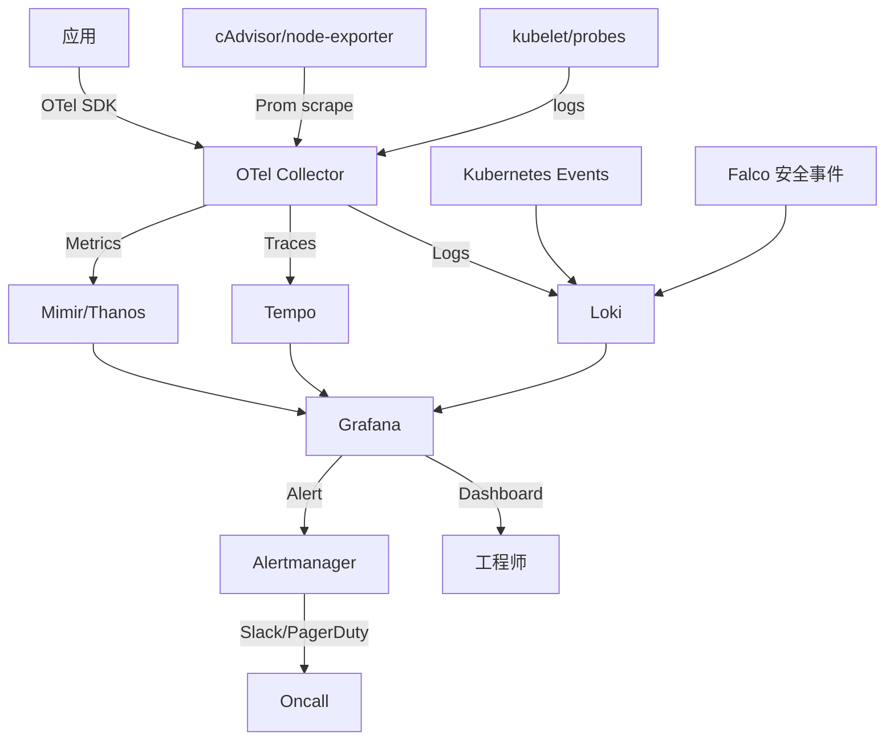

# 37. 可观测性全链路(OpenTelemetry / Tempo / Thanos)

## 37.1 OpenTelemetry(OTel)统一标准

**OpenTelemetry** = CNCF 标准,统一 Metrics/Logs/Traces。

```text
传统:
  Prometheus → Metrics
  Loki / ELK → Logs
  Jaeger / Zipkin → Traces
  三个 SDK,三个 Pipeline

OpenTelemetry:
  一个 SDK(自动埋点)
  一个 Collector(收/转/发)
  输出任意 backend
```

### 架构

```text
应用 (auto-instrumented)
  ↓ OTel SDK
OTel Collector
  ├── Prometheus exporter
  ├── Loki exporter
  ├── Tempo exporter
  └── (可配置)
```

### 应用集成(Go)

```go
import (
    "go.opentelemetry.io/otel"
    "go.opentelemetry.io/otel/sdk/trace"
    "go.opentelemetry.io/otel/exporters/otlp/otlptrace/otlptracegrpc"
    "go.opentelemetry.io/otel/sdk/resource"
    semconv "go.opentelemetry.io/otel/semconv/v1.24.0"
)

func initTracer() {
    exporter, _ := otlptracegrpc.New(
        context.Background(),
        otlptracegrpc.WithEndpoint("otel-collector:4317"),
        otlptracegrpc.WithInsecure(),
    )
    
    res, _ := resource.Merge(
        resource.Default(),
        resource.NewWithAttributes(
            semconv.SchemaURL,
            semconv.ServiceName("my-service"),
            semconv.ServiceVersion("1.0.0"),
        ),
    )
    
    tp := trace.NewTracerProvider(
        trace.WithBatcher(exporter),
        trace.WithResource(res),
    )
    otel.SetTracerProvider(tp)
}

// 业务代码
func handleRequest(w http.ResponseWriter, r *http.Request) {
    tracer := otel.Tracer("my-service")
    ctx, span := tracer.Start(r.Context(), "handleRequest")
    defer span.End()
    
    // 业务
}
```

### OTel Collector 部署

```bash
helm repo add open-telemetry https://open-telemetry.github.io/opentelemetry-helm-charts
helm install otel-collector open-telemetry/opentelemetry-collector \
  --namespace observability --create-namespace \
  --values values.yaml
```

```yaml
# values.yaml
mode: deployment
config:
  exporters:
    prometheusremotewrite:
      endpoint: http://prometheus:9090/api/v1/write
    otlp/tempo:
      endpoint: tempo:4317
      tls:
        insecure: true
  
  receivers:
    otlp:
      protocols:
        grpc:
          endpoint: 0.0.0.0:4317
        http:
          endpoint: 0.0.0.0:4318
    prometheus:
      config:
        scrape_configs:
        - job_name: 'otel-collector'
          static_configs:
          - targets: [localhost:8888]
  
  processors:
    batch:
      timeout: 10s
    memory_limiter:
      check_interval: 1s
      limit_percentage: 80
      spike_limit_percentage: 20
  
  service:
    pipelines:
      traces:
        receivers: [otlp]
        processors: [memory_limiter, batch]
        exporters: [otlp/tempo]
      metrics:
        receivers: [otlp, prometheus]
        processors: [memory_limiter, batch]
        exporters: [prometheusremotewrite]
```

### 应用 OTel 自动埋点

```yaml
# 用 Operator 自动注入 sidecar
apiVersion: opentelemetry.io/v1alpha1
kind: Instrumentation
metadata:
  name: default-instrumentation
  namespace: observability
spec:
  default:
    language: python
  propagators:
  - tracecontext
  - baggage
  - b3
  sampler:
    type: parentbased_traceidratio
    argument: "0.1"                      # 10% 采样
```

```yaml
# Pod 加 annotation 自动注入
apiVersion: apps/v1
kind: Deployment
metadata: { name: my-app }
spec:
  template:
    metadata:
      annotations:
        instrumentation.opentelemetry.io/inject-python: "true"
```

## 37.2 Tempo(分布式追踪存储)

**Tempo** = Grafana 出品,廉价追踪存储(用对象存储)。

### 安装

```bash
helm install tempo grafana/tempo -n observability --create-namespace
```

```yaml
# values.yaml - S3 存储
storage:
  trace:
    backend: s3
    s3:
      bucket: tempo-traces
      region: us-east-1
      access_key: xxx
      secret_key: xxx
```

### 与 Grafana 集成

```yaml
# Grafana DataSource
apiVersion: v1
kind: ConfigMap
metadata: { name: grafana-datasources, namespace: observability }
data:
  datasources.yaml: |
    apiVersion: 1
    datasources:
    - name: Tempo
      type: tempo
      access: proxy
      url: http://tempo:3100
      isDefault: true
```

### Tempo + Logs + Metrics(关联)

```yaml
# Loki derived fields(trace ID)
derivedFields:
- name: traceID
  matcherRegex: '"traceID":"(\w+)"'
  url: '${__value.raw}/trace/${__value.traceID}'
  urlLabel: 'Trace'

# Tempo 配 Loki
# Trace 详情页能跳到关联日志
```

## 37.3 Jaeger 替代方案

**Jaeger** = 老牌 tracing,UI 强。

### 安装

```bash
# 1. Jaeger Operator
kubectl create namespace observability
kubectl apply -f https://github.com/jaegertracing/jaeger-operator/releases/latest/download/jaeger-operator.yaml -n observability

# 2. 创建 instance
kubectl apply -f - <<EOF
apiVersion: jaegertracing.io/v1
kind: Jaeger
metadata: { name: simplest, namespace: observability }
EOF
```

### 实战:生产 storage

```yaml
apiVersion: jaegertracing.io/v1
kind: Jaeger
metadata: { name: prod, namespace: observability }
spec:
  strategy: production
  storage:
    type: elasticsearch
    options:
      es:
        server-urls: https://es.observability:9200
        index-prefix: jaeger
        username: jaeger
        passwordFromSecret: jaeger-secret
  ingress:
    enabled: true
    hosts: [jaeger.example.com]
    ingressClassName: nginx
```

## 37.4 Thanos(全局 Prometheus)

**问题**:Prometheus 联邦/分区,长期存储,跨集群查询。

```text
Sidecar (per Prometheus)
  ↓ push to S3
Thanos Store Gateway
  ↓
Thanos Querier (统一查询)
  ↓
Grafana
```

### 安装

```bash
# 1. 上传对象存储
mc config host add minio http://minio:9000 accesskey secretkey
mc mb minio/thanos

# 2. 装 Thanos
helm install thanos bitnami/thanos -n monitoring --create-namespace
```

### components

```yaml
# Query
thanos query \
  --http-address 0.0.0.0:10902 \
  --grpc-address 0.0.0.0:10901 \
  --store sidecar-prometheus-1:10901 \
  --store sidecar-prometheus-2:10901

# Sidecar(挂 Prometheus)
thanos sidecar \
  --tsdb.path /prometheus \
  --prometheus.url http://localhost:9090 \
  --objstore.config-file /etc/thanos/config.yaml

# Store Gateway(查 S3 历史)
thanos store \
  --data-dir /var/thanos/store \
  --objstore.config-file /etc/thanos/config.yaml \
  --http-address 0.0.0.0:10902 \
  --grpc-address 0.0.0.0:10901
```

### Prometheus 加 sidecar

```yaml
apiVersion: apps/v1
kind: Deployment
metadata: { name: prometheus }
spec:
  template:
    spec:
      containers:
      - name: prometheus
        image: prom/prometheus:v2.50.0
        args:
        - --storage.tsdb.path=/prometheus
        - --web.enable-lifecycle
        - --web.enable-remote-write-receiver
      - name: thanos-sidecar
        image: quay.io/thanos/thanos:v0.34.0
        args:
        - sidecar
        - --tsdb.path=/prometheus
        - --prometheus.url=http://localhost:9090
        - --objstore.config=/etc/thanos/objstore.yaml
        ports:
        - { containerPort: 10901, name: grpc }
        - { containerPort: 10902, name: http }
```

### Thanos Compactor(降采样/压缩)

```bash
thanos compact \
  --data-dir /var/thanos/compact \
  --objstore.config-file /etc/thanos/objstore.yaml \
  --retention.resolution-raw=30d \
  --retention.resolution-5m=90d \
  --retention.resolution-1h=1y
```

## 37.5 Cortex/Mimir(多租户长期存储)

**Cortex** = CNCF 项目,生产级长期存储(支持多租户)。
**Mimir** = Grafana 出品,Cortex 的下一代。

### Mimir 部署

```bash
helm install mimir grafana/mimir -n mimir --create-namespace
```

```yaml
# values.yaml
ingester:
  replicas: 3
  storage:
    type: s3
    s3:
      bucket_name: mimir-blocks
      access_key_id: xxx
      secret_access_key: xxx

store_gateway:
  sharding_ring:
    replication_factor: 3

compactor:
  enabled: true

alertmanager:
  enabled: true

query:
  replicas: 2
```

### 多租户(用 X-Scope-OrgID)

```bash
# Prometheus remote write 加 header
remote_write:
- url: http://mimir-nginx:8080/api/v1/push
  headers:
    X-Scope-OrgID: tenant-a
```

### Mimir vs Cortex vs Thanos

| 维度 | Thanos | Cortex | Mimir |
|------|--------|--------|-------|
| 多租户 | ❌ | ✅ | ✅ |
| 查询性能 | 中 | 高 | 最高 |
| 运维复杂度 | 中 | 高 | 中 |
| Alertmanager | ❌(需用 Prometheus) | ✅ | ✅ |
| 商业支持 | ❌ | ❌ | ✅(Grafana Labs) |

## 37.6 Sloth(SLO 自动化)

```bash
helm install sloth slok/sloth -n monitoring
```

```yaml
apiVersion: sloth.slok.dev/v1alpha1
kind: ServiceLevelObjective
metadata: { name: web-slo }
spec:
  service: web
  labels:
    tier: frontend
  slos:
  - name: availability
    objective: 99.9
    description: "Web 可用性"
    sli:
      events:
        error_query: sum(rate(http_requests_total{job="web",code=~"5.."}[{{.window}}]))
        total_query: sum(rate(http_requests_total{job="web"}[{{.window}}]))
  - name: latency
    objective: 99
    description: "P99 < 200ms"
    sli:
      events:
        error_query: |
          sum(rate(http_request_duration_seconds_bucket{job="web",le="0.2"}[{{.window}}]))
        total_query: |
          sum(rate(http_request_duration_seconds_count{job="web"}[{{.window}}]))
```

Sloth 自动生成 Prometheus recording rules + alert rules。

## 37.7 Pyroscope(持续 Profile)

**Pyroscope** = 持续 profile 存储,火焰图。

```bash
helm install pyroscope grafana/pyroscope -n observability
```

应用集成(Go):
```go
import "github.com/grafana/pyroscope-go"

pyroscope.Start(pyroscope.Config{
    ApplicationName: "my-service",
    ServerAddress:   "http://pyroscope:4040",
})
```

## 37.8 Vector(高性能日志收集)

**Vector** = Rust 写的日志/指标收集,比 Fluentd 快 10x。

```bash
helm install vector vector/vector -n logging --create-namespace
```

```yaml
# config
apiVersion: v1
kind: ConfigMap
metadata: { name: vector-config }
data:
  vector.yaml: |
    sources:
      kubernetes:
        type: kubernetes_logs
    
    transforms:
      parse_json:
        type: remap
        inputs: [kubernetes]
        source: |
          . = parse_json!(.message)
    
    sinks:
      loki:
        type: loki
        inputs: [parse_json]
        endpoint: http://loki:3100
        labels:
          namespace: .namespace
          pod: .pod
      prometheus:
        type: prometheus_exporter
        inputs: [parse_json]
        address: 0.0.0.0:9090
```

## 37.9 OpenTelemetry Demo(完整示例)

**OTel 官方 demo** = 完整微服务 demo,展示 OTel 全链路。

```bash
git clone https://github.com/open-telemetry/opentelemetry-demo
cd opentelemetry-demo
helm install otel-demo ./deploy/kubernetes/helm -n otel-demo --create-namespace
```

**包含**:
- 13 个微服务(Go/Java/Python/Node/.NET)
- 自动埋点
- 全链路 trace
- Prometheus + Tempo + Loki + Grafana
- 真实负载生成(Locust)

## 37.10 eBPF + OpenTelemetry(零侵入)

**OpenTelemetry eBPF profiler** = 自动 profile,无需改代码。

```yaml
apiVersion: apps/v1
kind: DaemonSet
metadata: { name: otel-ebpf-profiler }
spec:
  template:
    spec:
      containers:
      - name: profiler
        image: otel/ebpf-profiler
        args:
        - --receiver=otlp
        - --otel-exporter=otlphttp
        - --otel-endpoint=otel-collector:4318
        securityContext:
          privileged: true                # 需特权访问 eBPF
```

## 37.11 完整可观测性栈架构



## 37.12 专家清单

### OpenTelemetry
- [ ] 部署 OTel Collector
- [ ] 应用集成(Go/Java/Python)
- [ ] 自动注入(Operator)
- [ ] 配置采样(traceidratio)

### Tracing
- [ ] Tempo + Grafana 部署
- [ ] Logs/Traces 关联(Loki derived fields)
- [ ] 跨服务 trace 完整

### 长期存储
- [ ] Thanos / Mimir 部署
- [ ] S3 对象存储配置
- [ ] Compactor(降采样 + 保留)
- [ ] 多租户(X-Scope-OrgID)

### SLO
- [ ] Sloth 自动生成 SLO 规则
- [ ] Error Budget 监控

### Profile
- [ ] Pyroscope 部署
- [ ] 持续火焰图
- [ ] eBPF profiler 集成

### 性能
- [ ] Vector 替代 Fluentd(快 10x)
- [ ] OTel Collector Pipeline 调优
- [ ] 采样策略(成本/质量)

## 37.13 本章小结

- **OpenTelemetry** = 统一标准(SDK + Collector)
- **Tempo/Jaeger** = 分布式追踪存储
- **Thanos/Cortex/Mimir** = 长期指标存储
- **Sloth** = SLO 自动化
- **Pyroscope** = 持续 profile
- **Vector** = 高性能日志收集
- 完整栈:OTel SDK → Collector → {Mimir/Tempo/Loki} → Grafana
- SLO + Profile + Trace + Metrics 全方位
- 关键是关联(trace_id 贯穿 logs/metrics)
