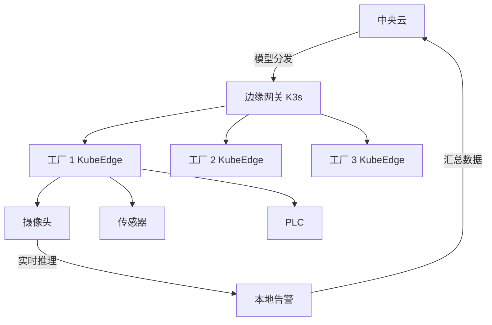

# 38. 边缘计算与多云 K8s

## 38.1 边缘计算的场景

```text
中心云模式:
  - 100% 在中心云
  - 网络延迟 100ms+
  - 带宽成本高
  - 不适合实时/IoT

边缘模式:
  - 边缘节点就近计算
  - 延迟 < 10ms
  - 离线/弱网可用
  - 适合:工厂、零售、车联网、5G、CDN
```

**挑战**:
- 边缘节点资源有限(1-4C 8G)
- 网络不稳定
- 大集群 vs 小集群(< 100 节点)
- 远程运维困难

## 38.2 K3s(轻量级 K8s)

**K3s** = Rancher 出品,5 分钟装完的 K8s,适合边缘/IoT/边缘。

```text
K3s = K8s 精简版
  - 单二进制(50MB)
  - 默认 SQLite(可换 etcd/postgres/mysql)
  - 内置:Traefik / ServiceLB / LocalPath
  - 资源占用:K8s 的 1/10
```

### 安装

```bash
# Server(单 master)
curl -sfL https://get.k3s.io | sh -

# 验证
sudo kubectl get nodes

# Agent join
curl -sfL https://get.k3s.io | K3S_URL=https://myserver:6443 \
  K3S_TOKEN=mynodetoken sh -
```

### K3s 高级配置

```bash
# 自定义
curl -sfL https://get.k3s.io | INSTALL_K3S_EXEC="--disable=traefik --disable=servicelb --flannel-backend=host-gw" sh -

# 常用参数
# --disable=traefik       不用内置 traefik
# --disable=servicelb     不用内置 ServiceLB
# --flannel-backend=vxlan | host-gw | wireguard
# --kube-apiserver-arg=--audit-log-maxage=30
# --cluster-cidr=10.42.0.0/16
# --service-cidr=10.43.0.0/16
# --data-dir=/var/lib/rancher/k3s
# --write-kubeconfig-mode=644
```

### K3s 高可用(embedded etcd)

```bash
# 第一个 server
curl -sfL https://get.k3s.io | sh -s - --cluster-init

# 加 server
curl -sfL https://get.k3s.io | K3S_URL=https://myserver:6443 \
  K3S_TOKEN=mynodetoken sh -s - --server
```

### K3s 替换组件

| K8s 默认 | K3s 默认 | 备注 |
|---------|---------|------|
| etcd | SQLite(默认)/ etcd | 单节点 SQLite,集群 etcd |
| kube-proxy | klipper-lb | 内置 ServiceLB |
| networking | Flannel | 默认 VXLAN |
| Traefik | Traefik v2 | 内置 |
| Local Path Provisioner | 内置 | 默认存储 |

### K3s 适用场景

```text
✅ 边缘节点(零售/工厂)
✅ IoT 网关
✅ CI 跑临时集群
✅ ARM 设备(Raspberry Pi)
✅ 嵌入式
❌ 1000+ 节点(用标准 K8s)
❌ 严格企业场景(用 OpenShift/Rancher)
```

## 38.3 K0s(零依赖 K8s)

**K0s** = Mirantis 出品,**单二进制** K8s,零外部依赖。

```bash
# 装
curl -sSf https://get.k0s.sh | sudo sh
sudo k0s install controller --single
sudo k0s start
```

```bash
# 配 worker
sudo k0s install worker --token-file /tmp/token
sudo k0s start
```

**优势**:
- 单二进制,无 containerd/docker 依赖
- 0 配置启动
- 适合:edge、air-gapped、CI

## 38.4 KubeEdge(边缘计算平台)

**KubeEdge** = CNCF 项目,边缘计算专用 K8s。

```text
CloudCore(云端) + EdgeCore(边缘) + EdgeMesh

特点:
  - 边缘节点离线工作
  - 消息总线(MQTT)
  - 边缘自治(网络断了仍能跑)
  - 设备协议(Mapper)
```

### 安装

```bash
# 1. CloudCore
helm install kubeedge kubeedge/kubeedge \
  --set cloudCore.enabled=true \
  --set edgeCore.enabled=false \
  --namespace kubeedge --create-namespace

# 2. EdgeCore(边缘节点)
wget https://github.com/kubeedge/kubeedge/releases/download/v1.14.0/keadm-v1.14.0-linux-amd64.tar.gz
tar -xzf keadm-v1.14.0-linux-amd64.tar.gz
./keadm join --cloudcore-ipport=<cloudcore>:10000 --token=<token>
```

### DeviceTwin(管理 IoT 设备)

```yaml
apiVersion: devices.kubeedge.io/v1alpha2
kind: Device
metadata:
  name: temperature-sensor
  namespace: default
spec:
  deviceModelRef:
    name: temperature-model
  nodeSelector:
    nodeName: edge-node-1
status:
  twins:
  - propertyName: temperature
    desired:
      value: "20"
      metadata:
        timestamp: "2024-01-15T10:00:00Z"
  - propertyName: humidity
    reported:
      value: "60"
```

### 边缘自治

```yaml
apiVersion: apps/v1
kind: Deployment
metadata:
  name: edge-app
spec:
  template:
    spec:
      nodeName: edge-node-1
      containers:
      - name: app
        image: edge-app:v1
        env:
        - name: AUTONOMOUS
          value: "true"               # 网络断仍能跑
```

## 38.5 OpenYurt(阿里边缘 K8s)

**OpenYurt** = 阿里云出品,边缘原生 K8s。

```bash
# 1. 装 yurtctl
go install github.com/openyurtio/openyurt/cmd/yurtctl@latest

# 2. 转换标准 K8s 为 OpenYurt
yurtctl convert --cloud-nodes master1,master2 \
  --edge-nodes edge1,edge2
```

**特点**:
- 边缘节点池(Nodepool)
- 流量本地化(Local API Server)
- 节点自治

## 38.6 Virtual Kubelet(虚拟 K8s 节点)

**Virtual Kubelet** = 把云服务(ACI/Fargate/ECI)当作 K8s Node。

```text
真实 Node: 物理机/VM
Virtual Kubelet Node: 云服务(无服务器)
  - AWS Fargate
  - Azure Container Instances
  - 阿里云 ECI
```

```bash
# Azure
kubectl apply -f https://raw.githubusercontent.com/virtual-kubelet/azure-aci/master/deploy/manifests/deployment.yaml
```

```yaml
apiVersion: v1
kind: Pod
metadata: { name: fargate-pod }
spec:
  nodeName: virtual-kubelet-aci    # 调度到 ACI
  containers:
  - name: app
    image: nginx
    resources:
      requests: { cpu: 100m, memory: 128Mi }
```

## 38.7 多云 K8s 部署

### 选型决策

```text
托管(省事):
  - EKS(AWS) / AKS(Azure) / GKE(GCP)
  - 阿里 ACK / 腾讯 TKE / 华为 CCE
  - 适合:不想管控制面
  
自建(灵活):
  - kubeadm(官方)
  - kOps(声明式集群生命周期)
  - kubespray(Ansible 自动化)
  - Cluster API(声明式生命周期,K8s 风格)
  - Rancher / OpenShift
```

### kOps(声明式 AWS/GCP 集群)

```bash
# 装
curl -LO https://github.com/kubernetes/kops/releases/latest/download/kops-linux-amd64
chmod +x kops-linux-amd64 && sudo mv kops-linux-amd64 /usr/local/bin/kops

# 配 S3 state store
export KOPS_STATE_STORE=s3://my-kops-state
export AWS_REGION=us-east-1

# 配 DNS
aws route53 create-hosted-zone --name example.com --caller-reference 1

# 创建集群
kops create cluster --zones=us-east-1a,us-east-1b example.k8s.local
kops update cluster --yes
```

### kubespray(Ansible 自动化)

```bash
git clone https://github.com/kubernetes-sigs/kubespray
cd kubespray

# 配 inventory
cp -rfp inventory/sample inventory/mycluster
declare -a IPS=(10.0.0.1 10.0.0.2 10.0.0.3)
CONFIG_FILE=inventory/mycluster/hosts.yaml python3 contrib/inventory_builder/inventory.py ${IPS[@]}

# 安装
ansible-playbook -i inventory/mycluster/hosts.yaml -u ubuntu --become --become-user=root cluster.yml
```

### Cluster API(已在 31 章讲)

## 38.8 跨云网络

### Submariner(已在 31 章讲)

### Skupper(L7 代理)

```bash
# 集群 1
skupper init --site-name cluster-1

# 生成 token
skupper token create /tmp/token.yaml

# 集群 2
skupper link create /tmp/token.yaml
```

## 38.9 跨云存储

### Rook Ceph(多云)

```bash
helm install rook-ceph rook-release/rook-ceph -n rook-ceph --create-namespace
```

```yaml
apiVersion: ceph.rook.io/v1
kind: CephCluster
metadata: { name: rook-ceph, namespace: rook-ceph }
spec:
  cephVersion:
    image: quay.io/ceph/ceph:v18.2.0
  dataDirHostPath: /var/lib/rook
  mon:
    count: 3
  storage:
    useAllNodes: true
    useAllDevices: true
```

### MinIO(对象存储)

```bash
helm install minio minio/minio -n minio --create-namespace
```

## 38.10 边缘 AI 实战



```yaml
# 边缘 AI 推理(K3s 节点)
apiVersion: apps/v1
kind: Deployment
metadata: { name: edge-ai }
spec:
  template:
    spec:
      nodeSelector: { workload: edge-ai }
      containers:
      - name: inference
        image: myorg/edge-ai:v1
        resources:
          limits: { cpu: 2, memory: 4Gi, nvidia.com/gpu: 1 }
        volumeMounts:
        - { name: model, mountPath: /models }
      volumes:
      - name: model
        hostPath: { path: /opt/models }
```

## 38.11 5G MEC(Multi-access Edge Computing)

```text
场景:
  - 5G 基站 + 本地计算
  - 工厂自动化
  - 自动驾驶
  - 云游戏

K8s 角色:
  - RAN/CU/DU 编排
  - 工作负载下沉到基站
  - 延迟 < 5ms
```

### 关键项目

- **OpenAirInterface**:5G 基站模拟
- **Free5GC**:5G 核心网
- **SD-Core**:ONF 边缘 K8s 平台

## 38.12 实战:多云灾备(成本对比)

| 方案 | 成本(年) | RTO | RPO |
|------|---------|-----|-----|
| Velero 冷备 | $5K | 4h | 1h |
| 跨云热备(AWS+Azure) | $200K | 30s | 1min |
| 多云 K8s(Cluster API) | $300K | 秒 | 0 |

## 38.13 专家清单

### K3s
- [ ] 安装 K3s(单节点 + HA)
- [ ] 部署应用到 K3s
- [ ] 替换内置组件(Traefik/ServiceLB)
- [ ] ARM 设备部署

### KubeEdge / OpenYurt
- [ ] 部署 KubeEdge
- [ ] DeviceTwin 管理 IoT
- [ ] 边缘自治测试(断网)

### 多云
- [ ] 跨云网络(Submariner)
- [ ] 跨云存储(Rook Ceph)
- [ ] 多云灾备
- [ ] Cluster API 多云

### 边缘 AI
- [ ] K3s + GPU
- [ ] 模型分发
- [ ] 数据回流

## 38.14 本章小结

- **K3s** = 轻量级 K8s,边缘首选
- **K0s** = 零依赖单二进制
- **KubeEdge** = 边缘计算平台(CNCF)
- **OpenYurt** = 阿里边缘 K8s
- **Virtual Kubelet** = 云服务当 Node
- **多云**:Cluster API/kOps/kubespray
- **跨云网络**:Submariner
- **跨云存储**:Rook Ceph
- 选型:50 节点以下 K3s,边缘 KubeEdge,大规模 K8s 多云
