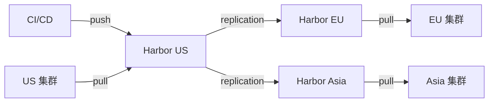

# 40. 镜像仓库与镜像分发

## 40.1 镜像仓库全景

```text
云托管:
  - AWS ECR
  - Azure ACR
  - GCP Artifact Registry
  - 阿里云 ACR
  - 腾讯云 TCR

自建(生产):
  - Harbor(主流,推荐)
  - Distribution(Docker Registry)
  - JFrog Artifactory
  - Sonatype Nexus
  - Quay(Red Hat)
  - Zot(轻量)

轻量:
  - Docker Registry
  - Distribution
  - crane(国产)
```

## 40.2 Harbor(企业级镜像仓库)

**Harbor** = CNCF 项目,企业级 Registry,事实标准。

```text
功能:
  - 多租户 + RBAC
  - 镜像复制(multi-region)
  - 漏洞扫描(Trivy)
  - 镜像签名(cosign)
  - 不可变 tag
  - 保留策略
  - 代理缓存(从 Docker Hub 缓存)
  - Webhook / Notary
```

### 安装

```bash
# 1. 下载
wget https://github.com/goharbor/harbor/releases/download/v2.10.0/harbor-online-installer-v2.10.0.tgz
tar -xzf harbor-online-installer-v2.10.0.tgz
cd harbor

# 2. 配 harbor.yml
cp harbor.yml.tmpl harbor.yml
vim harbor.yml
# hostname: harbor.example.com
# https: cert/...
# database: 内置 PostgreSQL
# data_volume: /data

# 3. 安装
./install.sh

# 4. 访问
https://harbor.example.com
# 默认 admin / Harbor12345
```

### Helm 部署(更 K8s 原生)

```bash
helm repo add harbor https://helm.goharbor.io
helm install harbor harbor/harbor -n harbor --create-namespace
```

### K8s 集成(拉镜像凭证)

```bash
# 在 Harbor 创建项目 myorg,用户 robot$myorg-puller
# 配 Secret
kubectl create secret docker-registry regcred \
  --docker-server=harbor.example.com \
  --docker-username=robot\$myorg-puller \
  --docker-password=xxx \
  --namespace=default
```

```yaml
apiVersion: v1
kind: Pod
metadata: { name: app }
spec:
  imagePullSecrets:
  - name: regcred
  containers:
  - name: app
    image: harbor.example.com/myorg/app:v1.0.0
```

### Harbor 镜像复制(multi-region)

```bash
# 1. Harbor UI → 系统管理 → 仓库 → 新建目标
# 2. 创建复制规则
#   源:harbor-us
#   目标:harbor-cn
#   触发:定时/手动/event-based
#   资源筛选:库 myorg/*  tag v*
```

### Harbor 漏洞扫描

```bash
# Harbor 内置 Trivy
# 推镜像后自动扫描
docker push harbor.example.com/myorg/app:v1.0.0

# 看扫描结果
curl -u "admin:Harbor12345" \
  "https://harbor.example.com/api/v2.0/projects/myorg/repositories/app/artifacts/v1.0.0?with_scan_overview=true"
```

### Harbor 镜像签名(cosign)

```bash
# 1. 装 Notary
# Harbor 自带 Notary(如果启用了)

# 2. 签名
cosign sign --key cosign.key harbor.example.com/myorg/app:v1.0.0
```

### Harbor 代理(缓存 Docker Hub)

```bash
# Harbor UI → 系统管理 → 仓库 → 新建目标
# Provider: Docker Hub
# 创建 project: dockerhub-proxy
# 配 endpoint: https://dockerhub-proxy.example.com
# 用法:
docker pull dockerhub-proxy.example.com/library/nginx:latest
```

### 镜像保留策略

```bash
# Harbor UI → 项目 → 配置 → 保留
# 自动删除:
#  - 30 天前推送
#  - 保留最近 10 个 tag
#  - 不删除 release tag
```

## 40.3 Distribution(Docker Registry 原版)

```bash
# 单 binary 跑
docker run -d -p 5000:5000 --restart=always \
  -v /var/lib/registry:/var/lib/registry \
  --name registry registry:2
```

K8s 部署:
```yaml
apiVersion: apps/v1
kind: Deployment
metadata: { name: registry }
spec:
  template:
    spec:
      containers:
      - name: registry
        image: registry:2
        ports: [{ containerPort: 5000 }]
        env:
        - name: REGISTRY_STORAGE_DELETE_ENABLED
          value: "true"
        volumeMounts:
        - { name: data, mountPath: /var/lib/registry }
      volumes:
      - name: data
        persistentVolumeClaim: { claimName: registry-pvc }
```

## 40.4 镜像拉取优化

### Image Pull Policy

```yaml
spec:
  containers:
  - name: app
    image: nginx:1.25
    imagePullPolicy: IfNotPresent         # 默认
    # Always: 每次都拉(慢,准)
    # IfNotPresent: 本地有就跳过(快)
    # Never: 只用本地(离线)
```

### 镜像预热(Pre-pull)

```yaml
# 关键 namespace 加 initContainer
# 把镜像缓存到所有节点
apiVersion: apps/v1
kind: DaemonSet
metadata: { name: image-prepull }
spec:
  template:
    spec:
      initContainers:
      - name: prepull
        image: myorg/app:v1.0.0
        command: ["/bin/true"]
      containers:
      - name: pause
        image: k8s.gcr.io/pause
```

### 镜像大小优化(深度)

```dockerfile
# 1. multi-stage(必须)
FROM golang:1.22 AS build
WORKDIR /app
COPY . .
RUN CGO_ENABLED=0 go build -ldflags="-s -w" -o /app/app

# 2. distroless(20MB 镜像,无 shell,无 package manager)
FROM gcr.io/distroless/static:nonroot
COPY --from=build /app/app /
USER 65532:65532
ENTRYPOINT ["/app"]
```

```dockerfile
# 3. 镜像分层优化(越小越好)
FROM gcr.io/distroless/base
COPY --from=build /app/binary /binary
COPY --from=build /etc/ssl/certs/ca-certificates.crt /etc/ssl/certs/
```

```dockerfile
# 4. 合并 RUN(减少层)
RUN apt-get update && \
    apt-get install -y --no-install-recommends \
        ca-certificates curl && \
    rm -rf /var/lib/apt/lists/*
```

```dockerfile
# 5. .dockerignore(防 COPY 无关文件)
.git
node_modules
*.log
.env
```

## 40.5 镜像分发(大规模)

### 问题:1000 节点同时拉镜像

```text
单镜像 500MB × 1000 节点 = 500GB 网络流量
中心 registry 网络带宽瓶颈
拉镜像耗时长(几十秒-几分钟)
```

### Dragonfly(P2P 镜像分发)

**Dragonfly** = 字节跳动出品,CNCF,P2P 镜像分发。

```text
节点拉镜像:
  - 不直接从 registry 拉
  - 从其他节点 P2P 拉
  - 一份镜像在多节点并行传播
  - 速度 5-10x 提升
```

```bash
# 1. 装 P2P Client(DaemonSet)
helm install dragonfly dragonfly/dragonfly -n dragonfly-system --create-namespace

# 2. 配 containerd mirror
# /etc/containerd/config.toml
[plugins."io.containerd.grpc.v1.cri".registry.mirrors]
  [plugins."io.containerd.grpc.v1.cri".registry.mirrors."docker.io"]
    endpoint = ["http://127.0.0.1:65001"]
```

### Kraken(P2P 镜像分发,Uber)

```bash
helm install kraken kraken/kraken -n kraken --create-namespace
```

### CNCF Distribution(原生 Registry 增强)

```text
- IPFS 后端
- 内容寻址(CID)
- 跨网络同步
```

## 40.6 镜像构建优化

### BuildKit(现代 Docker 构建)

```bash
# BuildKit 启用
DOCKER_BUILDKIT=1 docker build -t myorg/app:v1 .

# 多平台
docker buildx build --platform linux/amd64,linux/arm64 \
  -t myorg/app:v1 --push .
```

### BuildKit K8s 构建(kaniko)

```bash
# kaniko(无需 Docker daemon)
docker run -v $(pwd):/workspace \
  gcr.io/kaniko-project/executor:latest \
  --context=/workspace \
  --destination=myreg/myorg/app:v1 \
  --cache=true
```

```yaml
# K8s Job 构建
apiVersion: batch/v1
kind: Job
metadata: { name: build-app }
spec:
  template:
    spec:
      containers:
      - name: kaniko
        image: gcr.io/kaniko-project/executor:latest
        args:
        - --context=git://github.com/myorg/app.git#refs/heads/main
        - --destination=myreg/myorg/app:v1
        - --cache=true
        - --cache-repo=myreg/cache
      restartPolicy: Never
```

### 镜像构建缓存策略

```text
层级缓存:
  - 基础镜像不变 → 复用层
  - 改一个文件 → 重建后续所有层
  - 顺序写 RUN 命令

BuildKit cache mount:
  - /root/.cache(/go/pkg/mod)
  - /root/.npm
  - 跨构建复用
```

```dockerfile
# BuildKit 缓存
# syntax=docker/dockerfile:1.4
FROM golang:1.22
RUN --mount=type=cache,target=/root/.cache/go-build \
    --mount=type=cache,target=/go/pkg/mod \
    go build -o /app
```

## 40.7 镜像安全深度

### 镜像签名(已在 21/29 章)

```bash
# 签名
cosign sign --key cosign.key myreg/myorg/app:v1

# 验证
cosign verify --key cosign.pub myreg/myorg/app:v1

# 准入(Connaissance/Kyverno)
```

### SBOM 自动化

```bash
# 1. Syft 生成
syft myreg/myorg/app:v1 -o spdx-json > sbom.json

# 2. cosign 附加
cosign attach sbom --key cosign.key myreg/myorg/app:v1 sbom.json

# 3. 验证
cosign verify-attestation --key cosign.pub \
  --type https://spdx.dev/Document myreg/myorg/app:v1
```

### 不可变 Tag

```bash
# Harbor UI → 项目 → 配置 → 不可变 tag
# 防覆盖(防攻击者改镜像覆盖)
# 推荐:tag 用 SHA,不用 latest
```

### 镜像清理(GC)

```bash
# Harbor 自动 GC
# 配置保留策略:
#   - 保留最近 10 个 tag
#   - 30 天前的删除
#   - release tag 永不过期

# Distribution GC
bin/registry garbage-collect /etc/docker/registry/config.yml --delete-untagged=true
```

## 40.8 实战:多 region Harbor 架构



**Harbor 复制规则**:
- **pull-based**:目标主动拉
- **push-based**:源主动推
- **event-based**:推送后立即复制

## 40.9 Registry 性能优化

### 镜像分层拉取

```text
K8s 默认行为:
  拉整个镜像才启动容器

Containerd image lazy pulling:
  - 启动容器前只拉必要层
  - 大镜像启动快 50%
```

### P2P + Lazy pull

```yaml
# containerd 配置
[plugins."io.containerd.snapshotter.v1.native"]
  overlayfs = true
[plugins."io.containerd.grpc.v1.cri".containerd]
  disable_snapshot_annotations = false
  snapshotter = "stargz"
```

### 镜像预热(DaemonSet)

```yaml
apiVersion: batch/v1
kind: Job
metadata: { name: image-prepull }
spec:
  template:
    spec:
      restartPolicy: Never
      nodeSelector: { workload: critical }
      initContainers:
      - name: prepull
        image: myorg/critical-app:v1.0.0
        command: ["/bin/sh", "-c", "echo pulled"]
        # 镜像拉到此节点缓存
      containers:
      - name: sleep
        image: k8s.gcr.io/pause
```

## 40.10 Registry API 集成

### 自动同步 Git Tag → 镜像 Tag

```python
# 监听 Git push
@webhook.route('/webhook', methods=['POST'])
def git_push():
    data = request.json
    tag = data['ref'].split('/')[-1]
    sha = data['after']
    
    # 触发 CI
    trigger_ci(f"myorg/app:{tag}")
    
    # 或直接打 tag
    subprocess.run([
        'docker', 'tag', f'myreg/myorg/app:{sha}',
        f'myreg/myorg/app:{tag}'
    ])
    subprocess.run([
        'docker', 'push', f'myreg/myorg/app:{tag}'
    ])
```

### 镜像保留策略(Harbor API)

```python
import requests
import json

# 创建保留策略
rule = {
    "algorithm": "or",
    "rules": [
        {
            "tag_regex": "release-.*",
            "untagged": False,
            "scope_selector": {"repository": ["**"]},
            "tag_selectors": [{"kind": "matchLabel", "decorator": "release"}]
        }
    ],
    "trigger": {
        "kind": "Schedule",
        "settings": {"cron": "0 0 * * 0"}    # 每周日 0 点
    }
}

requests.post(
    'https://harbor.example.com/api/v2.0/projects/myorg/retentions',
    auth=('admin', 'Harbor12345'),
    json=rule
)
```

## 40.11 实战案例:200 节点集群镜像分发优化

```text
背景:200 节点 K8s 集群
  - 单镜像 800MB
  - 节点分布在 3 个 region
  - 推新镜像后,所有节点都要拉
  - 中心 registry 拉 200×800MB = 160GB 流量
  - 时间 30 分钟+

优化:
  1. Dragonfly P2P
     - 第一个节点从 registry 拉(800MB)
     - 其他节点 P2P 拉(并行)
     - 整体 5 分钟
  2. 镜像分层(layered pull)
     - 基础层缓存
     - 应用层只拉变动的
  3. 镜像预热(DaemonSet)
     - 新版本发布时,先在后台预热
     - 滚动升级时秒级切换
  4. 多 region registry 复制
     - EU 集群拉 EU registry
     - 不跨 region 拉
```

## 40.12 专家清单

### Harbor
- [ ] 部署 Harbor(Helm)
- [ ] 多租户 + RBAC
- [ ] 镜像复制(多 region)
- [ ] 漏洞扫描
- [ ] 镜像签名(cosign)
- [ ] 代理缓存(Docker Hub)
- [ ] 不可变 tag
- [ ] 保留策略

### 镜像优化
- [ ] distroless / chainguard
- [ ] multi-stage 构建
- [ ] BuildKit cache
- [ ] .dockerignore
- [ ] 多平台(amd64/arm64)

### 镜像分发
- [ ] Dragonfly / Kraken(P2P)
- [ ] 镜像预热(DaemonSet)
- [ ] 多 region 复制
- [ ] Lazy pulling(Stargz)

### 安全
- [ ] cosign 签名验证
- [ ] SBOM 生成 + 验证
- [ ] 漏洞扫描自动化
- [ ] 不可变 tag
- [ ] 定期 GC

### 性能
- [ ] 镜像大小 < 100MB
- [ ] 基础层复用
- [ ] P2P 分发
- [ ] 启动时间 < 5s

## 40.13 本章小结

- **Harbor** = 企业级 Registry(CNCF,推荐)
- **多 region 复制** = 全球分发
- **Dragonfly** = P2P 镜像分发(节省 90% 流量)
- **BuildKit** = 现代构建(快 10x)
- **cosign** = 镜像签名(供应链)
- **SBOM** = 依赖清单
- **不可变 tag** = 安全
- 实战:Harbor + Trivy + cosign + Dragonfly 全套
- 关键:镜像小、签名 + 扫描 + P2P 分发
