# Kubernetes 专家级教程

> 从零开始,学完直接成为 Kubernetes 专家。本教程以 **架构 → 核心资源 → 调度 → 可观测 → 生产 → SRE** 为主线,所有示例都可在 minikube / kind / 公有云集群中跑通。

## 你将学到

- Kubernetes 整体架构、控制面/数据面、声明式 API 设计哲学
- kubectl 全部常用命令 + 调试技巧 + 插件生态
- Pod / Deployment / StatefulSet / DaemonSet / Job 全场景
- Service 三种类型 + Ingress + Gateway API
- ConfigMap / Secret / PV / PVC / StorageClass
- 调度器机制:nodeSelector / affinity / taint / topology spread
- HPA / VPA / KEDA 自动扩缩容
- RBAC / NetworkPolicy / SecurityContext / PodSecurityStandards
- Prometheus + Grafana + Loki + Tempo 可观测性
- 备份恢复(etcd / Velero)、安全加固、Operator 开发
- GitOps(ArgoCD / Flux)、性能调优、SRE 故障演练

## 目录

### 基础篇

| # | 主题 | 重点 |
|---|------|------|
| [01](./01-Kubernetes核心概念与架构.md) | 核心概念与架构 | 控制面/数据面 / 声明式 API / etcd / 组件协作 |
| [02](./02-环境搭建与kubectl详解.md) | 环境搭建与 kubectl | minikube/kind/k3s / kubectl 全部命令 / 插件 |
| [03](./03-Pod深度解析与生命周期.md) | Pod 深度解析 | 容器设计模式 / 生命周期 / probe / 优雅终止 |
| [04](./04-Deployment与滚动升级.md) | Deployment 滚动升级 | ReplicaSet / 策略 / 回滚 / 蓝绿/金丝雀 |
| [05](./05-Label与Selector机制.md) | Label 与 Selector | 核心机制 / 推荐标签 / 节点/Pod 亲和 |

### 核心资源篇

| # | 主题 | 重点 |
|---|------|------|
| [06](./06-Service与负载均衡.md) | Service 与负载均衡 | ClusterIP / NodePort / LoadBalancer / Headless / Endpoint |
| [07](./07-Ingress与外部访问.md) | Ingress 与外部访问 | Nginx Ingress / Gateway API / TLS / 灰度 |
| [08](./08-ConfigMap与Secret配置管理.md) | ConfigMap 与 Secret | 配置注入 / 热更新 / SOPS / External Secrets |
| [09](./09-存储卷Volume与PV-PVC.md) | 存储卷与 PV/PVC | emptyDir/hostPath / PV/PVC / StorageClass / CSI |
| [10](./10-StatefulSet与有状态应用.md) | StatefulSet 有状态应用 | 稳定网络标识 / 顺序启停 / MySQL/Redis/Kafka |
| [11](./11-DaemonSet与Job-CronJob.md) | DaemonSet 与 Job | 节点级守护 / 一次性任务 / 定时任务 |

### 调度与高级篇

| # | 主题 | 重点 |
|---|------|------|
| [12](./12-调度器与污点容忍.md) | 调度器与污点 | 调度流程 / nodeSelector / affinity / taint / topology |
| [13](./13-HPA-VPA自动扩缩容.md) | HPA/VPA 自动扩缩容 | HPA v2 / VPA / KEDA / 稳定窗口 / 冷却时间 |
| [14](./14-RBAC权限管理.md) | RBAC 权限管理 | User/Group/ServiceAccount / Role/ClusterRole |
| [15](./15-网络策略与ServiceMesh.md) | 网络策略与 Service Mesh | NetworkPolicy / Calico/Cilium / Istio 概念 |
| [16](./16-资源配额与LimitRange.md) | 资源配额与 LimitRange | ResourceQuota / LimitRange / PriorityClass |

### 可观测性篇

| # | 主题 | 重点 |
|---|------|------|
| [17](./17-Prometheus与Grafana监控.md) | Prometheus + Grafana | 指标体系 / ServiceMonitor / 告警 / Dashboard |
| [18](./18-Loki日志收集与EFK.md) | Loki 日志收集 | Promtail / Loki / Grafana / EFK 对比 |
| [19](./19-Troubleshooting排错实战.md) | Troubleshooting 排错 | 8 大类故障 / 排查方法论 / 真实案例 |

### 生产实战篇

| # | 主题 | 重点 |
|---|------|------|
| [20](./20-集群高可用与备份恢复.md) | 高可用与备份恢复 | etcd 备份 / Velero / 灾备 / 多集群 |
| [21](./21-安全加固与CIS-Benchmark.md) | 安全加固与 CIS | PodSecurityStandards / 镜像安全 / 审计 |
| [22](./22-Operator开发与CRD.md) | Operator 开发与 CRD | CRD / Controller / kubebuilder / 真实案例 |
| [23](./23-GitOps与ArgoCD-Flux.md) | GitOps 与 ArgoCD/Flux | 声明式部署 / Application / Kustomize / 多环境 |

### 专家篇

| # | 主题 | 重点 |
|---|------|------|
| [24](./24-性能调优与生产检查清单.md) | 性能调优与生产清单 | 调优维度 / 容量规划 / 发布检查清单 |
| [25](./25-SRE实战与故障演练.md) | SRE 实战与故障演练 | SLO/SLI / Chaos Engineering / 故障复盘 |

## 学习路径

```mermaid
graph LR
  A[1. 架构] --> B[2. kubectl]
  B --> C[3. Pod]
  C --> D[4. Deployment]
  D --> E[5. Label]
  E --> F[6. Service]
  F --> G[7. Ingress]
  G --> H[8. Config]
  H --> I[9. 存储]
  I --> J[10. StatefulSet]
  J --> K[11. Daemon/Job]
  K --> L[12. 调度]
  L --> M[13. 扩缩容]
  M --> N[14. RBAC]
  N --> O[15. 网络策略]
  O --> P[16. 资源配额]
  P --> Q[17-18. 可观测]
  Q --> R[19. 排错]
  R --> S[20-21. 生产]
  S --> T[22. Operator]
  T --> U[23. GitOps]
  U --> V[24-25. SRE]
```



| 阶段 | 文档 | 学完能 |
|------|------|--------|
| 入门 | 01-05 | 理解 K8s 架构,能部署一个高可用 web 服务 |
| 进阶 | 06-11 | 掌握所有核心工作负载,处理有状态/批处理场景 |
| 高级 | 12-16 | 调度、扩缩容、安全、多租户 |
| 生产 | 17-23 | 完整可观测体系 + GitOps + Operator |
| 专家 | 24-25 | 性能调优 + SRE 故障演练 + 容量规划 |

## 速查表(收藏)

### kubectl 必记

```bash
# 集群信息
kubectl cluster-info
kubectl get nodes -o wide
kubectl get componentstatuses          # 控制面组件
kubectl get events --sort-by=.metadata.creationTimestamp

# 资源操作
kubectl get pods -A                      # 所有命名空间
kubectl get pod -n ns -l app=nginx       # 带 label 过滤
kubectl get pod -o yaml                  # 完整 yaml
kubectl get pod -o jsonpath='{.items[*].spec.nodeName}'  # 自定义输出
kubectl describe pod <name>              # 详细信息
kubectl logs <pod> -c <container> --previous  # 上次容器日志
kubectl exec -it <pod> -- /bin/sh        # 进入容器
kubectl cp <pod>:/path ./local           # 复制文件
kubectl port-forward <pod> 8080:80       # 端口转发

# 调试
kubectl run debug --rm -it --image=busybox --restart=Never -- sh  # 临时容器
kubectl debug <pod> -it --image=nicolaka/netshoot --target=<container>  # 注入调试容器(K8s 1.23+)
kubectl auth can-i create pods --as=system:serviceaccount:default:sa  # RBAC 检查

# 编辑/应用
kubectl apply -f manifest.yaml
kubectl apply -k ./kustomize-dir/        # Kustomize
kubectl edit deploy nginx                # 在线编辑
kubectl diff -f manifest.yaml            # 预览变更
kubectl scale deploy/nginx --replicas=5
kubectl set image deploy/nginx nginx=nginx:1.25
kubectl rollout status deploy/nginx
kubectl rollout undo deploy/nginx        # 回滚
kubectl rollout history deploy/nginx
kubectl delete -f manifest.yaml
```

### YAML 模板

```yaml
apiVersion: apps/v1
kind: Deployment
metadata:
  name: nginx
  namespace: default
  labels:
    app: nginx
    app.kubernetes.io/name: nginx        # 推荐标签
    app.kubernetes.io/instance: nginx
    app.kubernetes.io/version: "1.25"
    app.kubernetes.io/managed-by: kubectl
spec:
  replicas: 3
  strategy:
    type: RollingUpdate                  # RollingUpdate / Recreate
    rollingUpdate:
      maxSurge: 25%                      # 最多超 25% 副本
      maxUnavailable: 25%                # 最多不可用 25%
  selector:
    matchLabels:
      app: nginx
  template:
    metadata:
      labels:
        app: nginx
    spec:
      affinity: {}                       # 见 12
      containers:
      - name: nginx
        image: nginx:1.25
        ports:
        - containerPort: 80
        resources:
          requests: { cpu: 100m, memory: 128Mi }
          limits:   { cpu: 500m, memory: 512Mi }
        livenessProbe:
          httpGet: { path: /, port: 80 }
          initialDelaySeconds: 10
          periodSeconds: 5
        readinessProbe:
          httpGet: { path: /, port: 80 }
          initialDelaySeconds: 2
        startupProbe:                     # 慢启动场景
          httpGet: { path: /, port: 80 }
          failureThreshold: 30
          periodSeconds: 10
        securityContext:
          runAsNonRoot: true
          readOnlyRootFilesystem: true
          capabilities: { drop: [ALL] }
        volumeMounts:
        - name: data
          mountPath: /var/cache/nginx
      volumes:
      - name: data
        emptyDir: {}
```

### 推荐标签(`app.kubernetes.io/*`)

```yaml
labels:
  app.kubernetes.io/name: <app>          # 应用名
  app.kubernetes.io/instance: <rel>      # Release 名
  app.kubernetes.io/version: "1.25"      # 语义化版本
  app.kubernetes.io/component: backend   # 组件:db/cache/frontend
  app.kubernetes.io/part-of: ecommerce   # 所属系统
  app.kubernetes.io/managed-by: helm     # 管理工具
```

## 工具链

| 工具 | 用途 |
|------|------|
| [minikube](https://minikube.sigs.k8s.io/) | 本地单节点 K8s |
| [kind](https://kind.sigs.k8s.io/) | 本地多节点 K8s(测试) |
| [k3d](https://k3d.io/) | k3s 容器化 |
| [k9s](https://k9scli.io/) | 终端 UI |
| [Lens](https://k8slens.dev/) | 桌面 GUI |
| [stern](https://github.com/stern/stern) | 多 pod 日志聚合 |
| [kubectl-neat](https://github.com/itaysk/kubectl-neat) | 精简 yaml |
| [kubectl-tree](https://github.com/ahmetb/kubectl-tree) | 资源层级 |
| [kubectx](https://github.com/ahmetb/kubectx) | context 切换 |
| [polaris](https://github.com/FairwindsOps/polaris) | best practice 扫描 |
| [pluto](https://github.com/FairwindsOps/pluto) | 检测弃用 API |
| [trivy](https://trivy.dev/) | 镜像/集群安全扫描 |
| [velero](https://velero.io/) | 备份恢复 |
| [argocd](https://argo-cd.readthedocs.io/) | GitOps |
| [flux](https://fluxcd.io/) | GitOps |

## 实战练习清单

完成下面所有项,你就是 K8s 专家:

- [ ] 用 minikube/kind 搭建本地集群
- [ ] kubectl 掌握 50+ 命令
- [ ] 写一个完整 Deployment + Service + Ingress 应用
- [ ] 用 StatefulSet 部署 MySQL 或 Redis
- [ ] 用 DaemonSet 部署日志采集器
- [ ] 用 Job 跑一次性迁移任务
- [ ] 用 CronJob 跑定时任务
- [ ] 配置 HPA 基于 CPU/内存扩缩容
- [ ] 写 NetworkPolicy 限制 namespace 流量
- [ ] 配置 RBAC 给不同团队权限
- [ ] 部署 Prometheus + Grafana 监控
- [ ] 接入 Loki 收集日志
- [ ] 模拟一次 Pod 故障,完整排查
- [ ] 用 Velero 备份恢复 namespace
- [ ] 接入 ArgoCD,实现 GitOps 部署
- [ ] 给应用加 PodSecurityStandards
- [ ] 用 kustomize 管理多环境
- [ ] 写一个简单的 CRD + Controller
- [ ] 跑一次 chaos 实验(杀 pod/网络分区)
- [ ] 写一份故障复盘文档

## 进阶阅读

- [官方文档](https://kubernetes.io/zh-cn/docs/)
- [Kubernetes The Hard Way](https://github.com/kelseyhightower/kubernetes-the-hard-way)
- [kubectl 速查表](https://kubernetes.io/docs/reference/kubectl/cheatsheet/)
- [CNCF 官方培训](https://www.cncf.io/certification/cka/)
- [CKA 考试大纲](https://github.com/cncf/curriculum)
- [Kubernetes Patterns](https://k8spatterns.io/)
- [Production-Grade Container Build](https://github.com/GoogleContainerTools/distroless)
