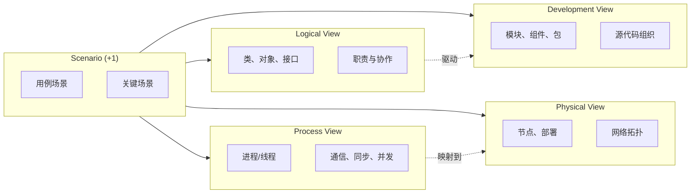
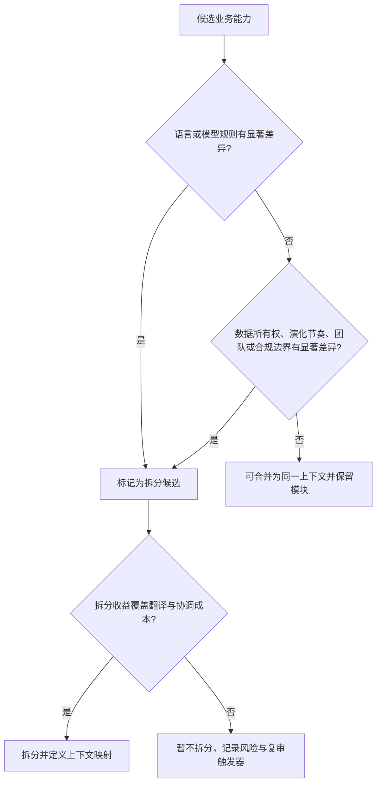
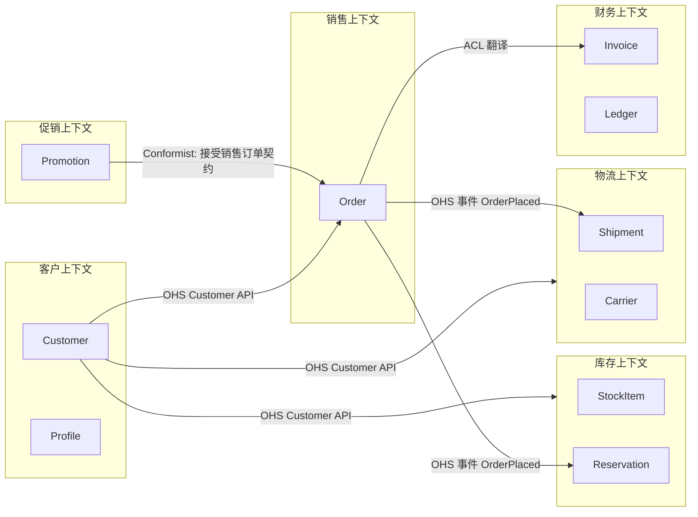

# 第 3 章 架构视图、模块化与架构风格；领域驱动设计

> 范畴：结构 (Structure) 与领域 (Domain)
> 案例：多租户电商平台（Multi-tenant E-commerce Platform，下称 **MECP**）
> 前置章节：第 1 章 架构思想、第 2 章 需求与质量

---

## 3.1 学习目标

完成本章后，你应该能够：

1. **区分**视图（View）、视点（Viewpoint）与模型（Model），并能按利益相关人选择适当的视角。
2. **解释** 4+1 视图与 C4 模型的关系、差异与适用阶段。
3. **推导**给定模块的内聚度与耦合度，并对模块边界提出重构方向。
4. **陈述**信息隐藏（Information Hiding）与六条组件/包原则（REP、CCP、CRP、ADP、SDP、SAP），并正确解释 I/A/D 指标。
5. **比较**分层、模块化单体、微服务、事件驱动、管道-过滤器、六边形、CQRS 在结构、演化、运维、团队四个维度上的差异。
6. **运用** DDD 战略设计拆分限界上下文（Bounded Context），绘制上下文映射（Context Map），并定义聚合（Aggregate）的一致性边界。
7. **辨别**"风格不是目标"——架构风格是手段，业务复杂度与质量属性需求才是目的。

---

## 3.2 架构视图

### 3.2.1 问题的本质

> 一份源代码并不存在"完整"的架构表示。任何投影都会丢失信息，但合适的投影能让目标读者在一个画面中看清关心的结构。

软件系统是**多维结构（multi-dimensional structure）**：它同时拥有逻辑分层、运行时进程、部署拓扑、数据分布、团队归属、时间演化等切片。试图用一张图表达所有切片，会让图既无法被代码作者看清，也无法被运维、安全、合规等利益相关人理解。

**架构模型三件套**（出自 ISO/IEC 42010 / IEEE 1471）：

| 概念 | 英文 | 含义 |
|---|---|---|
| 视点 | Viewpoint | 选取与呈现模型的约定（约定构建什么、忽略什么、采用什么符号）|
| 视图 | View | 按某一视点，从系统中提取并组织得到的表示 |
| 模型 | Model | 用于构造视图的抽象（不一定是代码，可以是元素、关系、约束）|

> 推导：每张架构图都暗含一个视点。读图时先问"这是谁的视图"，比立刻看节点和箭头更有效。

### 3.2.2 4+1 视图（Kruchten 1995）

Philippe Kruchten 在 *IEEE Software* 1995 提出 4+1 视图模型，目标是为**面向对象分布式系统**提供多视角可读蓝图。



四种基本视图 + 一组场景（Use-case Scenarios）：

| 视图 | 主要利益相关人 | 核心问题 | 典型工具 |
|---|---|---|---|
| 逻辑视图（Logical View） | 架构师、开发者 | 系统为最终用户提供什么功能？对象责任如何分配？| UML 类图、对象图、状态图 |
| 过程视图（Process View） | 架构师、性能工程师 | 运行时如何通信？并发、线程、死锁？| 序列图、协作图、活动图 |
| 物理视图（Physical View） | 运维、SRE | 软件到硬件的映射？网络、容灾？| 部署图 |
| 开发视图（Development View） | 开发者、构建工程师 | 源码如何组织？模块依赖、构建依赖？| 包图、组件图、构建脚本 |
| 场景（Scenarios / +1） | 全部 | 关键的端到端用例如何串联四视图？| 用例图、文本脚本 |

4+1 视图的**作用**是约束讨论：让架构评审时不再"各看各的图"，而是按视点把图对齐。

### 3.2.3 C4 模型（Brown 2010-）

Simon Brown 的 C4 模型提供层级化核心图：System Context、Container、Component 与可选 Code。它还定义 Dynamic、Deployment 等 supporting diagrams 来表达运行时交互和部署；数据、安全、组织等关注点仍可按需要补充专门视图。

| 层级 | 英文 | 关注点 | 读者 |
|---|---|---|---|
| 第 1 级 | System Context | 待描述系统与用户、外部系统的关系 | 技术与非技术利益相关者 |
| 第 2 级 | Container | 系统内部可运行/部署或存储数据的主要单元，如应用、数据库、消息代理 | 架构师、开发者、运维 |
| 第 3 级 | Component | 某个容器内部具有明确职责和接口的主要组件 | 开发者 |
| 第 4 级 | Code | 必要时展示关键实现元素；通常按需使用 | 开发者 |

> C4 与 4+1 可以互补，但 C4 不是 4+1 的严格“实例化”。前者是层级化软件结构抽象，后者组织逻辑、过程、开发、物理视图并用场景验证；二者覆盖的关注点不同。

### 3.2.4 视点与 C4 的对照

| 维度 | 4+1 | C4 |
|---|---|---|
| 组织轴 | 多个并列关注点/视图 | 从系统上下文缩放到容器与组件 |
| 表示法 | 原论文使用多种表示法，常配合 UML，但不强制只有 UML | 简单方框、关系和明确标签 |
| 擅长问题 | 逻辑、并发、开发、部署以及场景 | 软件系统边界、主要运行单元和内部组件 |
| 需要补充/扩展 | 上下文、安全、数据等视图视项目而定 | 可用 C4 Dynamic/Deployment 补动态与部署；数据、安全等再补专门视图 |
| 使用方式 | 选择真正有用的视图，不按人数机械增加 | 不必画满四级；按受众和风险选择 |
| 工具支持 | 主流 UML 工具 | Structurizr DSL、PlantUML、IcePanel |

### 3.2.5 其它视点框架

- **arc42**：12 节文档模板：介绍与目标、约束、范围与上下文、解决方案策略、构建块视图、运行时视图、部署视图、横切概念、架构决策、质量需求、风险与技术债、术语表。
- **Rozanski & Woods**：七个核心 viewpoints——Context、Functional、Information、Concurrency、Development、Deployment、Operational；quality perspectives（如安全、性能、可用性、演进）横切多个视点。
- **SEI Views and Beyond**：以模块、组件—连接件、分配三类结构及视图文档方法组织架构表达。
- **Operational View** 一词也出现在 DoDAF/MODAF 等企业/国防框架中，含义与 Rozanski & Woods 的 Operational Viewpoint 不完全相同；不要笼统归因于 TOGAF。

> 框架是关注点清单，不是必须画满的文档套餐。按利益相关者问题和风险选择最小充分视图，并明确框架术语的来源。

### 3.2.6 案例：MECP 的视图集

**MECP 背景**：B2B SaaS 形态的多租户电商，租户分基础版与旗舰版；支持独立站、微信小程序、API 集成；峰值 50 万 QPS；中国 + 东南亚部署。

| 视图 | 工具 | 关键元素 |
|---|---|---|
| System Context | Structurizr DSL | 终端用户、商家后台、第三方支付、物流 SaaS、ERP、CDN |
| Container | C4 Level 2 | Storefront BFF、Merchant Admin、Order Service、Inventory Service、Payment Service、Search Service、Notification Service、Promo Engine；MySQL、Elasticsearch、Kafka、Redis、RDS |
| Component | C4 Level 3（按服务）| 订单服务的聚合根、领域服务、仓储、事件发布器 |
| Process | 4+1 进程视图 | Saga 编排器、库存锁释放的补偿路径、跨服务事务 |
| Deployment | 4+1 物理视图 | 多可用区 + 多区域，K8s 集群，MySQL 主从 |
| Development | 模块图 | 多仓库（Polyrepo），按服务分仓；共享 libs 通过 internal registry |

**视图间一致性约束**：

- Container 视图中的可部署应用应能映射到部署视图中的节点/实例；数据库、外部托管服务等容器则映射为相应资源，而非都要求“副本”。
- 动态/过程视图中的跨容器调用应与 Container 视图中的边界和关系一致；容器内部交互无需伪装成跨容器调用。
- Component 视图中的每个组件属于被展开的某个容器；同一逻辑库若被多个容器复用，应在各自上下文中表达实例或明确共享模型，而非强制全局唯一归属。

> 推导：视图间的"一致性"是比"画得漂亮"更重要的质量。架构评审应优先检查一致性，再讨论细节。

### 3.2.7 反模式

1. **唯一视图（One-View-Fits-All）**：试图用一张部署图同时讲清组件、进程、团队。读图者无法对齐心智。
2. **视图即 UML**：强行使用 UML 类图讲部署，把 CPU 节点画成"类"。
3. **视图与代码脱节**：视图在 Confluence 躺在 3 年前，代码已演化若干版本。视图成为"叙事装修"。
4. **视图污染（View Smog）**：把运行时信息塞进开发视图，让开发者看不清依赖。
5. **场景缺失**：四视图都画了，但没有"+1"用场景串联，导致无法回答"用户下单时到底走过哪些节点"。

### 3.2.8 检查清单

- [ ] 每个视图都有显式视点声明（读者、问题、表示法、源）。
- [ ] 视图命名遵循同一套词汇（避免"服务"与"组件"混用）。
- [ ] 视图间一致性已建立（每张图都有可机器校验的桥接规则）。
- [ ] +1 场景可让非技术利益相关人独立走通。
- [ ] 视图与代码 diff 同步（CI 自动检查）。
- [ ] 每张图只回答 1-2 个问题，不堆叠信息。

### 3.2.10 练习

1. **读图练习**：选你团队最近一个项目的 4+1 视图，列出每张图回答了什么问题、忽略了什么、未回答什么。
2. **视点声明**：为你的系统写一份"视点目录"（每个视点 150 字内）。
3. **视图映射**：对一个服务画 C4 Component 图，再分别说明它与 4+1 的逻辑视图、开发视图回答哪些不同问题；二者不是一一对应。
4. **一致性检验**：用脚本读取你的部署清单（K8s Manifest）并与 Container 视图比较，列出孤儿容器与幽灵组件。

---

## 3.3 模块化基础

### 3.3.1 模块与模块化

> 模块（Module）= 一组职责相关、可被命名、对外隐藏内部细节的计算单元。

模块化（Modularity）= 系统被分解为模块、模块之间通过受控接口协作的性质。**模块化的目的不是减少代码量，而是允许系统在演化时，把变动局限在有限模块内，而不波及其他模块。**

公式（概念定义，非数值公式）：

$$
\text{演化成本} \approx f(\text{跨模块改动数} \times \text{模块耦合度})
$$

> 解释：跨模块改动数取决于需求性质；耦合度取决于设计。即使是简单需求，耦合度高的模块也会让改动放大。

### 3.3.2 内聚（Cohesion）

> 内聚 = 模块内部元素彼此关联的紧密程度。

由 Yourdon & Constantine 1979 提出，沿用至今的 7 级内聚（从最差到最佳）：

| 等级 | 名称 | 含义 | 信号 |
|---|---|---|---|
| 1 | 偶然内聚（Coincidental）| 元素毫无关联 | 工具类 `Util` |
| 2 | 逻辑内聚（Logical）| 同类操作但参数决定分支 | `print(report|receipt)` |
| 3 | 偶然时间（Temporal）| 同时被调用的不相关操作 | `initAll()` |
| 4 | 过程内聚（Procedural）| 必须按固定顺序执行 | `step1(); step2();` |
| 5 | 通信内聚（Communicational）| 操作同一数据 | `read; write;` |
| 6 | 顺序内聚（Sequential）| 一输出是下一输入 | parser → token → AST |
| 7 | 功能内聚（Functional）| 元素共同完成单一功能 | `placeOrder()` |

**实际工程中** 1-3 通常归并为"差内聚"；4-5 为"中等"；6-7 为"目标"。

### 3.3.3 耦合（Coupling）

> 耦合 = 模块之间相互依赖的紧密程度。

Stevens 1974 的 7 级耦合（从最差到最佳）：

| 等级 | 名称 | 含义 |
|---|---|---|
| 1 | 内容耦合（Content）| 直接修改另一模块内部 |
| 2 | 公共耦合（Common）| 共享全局可变状态 |
| 3 | 外部耦合（External）| 共享外部数据格式 |
| 4 | 控制耦合（Control）| 把控制标志当作参数 |
| 5 | 标记耦合（Stamp）| 传递整个数据结构但只用一个字段 |
| 6 | 数据耦合（Data）| 只传递必要数据参数 |
| 7 | 消息耦合（Message）| 只传递消息（无可变共享）|

> 推导：工程实践中，常见目标是把耦合控制在"数据耦合"或"消息耦合"。"控制耦合"是隐藏最深的耦合——一次简单的标志位新增，会引起上下游多次同步修改。

### 3.3.4 信息隐藏与封装

> 信息隐藏（Information Hiding, Parnas 1972）= 模块只暴露完成职责所必需的最小信息。

Parnas 的经典论文指出：**模块划分的依据不是"流程步骤"，而是"可能被改变的决策"。** 因此判断两个职责是否应放同一模块，问的不是"它们是否同时被调用"，而是"它们是否因同一理由改变"。

> 公式（决策导向）：
> $\text{模块} = \{ \text{职责} \mid \text{职责} \text{由同一组决策驱动} \}$
> 解释：决策改变 ⇒ 需修改的模块集合最少。

封装（Encapsulation）则是信息隐藏的一种**实现机制**——用语言/平台提供的可见性约束防止意外访问。**信息隐藏是设计原则，封装是实现手段。**

### 3.3.5 依赖原则（Robert Martin 包级原则）

模块化到**组件/包（Component/Package）**层级后，Robert C. Martin 给出六条相关原则：

| 原则 | 英文 | 含义 | 推论 |
|---|---|---|---|
| 重用—发布等价 | Reuse/Release Equivalence Principle (REP) | 重用粒度就是发布粒度 | 可重用库应有发布、版本与兼容策略 |
| 共同重用 | Common Reuse Principle (CRP) | 不应迫使使用者依赖其不需要且会独立变化的类 | 按共同使用关系组织包 |
| 共同封闭 | Common Closure Principle (CCP) | 会因同类变化而一起修改的类应尽量聚合 | 与包级变化原因有关 |
| 无环依赖 | Acyclic Dependencies Principle (ADP) | 发布/组件依赖图应避免环 | 通过依赖反转、拆分或合并恢复可构建性 |
| 稳定依赖 | Stable Dependencies Principle (SDP) | 依赖应指向更稳定的组件 | 不稳定度 $I=Ce/(Ca+Ce)$ |
| 稳定抽象 | Stable Abstractions Principle (SAP) | 稳定组件应以足够抽象性保持可扩展 | 抽象度 $A=Na/Nc$ |

两条配套的可量化指标：

$$
I = \frac{\text{出度 (Fan-out)}}{\text{入度 (Fan-in)} + \text{出度 (Fan-out)}}
$$

$$
A = \frac{N_a}{N_c}
$$

> 解释：按 Robert C. Martin 的定义，$I$ 越接近 **0** 越稳定（入向依赖多、出向依赖少），越接近 1 越不稳定；$A$ 越接近 1 越抽象。到主序列的归一化距离常写为 $D=|A+I-1|$，越接近 0 表示抽象度与稳定度较平衡。它是启发式诊断指标，不是架构质量目标；稳定的具体组件和抽象但无人依赖的组件仍可能合理。

### 3.3.6 模块健康度指标矩阵

| 指标 | 含义 | 工具 | 使用方式 |
|---|---|---|---|
| 不稳定度（I）| 出向/总依赖比例 | jdeps、NDepend、Degraph | 按组件角色和趋势解释；核心叶子组件可合理较高 |
| 抽象度（A）| 抽象类型占比 | 依赖分析工具 | 与扩展责任、I、D 联合解释 |
| 主序列距离（D）| 抽象度与不稳定度的相对平衡 | 同上 | 观察离群，不作单一质量门槛 |
| CBO | 类间耦合 | 静态分析工具 | 口径依工具而异，按同类基线判断 |
| LCOM | 方法内聚缺口 | 静态分析工具 | 多种定义不可横向比较 |

### 3.3.7 案例：MECP 订单模块切分

**问题**：原 `order-service` 包含订单 CRUD、库存预占、促销计算、物流调度、发票生成。QPS 上升后，促销计算成为瓶颈，但无法独立扩容。

**Parnas 决策分析**：

| 职责 | 变更理由 | 是否共同理由 |
|---|---|---|
| 订单 CRUD | 订单状态业务规则 | 否 |
| 库存预占 | 库存中心规则 | 否 |
| 促销计算 | 营销规则 | 否 |
| 物流调度 | 物流商规则 | 否 |
| 发票生成 | 税务规则 | 否 |

每个职责对应独立决策源。建模为五个模块之后：

- 依赖方向（SDP）：`promo` 与 `inventory` 依赖 `order` 的领域事件时，会提高 `order` 的入向依赖 $Ca$，因此降低其不稳定度 $I$；还需检查这种稳定性是否符合变化关系。
- 抽象匹配（SAP）：结合 $A$ 与 $D$ 判断稳定组件是否提供足以演化的抽象；“有公开接口”本身不等于高抽象度。
- 部署形态：只有把促销模块拆为独立部署单元后才可单独 HPA；模块化单体内部不能仅靠代码模块独立扩容。

**结果**：促销计算优化可以独立部署，订单核心的发布频率从一周 2 次降到一月 1 次。

### 3.3.8 反模式

1. **数据袋（Data Bag）**：把不相关数据塞进同一聚合（如 `Order` 含 `billingAddress + shippingAddress + customerProfile + promoSnapshot`），导致聚合膨大。
2. **共享数据库（Shared DB）**：两个模块直接读写同一张表，绕过接口。耦合度直冲公共耦合。
3. **链式依赖（A → B → C → A）**：包循环，导致构建顺序不可能，团队互相等待。
4. **标志位驱动（Flag-Driven）**：用 `Order(isPriority)` 控制流程路径，分支爆炸。
5. **工具类吞噬者（Util God Class）**：所有不知放哪的代码到 `Util`，引入偶然内聚。

### 3.3.9 检查清单

- [ ] 每个模块能用一句话说出"其内部隐藏的决策是什么"。
- [ ] 不存在跨模块共享的可变状态。
- [ ] 包依赖图通过工具检测无环。
- [ ] I、A、D 按组件角色、依赖方向和历史趋势解释，不设“核心 I<0.3”门槛。
- [ ] 抽象只在需要稳定扩展点时引入；不以接口/抽象类数量本身判优。
- [ ] 没有"工具类"成为仓库的兜底分类。
- [ ] 每个模块都有独立的测试套件。

### 3.3.10 练习

1. **指标计算**：给你团队一个模块，用依赖分析工具算出其 I、A、D；判断是否在主序列上。
2. **Parnas 重构**：选一个改动频繁的类，列出其内部所有"被改变的决策"，把它们分行写下来，判断哪些可以独立成模块。
3. **依赖环破解**：画出你仓库的包依赖图，若存在环，列出三种破解方案（依赖反转、合并包、引入中性接口）并比较成本。
4. **内聚性自检**：对你上周的一个 PR，统计其中变更横跨几个模块；若横跨 ≥ 3，记录它们的共同决策点。

---

## 3.4 架构风格

### 3.4.1 风格不是目标

> 架构风格（Architectural Style）= 一组**约束**（元素 + 关系 + 约束 + 语义），表达了系统如何被组织。

**常见误解**：

- 把风格当作时髦标签。"我们用微服务。""我们用 EDA。"
- 把风格当作终点，而不是为业务复杂度与技术约束服务。

**正确心智**：

> 风格选择依据来自具体质量属性场景、业务不变量、约束、团队能力与演进成本。它们之间不存在可直接相乘或用逻辑蕴含计算的通用公式。

每种风格提供一组结构约束与机制，可能改善某些属性，也把复杂性转移到其他地方。例如进程边界可支持独立部署和故障隔离，但会引入网络失败与契约演进；异步消息可削峰和解耦时间，却增加状态、顺序、积压和调试成本。幂等、补偿等并非所有风格实例“一律必须”，而由所选交付/失败语义决定。

### 3.4.2 分层架构（Layered Architecture）

> 经典三层：Presentation（表现层）、Business（业务层）、Persistence（持久层）。亦可扩展为 N 层。

**结构**：

```
┌────────────────────────┐
│   Presentation Layer   │  ← UI、API、Controller
├────────────────────────┤
│   Business Layer       │  ← 领域规则、事务脚本、领域服务
├────────────────────────┤
│   Persistence Layer    │  ← 仓储、ORM、数据库
└────────────────────────┘
```

**机制**：

- 严格依赖：上层依赖下层，禁止向上或跨层。
- 数据传输对象（DTO）用于跨层；层内可暴露领域对象。

**适用边界**：

- 业务规则简单、CRUD 为主的中后台系统。
- 团队规模小、缺乏 DDD 经验。

**失败模式**：

- "贫血领域"（Anemic Domain Model）：业务层退化为事务脚本，所有逻辑在 Service 中，领域对象只是数据袋。
- 分层成单一轴：所有逻辑都按"水平"分层，忽略"垂直"能力（订单、营销、库存）的内聚需求。

### 3.4.3 模块化单体（Modular Monolith）

> 单个部署单元，内部按能力垂直切分为模块；模块间通过明确定义的接口通信，禁止跨模块直访数据库。

**结构**：

```
┌─────────────────────────┐
│   Order Module          │
│   ┌─────────────────┐   │
│   │  Public API     │   │
│   └─────────────────┘   │
│   ┌─────┐ ┌─────┐       │
│   │Agg │ │Svc │ （私有）│
│   └─────┘ └─────┘       │
├─────────────────────────┤
│   Inventory Module      │
│   ...                   │
├─────────────────────────┤
│   Shared Kernel（极小） │
└─────────────────────────┘
```

**机制**：

- 模块间使用语言可见性、构建规则和显式接口限制依赖。
- 可以共享一个物理数据库，但模块拥有自己的表/模式与写入规则；是否允许受控只读视图取决于契约和迁移目标。
- 模块协作可以同步调用或进程内事件；框架事件总线不是模块化的必要条件。

**适用信号**：希望保留单部署/本地事务的简单性，同时需要明确变化边界；团队能用测试、权限和构建规则守住模块。不存在“5–20 人”或“规模尚未大”的通用阈值，性能需求也不自动排除单体水平扩展。

**失败模式**：

- 名义模块化，实质共享表：任何一个模块直接读其他模块的表。
- 模块间同步依赖过密：虽无网络级联，但会形成长调用链、共同变更和整体事务膨胀。
- 缺乏架构测试与契约测试：边界随便利性逐步腐化。

### 3.4.4 微服务（Microservices）

> 一组围绕业务能力组织的小型自治服务，通过轻量协议（HTTP/gRPC/消息）通信，独立部署、独立伸缩。

**机制**：

- 每个服务对其能力和权威数据承担责任；Database per Service 是常见隔离策略，不要求每个服务必须有独立数据库实例。
- 服务间通过显式、可版本化且包含失败语义的契约通信。
- 跨服务工作流可用 Saga、预留、Outbox、同步协调或事务协议；不能把 Saga/Outbox 当作唯一答案。
- 独立交付需要自动化部署、可观测性、调用治理和端到端所有权。

**适用信号**：明确边界需要独立交付/扩展/故障或合规隔离，且组织长期收益高于分布式成本。团队达到 25 人、部署频率不同或“业务能力差异显著”都只是调查线索，不是采用门槛。

**失败模式**：

- 分布式单体：服务边界划分过细，调用链路像蜘蛛网，部署必须协调。
- 共享数据库：服务只"名义"独立，数据耦合仍在。
- 服务 SLO 无法组合成用户旅程，或所有权只停留在单服务，事故时端到端责任空缺。
- 粒度过细导致认知与协调开销超过自治收益；“100 个服务”不是通用爆炸阈值。

### 3.4.5 事件驱动架构（Event-Driven Architecture, EDA）

> 系统中状态变化以事件（Event）形式发布；多方订阅感兴趣的事件并各自响应。

**机制**：

- 事件通常描述已发生事实；命令和请求应与事件区分。事件内容是通知、状态转移还是完整事实，取决于契约与消费需求。
- Broker/日志负责传输、保留和消费语义；它本身不等于业务编排器。
- 常见组合包括事件通知、事件携带状态转移、事件溯源和 Saga 编舞/编排。事件溯源以事件日志作为聚合状态的权威历史，是独立模式；Saga 是长流程协调模式，二者都不能简单等同于 EDA 的“子类型”。

**适用信号**：多个消费者确需响应同一事实、生产与消费可时间解耦、流量需有界缓冲，或事件历史本身有业务价值。审计需求不自动推出事件溯源；普通不可变审计日志往往更简单。

**失败模式**：

- 事件作为"积分优惠券"：事件携带过程数据，导致双重写入与时序耦合。
- 缺乏幂等：消费者重复消费造成脏数据。
- 隐性耦合：订阅者反推生产者领域概念，生产者改了字段订阅者全炸。

### 3.4.6 管道-过滤器（Pipes & Filters）

> 数据流经一系列过滤器；每个过滤器对数据进行转换；过滤器通过管道连接。

**结构**：

```
[Source] → [Parse] → [Validate] → [Enrich] → [Sink]
```

**机制**：

- 过滤器通过明确格式接收和产生数据，尽量独立；有状态流处理也可使用该风格，但状态、分区与恢复成为一等设计问题。
- 管道可以同步、异步或流式，并定义缓冲和背压。
- 典型实例包括 UNIX 管道、编译阶段、ETL 和流处理拓扑。

**适用信号**：问题天然是一系列转换，阶段能独立理解、组合或并行；若核心是跨阶段交互式不变量，管道可能不合适。

**失败模式**：状态和顺序被隐藏、错误/重试语义不一致、最慢阶段造成背压、序列化成本随边界增多。状态并非“无法传递”，但会提高检查点、恢复和重分区复杂度。

### 3.4.7 六边形架构（Hexagonal / Ports & Adapters）

> 同心：核心（领域）依赖抽象端口；外部（UI、数据库、消息）通过适配器实现端口。

**结构**：

```
     Driving Adapters (CLI/Web/RPC)
            ↓
     ┌─────────────┐
     │   Ports     │  ← Use Case 接口
     └─────────────┘
            ↑
     ┌─────────────┐
     │   Domain    │  ← 实体、值对象、领域服务
     └─────────────┘
            ↑
     Driven Adapters (DB/MQ/外部API)
```

**机制**：

- **端口（Port）**表达应用/领域边界允许的输入或所需的外部能力。
- **适配器（Adapter）**把具体 UI、数据库、消息或外部 API 与端口连接。
- 洋葱架构、Clean Architecture 与六边形架构思想相近但不是完全同义标准；共同点是让核心策略不依赖外部细节。

**适用信号**：核心规则需要与多个外部机制独立演化或被快速测试。简单 CRUD 系统也可使用，但抽象成本可能不值。

**失败模式**：

- 端口过度抽象：所有外部交互都抽象，复用一个抽象的"上帝端口"。
- 技术类型泄漏进端口：端口签名暴露 HTTP request、ORM entity、消息客户端类型，使核心依赖适配器细节。适配器应转换为应用命令、值对象或端口专用类型；领域语义出现在适配器转换目标中本身不是反模式。

### 3.4.8 CQRS（Command Query Responsibility Segregation）

> 命令（写）与查询（读）分离：写模型维护一致性，读模型为查询优化。

**机制**：

- 命令侧根据业务不变量建模写入；查询侧按读取需求建模。两者可以共享数据库甚至部分类型，CQRS 的本质是责任模型分离，不要求物理分布。
- 读模型可同步计算、事务内维护、异步投影或按需构建；“同步双写”若跨两个资源会产生一致性缺口。

**适用信号**：命令与查询模型的语义/扩展需求确实不同，分离收益覆盖投影、陈旧和运维成本。不存在 10:1 读写比等通用触发阈值；索引、只读副本或物化视图可能更简单。

**失败模式**：

- 写读"伪分离"：仍用同一对象，既是命令模型又是查询模型。
- 读模型过多：每个新需求一个读模型，运维负担爆炸。
- 异步投影的陈旧性被低估；若用户要求写后立即可见，可用会话覆盖、读取写模型、同步投影或明确中间态，而不是笼统追求“强一致”。

### 3.4.9 风格对比矩阵

下表用 10 个定性维度比较风格。分值仅表达该案例下的倾向，不是通用事实；许多风格可组合，不能逐列相加选型。

| 维度 | 分层 | 模块化单体 | 微服务 | 事件驱动 | 管道-过滤器 | 六边形 | CQRS |
|---|---|---|---|---|---|---|---|
| 业务复杂度适合度 | 低-中 | 中 | 中-高 | 中-高 | 中 | 高 | 高 |
| 团队规模适合度 | 小 | 中 | 大 | 中-大 | 中 | 中 | 中-大 |
| 部署独立性 | 1 | 1 | 3 | 2-3 | 2 | 1-2 | 2 |
| 弹性（部分故障隔离）| 1 | 1 | 3 | 3 | 2 | 2 | 2-3 |
| 性能（同步链路）| 3 | 3 | 2 | 1-2 | 2 | 3 | 2（读侧 3）|
| 事务一致性支持 | 3（ACID）| 3 | 1（需 Saga）| 1（最终）| 2 | 3（领域内）| 1-2 |
| 演化隔离性 | 1 | 2 | 3 | 3 | 2 | 2 | 2 |
| 运维复杂度 | 1 | 2 | 3 | 3 | 2 | 2 | 2-3 |
| 学习曲线 | 低 | 中 | 高 | 中 | 低 | 中 | 中 |
| 适合的对称性 | 各层 | 多模块 | 多服务 | 异步为主 | 流式 | 业务核心 | 读写差异 |

> 注意：上表的"数值"是**相对评分**，不可机械地用作决策权值。决策必须结合业务质量属性。

### 3.4.10 风格选择推导：从场景到机制

风格选择不应由“业务复杂度高”“团队规模大”这样的单变量直接推出。使用以下顺序：

1. 为高优先级质量属性写出可测场景与硬约束。
2. 找出实现响应所需的机制，如独立部署、故障隔离、局部事务、异步削峰或读模型优化。
3. 组合能提供这些机制的风格，同时列出新增的分布式、运维与认知成本。
4. 以最简单候选为基线，用原型、负载测试、变更历史和团队拓扑验证差异。
5. 仅当收益证据覆盖迁移与长期运营成本时引入更复杂风格。

例如，团队数量大并不自动推出微服务；只有当边界能够独立拥有数据和发布、独立变化的收益持续高于远程调用与运维成本时，服务拆分才成立。读写负载或模型差异显著也不自动推出 CQRS；简单的只读副本、索引或物化视图可能已经足够。

**为什么不直接选"最有力"的风格**：

- 风格带着约束。约束需要纪律与基础设施。
- 团队未达到纪律水位时，强约束风格会被绕过（变成"分布式单体"）。
- 风格一旦选择，迁移成本极高（迁移 = 重新打地基）。

### 3.4.11 案例：MECP 的风格选择

| 子域 | 业务特征 | 选择的风格 | 约束兑现 |
|---|---|---|---|
| 商家后台 | CRUD 为主，模块清晰 | 分层 + 模块化单体 | 一个 Spring Boot 部署，多模块 |
| 下单核心 | 业务规则复杂、稳定 | 六边形 + 领域服务 | 端口隔离库存中心、支付中心 |
| 订单查询 | 读写差异显著 | CQRS（投影至 Elasticsearch）| 读侧独立扩缩容 |
| 库存与促销联动 | 跨业务、异步 | 事件驱动 + Saga | Kafka 主题 + 补偿 |
| 实时风险 | 流式反欺诈 | 管道-过滤器（Flink）| 低延迟、阶段可替换 |
| 跨租户数据 | 多租户隔离 | 微服务 + 每租户路由 | 按租户切分微服务实例 |

> 推导：MECP 没有"统一风格"。**风格随子域而异**——这是"风格作为工具"而非"风格作为标签"的体现。

### 3.4.12 反模式

1. **风格自恋（Style Worship）**：选风格而非选问题。
2. **早期微服务化**：未识别"模块边界"就先拆服务，埋下分布式单体。
3. **微服务中的共享数据库**：服务边界不成立。
4. **EDA 滥用同步**：发布事件后调用方立即 `get()` 事务，造成"假异步"。
5. **六边形架构的端口抽象爆炸**：每个外部依赖一个接口，领域被接口淹没。
6. **CQRS 中的双写**：写完同步写读模型，事件驱动形同虚设。
7. **管道-过滤器 + 状态**：过滤链中存在跨过滤器的状态，违反"独立"前提。

### 3.4.13 检查清单

- [ ] 选择风格前已对齐业务质量属性（性能 vs. 演化 vs. 弹性）。
- [ ] 风格选择有工程纪律（CI/CD、可观测性、契约测试）配套。
- [ ] 不在所有子域用同一种风格。
- [ ] 风格选择有 ADR（Architecture Decision Record）记录。
- [ ] 风格的成本（运维、复杂度）已成为预算项。
- [ ] 团队对所选风格有共识与培训。

### 3.4.14 练习

1. **风格扫盲**：为你所在项目的每个子域列出风格；找出不属于该子域的风格。
2. **成本账本**：选微服务 + 事件驱动，估算一年运维成本（基础设施人力、SLO、监控）与一年业务收益。
3. **违背验证**：在六边形架构实现中搜索 `from ... import OrderItem` 出现在 `infra/` 目录的情况；统计违反数。
4. **重读**：对上一节模块化单体的案例，写"若一年后并发上升 10 倍，应如何拆到微服务"的迁移路径，并标注每个迁移步骤的失败条件。

---

## 3.5 领域驱动设计：战略设计

> 领域驱动设计（Domain-Driven Design, DDD）= 一套指导软件系统**建模**与**组织**的思维方式，由 Eric Evans 在 2003 年同名著作中提出。

### 3.5.1 DDD 是什么，不是

| DDD 是什么 | DDD 不是什么 |
|---|---|
| 关于业务复杂性建模的思维方式 | 一种技术框架 |
| 强调**业务**与**代码**对齐 | 强调"采用某种技术栈" |
| 一套概念（聚合、上下文等）| 一套框架（Spring Boot 不是 DDD）|
| 渐进式（可演进）| 必须立即全面采用 |
| 团队协作方法（通用语言）| 单一开发者的设计活动 |

**战略设计 vs. 战术设计**：

- **战略设计（Strategic Design）**：处理大尺度问题——限界上下文、上下文映射、子域、团队组织。本章重点。
- **战术设计（Tactical Design）**：处理小尺度问题——实体、值对象、聚合、领域服务、领域事件、仓储。第 5 章展开。

### 3.5.2 通用语言与子域

> 通用语言（Ubiquitous Language）= 团队（业务 + 技术）在某一上下文中共同使用的、严格的、无歧义的语言。

**子域（Subdomain）三种**：

| 类型 | 含义 | 投入策略 |
|---|---|---|
| 核心子域（Core）| 业务的核心竞争力 | 全力投入，最好团队 |
| 支撑子域（Supporting）| 支撑核心但非竞争力 | 内部开发，但不必精英 |
| 通用子域（Generic）| 行业通用能力 | 外部购买或开源 |

> 推导：错把通用子域当核心子域，会让团队陷入"重新发明轮子"；错把核心子域当通用子域，会让业务失去差异化。

### 3.5.3 限界上下文（Bounded Context）

> 限界上下文 = 一个模型（实体、值对象、领域服务、规则）有其精确语义的边界。

**关键命题**：

- 一个模型在上下文 A 与上下文 B 中**可能含义不同**。
  - 例：`Order` 在销售上下文是"待支付订单"，在物流上下文是"待发货订单"，在财务上下文是"待对账订单"。
- 跨上下文关系和契约必须显式建模；只有模型语义不同且需要隔离时，才通过 ACL 或适配器翻译。Shared Kernel、Conformist 等关系可能有意共享或接受上游模型。

**评估候选边界**：

| 准则 | 提问 |
|---|---|
| 业务能力 | 这块业务是否有清晰的目标？ |
| 语言边界 | 业务专家在其上下文中是否使用专门的术语？ |
| 数据所有权 | 同一类数据是否在不同部门/团队被独立建模？ |
| 团队康威 | 该模块是否能由一个团队（< 9 人）独立交付？ |
| 演化节奏 | 这块能力是否独立演化？ |
| ACL 复杂度 | 翻译成本是否超过维护直接共享的成本？ |

**判断流程**：



### 3.5.4 上下文映射（Context Map）

> 上下文映射描述限界上下文之间的团队/模型关系以及必要的翻译。Evans 的 DDD Reference 汇总 Partnership、Shared Kernel、Customer/Supplier、Conformist、ACL、OHS、Published Language、Separate Ways、Big Ball of Mud 等模式；不要把来源简化成“7 类后由 Vernon 扩成 9 类”。

| 模式 | 英文 | 含义 | 适用 |
|---|---|---|---|
| 合作关系 | Partnership | 两团队共进退 | 高频协作 |
| 共享内核 | Shared Kernel | 共享一部分核心模型 | 双方设计共同维护 |
| 客户-供应商 | Customer-Supplier | 上游服务，下游依赖 | 一方主导 |
| 跟随者 | Conformist | 下游完全跟随上游模型 | 没有话语权 |
| 防腐层 | Anti-Corruption Layer (ACL) | 下游翻译上游模型 | 上游不可控 |
| 开放主机服务 | Open-Host Service (OHS) | 上游提供稳定协议 | 多下游接入 |
| 发布语言 | Published Language | 双方约定公共格式（JSON Schema / 事件 Schema）| 跨技术栈 |
| 各取所需 | Separate Ways | 不协作，自行实现 | 业务不重叠 |
| 大泥球 | Big Ball of Mud | 隐式混乱 | 反模式 |

**案例：MECP 上下文映射**



**翻译规则**：

- 销售上下文中的 `Customer.id` 进入库存上下文时仍叫 `customerId`，但语义偏窄（不含营销档案）。
- 销售发布 `OrderPlaced { orderId, total, lines }`；财务订阅后翻译为 `SalesEntry { orderRef, amount, taxZone, ... }`。

### 3.5.5 聚合（Aggregate）与一致性边界

> 聚合是一组由聚合根协调的领域对象，用来在一次业务操作/事务中保护明确不变量。它是领域模型边界，不等同于任意对象树，也不要求系统内所有一致性都采用同一种存储或“强一致”标签。

**聚合的不变量（Invariants）**：

- 聚合负责的不变量应在成功提交时成立；事务中间态是否可见取决于并发控制和存储语义。
- 跨聚合规则需要显式工作流：可以采用同步协调、同库事务、Saga、预留或异步事件；并非一律最终一致。

**常用聚合设计启发**：

1. 让聚合边界覆盖必须原子维护的规则，例如订单金额与订单行快照之间的关系。
2. 外部修改经聚合根或等价的领域操作进入，避免绕过不变量。
3. 聚合间优先按标识引用，减少对象图和加载边界耦合；需要值快照时显式复制。
4. 优先让一个事务修改一个聚合，但当同库原子事务更简单且符合边界时，不必为遵守口号强制引入 Saga。
5. **小聚合**：避免"上帝聚合"。

**聚合粒度的权衡**

不存在可计算“聚合大小”的通用公式。粒度应由不变量决定，再用并发冲突、事务时长、加载成本和失败恢复验证。边界过大通常增加争用与加载成本；边界过小则把原子规则转移成协调、预留或补偿复杂性。

**经验性验证信号**：

- 不变量只涉及少量对象不代表聚合一定小；先证明哪些状态必须原子改变。
- 观察序列化失败率、锁等待、事务延迟、加载数据量和热点键分布。指标恶化说明需要重审边界，但不存在“超过 5 个对象”或固定毫秒数的通用阈值。

**案例：MECP 订单聚合**

```
Order (聚合根)
├── orderId
├── customerId (引用，非嵌入)
├── status (待支付/待发货/已发货/已完成/已取消)
├── lines: List<OrderLine>
│     └── productId, quantity, unitPrice
├── totalAmount
├── paymentId (引用)
├── shippingAddress
└── domainEvents: List<OrderEvent>
```

不变量：

- 总金额 = 所有 OrderLine 的 quantity × unitPrice 之和。
- 状态机：`待支付 → 待发货 → 已发货 → 已完成`（或 `→ 已取消`）。
- 提交订单时必须校验金额、时间窗、库存预占 ID。

**不变量之外**应放在不同聚合：

- `Inventory` 单独为聚合，订单聚合持 `reservationId` 引用。
- `Payment` 单独为聚合，订单聚合持 `paymentId` 引用。
- `Shipment` 由物流上下文另起聚合。

**最终一致性示例**：

```
Sales: OrderPlaced (聚合保存)
   ↓ Kafka
Inventory: StockReserved (...; reservationId → orderId)
   ↓ 不一致检测
Sales: 检测到 ReservationFailed → 触发 OrderCancelled
```

### 3.5.6 DDD 战略设计推导步骤

```
1. 业务愿景 → 业务能力地图
2. 业务能力图 → 子域分类（核心 / 支撑 / 通用）
3. 子域 → 候选限界上下文（按"语言是否一致"切分）
4. 上下文 → 上下文映射（关系 + 翻译 + 协议）
5. 上下文 → 聚合（按需要在一次业务操作中原子保护的不变量切分）
6. 聚合 → 战术元素（实体 / 值对象 / 领域服务 / 仓储）
7. 上下文 → 模块（仓库 / 团队 / 部署单元）
```

### 3.5.7 反模式

1. **CRUD 思维**：把所有领域对象视作数据表，丧失聚合与不变量。
2. **通用语言退化为"开发语言"**：开发者用"接口"代替业务术语。
3. **大聚合**：把 Order、Payment、Inventory、Shipping 全打包为一个聚合。
4. **共享内核失控**：共用代码膨胀，团队互相绑定。
5. **ACA（Anti-Corruption Layer）变成"翻译地狱"**：ACL 嵌套 5 层，调试无法穿透。
6. **事件即命令**：发布"请做某事"的事件，违反"事件是已发生事实"。
7. **战术 ≠ 战略**：用 Entity/Aggregate 命名类，但战略边界从未划分。

### 3.5.8 检查清单

- [ ] 每个限界上下文有显式名称与团队归属。
- [ ] 通用语言词典存在；每次回顾刷新。
- [ ] 上下文映射覆盖所有跨上下文集成。
- [ ] 聚合根有清晰的强一致边界。
- [ ] 跨聚合通信通过事件或 ACL，不是直共享。
- [ ] 子域类型（核心/支撑/通用）已明确，资源投入与战略价值匹配。
- [ ] 每个限界上下文有 ADR，解释边界理由与备选方案。

### 3.5.9 练习

1. **业务能力地图**：为你所做的业务（如 MECP）画出 5-10 个核心能力的层次图。
2. **语言边界实验**：写下一段需求描述，挑出 5 个术语，找 3 个业务专家对比——他们的术语是否一致？
3. **聚合切割**：对给定领域（电商订单、银行账户、供应链单据），画出至少 3 种聚合切分方案，按"并发友好"与"事务一致性"评分。
4. **上下文映射**：对一段跨业务集成代码，列出其中的耦合关系；画出改进后的上下文映射。
5. **从战术到战略**：复习你最近代码仓库，找出"看似聚合但实际是数据袋"的对象，列出改进路径。

---

## 3.6 综合检查清单

将 3.2-3.5 收敛为一份可在架构评审中使用的清单：

### 3.6.1 视图与表达

- [ ] 架构表达使用了多个明确视点（不是单图）。
- [ ] 视图命名统一，术语与通用语言一致。
- [ ] 视图与代码存在自动同步机制。

### 3.6.2 模块化

- [ ] 模块划分基于"可能改变的决策"（Parnas）。
- [ ] 包依赖图无环。
- [ ] 不稳定度 I、抽象度 A 和主序列距离只用于同类组件的趋势/离群分析，不套用 I<0.3、A>0.7 等通用阈值。
- [ ] 跨模块使用显式接口；ACL 只在跨模型边界且需要隔离翻译时使用，不作为所有模块通信的默认层。

### 3.6.3 架构风格

- [ ] 风格选择有 ADR，理由与约束明确。
- [ ] 风格与子域匹配（不是"一统江湖"）。
- [ ] 团队对所选风格有纪律与培训。
- [ ] 风格带来的运维成本已在预算与组织能力内。

### 3.6.4 领域驱动

- [ ] 通用语言词典存在并被维护。
- [ ] 限界上下文边界理由已记录。
- [ ] 上下文映射覆盖所有跨上下文关系；同上下文聚合按不变量选择应用服务协调、同库事务、预留、Saga 或事件。
- [ ] 聚合在成功提交时保护声明的不变量，跨聚合协调和失败语义已明确。
- [ ] 子域类型与团队投入匹配。

### 3.6.5 约束与纪律

- [ ] 架构决策有 ADR 流水（`docs/adr/0001-xxx.md`）。
- [ ] 风格纪律有 CI 自动化（依赖分析、契约测试、SLO 监测）。
- [ ] 定期架构回顾（季度或半年）核对约束保持度。

---

## 3.7 本章练习总览

下列练习为综合性训练，建议在 1-2 周内完成。

### 练习 A：架构视图审计

阅读你团队最近一个项目的架构文档，输出：

1. 视图清单（每张图是什么视点、谁用、回答什么问题）。
2. 视点分析（使用了哪些显式/隐式视点）。
3. 一致性分析（每张图之间是否跨越视角合理）。
4. 改进建议（替换、补充、删除）。

### 练习 B：模块化重构

选一个改动频繁、改动面广的类/包：

1. 写出其内部决策、变更频率、变更原因。
2. 画出当前依赖图（用工具）。
3. 重构为 2-3 个模块，按"决策相同理由"分组。
4. 验证重构后主序列 I/A/D 改善。

### 练习 C：风格选择决策

对一个真实业务（可为虚构）：

1. 用 FIT 框架列出三种候风格。
2. 对每个风格评估其约束与适用边界。
3. 给出决策树的最终选择。
4. 写一份 ADR。

### 练习 D：DDD 战略建模

对一个领域（如电商、酒店、医疗）：

1. 业务能力地图（≥ 5 个能力）。
2. 子域分类（核心 / 支撑 / 通用）。
3. 限界上下文划分（≥ 3 个）。
4. 上下文映射（关系 + 翻译）。
5. 关键聚合（≥ 1 个）的不变量与边界。

### 练习 E：风格迁移路径

设计一个"从模块化单体 → 微服务"的迁移路径：

1. 触发条件（什么指标达到什么阈值）。
2. 拆分步骤（先拆哪些模块）。
3. 失败模式（每步最易翻车的点）。
4. 回滚方案。

---

## 3.8 补充阅读

- Kruchten, P. (1995). *The 4+1 View Model of Architecture*. IEEE Software.
- Brown, S. (2010-). *The C4 Model*.
- Parnas, D. L. (1972). *On the Criteria to Be Used in Decomposing Systems into Modules*. CACM.
- Yourdon, E., Constantine, L. (1979). *Structured Design*.
- Martin, R. C. (2003). *Agile Software Development: Principles, Patterns, and Practices*（包原则）.
- Evans, E. (2003). *Domain-Driven Design: Tackling Complexity in the Heart of Software*.
- Vernon, V. (2013). *Implementing Domain-Driven Design*.
- Fowler, M. (2002). *Patterns of Enterprise Application Architecture*.
- Richardson, C. (2018). *Microservices Patterns*.
- Hohpe, G., Woolf, B. (2003). *Enterprise Integration Patterns*.
- ISO/IEC/IEEE 42010:2011. *Architecture Description*.

---

> 本章小结：
> **架构视图**解决"用合适的投影让正确的人看清正确的问题"；
> **模块化**解决"让变动局限在有限模块"；
> **架构风格**解决"用一组约束兑现特定质量属性"；
> **DDD 战略设计**解决"在业务自然边界处构建软件"。
> 四者并非孤立——视图承载模块化，模块化由风格约束，风格变现于 DDD 边界。
