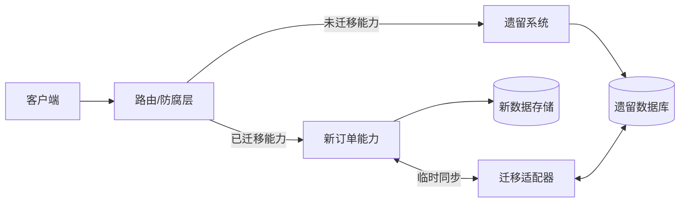

# 第 6 章　交付、演进、平台、组织与架构治理

## 学习目标

完成本章后，读者应能够：

1. 将架构视为持续演进的约束系统，而不是一次性蓝图。
2. 把质量属性转化为可执行的架构适应度函数（Architecture Fitness Function）。
3. 设计 API、事件与数据库契约的兼容迁移策略，并判断何时能无中断切换、何时应接受受控维护窗口。
4. 根据风险选择滚动、蓝绿、金丝雀等部署策略，并建立自动回滚判据。
5. 使用绞杀者模式（Strangler Fig Pattern）渐进替换遗留系统。
6. 区分云原生、平台工程、开发者平台与基础设施团队的职责边界。
7. 使用团队拓扑（Team Topologies）、认知负载（Cognitive Load）与康威定律（Conway's Law）调整组织结构。
8. 建立“原则—标准—例外—证据”的架构治理体系，并将可机械判断的规则治理即代码（Governance as Code）。
9. 通过风险登记册、技术雷达、架构评审和经济模型管理长期技术决策。
10. 将 FinOps 融入架构决策，使成本成为可观测、可归属、可优化的质量属性。

---

## 6.1 核心概念：架构是一组可演进约束

### 6.1.1 演进式架构

**演进式架构（Evolutionary Architecture）**是支持跨多个维度、以增量方式引导变更的架构。它不等于“边做边想”，而是承认需求、技术和组织均会变化，用反馈机制持续保持系统的关键质量属性。

可以把某时刻的架构状态表示为：

\[
A_t = (S_t, C_t, Q_t, O_t, E_t)
\]

其中：

- \(S_t\)：系统结构，如模块、服务、数据存储；
- \(C_t\)：组件间契约与依赖；
- \(Q_t\)：质量属性及其可接受区间；
- \(O_t\)：组织结构、所有权与协作方式；
- \(E_t\)：外部环境，如法规、流量、技术生态与成本。

一次架构演进是状态迁移 \(A_t \rightarrow A_{t+1}\)。迁移是否成功，不只看功能是否上线，还要验证：

\[
\forall q_i \in Q_{critical},\quad f_i(A_{t+1}) \in [L_i, U_i]
\]

其中 \(f_i\) 是质量属性的适应度函数，\([L_i,U_i]\) 是允许区间。若只验证功能、不验证这些约束，系统可能“上线成功、架构退化”。

### 6.1.2 演进的四个维度

1. **结构维度**：模块边界、依赖方向、服务拆分。
2. **契约维度**：API、事件、数据格式及语义。
3. **运行维度**：容量、可靠性、安全性、成本。
4. **社会技术维度**：团队职责、认知负载、决策权。

局部演进可能造成全局退化。例如，将订单服务拆成五个微服务，代码边界更清晰，却引入分布式事务和跨团队排障；这不是自动的架构进步。

### 6.1.3 可逆性与期权价值

架构决策风险可从失败可能性、影响、恢复时间、可探测性和不可逆性等维度评估。若组织使用

\[
RE=P_f\times I_f\times T_r
\]

必须为各变量定义量纲：$P_f$ 是给定时间窗内概率，$I_f$ 是可比较的损失，$T_r$ 是恢复时长。若用 1–5 序数评分，乘积只适合同一组织内粗排，不能解释为真实期望损失。高风险决定优先用旁路、影子流量、特性开关和小流量发布降低爆炸半径；双写本身会引入一致性风险，不能笼统当作“保留撤销路径”。

**适用边界**：演进式方法适合长期运行、环境不确定、可持续交付的系统。对一次性脚本、短生命周期原型，完整治理机制的成本可能超过收益；但安全、隐私、资金等不可逆风险仍不能省略。

---

## 6.2 架构适应度函数

### 6.2.1 定义与分类

**架构适应度函数（Architecture Fitness Function）**是评估某个架构特征是否仍满足期望的机制。它可以返回布尔值、数值、趋势或人工结论；“自动”不等于客观，指标选择、阈值和采样仍包含判断。

按执行方式分为：

- **原子型**：验证单一属性，如依赖层级无环。
- **整体型**：综合验证用户旅程，如下单链路的延迟、错误率和成本。
- **触发型**：在提交、构建、部署或定时任务中执行。
- **持续型**：对生产指标持续求值。
- **自动型**：机器可判定，例如镜像不得含严重漏洞。
- **人工型**：需要判断，例如领域边界是否仍与业务能力一致。

人工判断不应伪装成自动规则；无法自动化也不等于不治理。

### 6.2.2 从质量场景推导适应度函数

高优先级质量要求应尽量改写为可验证场景；探索阶段未知项应显式列为假设与实验目标，而非伪造阈值：

> 在促销流量达到日常峰值 5 倍时，已登录用户提交订单，99% 请求在 800 ms 内返回已受理状态，错误率低于 0.5%，且单订单边际基础设施成本不超过 0.03 元。

由此可导出：

- 性能：\(P99(latency) \le 800\text{ ms}\)；
- 可靠性：\(error\_rate < 0.5\%\)；
- 弹性：5 倍流量下不违反前两项；
- 经济性：\(marginal\_cost/order \le 0.03\) 元。

**推导步骤**：

1. 明确刺激源、刺激、环境、制品、响应、响应度量。
2. 判断该要求应在代码、构建产物、预生产还是生产环境验证。
3. 指定采样窗口、数据源、阈值和容忍区间。
4. 定义失败动作：阻断、告警、降级、回滚或登记例外。
5. 指定所有者和复审周期，避免阈值永久固化。

### 6.2.3 适应度函数模板

```yaml
id: AFF-ORDER-001
name: 下单关键路径延迟
quality_attribute: performance
scope: checkout-api
signal: http_server_duration_seconds
window: 15m
condition: p99 <= 800ms and request_count >= 10000
environment: production
trigger: continuous
failure_action: stop_canary_and_rollback
owner: checkout-team
exception: EXC-2026-014
review_date: 2026-10-01
evidence:
  - dashboard://checkout-slo
  - runbook://checkout-latency
```

### 6.2.4 度量适应度函数本身

- **覆盖率**：关键质量场景中已有函数覆盖的比例；不是代码覆盖率。
- **前置发现率**：生产前发现的架构违规数 / 全部架构违规数。
- **误报率**：经确认无须处置的失败 / 全部失败。
- **修复时长**（Mean Time to Remediate, MTTR）：从失败到恢复合规的时间。
- **漂移时长**：架构偏离标准但未被识别的持续时间。
- **例外老化**：已过复审日期仍未关闭的例外占比。

**反例**：规定“所有接口 P99 小于 200 ms”。它忽略业务语义、调用链和成本，为满足统一阈值，团队可能增加缓存并制造一致性问题。正确做法是从关键用户场景推导分层预算。

---

## 6.3 契约、版本与兼容性

### 6.3.1 契约不只是字段结构

**契约（Contract）**至少包含：

1. 语法：字段、类型、编码、状态码。
2. 语义：字段含义、单位、时区、金额精度。
3. 行为：幂等性、顺序、重试、超时、错误分类。
4. 时间：事件何时发生、数据新鲜度、弃用期限。
5. 服务水平：容量、公平使用限制、可用性目标。

只通过 Schema 校验，仍可能发生语义破坏。例如 `amount` 类型未变，但单位从“分”改为“元”。

### 6.3.2 兼容性模型

设旧消费者为 \(C_o\)，新消费者为 \(C_n\)，旧生产者为 \(P_o\)，新生产者为 \(P_n\)：

- **向后兼容（Backward Compatibility）**：\(C_n\) 能读取 \(P_o\) 的输出。
- **向前兼容（Forward Compatibility）**：\(C_o\) 能读取 \(P_n\) 的输出。
- **完全兼容（Full Compatibility）**：二者均成立。

对于开放消费者集合，新增可选字段通常更容易保持兼容，但“只新增”仍可能因枚举、默认值、校验、大小、语义和资源消耗破坏消费者。生产者与消费者都应按实际序列化协议设计未知字段/未知枚举策略；删除或改义需弃用、遥测和迁移窗口。

### 6.3.3 API 与事件演进流程

1. **登记消费者**：明确内部调用方、外部客户、批处理和离线订阅者。
2. **分类变更**：附加、收紧、删除、语义变化、行为变化。
3. **验证兼容性**：Schema 检查 + 消费者驱动契约测试 + 代表性流量回放。
4. **先扩展（Expand）**：服务端同时支持新旧形式。
5. **迁移消费者**：用遥测确认旧字段或旧版本不再使用。
6. **再收缩（Contract）**：删除旧形式。
7. **发布弃用记录**：包含期限、所有者、迁移指南和证据。

版本号不能替代兼容设计。每次小变更都创建 `/v2` 会造成永久并行维护；只有语义无法兼容且迁移窗口明确时才引入新主版本。

### 6.3.4 消息事件的特殊风险

事件是已发生事实，不应按当前数据库状态随意重算。事件契约应包括：

- 全局或聚合内唯一事件标识；
- 聚合标识和版本；
- 发生时间与写入时间；
- Schema 版本；
- 幂等消费规则；
- 顺序保证的范围；
- 重放、副作用抑制和数据保留策略。

**反例**：直接发布 ORM 实体作为领域事件。数据库字段重命名会变成外部破坏性变更，内部敏感字段也可能泄漏。应定义稳定的集成事件模型，并显式映射。

---

## 6.4 部署策略与发布控制

### 6.4.1 部署不等于发布

- **部署（Deployment）**：把制品放入运行环境。
- **发布（Release）**：让用户或流量使用新行为。

特性开关可分离二者，但开关必须有所有者、到期日和清理机制。权限开关不能仅存在前端；涉及安全、计费或数据权限的判断必须在服务端执行。

### 6.4.2 策略比较

| 策略 | 机制 | 优点 | 主要风险 | 适用场景 |
|---|---|---|---|---|
| 重建 | 停旧启新 | 简单、成本低 | 有停机窗口 | 非关键内部工具 |
| 滚动发布 | 分批替换实例 | 资源增量小 | 新旧版本并存 | 向前/向后兼容服务 |
| 蓝绿部署 | 两套完整环境切换 | 回退快、环境明确 | 双份资源、数据库难回退 | 高价值且切流可控系统 |
| 金丝雀发布 | 逐步扩大新版本流量 | 限制爆炸半径 | 需要可靠观测与流量分群 | 高频交付的在线服务 |
| 影子流量 | 复制请求但不返回结果 | 验证性能和结果差异 | 副作用、隐私、成本 | 读路径或可抑制副作用的迁移 |
| A/B 测试 | 用户分组比较业务结果 | 验证产品假设 | 不等价于技术安全验证 | 可量化产品实验 |

### 6.4.3 金丝雀操作流程

1. 发布前确认制品不可变、变更记录、回退制品和数据库兼容性。
2. 定义基线组与金丝雀组，避免地域、租户等级造成样本偏差。
3. 按可观察的样本量和风险逐级扩流，例如内部→1%→5%→25%→100%；百分比只是示例，高价值低频操作可能按租户/业务场景而非随机流量分组。
4. 每阶段观察足以覆盖主要故障延迟和负载模式的窗口；没有统一固定时长。
5. 同时比较技术指标、业务指标和成本指标。
6. 达到任一硬停止条件即自动停止扩流；按故障性质回滚或关闭功能。
7. 全量后继续观察延迟效应，如队列积压、账单增长和数据错误。

一个简化的升级条件为：

\[
\Delta E \le \epsilon_E \land \Delta L_{99} \le \epsilon_L \land \Delta B \ge -\epsilon_B
\]

- \(\Delta E\)：新旧版本错误率差；
- \(\Delta L_{99}\)：P99 延迟差；
- \(\Delta B\)：业务成功指标差；
- \(\epsilon\)：各指标可容忍偏差。

低流量阶段应使用绝对故障数与贝叶斯/置信区间辅助判断，不能因样本少而误判“0% 错误”。

### 6.4.4 回滚并非总是安全

代码可回滚，已经写入的新格式数据、已发送的消息和已执行的外部支付不可自动撤销。发布计划必须区分：

- **回滚（Rollback）**：恢复旧制品；
- **前滚修复（Roll Forward）**：发布兼容修复；
- **业务补偿（Compensation）**：用反向业务动作修正已发生事实。

**反例**：上线后看到错误率上升立即回滚，但旧代码无法读取新版本写入的数据，导致故障扩大。根因是未执行扩展—迁移—收缩。

---

## 6.5 数据库演进

### 6.5.1 扩展—迁移—收缩

以订单表将 `buyer_name` 拆为 `buyer_first_name`、`buyer_last_name` 为例：

**阶段 A：扩展**

1. 新增可空列，不删除旧列。
2. 新代码读取旧列，或优先读新列、缺失时回退旧列。
3. 写入路径执行双写，并监控差异。

**阶段 B：迁移**

4. 小批量、可暂停地回填历史数据。
5. 校验行数、校验和、业务不变量及租户隔离。
6. 将读取切至新列，持续观察旧列读取量。

**阶段 C：收缩**

7. 停止写旧列；确认所有应用和任务已迁移。
8. 经过回退窗口后删除旧列及兼容代码。
9. 更新数据字典、保留策略与恢复演练材料。

关键原则：需要滚动/无中断迁移时，每个中间状态应允许计划中的相邻版本共存。若安全或成本上无法做到，应设计明确维护窗口、备份与恢复，而不是伪称“零停机”。

### 6.5.2 双写一致性

应用层顺序写两个存储不能保证原子性。可选策略：

- 同库同事务：最直接，但受单库边界限制。
- 事务发件箱（Transactional Outbox）：业务数据与待发事件同事务写入，再异步投递。
- 变更数据捕获（Change Data Capture, CDC）：从日志捕获变化，降低业务代码侵入。
- 对账与修复：接受短暂不一致，必须定义不变量和补偿流程。

迁移完整率可定义为：

\[
R_m = \frac{N_{valid,new}}{N_{eligible,old}}
\]

还应测量差异率、回填吞吐、复制延迟、锁等待、失败重试和不可修复记录数。只有 \(R_m=100\%\) 也不够；若语义映射错误，数量完整仍是错误迁移。

### 6.5.3 数据定义语言风险

在大表上添加非空列、建立索引或改类型可能长期持锁。实施前应验证具体数据库版本的在线 DDL 能力，评估表大小、写入速率、复制延迟和磁盘空间。对高风险变更使用分批回填、并发索引、限速器和终止开关。

---

## 6.6 绞杀者模式：渐进替换遗留系统

### 6.6.1 模型

**绞杀者模式（Strangler Fig Pattern）**通过在遗留系统周围建立新能力和路由层，逐块迁移流量，最终使旧系统自然退役。其核心不是“新建微服务”，而是控制迁移单元和依赖方向。



### 6.6.2 操作流程

1. **发现接缝**：按业务能力、数据所有权和变更频率识别可切割边界。
2. **建立观测基线**：记录遗留行为、流量、延迟、错误和异常语义。
3. **建立防腐层（Anti-Corruption Layer）**：隔离旧模型，禁止新域模型直接依赖遗留表结构。
4. **选择首块**：优先高价值、低耦合、可验证且有回退路径的能力；不要先挑最复杂核心。
5. **同步数据**：明确权威数据源、复制方向、延迟预算和对账规则。
6. **影子验证**：对比新旧结果，抑制副作用。
7. **渐进切流**：按租户、地域或请求类型扩大流量。
8. **切断回流**：当新系统成为权威源后，禁止旧系统继续写该数据。
9. **退役**：删除路由、同步、表、权限和运维手册；确认许可证与基础设施成本消失。

迁移进度不能只用“已重写代码量”。更有意义的指标包括：

- 新系统承载的业务交易比例；
- 已移交的数据所有权比例；
- 遗留系统月度变更次数是否下降；
- 旧依赖、旧账号和旧运行成本是否真正消失；
- 迁移导致的业务差异率与事故率。

**失败模式**：

- 新系统继续直接共享遗留数据库，形成“分布式单体”。
- 无限期双写，没有权威源切换日期。
- 只增加新路径、不删除旧路径，系统复杂度单调上升。
- 按技术层迁移，例如先重写全部 DAO；长期没有可独立交付的业务切片。

---

## 6.7 云原生与平台工程的边界

### 6.7.1 云原生不是“部署在云上”

**云原生（Cloud Native）**是一组利用自动化、弹性、不可变基础设施、声明式 API 和可观测性来提升交付与运行能力的方法。系统使用虚拟机或 Kubernetes 并不自动成为云原生；若部署仍靠人工工单、状态不可重建、容量不可弹性调整，云只是托管地点。

云原生能力通常包括：

- 可自动创建、销毁和恢复的环境；
- 声明式配置与基础设施即代码；
- 面向失败设计，实例可替换而非手工修复；
- 标准化遥测、身份、密钥和供应链安全；
- 按实际需求伸缩，并能解释成本变化。

### 6.7.2 平台工程的产品边界

**平台工程（Platform Engineering）**以产品方式构建内部开发者平台（Internal Developer Platform, IDP），为应用团队提供自助式“铺好的道路”（Paved Road）。平台的用户是内部开发者，但目标是提升业务交付能力，而不是追求平台技术本身。

职责边界：

| 事项 | 平台团队 | 应用团队 | 共同责任 |
|---|---|---|---|
| 构建/部署能力 | 提供模板、流水线、策略与运行时 | 选择并使用，维护应用配置 | 发布安全门与反馈 |
| 可观测性 | 提供采集、查询、告警基础能力 | 定义业务 SLI、值班与运行手册 | 遥测质量 |
| 安全 | 提供身份、密钥、扫描和默认策略 | 正确授权、修复漏洞、数据分类 | 威胁建模与例外 |
| 可靠性 | 提供多区、备份、限流等能力 | 设定 SLO、容量与降级策略 | 演练与事故复盘 |
| 成本 | 提供标签、账单、预算和优化能力 | 对工作负载成本负责 | 单位经济指标 |

平台应提供**能力**而非接管应用责任。平台团队不应成为所有部署的审批队列；应用团队也不能以“平台负责”为由放弃生产所有权。

### 6.7.3 平台产品方法

1. 访谈应用团队，识别高频、重复、风险高的开发者旅程。
2. 建立当前基线：首次部署时长、变更前置时间、失败率、认知步骤数。
3. 选择少数高价值能力，定义服务目录与支持等级。
4. 提供黄金路径，但保留受治理的逃生舱口。
5. 通过真实团队试点，观察采用行为而非只收满意度。
6. 版本化平台 API，发布弃用策略，平台自身也遵循兼容性原则。
7. 删除低采用、重复或成本过高的能力。

平台价值可近似表达为：

\[
V_p = N_u \times (T_b - T_a) - C_p - C_m
\]

- \(N_u\)：能力被有效使用的次数；
- \(T_b,T_a\)：使用前后的单次时间或等价成本；
- \(C_p\)：平台建设成本；
- \(C_m\)：迁移、培训与使用摩擦成本。

不能用“平台组件数量”证明价值。建议度量：采用率、任务成功率、首次成功部署时间、开发者等待时间、平台引发事故率、支持工单量、黄金路径逃逸率。

**反例**：平台团队强制所有服务迁移到自研 DSL，只为统一配置。DSL 文档不足且缺少调试工具，应用团队需排队求助，认知负载从云 API 转移成了内部黑盒。标准化若未降低总认知负载，就没有创造平台价值。

---

## 6.8 组织设计：团队拓扑、认知负载与康威定律

### 6.8.1 康威定律与逆康威策略

**康威定律（Conway's Law）**是经验观察：组织的沟通结构会约束并倾向映射到其系统设计，而非确定性“复制”。按技术层分工且交接成本高的组织，系统更容易形成相应层间边界与等待。

**逆康威策略（Inverse Conway Maneuver）**根据希望促进的系统边界调整团队责任与沟通路径，但目标架构也应由业务价值流、变更耦合和认知负载证据验证，不能先画服务再机械重组组织。

但逆康威不是把组织图机械映射为服务图。组织重组成本高，业务边界也会变化。应先用变更耦合数据验证：若两个组件总是共同变更、共同事故、共同决策，强行分属不同团队可能增加协调成本。

### 6.8.2 团队拓扑

常见团队类型：

1. **流对齐团队（Stream-aligned Team）**：围绕业务价值流端到端负责，如“商家履约”。
2. **平台团队（Platform Team）**：提供可复用的内部能力，降低流对齐团队认知负载。
3. **赋能团队（Enabling Team）**：短期帮助其他团队掌握新能力，不长期代做。
4. **复杂子系统团队（Complicated-subsystem Team）**：负责需要深度专业知识的组件，如实时风控模型引擎。

交互模式应显式选择：

- **协作（Collaboration）**：共同探索，沟通高带宽但应有时限。
- **即服务（X-as-a-Service）**：通过稳定接口消费能力。
- **促进（Facilitating）**：赋能团队帮助能力迁移，目标是退出。

### 6.8.3 认知负载

**认知负载（Cognitive Load）**可分为：

- 内在负载：业务领域本身的复杂度；
- 外在负载：工具碎片、审批、偶然复杂度；
- 相关负载：学习和构建心智模型所需投入。

架构和平台应主要减少外在负载，而不是隐藏所有内在复杂度。可通过代理指标观察团队负载：

- 团队拥有的服务、语言、数据存储和告警数量；
- 完成一次变更需要联系的团队数；
- 新成员首次独立上线时间；
- 值班告警中无法直接处置的比例；
- 同一团队并行承担的业务领域数；
- 等待审批和环境的时间占交付前置时间比例。

这些指标不是个人绩效指标。将其用于排名会诱发拆分服务、隐藏依赖或降低告警质量。

### 6.8.4 组织—架构调整流程

1. 从价值流绘制需求到生产的等待、交接和返工。
2. 分析代码共同变更、运行调用、数据共享和事故协作网络。
3. 标出责任空白、多人共有但无人负责的组件。
4. 定义稳定业务能力及其数据所有权。
5. 为每个能力指定单一主责团队，并明确支持等级。
6. 选择团队交互模式和结束条件。
7. 通过模块化或契约降低跨团队同步需求。
8. 每季度用变更前置时间、跨团队等待和事故数据复核，而非频繁重组。

**反例**：为了“微服务自治”给每个服务成立团队。小团队需独立承担产品、开发、数据、安全和值班，认知负载超过承受能力，最终依赖少数专家救火。团队边界应围绕可持续承担的价值流，而不是围绕部署单元。

---

## 6.9 架构治理体系

### 6.9.1 治理目标

**架构治理（Architecture Governance）**不是集中审批所有设计，而是建立决策权、约束、证据与反馈，使局部自治不损害全局性质。治理的对象包括安全、互操作性、数据责任、可靠性、成本和技术组合风险。

一个完整治理项应包含：

\[
G = (Intent, Rule, Scope, Evidence, Owner, Exception, Review)
\]

只有“规则”没有意图，团队会机械合规；没有证据，规则无法验证；没有例外，组织会绕过治理；没有复审，临时妥协会永久化。

### 6.9.2 原则、标准与例外

- **原则（Principle）**：长期决策方向，例如“数据所有权与业务能力一致”。
- **标准（Standard）**：特定范围内可验证的要求，例如“跨域读取不得直连他域业务表”。
- **指南（Guideline）**：推荐做法，允许基于情境偏离。
- **例外（Exception/Waiver）**：有期限、有风险所有者、有补偿控制的批准偏离。

模板：

```markdown
### 标准 STD-DATA-003：跨域数据访问
- 意图：保持数据语义和变更自治。
- 适用范围：生产环境中的业务域。
- 必须：跨域读取通过已登记 API、事件或分析数据产品完成。
- 禁止：直接读取其他业务域的事务表。
- 证据：数据血缘扫描、网络策略、契约目录。
- 所有者：数据架构委员会。
- 例外入口：EXC 模板；最长 90 天。
- 复审：每 6 个月。
```

例外模板：

```markdown
## EXC-2026-014
- 偏离标准：STD-DATA-003
- 业务原因：大促前报表迁移无法按期完成
- 影响范围：仅 analytics-reader 只读访问 order_summary
- 风险：表结构变更导致报表错误；扩大数据暴露面
- 补偿控制：固定视图、只读账号、字段脱敏、每日契约校验
- 风险所有者：商业分析负责人
- 整改计划：迁移至订单数据产品
- 到期日：2026-09-30
- 关闭证据：旧账号删除记录、连续 14 天无查询日志
```

### 6.9.3 治理即代码

**治理即代码（Governance as Code）**将可机械判定的治理规则编码进开发与运行流程，例如：

- 基础设施配置禁止公开存储桶；
- 生产镜像必须签名且无不可接受漏洞；
- 服务必须声明所有者、数据分类、SLO 和成本中心；
- 模块依赖不得越过规定边界；
- 高风险资源必须启用备份和删除保护。

策略执行应分层：

1. 本地/IDE 快速反馈；
2. 提交或拉取请求检查；
3. 制品与部署准入；
4. 运行时持续漂移检测；
5. 例外自动到期与升级通知。

**边界**：领域边界是否合理、某项技术是否值得引入、权衡是否符合业务战略，不能完全编码。把所有治理问题转成规则会产生“通过检查但设计糟糕”的虚假安全感。

规则质量度量包括：失败命中率、误报率、绕过率、平均修复时间、规则执行延迟、过期例外数。规则应有测试样例和版本；高误报规则应修正或降级为告警，不能训练团队习惯性忽略。

### 6.9.4 分层架构评审

按决策风险选择评审强度：

- **低风险**：团队内异步评审，保留架构决策记录（Architecture Decision Record, ADR）。
- **中风险**：邀请受影响团队和领域专家限时评审。
- **高风险**：涉及资金、隐私、监管、不可逆数据迁移或全局平台时，由跨职能小组评审并要求实验或演练证据。

可从爆炸半径 $B$、不可逆性 $U$ 与知识不确定性 $K$ 三个维度选择评审强度。若定义

\[
R=B\times U\times K
\]

并对每项用 1–5 序数评分，$R$ 只是组织内排序启发式：乘法隐含维度可补偿和等距的假设，不具备概率或金额含义。更稳妥的是同时展示三维分数，对任何单维灾难性项目直接升级评审。

**评审操作流程**：

1. 提交一页问题陈述：目标、约束、不做什么、截止日期。
2. 列出质量属性场景、备选方案和不变方案。
3. 提交实验、容量估算、威胁模型、成本和迁移证据。
4. 评审者只讨论跨边界风险与未验证假设，不代替团队设计。
5. 记录结论：接受、有条件接受、试验后决定、拒绝；每项条件有所有者和日期。
6. 上线后按约定指标复核决策，必要时更新 ADR。

评审度量：等待时间、一次通过率、评审后重大风险发现率、条件按期关闭率、重复问题比例。追求“通过率 100%”会让评审失去发现问题的价值。

**反例**：每个服务都需月度委员会审批，材料几十页，委员会不了解上下文，只检查是否使用“标准技术”。结果是大批变更绕道进行，真正高风险决策反而淹没在队列中。

---

## 6.10 风险登记册与技术雷达

### 6.10.1 架构风险登记册

风险是尚未发生的不确定事件；问题是已经发生的事实；技术债是为了短期收益接受的未来成本。三者不应混写。

风险条目模板：

```markdown
## RISK-042：订单事件单区消息集群
- 风险陈述：若消息集群所在区域不可用，则订单状态无法向履约域传播，可能造成超卖和履约延迟。
- 可能性：3/5（序数等级，非 60%）
- 影响：5/5
- 排序等级：高；不把 3×5=15 解释为期望损失
- 早期指标：复制延迟、积压深度、区域错误率
- 缓解措施：跨区复制；履约端幂等重放；季度区域故障演练
- 应急措施：暂停高风险 SKU 销售；从事务发件箱重放
- 所有者：订单平台负责人
- 目标日期：2026-11-15
- 状态：缓解中
- 剩余风险：可能性 2/5，影响 4/5；仍需记录相关故障和尾部影响
```

风险处置有四类：规避、降低、转移、接受。接受不是忽略，必须有具名风险所有者和触发条件。

风险登记流程：识别→去重→评估→指定所有者→选择处置→跟踪领先指标→演练应急方案→复审剩余风险→关闭。应按暴露值、相关性和时间临近性排序；多个低概率风险依赖同一云区域时不能独立相加后忽略共同故障。

建议度量：无所有者风险数、逾期缓解项、风险平均存续时间、事故命中已登记风险比例、演练覆盖率、剩余风险趋势。若事故总来自登记册之外，说明识别机制失效。

### 6.10.2 技术雷达

**技术雷达（Technology Radar）**用于表达组织对技术采用的当前立场，而非流行榜单。典型环级：

- **采用（Adopt）**：已有足够证据，可在适用范围内默认使用。
- **试验（Trial）**：可在受控生产场景使用，需要明确支持者和反馈。
- **评估（Assess）**：通过原型验证，不承载关键生产责任。
- **暂缓（Hold）**：不再新增使用，或仅在批准例外下使用。

每个条目必须写明：问题、适用边界、证据、成熟度、退出条件、支持能力和复审日期。“采用 PostgreSQL”过于宽泛；应说明事务场景、规模边界、版本和运维能力。

雷达更新流程：收集提案→验证问题而非技术热度→小规模实验→记录可证伪假设→评估运维与退出成本→跨团队校准→发布范围化结论→定期升降环。

雷达不是采购目录，也不是禁止创新的黑名单。若“评估”条目多年不动，应关闭或设计真正的实验。

---

## 6.11 架构经济学与 FinOps

### 6.11.1 决策看总拥有成本

**总拥有成本（Total Cost of Ownership, TCO）**应包含：

\[
TCO = C_{build} + C_{run} + C_{change} + C_{risk} + C_{exit}
\]

- \(C_{build}\)：采购、开发和迁移成本；
- \(C_{run}\)：基础设施、许可证、运维和值班成本；
- \(C_{change}\)：未来修改、协调与认知成本；
- \(C_{risk}\)：故障、安全、合规风险的期望损失；
- \(C_{exit}\)：数据迁出、合同终止和替换成本。

“自建软件没有许可证费用”不代表便宜；“托管服务单价高”也不代表总成本高。决策必须统一时间范围、负载假设和人员机会成本。

净现值（Net Present Value, NPV）用于比较跨期方案：

\[
NPV = \sum_{t=0}^{n}\frac{B_t-C_t}{(1+r)^t}
\]

- \(B_t\)：第 \(t\) 期收益；
- \(C_t\)：第 \(t\) 期成本；
- \(r\)：折现率；
- \(n\)：评估期数。

不确定性高时应给出乐观、基准、悲观场景，并对流量、工程投入、云价格和故障损失做敏感性分析，而不是只报单点数字。

### 6.11.2 FinOps 的职责边界

**FinOps（Cloud Financial Operations）**是工程、财务和业务共同对云价值负责的运营模型。它不是财务部门月底削减账单，也不是“所有资源都选最便宜规格”。

三个循环：

1. **告知（Inform）**：成本可见、可分配、可解释。
2. **优化（Optimize）**：消除浪费、匹配承诺、改善架构效率。
3. **运营（Operate）**：把预算、异常、单位成本纳入日常交付。

成本分配需要足以回答决策问题的归属维度，如团队、产品、环境或业务能力。并非每项资源都能或应按租户精确标记；高基数标签可能增加遥测成本，共享平台可按使用量、固定比例或业务价值分摊，并公开规则与未分配成本。

### 6.11.3 单位经济指标

总账单随业务增长而上涨未必是坏事。应建立单位成本：

\[
C_u = \frac{C_{total}}{N_{business\ units}}
\]

例如每成功订单成本、每活跃租户成本、每千次搜索成本。进一步拆解：

\[
C_{order}=C_{compute}+C_{storage}+C_{network}+C_{managed}+C_{shared}
\]

同时观察质量，避免通过降配降低成本却损害转化率。可定义价值效率：

\[
E_v = \frac{Business\ Value}{Cloud\ Cost}
\]

业务价值可用毛利、成功交易数或符合战略的代理指标表示，但必须固定口径。

### 6.11.4 成本治理操作流程

1. 建立 80% 以上可归属成本覆盖率，列出不可分配项。
2. 为关键产品建立单位成本基线和预算区间。
3. 设置基于历史季节性的异常检测，不用静态阈值误报大促。
4. 每周由工程团队处理闲置、过配、存储生命周期和网络路径问题。
5. 对稳定基线负载评估预留/承诺折扣，对不确定负载保留弹性。
6. 在架构评审中提交成本模型和主要敏感参数。
7. 优化后验证质量指标与业务指标未退化。
8. 将节省额区分为“理论节省”和账单实际减少，避免重复记功。

关键度量：可分配成本比例、预算偏差、预测准确率、单位成本趋势、闲置成本、承诺覆盖率与利用率、异常发现时间、实际节省实现率。

**反例**：为降低账单统一要求数据库 CPU 利用率达到 80%。数据库峰值和尾延迟需要余量，团队被迫贴近容量上限，促销时大量超时。资源效率必须服从 SLO、恢复目标和风险容忍度。

---

## 6.12 统一操作流程：从决策到退役

以下流程把演进、交付、组织和治理连成闭环。

### 步骤 1：定义决策与业务结果

- 问题是什么，若不做会怎样？
- 成功的业务指标和质量属性是什么？
- 哪些范围明确不做？
- 决策期限和风险所有者是谁？

### 步骤 2：建立当前基线

采集流量、延迟、错误、恢复、成本、交付前置时间、跨团队等待和数据质量。没有基线就无法证明演进带来改善。

### 步骤 3：列出假设与选项

至少包含“不改变”的基准方案。记录每个方案的可逆性、爆炸半径、TCO、组织依赖与退出成本。

### 步骤 4：选择最小可证伪实验

用原型、影子流量、容量测试或单租户试点验证最大不确定性，而不是先完成全部建设。实验必须有失败判据。

### 步骤 5：设计兼容迁移

明确契约、权威数据源、中间状态、扩展—迁移—收缩步骤、回滚/前滚/补偿策略和旧路径删除日期。

### 步骤 6：匹配治理强度

按爆炸半径、不可逆性和知识不确定性选择团队内 ADR、专家评审或跨职能高风险评审；能自动判断的标准进入流水线。

### 步骤 7：渐进交付

使用特性开关、金丝雀、租户分组和自动停止条件限制风险。部署期间同时观察技术、业务、数据和成本指标。

### 步骤 8：验证组织可运营性

确认值班团队理解系统、告警可操作、运行手册有效、跨团队依赖有明确接口，认知负载未超过团队能力。

### 步骤 9：全量与复核

达到成功标准后全量，并在延迟影响窗口后复核。将实际结果与 ADR、成本模型和风险假设比较。

### 步骤 10：收缩与退役

删除旧代码、旧表、双写、特性开关、临时权限、重复告警和旧基础设施；关闭风险和例外。没有删除旧路径，迁移就未完成。

---

## 6.13 综合示例：多租户电商平台订单能力演进

### 6.13.1 背景

平台的订单能力位于单体应用中。大租户促销会拖慢所有租户；数据库变更需要全平台停机；订单表被履约、分析和客服直接查询。目标是在不停止业务的前提下独立演进订单能力。

质量场景：

- 大促峰值 12,000 次下单/秒；
- P99 受理延迟不超过 800 ms，错误率低于 0.5%；
- 任一租户不能消耗超过共享容量的 20%；
- 恢复点目标不超过 1 分钟；
- 每成功订单云成本不超过 0.03 元；
- 迁移期间不得重复扣款或丢失已受理订单。

### 6.13.2 决策与组织

成立围绕“下单到订单确认”价值流的流对齐团队，端到端拥有代码、数据、SLO 和成本。平台团队提供标准流水线、租户流量分组、遥测和数据库迁移作业能力。支付仍由独立团队以稳定契约提供服务，双方短期协作定义幂等语义，之后转为即服务交互。

### 6.13.3 迁移设计

1. 在单体前建立订单路由层。
2. 定义 `OrderAccepted` 集成事件，包含订单号、租户号、金额币种、聚合版本和幂等键，不暴露 ORM 实体。
3. 单体在本地事务中写订单和发件箱，由投递器发布事件。
4. 新订单服务先消费影子请求，只比较计算结果，不执行支付。
5. 使用 CDC 回填新订单库；按租户核对订单数、金额总和、状态转换不变量。
6. 先把内部租户的订单查询切到新服务，再切写入。
7. 按租户扩大到 1%、5%、25%、50%、100%，硬停止条件包括重复扣款数大于 0、错误率差超过 0.2 个百分点、单位成本超过基线 20%。
8. 新服务成为订单权威源后，禁止单体写订单表；旧系统通过 API 或事件获取数据。
9. 观察两个完整结算周期后删除旧写路径、CDC 任务、数据库账号和订单模块。

### 6.13.4 适应度函数

- 结构：新订单服务不得依赖单体数据库驱动或表模型。
- 契约：当前及上一版本消费者契约必须通过。
- 数据：新旧系统按租户的订单金额差为 0；状态不得从终态回退。
- 性能：峰值负载下 P99 小于 800 ms。
- 隔离：单租户达到限额时，其他租户 P99 增幅小于 10%。
- 可靠性：发件箱未发布消息年龄小于 60 秒。
- 成本：每成功订单滚动七日成本不超过 0.03 元。
- 治理：生产资源必须有团队、产品、租户归属策略和数据分类标签。

### 6.13.5 风险与经济性

最高风险是双写造成订单状态分叉，因此不采用应用层双写，而采用事务发件箱和单向 CDC。第二风险是共享数据库迁移期间锁表，使用在线建索引、分批回填和复制延迟停止条件。

经济模型同时计算新集群成本、单体缩容收益、迁移工程投入和遗留许可证退出成本。若新服务上线而单体无法缩容，总账单只会增加；所以“释放单体资源并退役旧模块”是收益实现条件，而非后续清理。

### 6.13.6 反例复盘

一个看似更快的方案是新建订单微服务但继续读写单体订单表。它短期减少迁移工作，却保留数据库耦合、发布协调和故障域，新增了网络与部署复杂度。部署单元改变了，架构约束没有改变，因此不构成有效演进。

---

## 6.14 检查清单

### 演进与适应度

- [ ] 是否定义了关键质量场景及可接受区间？
- [ ] 每个关键约束是否有自动或人工适应度函数？
- [ ] 是否明确函数的数据源、窗口、失败动作、所有者和复审日期？
- [ ] 是否保留可逆路径，并对不可逆操作单独评审？
- [ ] 是否同时覆盖结构、契约、运行和组织维度？

### 契约与数据库

- [ ] 是否登记全部消费者并区分语法、语义、行为和时间契约？
- [ ] 新旧生产者与消费者能否在迁移窗口共存？
- [ ] 是否采用扩展—迁移—收缩，而非一步破坏性修改？
- [ ] 是否明确权威数据源、对账不变量、回填限速和终止条件？
- [ ] 旧字段、旧版本、双写和同步任务是否有删除日期？

### 部署与迁移

- [ ] 部署与功能发布是否解耦？
- [ ] 是否按风险选择滚动、蓝绿、金丝雀或影子流量？
- [ ] 金丝雀分组是否避免租户和地域样本偏差？
- [ ] 是否定义自动停止、回滚、前滚和业务补偿条件？
- [ ] 全量后是否观察队列、账单和数据等延迟效应？
- [ ] 绞杀迁移是否按业务切片，并真正切断遗留写入和依赖？

### 平台与组织

- [ ] 平台是否解决已验证的开发者旅程问题？
- [ ] 平台和应用团队责任是否明确，平台是否避免成为审批队列？
- [ ] 黄金路径是否有受治理的逃生舱口？
- [ ] 团队是否围绕价值流拥有代码、数据、运行和成本？
- [ ] 是否用变更与事故数据验证团队边界，而非机械套用组织模型？
- [ ] 是否控制团队的技术、领域、值班和协作认知负载？

### 治理

- [ ] 原则、标准、指南和例外是否清晰区分？
- [ ] 每个标准是否有意图、范围、证据、所有者和复审周期？
- [ ] 例外是否有补偿控制、风险所有者和自动到期日？
- [ ] 可机械判断的规则是否进入交付或运行流程？
- [ ] 架构评审强度是否与爆炸半径、不可逆性和不确定性匹配？
- [ ] 风险登记册是否跟踪领先指标、剩余风险和应急演练？
- [ ] 技术雷达条目是否说明范围、证据、退出条件和复审日期？

### 经济性与 FinOps

- [ ] 方案比较是否包含构建、运行、变更、风险和退出成本？
- [ ] 是否给出基准、乐观和悲观场景及敏感参数？
- [ ] 云成本是否可归属到团队、产品和环境？
- [ ] 是否建立每订单、每租户等单位成本，而非只看总账单？
- [ ] 成本优化是否验证 SLO、业务指标和恢复能力未退化？
- [ ] 声称的节省是否已体现在实际账单或可释放合同中？

---

## 6.15 练习

### 练习 1：设计适应度函数

为多租户电商平台的“租户隔离”设计至少五个适应度函数，分别覆盖结构、性能、数据、安全和成本。每个函数写明指标、窗口、阈值、触发点、失败动作和例外机制。解释为什么不能只用“所有请求都带租户 ID”作为充分证据。

### 练习 2：判断兼容性

订单事件新增 `discountType` 枚举，生产者计划增加值 `LIVE_STREAM`。分析以下消费者是否向前兼容：

1. 未知枚举值反序列化失败；
2. 未知值映射为 `OTHER` 并记录原值；
3. 使用 `default` 分支免日志跳过订单；
4. 消费者按金额重新推断折扣类型。

给出迁移方案，并讨论语法兼容与业务语义兼容的差异。

### 练习 3：无停机数据库迁移

将 `orders.total_amount` 从无币种整数改为金额与币种组合。设计扩展—迁移—收缩步骤，说明：

- 默认币种如何推导；
- 历史异常记录如何处理；
- 双写差异如何监控；
- 哪个版本开始允许删除旧列；
- 回滚代码时如何读取新数据。

### 练习 4：选择部署策略

比较以下变更适合的发布策略，并给出停止判据：

- 纯前端商品卡片布局实验；
- 支付幂等算法修改；
- 数据库驱动大版本升级；
- 搜索排序模型替换；
- 修复正在利用的严重安全漏洞。

不得只回答策略名称，必须分析可观测性、样本偏差、副作用和回退限制。

### 练习 5：设计绞杀路线

遗留电商单体包含商品、价格、购物车、订单、支付和客服。绘制依赖与数据所有权，选择首个迁移切片。写出选择依据、防腐层、数据同步方式、影子验证、切流阶段及退役证据。再说明为什么“先抽公共数据库访问层”可能让迁移更困难。

### 练习 6：平台边界评审

某平台团队计划统一接管所有应用的告警配置和值班。使用职责表分析该方案会降低还是转移认知负载。提出一个平台 API，使平台提供默认告警能力，同时由应用团队拥有业务 SLI 和处置手册。定义平台采用率之外的四项成功指标。

### 练习 7：逆康威设计

现有组织按前端、后端、数据库和测试分部。一次订单功能需四次排期和三次交接。设计面向价值流的团队拓扑，明确四类团队中哪些必要、交互模式及结束条件。列出三项数据，用于验证重组确实降低协调成本。

### 练习 8：编写治理标准与例外

为“生产服务必须启用多可用区”编写完整标准。然后为一个可容忍 24 小时中断的内部报表服务申请例外，包含风险、补偿控制、所有者、期限和关闭证据。讨论为何统一强制多区可能不经济。

### 练习 9：组织架构评审

为“订单服务由关系数据库迁移至分布式数据库”准备评审材料：问题、质量场景、三个方案、最大不确定性、实验、迁移、回退、成本和退出计划。使用 \(R=B\times U\times K\) 评分，并据此选择评审层级。

### 练习 10：建立风险登记册

针对大促列出至少八项架构风险。区分风险、问题和技术债；为前三项写领先指标、缓解、应急措施和剩余风险。识别至少一组具有共同故障原因的相关风险，说明为何不能独立计算。

### 练习 11：制作技术雷达

选择八项与多租户电商平台相关的技术或实践，分别放入采用、试验、评估、暂缓四个环。每项写明适用范围、证据、负责人和升降环条件。不得以“行业流行”作为证据。

### 练习 12：FinOps 决策

比较自建消息集群与托管消息服务的三年 TCO。至少纳入人力、跨区流量、容量余量、故障期望损失、承诺折扣和退出成本。计算每百万订单成本，并对订单增长率和运维人力做敏感性分析。说明何种数据变化会使结论反转。

### 练习 13：识别治理反模式

某公司有以下现象：所有变更均需架构委员会审批；委员会以文档页数衡量充分性；例外无到期日；流水线规则误报率 35%；技术雷达两年未更新。逐项分析激励扭曲与系统性后果，提出最小治理改造顺序及度量。

### 练习 14：综合演练

为多租户电商平台制定“订单能力从单体迁出”的 90 天演进计划。交付物必须包含：

- 质量场景与适应度函数；
- 契约及数据库迁移阶段；
- 团队所有权与交互模式；
- 金丝雀阶段和自动停止条件；
- 风险登记册前三项；
- 架构评审层级与证据；
- 单位成本模型；
- 旧路径退役的可验证完成定义。

最后写出一个明确的“终止迁移”条件：当关键假设被证伪时，团队应停止继续投入，而不是因沉没成本扩大方案。
