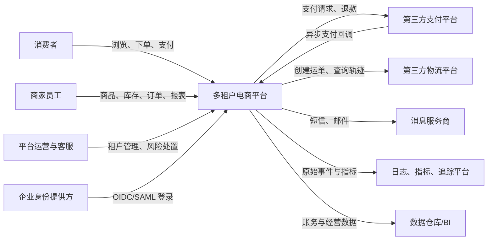
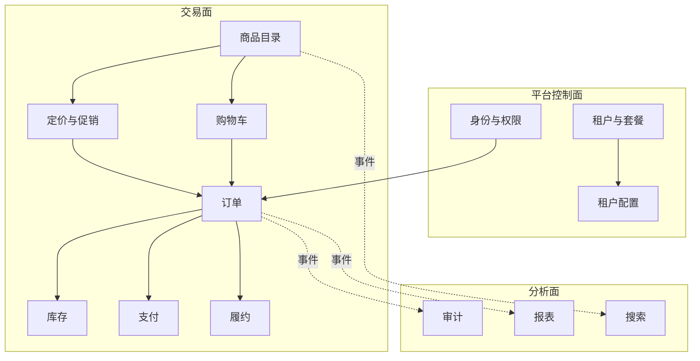
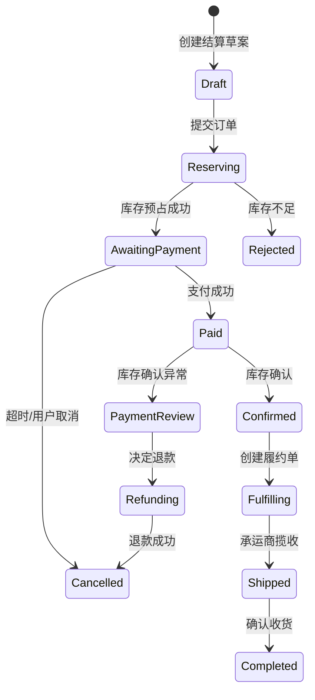
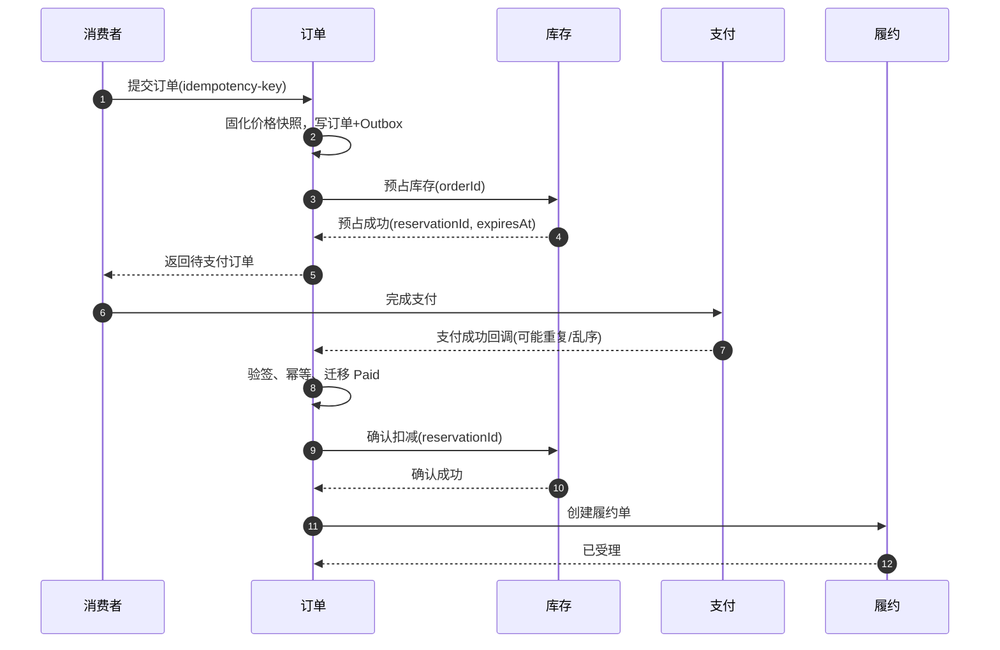
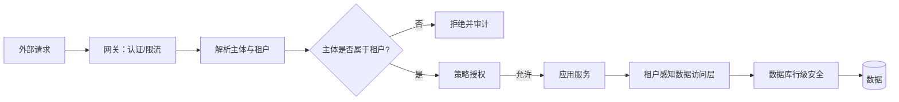
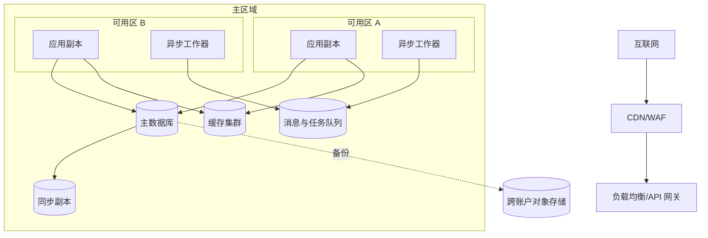
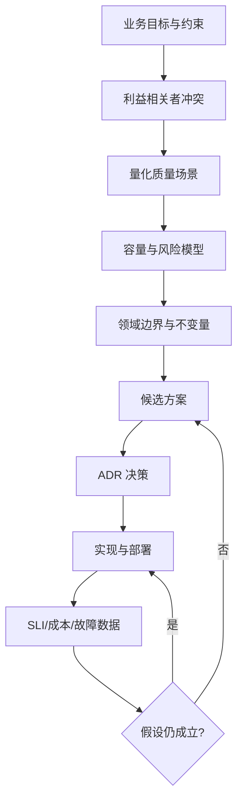

# 第 7 章　贯穿式案例与结业训练：从零设计并演进多租户电商平台

> 本章不是一份“标准架构答案”，而是一条可审计的推理链。所有设计都从业务目标、约束和可验证的质量场景出发，经候选方案比较、架构决策记录（Architecture Decision Record，ADR）固化，再由运行数据和故障反馈推动演进。

## 7.1 学习目标

完成本章后，读者应能够：

1. 把模糊的商业设想转换为系统边界、利益相关者目标和可量化质量属性场景。
2. 用容量模型估算负载，而不是仅凭“以后会很大”选择技术。
3. 识别领域边界，区分必须原子维护的业务不变量、会话/因果保证与允许最终收敛的派生状态。
4. 比较模块化单体、微服务和事件驱动等候选方案，并明确其适用边界。
5. 用 ADR 记录“为什么”，用风险清单和适应度函数持续验证决策。
6. 设计租户隔离、订单、库存、支付、履约等关键链路的数据与一致性策略。
7. 将可靠性、安全、性能、部署、演进和成本放入同一个决策模型。
8. 设计可执行的失败注入实验，并用恢复时间目标检验架构韧性。
9. 对架构方案进行评审、答辩和复盘，能指出反例与失效条件。

---

## 7.2 业务背景：不是先画服务，而是先定义成功

### 7.2.1 场景设定

创业团队“云栈商业”计划提供一套软件即服务（Software as a Service，SaaS）电商平台。商家作为平台租户，可创建品牌店铺、维护商品和库存、开展促销、接收消费者订单，并连接第三方支付与物流。消费者通过每个商家的独立域名或小程序购物。

首期目标不是挑战大型综合电商，而是服务中小品牌：

- 8 人研发团队，6 个月内上线；
- 初始资金只够支撑约 18 个月；
- 先覆盖单区域、单币种、实物商品；
- 不自建支付清算和物流网络；
- 商家要求开箱即用，但大型商家将逐步要求定制规则、审计和数据驻留；
- 大促流量具有明显尖峰，平台收入却主要按月订阅，基础设施浪费会直接侵蚀毛利。

### 7.2.2 商业目标与可观测结果

| 目标 | 指标 | 第 1 阶段目标 | 第 3 阶段目标 | 架构含义 |
|---|---|---:|---:|---|
| 快速获客 | 新租户首次开店时间 | ≤ 30 分钟 | ≤ 10 分钟 | 租户开通必须自动化，不能依赖人工建库 |
| 保持交易可信 | 重复业务扣款 | 已知事件数为 0；发生即处置 | 已知事件数为 0；发生即处置 | 支付意图需幂等，外部账单需持续对账；不能把观测目标误作数学保证 |
| 保证可售库存可信 | 超卖事件率与数量 | < 0.1%，且有损失上限 | < 0.01%，且有损失上限 | 定义库存不变量、预占与异常处置；指标口径需区分硬库存与业务容忍 |
| 支撑大促 | 峰值订单吞吐 | 20 单/秒 | 2,000 单/秒 | 读写路径分离、削峰、热点治理 |
| 控制成本 | 基础设施成本/GMV | < 1.2% | < 0.6% | 共享资源优先，按证据拆分和扩容 |
| 提升交付速度 | 独立生产发布 | 每周 1 次 | 每日多次 | 模块边界、自动化验证、渐进式发布 |

### 7.2.3 范围与非目标

**首期范围：**租户开通、店铺装修的最小能力、商品、价格、库存、购物车、下单、支付回调、订单查询、发货通知、基础报表。

**首期非目标：**跨境税务、多币种结算、平台自营仓、复杂推荐、实时竞价广告、跨区域双活、任意脚本插件。非目标不是永久拒绝，而是防止架构被尚未验证的未来需求拖垮。

### 7.2.4 第一条推理链

1. 团队小且上线窗口短，组织无法承担十几个服务的部署与值班复杂度。
2. 业务边界仍在探索，过早固定远程接口会放大变更成本。
3. 多租户隔离和交易正确性从第一天就是刚性约束，不能作为“后续优化”。
4. 因而首期优先选择**边界清晰的模块化单体**，同时把租户上下文、幂等键、领域事件和可观测性作为演进接缝。
5. 当容量、团队自治或故障隔离证据出现后，再拆分特定模块，而不是按名词清单一次性微服务化。

---

## 7.3 利益相关者：冲突目标必须显式化

### 7.3.1 利益相关者地图

| 利益相关者 | 关切 | 可接受妥协 | 不可接受结果 |
|---|---|---|---|
| 消费者 | 页面快、库存和价格可信、付款不重复 | 订单状态短暂延迟 | 扣款后订单消失、跨店信息泄露 |
| 商家运营 | 快速上架、促销灵活、报表可用 | 报表延迟数分钟 | 大促无法下单、错价不可追溯 |
| 商家财务 | 账款准确、可对账、可导出 | T+1 汇总 | 金额无法解释、账实不符 |
| 商家管理员 | 权限清晰、员工离职可收权 | 高风险操作二次确认 | 越权访问其他租户数据 |
| 平台产品 | 快速试错、统一体验 | 首期少量人工补偿 | 每次改动需跨团队长协调 |
| 研发团队 | 边界清晰、可测试、故障易定位 | 有计划地偿还局部技术债 | 分布式链路无追踪、共享库任意写 |
| SRE/运维 | 可观测、可回滚、容量可预测 | 非关键报表降级 | 无法止损、恢复依赖个人记忆 |
| 安全与合规 | 最小权限、审计、数据生命周期 | 分级控制而非所有数据同等级 | 租户数据泄露、支付敏感数据落库 |
| 管理层/投资人 | 增长、毛利、风险可控 | 某些高级能力延后 | 技术成本随租户数线性失控 |
| 支付/物流供应商 | 协议合规、限流、重试有界 | 异步接入 | 回调风暴、无幂等导致重复业务 |

### 7.3.2 冲突分析

典型冲突是“促销灵活性”与“价格确定性”。若运营可在任意时刻修改规则，而订单只保存规则引用，则消费者付款时可能得到不同金额。解决方法不是要求双方让步，而是定义不变量：**订单创建时固化计价快照；后续规则变化不回写历史订单。**

另一个冲突是“租户定制”与“平台可维护性”。直接为大客户复制代码能快速签单，却会产生无法合并的分支。首期允许的定制形式限定为：配置、主题、规则参数和外部 Webhook；任意代码插件必须等待隔离运行时、权限模型和版本契约成熟。

### 7.3.3 利益相关者访谈步骤

1. 询问目标，不先询问功能：“什么结果意味着成功？”
2. 追问刺激与响应：“大促开始后库存服务变慢时，你期望系统做什么？”
3. 量化阈值：“快”是 P95 200 ms，还是 2 s？
4. 明确数据责任：“谁有权纠正订单？修正是否要保留原值？”
5. 暴露冲突，记录决策者和仲裁原则。
6. 将结论转换为质量场景和验收指标。

---

## 7.4 系统上下文：先画责任边界

### 7.4.1 上下文图



### 7.4.2 信任边界与数据流

- 消费者、商家、第三方回调均位于不可信网络。
- 平台不保存银行卡主账号；支付页面由支付机构托管，平台仅保存支付令牌和交易标识。
- 商家身份与消费者身份分域；后台高风险操作需要更强认证。
- 所有业务请求进入平台时解析租户上下文，后续不接受客户端任意覆盖 `tenant_id`。
- 导出到 BI 的数据必须按用途最小化，敏感字段脱敏或标记访问策略。

### 7.4.3 上下文验收问题

- 平台是否被错误地画成“世界中心”，遗漏人工客服、对账、补偿等真实参与者？
- 外部系统超时、重复回调、乱序回调分别如何处理？
- 哪些数据跨越信任边界？是否有责任主体和留存周期？
- 系统边界外的承诺是否被误写成平台自身 SLA？

---

## 7.5 质量场景：把形容词变成可测试合同

### 7.5.1 场景模型

质量属性场景（Quality Attribute Scenario）由六部分组成：

$$Q=(S, A, E, X, R, M)$$

其中：

- $S$：刺激源（Source），如消费者、攻击者或节点故障；
- $A$：刺激（Stimulus），如突发流量、依赖超时；
- $E$：环境（Environment），如正常运行或大促峰值；
- $X$：受影响制品（Artifact），如订单 API 或租户数据库；
- $R$：响应（Response），系统采取的动作；
- $M$：响应度量（Measure），如 P99 延迟、恢复时间、错误预算。

只写“系统应高可用”无法指导设计；六元组迫使团队说明在什么情况下、哪个部分、达到何种可观测结果。

### 7.5.2 关键质量场景

| 编号 | 刺激与环境 | 响应 | 度量 |
|---|---|---|---|
| QS-01 下单性能 | 大促峰值，单租户 2,000 次下单请求/秒，持续 10 分钟 | 限流保护、库存原子预占、异步化非关键步骤 | 接受请求 P99 ≤ 800 ms；有效请求成功率 ≥ 99.9% |
| QS-02 读性能 | 正常时商品详情 15,000 RPS，80% 命中热门商品 | CDN/缓存服务，回源受控 | P95 ≤ 150 ms，P99 ≤ 400 ms |
| QS-03 可用性 | 主数据库节点宕机 | 自动故障转移，短暂拒绝写入并重试 | RTO ≤ 5 分钟；已确认订单 RPO = 0 |
| QS-04 租户隔离 | 恶意商家篡改请求中的租户标识 | 服务端从身份推导租户，策略层拒绝并审计 | 跨租户读取/写入成功数 = 0 |
| QS-05 支付正确性 | 支付方同一成功回调重复 20 次且乱序到达 | 验签、去重、状态机拒绝非法迁移 | 订单只记一次支付成功；重复扣款 = 0 |
| QS-06 可修改性 | 新增一种促销规则 | 在定价模块内扩展并进行影子计算 | 不修改订单/支付模块；2 人日内完成并可回滚 |
| QS-07 可观测性 | 订单成功率 5 分钟内下降 2% | 告警关联租户、版本、依赖与追踪 | 发现时间 MTTD ≤ 3 分钟；定位候选根因 ≤ 15 分钟 |
| QS-08 灾难恢复 | 区域不可恢复 | 从异地备份恢复控制面与交易数据 | 阶段 2：RTO ≤ 4 小时，RPO ≤ 15 分钟 |
| QS-09 公平性 | 一个租户导出全量历史数据 | 隔离资源池、租户级配额和排队 | 其他租户在线 P99 增幅 < 10% |
| QS-10 审计 | 管理员修改退款结果 | 不可变审计事件记录操作者、前后值和理由 | 100% 高风险操作可追溯，保留 7 年 |

### 7.5.3 冲突与优先级

使用简化的架构权衡分析法（Architecture Tradeoff Analysis Method，ATAM）排序：

| 场景 | 业务价值 1–5 | 风险 1–5 | 实现成本 1–5 | 优先级判断 |
|---|---:|---:|---:|---|
| QS-04 租户隔离 | 5 | 5 | 3 | 首期硬门槛 |
| QS-05 支付正确性 | 5 | 5 | 3 | 首期硬门槛 |
| QS-01 大促下单 | 5 | 4 | 5 | 分阶段建设，先可限流再扩容 |
| QS-07 可观测性 | 4 | 4 | 2 | 首期建立最小闭环 |
| QS-08 跨区域恢复 | 3 | 3 | 5 | 首期备份演练，阶段 3 再多区域 |
| QS-06 促销扩展 | 4 | 3 | 3 | 通过模块边界和测试控制 |

反例：因为“高可用很重要”首期就建设跨地域多活。若团队尚无自动化故障转移、数据冲突处理和常规恢复演练能力，多活只会增加未知故障模式，并挤占支付正确性和租户隔离投入。

---

## 7.6 阶段容量模型：先算数量级，再选择结构

### 7.6.1 四阶段假设

| 指标 | 阶段 0：验证期 | 阶段 1：产品市场匹配 | 阶段 2：规模化 | 阶段 3：大型促销 |
|---|---:|---:|---:|---:|
| 租户数 | 20 | 500 | 10,000 | 50,000 |
| 月活消费者 | 2 万 | 100 万 | 2,000 万 | 1 亿 |
| 商品 SKU | 5 万 | 300 万 | 8,000 万 | 3 亿 |
| 日订单 | 2,000 | 10 万 | 300 万 | 2,000 万 |
| 平均下单 TPS | 0.03 | 1.2 | 35 | 230 |
| 峰值系数 | 20 | 30 | 40 | 80 |
| 峰值下单 TPS | 1 | 40 | 1,400 | 18,500 |
| 商品读峰值 RPS | 50 | 3,000 | 60,000 | 500,000 |
| 交易数据增量 | 2 GB/月 | 100 GB/月 | 3 TB/月 | 20 TB/月 |
| 可用性目标 | 99.5% | 99.9% | 99.95% | 核心链路 99.99% |

峰值估算采用：

$$TPS_{peak}=\frac{O_d}{86{,}400}\times K_p$$

其中 $O_d$ 为日订单数，$86{,}400$ 为一天秒数，$K_p$ 为峰值系数。该公式只是容量起点；大促预约、秒杀等流量不能用日均外推，必须使用活动计划和压测校准。

存储估算采用：

$$V_y=N_d\times B_o\times365\times(1+I)\times F_r$$

其中 $N_d$ 为日订单数，$B_o$ 为每单原始字节数，$I$ 为索引/元数据开销比例，$F_r$ 为在线副本与备份总存储相对单份数据的倍数。若每单原始交易数据 8 KB、索引额外 50%、在线副本与备份合计存 3 份，则阶段 2 年增量约为 $3{,}000{,}000\times8\text{KB}\times365\times1.5\times3\approx39.4\text{TB}$。必须避免把“额外副本比例”与“总份数”混在同一加法项中。

### 7.6.2 不确定性处理

容量数字不是承诺，应给出区间和敏感性：

- 峰值系数从 40 上升到 80，计算和连接需求近似翻倍；
- 热门 SKU 可能承受总库存写入的 30%，均匀分片假设失效；
- 一次订单可能产生 10–30 个领域与审计事件，消息吞吐高于订单吞吐；
- 缓存命中率从 95% 降至 80%，回源量增长 4 倍，即 $(1-0.80)/(1-0.95)=4$。

因此应按业务风险和扩容提前期为各资源设置余量，并用真实指标更新模型。30%–50% 可作为教学起点，不是通用安全值：无状态计算、数据库连接、消息积压和灾备容量需要不同的余量模型。

---

## 7.7 领域边界：围绕不变量，而不是数据库表拆分

### 7.7.1 核心概念

限界上下文（Bounded Context）是领域模型和语言保持一致的边界。一个“商品”在目录上下文表示可展示内容，在库存上下文表示可售单元，在订单上下文则是不可变交易快照。强行共享同一个 `product` 对象会让不同生命周期相互污染。

### 7.7.2 领域分解



### 7.7.3 边界与所有权表

| 上下文 | 聚合/核心对象 | 必须维护的不变量 | 对外契约 |
|---|---|---|---|
| 租户 | Tenant、Plan | 租户标识唯一；停用后禁止新交易 | 租户状态查询、套餐变更事件 |
| 身份权限 | Principal、Role、Policy | 主体只获得授权租户内权限 | 令牌验证、授权判定 |
| 商品目录 | Product、SKU、Category | SKU 在租户内唯一；发布内容完整 | 商品查询、商品已发布事件 |
| 定价促销 | PriceList、Promotion | 同一计算输入得到可解释结果 | 报价、规则版本 |
| 购物车 | Cart | 购物车不是成交承诺 | 增删商品、结算草案 |
| 订单 | Order | 金额快照不可静默改变；状态迁移合法 | 创建/取消/查询订单 |
| 库存 | Stock、Reservation | 可用量不得小于 0；预占有过期时间 | 预占、确认、释放 |
| 支付 | Payment、Refund | 同一业务幂等键仅产生一个逻辑结果 | 发起支付、处理回调 |
| 履约 | Shipment | 已发货项目不能被普通取消 | 创建运单、轨迹更新 |
| 报表 | Fact、Projection | 可重建、允许延迟、标记数据水位 | 查询指标与导出 |

### 7.7.4 关键建模推导

**为什么订单保存商品与价格快照？**

1. 商品名称、图片、税率和促销规则会变化。
2. 订单是已经达成的交易事实，必须可重放和可解释。
3. 若只保存外键，历史订单展示和退款金额将随当前商品变化。
4. 因而订单项保存 SKU 标识以及成交时名称、单价、优惠、税费的快照；目录仍是内容源，但不是历史事实源。

**为什么购物车不锁库存？**

1. 购物车放弃率高、存活时间长。
2. 长时间锁库存会降低真实购买者的可售量，并容易被恶意占用。
3. 因而购物车只提供估算；进入结算后进行短期库存预占，支付完成后确认扣减，超时释放。

### 7.7.5 失败模式

- 按 CRUD 表拆服务：产生跨服务事务和大量贫血接口。
- 所有上下文共享数据库写权限：边界只存在于图上，无法独立演进。
- 把领域事件当作“任意 JSON”：生产者随意改字段，消费者隐性耦合。
- 将报表查询直接压到交易主库：月末导出拖垮下单。

---

## 7.8 候选方案与决策：答案随阶段变化

### 7.8.1 候选方案

- **方案 A：传统分层单体。** 一个部署单元、共享模型、控制器—服务—数据访问层。
- **方案 B：模块化单体。** 一个部署单元，但按限界上下文组织，模块私有数据访问，通过应用接口和进程内领域事件协作。
- **方案 C：细粒度微服务。** 每个上下文独立部署、独立数据库，通过同步 API 和消息协作。
- **方案 D：无服务器函数与托管服务优先。** 事件触发函数承载业务，尽量不维护常驻计算。

### 7.8.2 加权决策表

评分 1–5，5 为最好；权重反映阶段 0–1，而非永恒真理。

| 决策维度 | 权重 | A 分层单体 | B 模块化单体 | C 微服务 | D 无服务器 |
|---|---:|---:|---:|---:|---:|
| 6 个月交付 | 25% | 5 | 4 | 2 | 3 |
| 交易一致性易控 | 20% | 5 | 5 | 2 | 2 |
| 领域边界可演进 | 15% | 2 | 5 | 5 | 3 |
| 运维复杂度 | 15% | 5 | 4 | 1 | 4 |
| 峰值伸缩 | 10% | 2 | 3 | 5 | 5 |
| 故障隔离 | 10% | 1 | 2 | 5 | 4 |
| 供应商可迁移性 | 5% | 4 | 4 | 4 | 2 |
| **加权总分** | **100%** | **3.80** | **4.05** | **3.00** | **3.20** |

**结论：阶段 0–1 采用 B。**但决策附带退出条件：当某模块在容量、变更节奏、合规隔离或故障半径上持续突破单体边界时，允许拆分。

### 7.8.3 反事实检查

若团队已有成熟平台工程能力、20 个自治小队、明确稳定的领域边界，方案 C 的交付劣势会下降；若业务主要是低频异步任务，方案 D 的冷启动和调试劣势也可能可接受。决策表用于暴露假设，不是用加权小数伪装客观真理。

### 7.8.4 阶段演进图


拆分触发器必须可观测，但阈值是当前案例的复审信号，不是自动拆分规则：

- 某模块持续占用整套系统约 40% CPU/写入且无法在进程内独立治理；
- 模块故障造成的整体故障半径超过已定义场景；
- 团队发布等待持续恶化，模块/契约措施无法缓解；
- 合同或法规经确认要求独立数据面、地域或密钥。

达到信号后仍要比较垂直扩容、资源舱壁、模块重构、租户单元化和服务拆分的总成本。“代码行数多”或“微服务更先进”不构成触发器。


---

## 7.9 关键 ADR：把推理保存给未来团队

### 7.9.1 ADR 模板

每条 ADR 至少包含：上下文、决策驱动因素、候选方案、决策、后果、验证方式、失效/复审条件。状态可为提议、接受、替代、废弃。ADR 记录当时合理的选择，不应事后改写历史；新决策通过“替代”关联旧记录。

### ADR-001：首期采用模块化单体

- **上下文：**8 人团队，6 个月上线，领域边界尚在变化，但交易正确性和租户隔离要求高。
- **候选：**分层单体、模块化单体、微服务、函数化架构。
- **决策：**采用单部署单元；按限界上下文分模块；禁止跨模块直接访问仓储；模块通过应用接口和领域事件协作。
- **理由链：**少部署单元降低交付风险；模块私有模型抑制耦合；进程内事务便于首期维护订单不变量；事件契约为未来拆分提供接缝。
- **负面后果：**不能独立扩容单个模块；进程崩溃影响全站；边界靠架构测试和代码评审维护。
- **验证：**模块依赖适应度测试；跨模块数据库访问扫描；每季度审查热点和发布阻塞。
- **复审条件：**达到任一拆分触发器并持续一个季度。

### ADR-002：租户数据采用分级隔离

- **决策：**默认共享数据库、共享表并包含不可为空的 `tenant_id`；数据访问层强制注入租户谓词，数据库行级安全作为第二道防线。高合规或超大租户迁移到独立 schema/数据库，逻辑模型保持一致。
- **不选“一租户一库”作为默认：**阶段 3 有 50,000 租户，连接、迁移、备份和运维对象将线性增长。
- **不选仅靠应用过滤：**一次遗漏即可跨租户泄漏，风险不可接受。
- **后果：**所有唯一键和索引设计必须考虑租户前缀；后台批任务也必须携带显式租户上下文；需要自动化迁移工具支持租户搬迁。
- **验证：**跨租户负向测试；无租户上下文查询直接失败；审计日志记录租户和主体。

### ADR-003：使用事务性 Outbox 发布领域事件

- **上下文：**订单写库后需通知库存、报表和消息模块。直接“先写库再发消息”会在进程崩溃时丢事件；“先发消息再写库”会产生幽灵事件。
- **决策：**业务状态和 Outbox 记录在同一本地事务提交；发布器异步发送，成功后标记；消费者按事件 ID 幂等处理。
- **保证边界：**实现至少一次投递（at-least-once delivery），不声称端到端恰好一次。业务效果的“恰好一次”来自幂等键、唯一约束和状态机。
- **后果：**有事件延迟和重复；需监控 Outbox 积压、最老事件年龄和死信。
- **复审条件：**若数据库日志捕获成熟且能减少轮询成本，可替代发布器实现，但不改变契约。

### ADR-004：订单采用 Saga 协调，不采用跨服务两阶段提交

- **决策：**拆分后，由订单流程管理器协调库存预占、支付、订单确认；每步有超时和补偿。状态持久化，可从任意步骤恢复。
- **理由：**外部支付不参与两阶段提交；长事务会锁资源且降低可用性；Saga 显式表达业务中间态。
- **限制：**补偿不是数据库回滚。支付退款可能失败或延迟，必须进入“待人工处理”而非伪装已恢复。
- **验证：**对每个步骤注入超时、重复和乱序；检查最终状态与账务可解释性。

### ADR-005：缓存不是事实源

- **决策：**商品展示和租户配置可缓存；订单、支付、库存的最终业务判定必须使用权威状态与明确一致性协议，但不意味着每次都绕过所有安全缓存直读数据库。缓存键包含租户、对象和版本；使用 TTL 与事件失效；回源采用请求合并、限流和抖动过期。
- **后果：**允许商品展示短暂陈旧；价格在结算时重新计算并固化；缓存全失效时系统需要限流保护数据库。

---

## 7.10 数据与一致性：从业务不变量选择一致性级别

### 7.10.1 数据分类

| 数据 | 权威来源 | 一致性要求 | 读取模型 |
|---|---|---|---|
| 租户状态 | 租户模块 | 停用对新写入需强制生效 | 本地短缓存，版本校验 |
| 商品内容 | 商品模块 | 最终一致可接受 | CDN、搜索索引、读模型 |
| 报价 | 定价模块 | 结算时强校验；浏览时可短暂陈旧 | 缓存报价 + 订单价格快照 |
| 库存可用量 | 库存模块 | 单 SKU/分片内以条件原子更新、串行化事务或等价协议维护不超卖规则 | 展示近似值 |
| 订单状态 | 订单模块 | 聚合内按存储事务与并发控制维护状态机；跨模块按工作流定义中间态和收敛 | 订单读模型 |
| 支付事实 | 支付模块保存平台账本；支付机构是外部扣款事实来源 | 幂等意图、单调状态机、主动查询和对账 | 支付投影 |
| 经营报表 | 分析模块 | 最终收敛，显示数据水位和修正批次 | 列式仓库/预聚合 |

### 7.10.2 下单状态机



状态机必须拒绝逆向或跳跃迁移。例如已经 `Paid` 的订单收到较早的“支付处理中”回调，不能回退。每次迁移记录来源事件、版本和时间。

### 7.10.3 库存预占算法

单个库存分片内使用条件更新：

```text
UPDATE stock
SET available = available - :q,
    reserved  = reserved + :q,
    version   = version + 1
WHERE tenant_id = :tenant
  AND sku_id = :sku
  AND available >= :q
  AND version = :expected_version;
```

受影响行数为 1 表示成功，为 0 则重新读取或报告库存不足。`available >= q` 是防超卖不变量；乐观版本控制防止丢失更新。预占记录包含过期时间，由定时扫描与延迟消息双通道触发释放，释放操作仍需幂等。

对于超级热门 SKU，单行写会成为串行瓶颈。候选策略包括：

1. 活动前把独立活动库存分配到多个桶；
2. 请求按桶路由，桶内原子扣减；
3. 桶余量不均时受控再平衡；
4. 总量以权威库存对账，发现差异立即停止销售或降级为排队。

不能简单用“Redis `DECR` 成功即成交”而不考虑持久化、故障转移时已确认写丢失和数据库对账。

### 7.10.4 Saga 时序



异常分支：

- 库存预占失败：订单转 `Rejected`，不发起支付。
- 支付超时：保持 `AwaitingPayment`，通过主动查询支付方确定结果，不能仅凭客户端超时判失败。
- 支付成功但库存确认失败：订单进入 `PaymentReview`，冻结自动履约；优先修复预占状态，无法恢复则发起退款并持续对账。
- 同一请求重试：`tenant_id + idempotency_key` 唯一，返回既有订单，不重复执行副作用。

### 7.10.5 一致性决策方法

对每个操作依次询问：

1. 不变量是什么，违反后是否可补偿？
2. 不变量范围是否能收敛到单聚合、单分片或单数据库事务？
3. 读到旧值的最长可接受时间是多少？
4. 外部参与者是否支持事务？若不支持，如何幂等、查询和对账？
5. 网络分区时更应拒绝请求，还是返回可能陈旧结果？
6. 人工处置入口、证据和时限是什么？

**反例：**把“最终一致”用作所有异常的解释。最终一致必须说明收敛机制、最大延迟、冲突规则、不可收敛时告警以及人工处置流程。

---

## 7.11 可靠性：以错误预算和可恢复性驱动

### 7.11.1 SLO 与错误预算

服务级别目标（Service Level Objective，SLO）是系统内部可验证的目标。若月度可用性目标为 99.95%，30 天错误预算为：

$$B=30\times24\times60\times(1-0.9995)=21.6\text{ 分钟}$$

错误预算不是允许随意宕机，而是平衡发布速度与可靠性的治理工具。预算消耗过快时冻结高风险发布、优先修复稳定性；预算充足时允许受控实验。

核心服务级别指标（Service Level Indicator，SLI）：

- 下单有效请求成功率；
- 下单端到端延迟分位数；
- 支付回调处理新鲜度；
- 库存预占正确率；
- Outbox 最老未发布事件年龄；
- 租户隔离拒绝与异常访问数。

### 7.11.2 韧性策略

| 风险 | 策略 | 边界/副作用 |
|---|---|---|
| 外部支付超时 | 超时、有限重试、指数退避加抖动、熔断、主动查询 | 非幂等请求禁止盲目重试 |
| 消息重复 | 消费者幂等表、唯一约束、状态机 | 幂等记录也要有生命周期 |
| 消息积压 | 分区扩容、背压、按重要性降级、死信 | 扩容前先判断下游容量 |
| 缓存击穿 | 请求合并、随机 TTL、预热、回源限流 | 不能让缓存故障拖垮事实源 |
| 噪声租户 | 租户级令牌桶、并发配额、独立工作队列 | 配额需考虑套餐和紧急提升 |
| 数据库故障 | 同步副本、自动切换、连接池快速失效、恢复演练 | 切换期间写入需有界失败 |
| 代码缺陷 | 金丝雀、特性开关、快速回滚 | 数据迁移必须向前/向后兼容 |

### 7.11.3 降级顺序

按业务价值预先定义降级，而不是事故中临时争论：

1. 关闭个性化推荐、实时销量和复杂装修组件；
2. 报表与批量导出排队；
3. 商品页面使用较旧缓存并明确价格以结算为准；
4. 限制低套餐租户的后台批操作；
5. 保留下单、支付结果确认和订单查询；
6. 若库存或支付事实源不可判定，则**宁可拒绝新交易，也不伪造成功**。

### 7.11.4 失败注入计划

失败注入遵守“假设—观察—止损—复盘”闭环，先在测试环境，再在小租户、低流量生产单元演练。每次实验有负责人、停止条件和数据恢复方案。

| 编号 | 注入情境 | 稳态假设 | 期望响应 | 观测指标 | 停止条件 |
|---|---|---|---|---|---|
| FI-01 | 支付 API 30% 请求延迟 8 秒 | 下单入口仍可用，支付结果不误判 | 5 秒超时、熔断；订单保持待确认；后台主动查询 | 超时率、熔断状态、重复扣款数 | 下单成功率下降 > 2% |
| FI-02 | 同一支付成功回调重复 20 次并乱序 | 一个逻辑支付结果 | 验签后幂等处理，状态不回退 | 唯一约束冲突、状态迁移拒绝数 | 出现第二条支付成功账 |
| FI-03 | Outbox 发布器停机 15 分钟 | 交易写入不丢，异步视图延迟后恢复 | 积压告警；恢复后有界追赶，无下游风暴 | 最老事件年龄、追赶速率、消费者延迟 | 主库 CPU > 75% 持续 5 分钟 |
| FI-04 | 缓存集群全部清空 | 权威数据库保持可用 | 请求合并、回源限流、热门数据预热 | 命中率、数据库 QPS/P99、拒绝数 | 数据库连接使用率 > 80% |
| FI-05 | 一个租户发起 500 个并发全量导出 | 其他租户在线交易不受显著影响 | 导出进入租户队列并限并发 | 其他租户 P99 增幅 | 增幅 > 10% |
| FI-06 | 主数据库节点强制终止 | 已确认订单不丢 | 自动切换，应用刷新连接，短暂重试 | RTO、失败请求、RPO 校验 | 5 分钟未恢复 |
| FI-07 | 库存确认响应丢失但实际已成功 | 不重复扣减，不错误退款 | 以 reservationId 查询后判定 | 对账差异、人工单数量 | 无法查询权威状态 |
| FI-08 | 消息分区乱序 | 订单状态不回退 | 基于聚合版本拒绝旧事件并触发补拉 | 旧版本拒绝数、最终收敛时间 | 任一订单 10 分钟未收敛 |
| FI-09 | 单可用区网络隔离 | 核心流量转移到健康区 | 摘除实例、消费者再均衡 | 错误预算消耗、再均衡时长 | 预算燃烧率 > 14.4 倍 |
| FI-10 | 对象存储最新备份损坏 | 可从前一备份与日志恢复 | 自动校验失败并选择可用恢复点 | 恢复时长、校验差异 | 超过 RTO/RPO |

---

## 7.12 安全与多租户隔离：默认拒绝，纵深防御

### 7.12.1 威胁模型

采用 STRIDE 模型审视：身份伪造（Spoofing）、数据篡改（Tampering）、抵赖（Repudiation）、信息泄露（Information Disclosure）、拒绝服务（Denial of Service）、权限提升（Elevation of Privilege）。最关键风险不是神秘零日漏洞，而是普通查询遗漏租户条件、后台任务使用超级账号、对象存储 URL 可猜、支付回调未验签等工程错误。

### 7.12.2 租户请求链



### 7.12.3 控制措施

- **身份：**短期访问令牌、密钥轮换；后台支持多因素认证；服务身份独立，不共享万能密钥。
- **授权：**基于角色的访问控制（Role-Based Access Control，RBAC）负责稳定职责，基于属性的访问控制（Attribute-Based Access Control，ABAC）表达租户、资源归属和订单状态条件。
- **数据：**传输和静态加密；密钥分层；敏感字段按用途脱敏；日志禁止输出令牌、地址全文和支付敏感数据。
- **租户隔离：**服务端推导租户、复合主键/唯一键包含租户、行级安全、租户级缓存命名空间、对象存储路径和签名策略隔离。
- **供应链：**依赖锁定与漏洞扫描；构建产物签名；部署仅接受可信流水线身份。
- **审计：**高风险操作追加写审计，记录谁、何时、在哪个租户、变更前后值、理由和关联请求；业务管理员不能删除审计记录。
- **Webhook：**签名、时间窗、防重放 nonce、来源限流；密钥可并行轮换。

### 7.12.4 数据生命周期

| 数据类别 | 默认保留 | 删除策略 | 例外 |
|---|---:|---|---|
| 购物车与行为明细 | 90 天 | 到期自动删除/聚合 | 用户同意的匿名分析 |
| 订单与财务凭证 | 7 年 | 法定期限后安全删除 | 法律保全冻结 |
| 应用日志 | 30 天热、180 天归档 | 分层到期删除 | 安全事件延长保留 |
| 审计日志 | 7 年 | 不可由租户普通管理员删除 | 地区法规另有要求 |
| 备份 | 35 天滚动 | 密钥销毁与介质过期 | 灾备政策批准 |

删除租户不能只删主表：需覆盖缓存、搜索索引、对象存储、消息重放区、分析仓库和备份到期策略，并生成可审计的删除任务状态。

---

## 7.13 性能：预算、热点与背压

### 7.13.1 端到端延迟预算

阶段 2 下单 P99 目标为 800 ms，可分配为：

| 环节 | P99 预算 |
|---|---:|
| 网关与鉴权 | 40 ms |
| 订单参数与幂等检查 | 60 ms |
| 定价确认 | 120 ms |
| 库存预占 | 200 ms |
| 订单事务提交 | 150 ms |
| 网络与序列化余量 | 80 ms |
| 抖动安全余量 | 150 ms |
| **合计** | **800 ms** |

支付完成不放在同步下单预算中，因为消费者与第三方支付耗时不可控；接口先返回待支付订单。延迟预算可定位责任，避免每个组件都认为自己 300 ms “已经很快”。

### 7.13.2 排队模型

利用率接近 100% 时，等待时间会非线性上升。对简化的 M/M/1 队列：

$$W=\frac{1}{\mu-\lambda}$$

其中 $\lambda$ 为到达率，$\mu$ 为服务率，$W$ 为系统平均停留时间。当服务率为 1,000 请求/秒、到达率从 700 上升到 900 时，$W$ 从约 3.3 ms 上升到 10 ms；达到 990 时升至 100 ms。因此核心资源不能以平均 95% 利用率为容量目标，应保留突发和故障转移余量。

### 7.13.3 性能策略的推理顺序

1. 先用追踪确认瓶颈，避免凭感觉加缓存。
2. 删除不必要工作：避免首页同步加载报表、推荐和非关键库存精确值。
3. 减少往返：批量读取、连接复用、避免 N+1 查询。
4. 设计索引：租户前缀、查询选择性、覆盖索引与写放大权衡。
5. 缓存稳定且读多写少的数据，并设计失效和雪崩保护。
6. 对可延迟工作异步化，同时提供背压和积压 SLO。
7. 水平扩展前处理热点；均匀分片不能解决超级 SKU。
8. 以接近真实的数据分布压测，包括缓存冷启动和单租户热点。

### 7.13.4 性能反例

- 只报平均延迟，掩盖尾延迟和少数大租户体验。
- 无限增加线程和连接，使数据库在过载时更快崩溃。
- 消费者积压时盲目扩容，导致下游数据库雪崩。
- 仅压测均匀 SKU，生产秒杀热点立即串行化。
- 缓存无租户前缀，引发跨租户数据泄露，性能优化变成安全事故。

---

## 7.14 部署与演进：从单区域到租户单元

### 7.14.1 阶段 0–1 部署

- 单区域、至少两个可用区；
- 应用无状态多副本；
- 托管关系数据库同步高可用；
- Redis 用于缓存与短期协调，但不作为订单事实源；
- 对象存储保存图片与导出文件；
- CDN 承载静态资源和公开商品页；
- 队列承载通知、报表投影和 Outbox 事件；
- 基础设施即代码，环境差异通过配置而不是手工修改。



### 7.14.2 兼容性部署

数据库和事件契约使用“扩展—迁移—收缩”三步：

1. **扩展：**先增加可空字段/新表，旧版本仍可运行；消费者先兼容新旧事件。
2. **迁移：**双读或受控回填，观测覆盖率和差异；必要时双写但必须对账。
3. **收缩：**所有实例和消费者切换后，再删除旧字段和旧契约。

反例是在一次发布中重命名列并立即部署新代码。滚动发布期间旧实例仍访问旧列，会产生不可预测故障；回滚新代码也无法恢复被删数据。

### 7.14.3 阶段 2：有证据地拆分

先拆支付适配与异步报表：

- 支付适配器故障模式与合规边界独特，需独立熔断和发布；
- 报表是资源消耗大且允许延迟的读模型，可从交易库卸载；
- 订单核心暂不拆散，避免在边界未稳时引入分布式事务。

拆分顺序：建立契约测试 → 禁止新跨边界写 → 回填独立存储 → 影子读取比较 → 小流量切换 → 扩大流量 → 删除旧路径。不得长期保留“双实现任选其一”的模糊状态。

### 7.14.4 阶段 3–4：单元化与多区域

当租户规模和数据驻留要求出现后，引入单元架构（Cell-Based Architecture）：

- 控制面维护租户、套餐、单元分配和全局路由；
- 每个单元拥有一组计算、缓存、队列和交易数据库，承载有限租户；
- 单元故障只影响其中一部分租户；
- 大租户可放入专属单元；
- 租户路由有版本，迁移采用复制、静默校验、短暂停写和切换。

多区域并不自动意味着交易双写。默认让一个租户在某时刻只有一个主写区域，跨区域异步复制用于灾备；只有业务明确要求低 RTO 且团队能处理冲突时，才考虑更复杂的多主模型。

### 7.14.5 演进适应度函数

| 架构意图 | 自动/周期验证 |
|---|---|
| 模块不得绕过接口访问其他模块表 | 依赖规则与数据库权限测试 |
| 所有交易表按租户隔离 | schema 检查：`tenant_id` 非空、复合索引存在 |
| 事件向后兼容 | 契约兼容检查与消费者回放 |
| 下单性能不回退 | 固定数据分布下 P99 基线 |
| 备份可恢复 | 每月随机恢复并校验订单数和哈希 |
| 单租户不能拖垮共享平台 | 每季度噪声租户故障注入 |
| 成本保持可解释 | 每租户、每订单、每模块单位成本看板 |

---

## 7.15 成本模型：优化单位经济，而非只压账单

### 7.15.1 总拥有成本

总拥有成本（Total Cost of Ownership，TCO）可近似为：

$$C_{total}=C_{infra}+C_{license}+C_{people}+C_{risk}+C_{change}$$

- $C_{infra}$：计算、存储、网络、托管服务；
- $C_{license}$：商业数据库、监控、安全产品；
- $C_{people}$：研发、值班、迁移与培训；
- $C_{risk}$：预期事故损失，即事故概率乘影响；
- $C_{change}$：未来修改和退出供应商的成本。

只比较云主机价格会错误地忽略微服务平台的人员成本，也会忽略廉价自建数据库带来的恢复风险。

### 7.15.2 阶段性成本估算

以下为教学用数量级，不代表供应商报价：

| 成本项/月 | 阶段 0 | 阶段 1 | 阶段 2 | 阶段 3 |
|---|---:|---:|---:|---:|
| 应用与工作器 | ¥4,000 | ¥20,000 | ¥180,000 | ¥900,000 |
| 数据库与缓存 | ¥6,000 | ¥35,000 | ¥350,000 | ¥1,800,000 |
| 消息、对象存储、CDN | ¥2,000 | ¥18,000 | ¥260,000 | ¥1,500,000 |
| 可观测与安全 | ¥2,000 | ¥15,000 | ¥180,000 | ¥800,000 |
| 备份与跨区流量 | ¥1,000 | ¥7,000 | ¥80,000 | ¥500,000 |
| **合计** | **¥15,000** | **¥95,000** | **¥1,050,000** | **¥5,500,000** |
| 月订单量 | 6 万 | 300 万 | 9,000 万 | 6 亿 |
| 基础设施成本/订单 | ¥0.25 | ¥0.032 | ¥0.012 | ¥0.009 |

> 月订单量按 30 天估算，单位成本为四舍五入后的教学值；自然月天数、预留折扣、税费和流量结构会改变结果。

成本随规模增长但单位成本下降才是健康信号。若租户增长 10 倍而监控日志增长 100 倍，可能是无采样高基数标签或重复日志，而非业务必需。

### 7.15.3 成本决策表

| 选择 | 节省 | 隐性成本 | 采用条件 |
|---|---|---|---|
| 共享库多租户 | 显著降低实例数 | 隔离工程、噪声租户风险 | 有强制租户策略与搬迁能力 |
| 托管数据库 | 减少值班与恢复工作 | 单价高、供应商绑定 | 交易关键且团队小 |
| 预留/承诺用量 | 稳态资源折扣 | 预测错误和锁定 | 有 3–6 个月稳定基线 |
| Spot/抢占实例 | 异步计算便宜 | 随时中断 | 任务可重试、有检查点 |
| 全量日志长期保留 | 排障信息丰富 | 高存储和查询费、隐私风险 | 仅对审计/安全数据按政策保留 |
| 自建消息系统 | 可能降低大规模单价 | 运维、升级、事故成本 | 团队已有成熟能力且规模证明确有收益 |

### 7.15.4 FinOps 检查

- 每项云资源有所有者、环境、租户/单元和成本中心标签；
- 展示每订单、每活跃租户、每 GMV 的单位成本；
- 区分稳态容量、故障转移余量和闲置浪费；
- 对象存储、日志、快照和消息设置生命周期；
- 大租户成本与收入可对照，超额任务进入配额或增值计费；
- 架构评审同时展示性能收益和三年 TCO，而非只展示月账单。

---

## 7.16 全链路复盘：从“正确答案”回到证据

### 7.16.1 决策推理链总览



本案例没有从“要做电商”直接跳到“微服务 + 消息队列”。核心推理是：

1. **目标层：**平台要快速上线并可信交易，同时控制单位成本。
2. **场景层：**把可信、快、可用、隔离变成有阈值的刺激—响应场景。
3. **模型层：**容量模型揭示商品读远高于订单写、热点远比均值危险；领域模型揭示订单快照、库存不变量与支付事实的不同责任。
4. **方案层：**首期选择模块化单体，是组织能力和一致性需求下的局部最优，而不是对微服务的永久否定。
5. **机制层：**Outbox、幂等、状态机、Saga、租户纵深隔离和降级顺序把质量目标落到机制。
6. **演进层：**拆分由容量、故障半径、团队自治和合规证据触发；部署从共享平台演进为租户单元。
7. **反馈层：**SLO、错误预算、失败注入、单位成本和恢复演练持续检验原假设。

### 7.16.2 关键权衡复盘

| 决策 | 得到 | 付出 | 若条件变化如何处理 |
|---|---|---|---|
| 模块化单体起步 | 快速交付、事务简单 | 独立扩缩容与隔离较弱 | 按触发器拆热点/高风险模块 |
| 共享表多租户 | 成本低、运维对象少 | 隔离缺陷影响大 | 行级安全、专属单元、租户迁移 |
| Saga | 跨外部系统可恢复 | 中间态与补偿复杂 | 可收敛到单事务时不要使用 Saga |
| 最终一致读模型 | 交易库减压、查询灵活 | 数据短暂延迟 | 显示水位；关键判定回权威源 |
| 托管服务 | 降低人员与恢复风险 | 单价和绑定 | 保持数据导出、契约隔离和退出演练 |
| 单租户主写区域 | 冲突少、正确性清晰 | 区域故障恢复非零 | 高价值租户再评估热备与切换自动化 |

### 7.16.3 容易被忽略的失败模式

1. **架构图正确、权限错误：**模块在代码层分开，却共享数据库超级账号。
2. **宣称恰好一次：**消息中间件去重不等于外部支付副作用恰好一次。
3. **补偿假象：**退款调用已发送就把订单标为已退款，实际供应商可能拒绝。
4. **平均数幻觉：**总体容量足够，但单租户或单 SKU 热点饱和。
5. **重试风暴：**每层各重试 3 次，三层组合可放大到 27 次调用。
6. **恢复未演练：**有备份不等于能在 RTO 内恢复，密钥、权限或日志可能缺失。
7. **同步链扩张：**一次下单依次调用十个服务，尾延迟和故障概率相乘。
8. **永久双写：**迁移中双写无对账、无结束条件，成为新的事实分叉。
9. **租户删除不完整：**主库删除但搜索、对象存储和分析仓库仍残留。
10. **成本局部优化：**为省托管费自建关键中间件，事故与值班成本反而更高。

---

## 7.17 架构验收清单

### 7.17.1 业务与范围

- [ ] 业务目标有指标、期限和责任人。
- [ ] 首期范围与非目标明确，没有为不确定未来过度设计。
- [ ] 利益相关者冲突有仲裁原则，而非同时承诺互斥目标。
- [ ] 容量模型包含均值、峰值、热点、增长和安全余量。

### 7.17.2 领域与数据

- [ ] 每个限界上下文有模型、所有者和不变量。
- [ ] 订单保存成交快照，历史事实不依赖可变商品数据。
- [ ] 必须原子维护的不变量尽量收敛到单事务边界；若跨边界，明确预留、协调协议和失败语义。
- [ ] 最终收敛流程定义目标时限、冲突规则、对账和人工处置；不要把最终一致性本身误写成有界延迟保证。
- [ ] 外部调用具备幂等键、超时、有限重试和权威查询。
- [ ] 事件有标识、聚合版本、schema 版本和兼容策略。

### 7.17.3 多租户与安全

- [ ] 租户上下文由可信身份推导，客户端不能任意指定。
- [ ] 数据库、缓存、对象存储、队列和日志均考虑租户隔离。
- [ ] 跨租户负向测试和数据库第二道防线已实施。
- [ ] 权限遵循最小授权，高风险操作有强认证和审计。
- [ ] 数据分类、保留、删除、备份到期和法律保全流程明确。
- [ ] 支付敏感数据不落入平台普通数据库和日志。

### 7.17.4 可靠性与性能

- [ ] 核心用户旅程定义 SLI、SLO 和错误预算。
- [ ] 超时、重试、熔断和背压在端到端层面协调。
- [ ] 降级顺序明确，事实不可判定时不会伪造成功。
- [ ] 备份已实际恢复并校验，而不只是显示“成功”。
- [ ] 压测覆盖热点租户、热点 SKU、冷缓存和依赖变慢。
- [ ] 失败注入有稳态假设、观测、停止条件与复盘。

### 7.17.5 部署、演进与成本

- [ ] 数据库和事件变更遵循扩展—迁移—收缩。
- [ ] 发布支持金丝雀、快速止损，数据变更可兼容回滚。
- [ ] 服务拆分有量化触发器，不按潮流或表数量拆分。
- [ ] 模块边界由权限、测试或自动化适应度函数守护。
- [ ] 单位成本可按订单、租户、模块/单元解释。
- [ ] ADR 记录候选、后果、验证和复审条件。

---

## 7.18 分层结业练习

### 7.18.1 基础层：识别与解释

1. **质量场景改写。**把“平台要安全、快速、稳定”分别改写为六元组场景，每个场景至少含一个数值阈值。
2. **不变量分类。**对商品标题、购物车数量、可售库存、订单成交价、支付结果、日报销售额判断应采用强一致还是最终一致，并说明最长可接受陈旧时间。
3. **租户键设计。**给出 `product`、`order`、`idempotency_record` 三张表的主键或唯一键设计，说明为何必须包含租户维度。
4. **容量计算。**日订单 500 万、峰值系数 60，计算峰值 TPS；若每单产生 18 个事件，估算峰值事件速率。
5. **状态机检查。**列出三条必须拒绝的订单状态迁移，并说明收到乱序事件时的处理。

### 7.18.2 进阶层：方案设计

6. **大促设计。**某租户将对单一 SKU 投放 20 万件库存，预计 1 分钟内收到 300 万次购买尝试。设计入口限流、排队、库存扣减、结果查询、反作弊和降级；不得把所有请求直接打到数据库。
7. **支付故障。**支付方 P99 从 800 ms 升至 12 s，且回调延迟 20 分钟。设计订单状态、客户端提示、主动查询、重试边界和对账流程。
8. **租户迁移。**把大型租户从共享单元迁移到专属单元，设计复制、增量追赶、校验、切换、回滚和租户路由版本。
9. **事件契约演进。**`OrderPaid` 事件需要增加币种和税额，并把 `amount` 从整数分改为十进制定点结构。给出兼容迁移方案。
10. **成本评审。**团队提议“每租户一套 Kubernetes 集群”以获得隔离。用三年 TCO、故障半径、运维对象数量和替代方案进行评审。

### 7.18.3 高阶层：综合架构作业

11. **区域化演进。**欧洲租户要求数据驻留，核心订单 RTO 30 分钟、RPO 1 分钟。设计控制面、数据面、租户路由、密钥、备份、发布和灾备演练。明确哪些数据可跨区、哪些不可。
12. **架构反事实。**分别在“团队扩大到 80 人”和“租户仅 100 个但每个都超大”两种情境下，重新填写候选方案决策表；指出哪些权重和评分变化。
13. **故障日设计。**从 FI-01～FI-10 选择四项组合为一次 90 分钟故障演练。给出稳态指标、注入顺序、爆炸半径、停止条件、证据收集和复盘模板。
14. **完整 ADR 包。**为搜索拆分、库存分片、跨区域灾备各写一条 ADR。每条必须有至少三个候选方案和一个明确复审条件。
15. **毕业设计。**提交一份不超过 20 页的架构说明，覆盖上下文、质量场景、容量、领域、数据一致性、安全、可靠性、部署、成本、演进路径和风险。每个关键决策都必须能追溯到业务目标或质量场景。

---

## 7.19 架构评审题

评审时不问“用了什么技术”，先问“哪条假设支撑这个选择”。

1. 为什么首期不是微服务？在什么证据下应推翻该决定？
2. 如果共享表已有行级安全，应用层是否还需要租户过滤？为什么？
3. 下单链路中哪些步骤必须同步，哪些可以异步？异步后用户如何获知结果？
4. “支付成功但订单仍待支付”是可接受的中间态吗？最长多久？如何收敛？
5. Outbox 解决了什么原子性缺口？它没有解决什么？
6. 库存预占过期与支付回调竞态如何处理？谁是裁决者？
7. 为什么订单报表不应直接查询交易主库？读模型延迟如何向用户表达？
8. 服务可用性均为 99.9%，串联 8 个同步服务的理论可用性约是多少？这一计算有哪些简化假设？
9. 缓存命中率突然从 95% 降到 80%，为什么回源压力是 4 倍而不是 15% 增长？
10. 一个大租户要求独立数据库，是否必须分叉代码和部署？
11. 金丝雀发布能否保护不兼容数据库迁移？还缺什么机制？
12. 多区域双活会引入哪些新不变量和故障模式？为何单租户单主写可能更适合？
13. 错误预算耗尽时是否应停止所有发布？紧急安全修复如何处理？
14. 你如何证明备份可用，而不仅是备份任务成功？
15. 如果单位基础设施成本持续下降，但值班人力翻倍，架构成本是否优化成功？

---

## 7.20 口试题

每题建议回答 3～5 分钟，要求先陈述假设，再给选择、反例和验证方式。

1. 用一分钟描述平台最重要的三个业务不变量。
2. 解释“将原子不变量收敛到边界内、跨边界显式协调”这一原则，并给出必须使用跨资源原子提交或同步协调的反例。
3. 为什么网络超时不等于支付失败？系统应如何判定？
4. 至少一次消息投递如何实现业务效果不重复？
5. Saga 补偿与数据库回滚有何本质差别？
6. 共享库多租户最危险的三个泄漏路径是什么？
7. 如何识别“噪声租户”，又如何避免公平限流伤害大促客户？
8. 如果 P50 很好而 P99 恶化，你会按什么顺序排查？
9. 什么情况下缓存会降低而不是提高系统可靠性？
10. 如何给库存热点分片？分片后总量不变量怎样维护？
11. 为什么服务拆得越细，端到端可靠性可能越低？
12. 数据库主从切换成功，但业务仍不可用，可能有哪些原因？
13. 如何设计一个可回滚的租户跨单元迁移？
14. 什么时候值得接受供应商绑定？如何降低退出风险？
15. 选择一条本章 ADR，指出它最可能在哪种未来情境下失效。

---

## 7.21 参考答案要点

> 以下是评分锚点，不是唯一答案。高质量回答应明确假设、边界、失败条件和验证证据。

### 7.21.1 基础练习答案要点

1. **质量场景：**包含刺激源、刺激、环境、制品、响应和度量；“安全”可写成恶意租户篡改租户 ID 时跨租户成功数为 0；“快速”使用 P95/P99；“稳定”给故障类型、RTO/RPO。对零事件目标还要定义检测覆盖和处置，不能解释成绝对概率保证。
2. **一致性：**商品标题、购物车展示和日报可最终收敛；库存预占、订单成交价和支付状态迁移需要权威校验及明确事务/并发协议。报表显示水位；支付中间态通过查询、回调和对账收敛。不要只给数据项贴“强/最终”标签。
3. **租户键：**例如商品唯一键 `(tenant_id, sku_code)`，订单唯一约束 `(tenant_id, order_id)`，幂等唯一键 `(tenant_id, operation, idempotency_key)`。物理主键是否包含 `tenant_id` 取决于分片、索引和全局 ID 设计；关键是所有租户作用域约束与访问路径都显式包含并强制租户维度。
4. **容量：**$5{,}000{,}000/86{,}400\times60\approx3{,}472$ TPS；事件峰值约 $3{,}472\times18\approx62{,}500$ 条/秒。还应指出事件大小、分区和突发分布未知。
5. **非法迁移：**如 `Paid→AwaitingPayment`、`Shipped→Cancelled`、`Rejected→Confirmed`。用聚合版本、状态迁移表和事件 ID 拒绝旧/重复事件，并在缺失版本时补拉权威状态。

### 7.21.2 进阶练习答案要点

6. **大促：**300 万/60 秒 = 50,000 次尝试/秒，远大于成交需求。应在 CDN/WAF 和活动网关校验资格，发放有界令牌或进入队列；库存预分桶、原子扣减；结果异步查询；禁止无限重试；数据库只处理接近 20 万个有效候选而非 300 万请求。停止销售条件和对账不可缺。
7. **支付故障：**订单保持待支付/支付确认中；客户端展示“正在确认，请勿重复支付”；对相同幂等键不重复创建；熔断新调用，主动查询采用有界退避；回调验签并幂等；超过业务时限进入异常队列与日终对账，不能因 HTTP 超时自动宣布失败。
8. **租户迁移：**目标单元全量快照 → 变更日志增量复制 → 行数/金额/哈希校验 → 短暂停写或租户级写栅栏 → 追平 → 原子更新带版本路由 → 观察 → 延迟清理源数据。回滚必须在双向写未发生分叉前完成，或设计反向同步。
9. **事件演进：**先新增可选 `currency`、`tax` 和新金额结构，不改变旧字段语义；生产者双字段发布；消费者升级并验证；回放/影子比较；全部迁移后发布新主版本，最后停止旧字段。金额必须明确币种、精度和舍入，不用二进制浮点。
10. **每租户集群：**隔离强但 50,000 个集群不可运维，控制面、升级、监控和空闲容量成本线性增长。优先共享单元 + 租户配额 + 数据隔离；仅为高合规/高收入租户提供专属单元，而非分叉产品。

### 7.21.3 高阶练习答案要点

11. **区域化：**欧洲租户路由到欧洲数据单元；控制面仅保存最小元数据；交易、身份属性和备份留区；跨区只传匿名聚合或法律允许的数据。RPO 1 分钟要求持续日志复制和监控复制延迟，RTO 30 分钟要求预置基础设施、密钥与运行手册，并定期从备份/副本实际切换。
12. **反事实：**80 人团队提高独立发布与自治权重，微服务运维评分可能上升；少量超大租户使专属单元和按租户分区更有吸引力，默认共享表的噪声风险上升。仍需避免把组织人数直接等同于服务数量。
13. **故障日：**组合故障应控制因果，例如先停 Outbox 再清缓存会混淆结果；应逐项建立基线后注入，定义错误预算燃烧率、数据库利用率等停止条件，保存追踪、指标、事件积压和时间线，复盘关注系统机制而非个人操作。
14. **ADR：**评分点包括上下文、驱动因素、真实可行候选、明确决定、正负后果、可验证指标和复审条件。维持现状可行时应作为基线；不可行时记录硬约束。只写“采用 Elasticsearch/Kafka/多活，因为性能好”不合格。
15. **毕业设计：**应存在目标 → 质量场景 → 机制 → 指标的可追踪链；容量有计算；数据一致性有不变量与异常路径；安全覆盖全存储介质；部署可演进；成本含人力和风险；风险清单有责任人与验证计划。

### 7.21.4 评审题答案要点

1. 首期团队和边界不支撑微服务复杂度；容量、隔离、自治或合规触发器出现时复审。
2. 仍需要。应用层提供明确语义和早失败，行级安全是纵深防御；两层还需独立测试。
3. 创建订单、计价确认、库存预占需在用户反馈窗口内；通知、报表、搜索投影可异步。异步结果通过状态查询、推送和明确中间态呈现。
4. 可以短暂存在，但须定义例如 5 分钟正常、15 分钟告警、24 小时人工闭环；通过回调、主动查询和对账收敛。
5. Outbox 解决本地业务写与待发布事件的原子性；不解决重复投递、消费者副作用幂等、跨服务事务或事件永久积压。
6. 以预占记录和支付权威状态裁决；过期释放与确认均条件更新且幂等。支付已成功时不能简单因预占过期宣告取消，应恢复库存确认或退款。
7. 报表扫描和聚合会争抢交易资源；读模型允许延迟但需展示“数据截至时间”，并对关键财务数据对账。
8. 简化独立故障假设下为 $0.999^8\approx99.203\%$。现实中故障相关、重试、降级和冗余会改变结果，但计算揭示同步依赖累乘风险。
9. 回源比例从 5% 增至 20%，所以为 4 倍；缓存集群故障时必须保护源站。
10. 不必。可用相同制品、配置化路由和专属数据单元；独立数据库不等于代码分叉。
11. 不能。还需扩展—迁移—收缩、滚动期间双版本兼容、回填校验和数据恢复策略。
12. 多主引入写冲突、时钟/顺序、重复副作用、网络分区和脑裂；单租户单主写牺牲瞬时切换换取明确序列化点。
13. 不应机械停止所有发布；暂停增加风险的功能发布，允许经审批的可靠性和紧急安全修复，并增强金丝雀和回滚。
14. 定期在隔离环境随机选恢复点，恢复数据库、日志、密钥和依赖配置，校验数量、哈希与关键业务查询，并计时。
15. 没有。TCO 包含人力、事故风险和变更成本；需结合单位业务成本和服务质量评估。

### 7.21.5 口试评分标准

每题 10 分：

- 2 分：先声明规模、SLO、团队或合规等关键假设；
- 3 分：选择与业务不变量一致，推理链完整；
- 2 分：指出至少一个反例、失败模式或适用边界；
- 2 分：给出可观测指标、实验或恢复验证；
- 1 分：表达清晰，术语准确，不以技术名词替代解释。

若回答声称“永不丢失”“绝对一致”“自动解决所有故障”，却没有定义保证范围、系统边界和失败假设，最高不超过 5 分。

---

## 7.22 十二周学习与结业计划

建议每周投入 8～12 小时，产出可评审制品。每周均经历“理论阅读—案例建模—同伴评审—修订”闭环。

| 周次 | 主题与理论 | 案例产出 | 实践/失败注入 | 验收标准 |
|---|---|---|---|---|
| 第 1 周 | 架构职责、系统思维、约束 | 业务目标、范围、假设日志 | 访谈角色扮演 | 目标可量化，非目标明确 |
| 第 2 周 | 利益相关者、上下文与信任边界 | 利益相关者表、系统上下文图 | 模拟支付方超时访谈 | 外部依赖和责任边界完整 |
| 第 3 周 | 质量属性与 ATAM | ≥10 条六元组质量场景、优先级表 | 对模糊“高可用”要求追问 | 每条场景有数值度量 |
| 第 4 周 | 容量、排队、Little 定律、尾延迟 | 四阶段容量表和敏感性分析 | 冷缓存容量推演 | 计算可复核，含热点与余量 |
| 第 5 周 | 领域驱动设计、限界上下文、不变量 | 领域图、上下文所有权表 | 订单快照反事实分析 | 边界围绕语言和不变量 |
| 第 6 周 | 架构风格与决策方法 | 候选方案决策表、ADR-001/002 | 进行一次 ATAM 评审 | 结论能追溯到权重和假设 |
| 第 7 周 | 事务、幂等、Outbox、Saga | 下单状态机、时序图、异常矩阵 | FI-02 重复乱序推演 | 所有中间态有收敛方式 |
| 第 8 周 | 多租户安全、威胁建模、隐私 | STRIDE 表、授权与数据生命周期 | 跨租户攻击桌面演练 | 各存储介质均有隔离控制 |
| 第 9 周 | SLO、错误预算、韧性模式 | SLI/SLO、降级表、运行手册 | FI-01 与 FI-03 演练设计 | 有稳态、止损和复盘证据 |
| 第 10 周 | 性能工程、缓存、热点与背压 | 延迟预算、压测模型、热点方案 | FI-04 冷缓存推演 | 压测数据分布接近生产假设 |
| 第 11 周 | 部署演进、单元架构、灾备、FinOps | 演进路线、迁移方案、三年 TCO | FI-06 与备份恢复桌面演练 | RTO/RPO 有机制和实际验证计划 |
| 第 12 周 | 综合评审与架构答辩 | 20 页内毕业设计、ADR 包、风险登记册 | 90 分钟故障日答辩 | 通过清单、评审题与口试评分 |

### 7.22.1 每周节奏建议

- **第 1 天：**阅读理论并列出仍不确定的假设。
- **第 2～3 天：**完成本周案例制品和计算。
- **第 4 天：**由同伴扮演安全、SRE、财务、产品等角色评审。
- **第 5 天：**根据评审修订，新增或替代 ADR，不覆盖历史。
- **周末：**用 5 分钟口述本周最关键决策：背景、选择、代价、证据、失效条件。

### 7.22.2 结业评分量表

| 维度 | 权重 | 优秀表现 | 不合格表现 |
|---|---:|---|---|
| 业务追踪性 | 15% | 每个关键机制可追溯至目标/场景 | 从技术清单出发，无业务依据 |
| 领域与数据 | 20% | 不变量、边界、状态机和一致性清晰 | 以表拆服务，最终一致无收敛 |
| 质量属性 | 20% | 有数值、冲突、验证和错误预算 | 只写高性能、高可用 |
| 安全与租户 | 15% | 纵深隔离覆盖身份到备份 | 只在 SQL 中手写租户条件 |
| 演进与可运维 | 15% | 有触发器、兼容迁移、恢复演练 | 一步到位，不能回滚或复审 |
| 成本与风险 | 10% | 单位成本、TCO、风险责任明确 | 仅比较云资源标价 |
| 表达与答辩 | 5% | 假设明确，能回应反例 | 用名词权威替代推理 |

总分 80 分以上且“安全与租户”“领域与数据”均不低于该项 70% 方可结业。跨租户访问可成功、重复扣款无法防止或备份不可恢复属于一票否决项。

---

## 7.23 最终提交物与验收

学员最终应提交以下制品：

1. 一页业务目标、范围、利益相关者与假设摘要；
2. 系统上下文图、领域上下文图、部署演进图；
3. 至少 10 条可量化质量场景和优先级决策表；
4. 四阶段容量模型、热点分析与三年成本模型；
5. 下单状态机、Saga 时序、异常与补偿矩阵；
6. 至少 5 条完整 ADR，其中一条被后续 ADR 替代；
7. 多租户威胁模型、数据生命周期和租户迁移方案；
8. SLI/SLO、错误预算、告警、降级和恢复运行手册；
9. 至少 4 个失败注入实验设计及一次演练复盘；
10. 风险登记册：风险、概率、影响、缓解、触发指标、责任人和复审日期。

最终验收不以图的数量或技术栈新颖程度为标准，而检验四件事：

- **可追溯：**选择是否源于业务目标、质量场景和容量证据；
- **可解释：**一致性、隔离、降级和成本边界是否明确；
- **可验证：**是否存在指标、实验、恢复演练和验收阈值；
- **可演进：**假设失效时，是否知道何时复审、如何迁移以及怎样止损。

架构师的核心产出不是一张永不过时的蓝图，而是一套让团队在约束中作出可解释决策、在变化中保留选择权、在故障后能够学习的工程机制。
